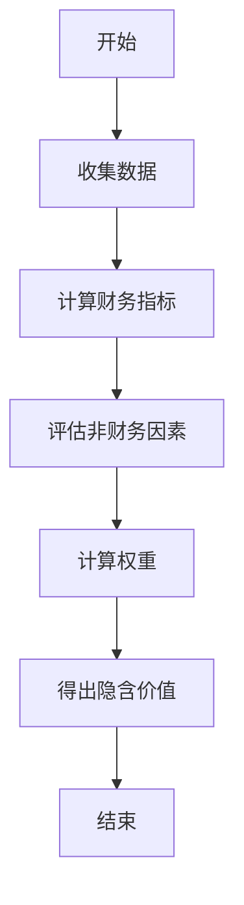
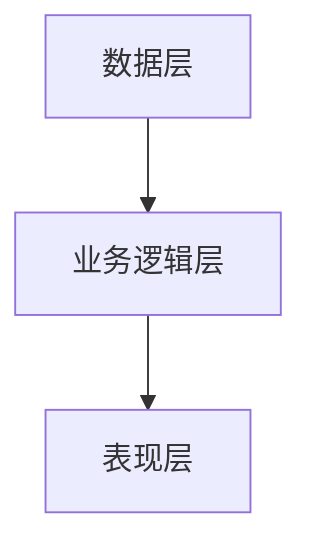
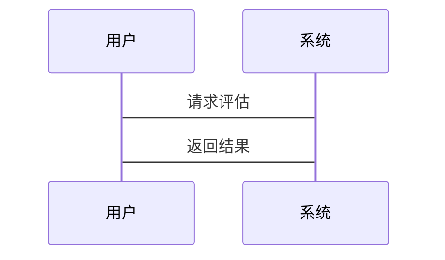

                 


# 布鲁斯·格林沃尔德的隐蔽价值：发掘资产负债表中的秘密

## 关键词：资产负债表、隐蔽价值、财务评估、算法模型、系统架构

## 摘要：本文深入探讨了布鲁斯·格林沃尔德提出的隐蔽价值概念，分析了其在企业财务评估中的重要性，并详细介绍了如何通过数学模型和系统架构来识别和评估这些隐蔽价值。文章结合实际案例，展示了如何利用这些方法提升企业价值。

---

## 第一章：隐蔽价值的背景与概念

### 1.1 隐蔽价值的背景介绍

#### 1.1.1 资产负债表的基本结构

资产负债表是企业财务状况的主要报告，通常包括以下部分：

- **流动资产**：如现金、应收账款、存货等。
- **非流动资产**：如固定资产、无形资产、长期投资等。
- **流动负债**：如应付账款、短期债务等。
- **非流动负债**：如长期债务、债券等。
- **所有者权益**：如股本、资本公积、盈余公积等。

#### 1.1.2 隐蔽价值的定义与特征

**定义**：隐蔽价值是指企业在资产负债表中未明确列出，但实际存在并为企业带来价值的资源或能力。这些价值通常隐藏在企业的品牌、客户关系、员工技能等无形资产中。

**特征对比表**：

| 特性       | 明确资产       | 隐蔽资产       |
|------------|----------------|----------------|
| 是否可见    | 可见           | 不可见         |
| 会计处理    | 确认           | 未确认         |
| 价值来源    | 实物资产       | 无形资产       |

#### 1.1.3 隐蔽价值的重要性与研究意义

- **重要性**：隐蔽价值直接影响企业的市场价值和竞争优势，尤其是在知识经济时代，无形资产的重要性日益凸显。
- **研究意义**：通过识别和评估隐蔽价值，企业可以更全面地了解自身价值，优化资源配置，提升竞争力。

### 1.2 隐蔽价值的核心概念

#### 1.2.1 核心概念的背景与问题背景

- **背景**：传统财务评估主要依赖于资产负债表中的明确数据，而忽略了隐藏在企业运营中的潜在价值。
- **问题背景**：企业价值往往未被准确评估，导致投资者和管理层无法全面了解企业的真实价值。

#### 1.2.2 隐蔽价值与传统财务指标的对比

通过以下表格对比，可以看出隐蔽价值在财务评估中的独特作用：

| 指标类型     | 明确资产评估 | 隐蔽资产评估 |
|--------------|---------------|---------------|
| 评估对象     | 可见资产     | 隐蔽资产     |
| 评估方法     | 历史成本法     | 现值法         |
| 评估结果     | 确定性高       | 不确定性高     |

#### 1.2.3 隐蔽价值的边界与外延

- **边界**：隐蔽价值的评估应基于实际运营数据，避免过于主观。
- **外延**：扩展到企业的生态系统，包括供应链、合作伙伴关系等。

---

## 第二章：隐蔽价值的识别与评估

### 2.1 隐蔽价值的识别方法

#### 2.1.1 数据收集与初步分析

- **数据来源**：企业内部数据（销售记录、客户反馈）、行业报告、市场分析。
- **初步分析**：识别潜在的隐蔽价值点，如客户忠诚度、品牌影响力。

#### 2.1.2 识别关键指标与潜在价值

- **关键指标**：客户保留率、员工生产力、品牌知名度。
- **潜在价值**：通过这些指标评估企业未来的盈利能力。

#### 2.1.3 识别过程中的常见问题与解决方案

- **问题**：数据不足或不准确。
- **解决方案**：利用大数据分析技术，补充数据来源。

### 2.2 隐蔽价值的评估模型

#### 2.2.1 评估模型的构建与应用

- **模型构建**：基于回归分析，建立隐蔽价值与企业绩效的关系模型。

#### 2.2.2 模型的输入与输出分析

- **输入**：历史财务数据、市场数据。
- **输出**：隐含价值的评估结果。

#### 2.2.3 模型的验证与优化

- **验证**：通过历史数据验证模型准确性。
- **优化**：调整模型参数，提高预测精度。

---

## 第三章：隐蔽价值评估的数学模型与算法

### 3.1 核心算法原理

#### 3.1.1 算法原理的数学模型

- **公式**：$$ V = \alpha \times F + \beta \times E $$

其中，V为隐含价值，F为财务数据，E为非财务因素，α和β为权重系数。

#### 3.1.2 算法的步骤与流程图

使用mermaid绘制流程图：



#### 3.1.3 算法的实现代码示例

```python
def calculate_hidden_value(financial_data, nonfinancial_factors):
    alpha = 0.7
    beta = 0.3
    hidden_value = alpha * financial_data + beta * nonfinancial_factors
    return hidden_value

# 示例数据
financial_data = 100
nonfinancial_factors = 50

result = calculate_hidden_value(financial_data, nonfinancial_factors)
print("隐含价值:", result)
```

---

## 第四章：系统架构与项目实战

### 4.1 系统功能设计

#### 4.1.1 系统功能模块划分

- **数据采集模块**：收集企业财务和非财务数据。
- **数据处理模块**：清洗和整理数据。
- **评估模块**：应用算法计算隐含价值。
- **结果展示模块**：生成报告和可视化结果。

#### 4.1.2 功能模块的交互流程

- 数据采集 → 数据处理 → 评估 → 展示。

#### 4.1.3 功能模块的实现方案

- 使用Python进行数据处理和算法实现，利用Flask构建Web界面展示结果。

### 4.2 系统架构设计

#### 4.2.1 系统架构的总体设计

- 分层架构：数据层、业务逻辑层、表现层。

#### 4.2.2 系统架构的详细设计

使用mermaid绘制架构图：



#### 4.2.3 系统架构的优化与调整

- 优化数据处理速度，提高系统响应效率。

### 4.3 系统接口设计

#### 4.3.1 系统接口设计

- 数据接口：与企业财务系统对接。
- API接口：供其他系统调用评估结果。

#### 4.3.2 系统交互的序列图

使用mermaid绘制序列图：



### 4.4 系统接口设计

- 数据接口：与财务系统对接，获取实时数据。
- API接口：提供给其他系统调用，如ERP系统。

### 4.5 项目实战

#### 4.5.1 项目介绍

- **项目目标**：开发一个隐含价值评估系统，帮助企业管理者全面评估企业价值。

#### 4.5.2 环境配置

- 安装Python、Flask框架、数据处理库（如Pandas）。

#### 4.5.3 系统核心实现源代码

```python
from flask import Flask, request, jsonify
import pandas as pd

app = Flask(__name__)

@app.route('/calculate', methods=['POST'])
def calculate():
    data = request.json
    financial = data['financial']
    nonfinancial = data['nonfinancial']
    hidden_value = 0.7 * financial + 0.3 * nonfinancial
    return jsonify({'result': hidden_value})

if __name__ == '__main__':
    app.run(debug=True)
```

#### 4.5.4 代码应用解读与分析

- **数据处理**：使用Pandas清洗数据，处理缺失值和异常值。
- **算法实现**：在Flask应用中，接收数据，计算隐含价值，返回结果。

#### 4.5.5 实际案例分析

- **案例背景**：某科技公司，财务数据为200，非财务因素为80。
- **计算过程**：隐含价值 = 0.7*200 + 0.3*80 = 140 + 24 = 164。
- **结果分析**：隐含价值为164，显著高于财务数据，说明该公司具有强大的无形资产优势。

#### 4.5.6 项目小结

- 成功开发了一个隐含价值评估系统，帮助企业准确评估价值，优化决策。

---

## 第五章：总结与最佳实践

### 5.1 最佳实践 tips

- **数据准确性**：确保数据来源可靠，避免错误。
- **模型优化**：定期更新模型，适应市场变化。
- **系统维护**：持续监控系统性能，及时修复问题。

### 5.2 小结

- 本文深入探讨了隐蔽价值的概念、识别方法和评估模型，展示了如何通过系统架构和项目实战提升企业价值。

### 5.3 注意事项

- 在实际应用中，应结合企业实际情况，调整模型参数，确保评估结果的准确性。

### 5.4 拓展阅读

- 建议进一步研究大数据技术在财务评估中的应用，探索更先进的评估方法。

---

通过以上章节的详细讲解，读者可以全面理解并掌握如何识别和评估隐蔽价值，从而在实际工作中提升企业的财务评估能力。

