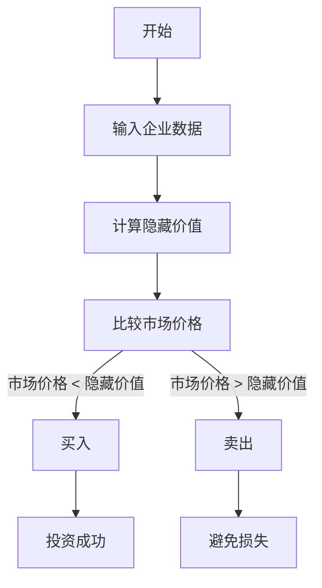

                 


# 隐藏价值投资法：解析布鲁斯·格林沃尔德的投资策略

## 关键词：隐藏价值投资法、价值投资、布鲁斯·格林沃尔德、投资策略、投资算法、系统架构

## 摘要：  
布鲁斯·格林沃尔德的隐藏价值投资法是一种基于对企业内在价值深入分析的投资策略，通过计算隐藏价值（Intrinsic Value）来判断投资标的的潜在价值。本文将详细介绍隐藏价值投资法的核心概念、数学模型、系统架构设计，以及实际应用中的案例分析，帮助读者全面理解这一投资方法。

---

# 第一部分: 隐藏价值投资法的背景与基础

## 第1章: 价值投资的起源与发展

### 1.1 价值投资的定义与核心理念  
价值投资是一种基于对企业内在价值分析的投资策略，旨在通过寻找被市场低估的股票，实现长期稳定的收益。其核心理念包括：  
1. **安全边际**：买入价格低于内在价值，确保投资的安全性。  
2. **长期视角**：关注企业的长期盈利能力，而非短期市场波动。  
3. **逆向思维**：在市场恐慌时寻找机会，在市场疯狂时保持冷静。  

### 1.2 布鲁斯·格林沃尔德的贡献  
布鲁斯·格林沃尔德是价值投资领域的权威，他的研究和实践为隐藏价值投资法奠定了基础。他强调：  
1. **隐藏价值的计算**：通过对企业未来现金流的折现，评估其内在价值。  
2. **安全边际的应用**：在买入时留有充足的安全空间，降低投资风险。  

### 1.3 隐藏价值投资法的定义与特点  
隐藏价值投资法是一种通过计算企业隐藏价值，寻找市场低估的投资机会的方法。其特点包括：  
1. **量化分析**：基于数学模型计算隐藏价值。  
2. **逆向投资**：在市场低估时买入，市场高估时卖出。  
3. **长期持有**：以长期视角持有优质资产。  

---

## 第2章: 隐藏价值的定义与评估方法

### 2.1 隐藏价值的定义  
隐藏价值（Intrinsic Value）是指企业未来现金流的现值，反映了企业的实际价值，而非市场定价。其计算公式为：  
$$ V = \frac{CF}{r} $$  
其中，\( V \) 表示隐藏价值，\( CF \) 表示未来现金流，\( r \) 表示折现率。  

### 2.2 隐藏价值的评估方法  
隐藏价值的评估需要结合企业的财务数据、行业地位和市场环境。具体方法包括：  
1. **财务指标分析**：通过市盈率、市净率等指标评估企业价值。  
2. **现金流折现法**：计算企业未来现金流的现值。  
3. **行业对标分析**：比较同行业企业的估值水平。  

### 2.3 隐藏价值与企业价值的关系  
隐藏价值是企业内在价值的体现，与市场定价可能存在差异。当市场价格低于隐藏价值时，投资机会出现。  

---

## 第3章: 隐藏价值投资法的数学模型与算法原理

### 3.1 隐藏价值的数学模型  
隐藏价值的计算模型是投资决策的核心。公式如下：  
$$ V = \sum_{t=1}^{n} \frac{CF_t}{(1 + r)^t} $$  
其中，\( CF_t \) 是第 \( t \) 年的现金流，\( r \) 是折现率，\( n \) 是预测期数。  

### 3.2 隐藏价值投资法的算法原理  
隐藏价值投资法的算法流程如下：  
1. **数据输入**：获取企业的财务数据和市场数据。  
2. **计算隐藏价值**：使用现金流折现法计算隐藏价值。  
3. **比较市场价与隐藏价值**：判断是否买入或卖出。  

### 3.3 隐藏价值投资法的流程图  


---

## 第4章: 隐藏价值投资法的系统架构设计

### 4.1 系统功能设计  
隐藏价值投资系统的功能模块包括：  
1. **数据采集**：获取企业的财务数据和市场数据。  
2. **隐藏价值计算**：使用数学模型计算隐藏价值。  
3. **投资决策**：基于计算结果生成投资建议。  

### 4.2 系统架构设计  


### 4.3 系统接口设计  
系统接口包括：  
1. 数据输入接口：接收企业数据。  
2. 计算接口：执行隐藏价值计算。  
3. 输出接口：生成投资建议。  

---

## 第5章: 隐藏价值投资法的项目实战

### 5.1 环境安装  
需要安装以下工具：  
1. Python编程语言。  
2. 数据分析库（如Pandas、NumPy）。  
3. 图表生成工具（如Matplotlib）。  

### 5.2 核心代码实现  
以下是隐藏价值计算的Python代码示例：  
```python
def calculate_intrinsic_value(enterprise_data):
    # 输入企业数据，包括现金流和折现率
    # 计算隐藏价值
    cf = enterprise_data['cash_flow']
    r = enterprise_data['discount_rate']
    n = len(cf)
    intrinsic_value = 0
    for t in range(n):
        intrinsic_value += cf[t] / (1 + r) ** t
    return intrinsic_value
```

### 5.3 实际案例分析  
以某企业为例，假设其未来5年的现金流分别为100、120、140、160、180万元，折现率为8%。计算其隐藏价值：  
$$ V = \frac{100}{1.08} + \frac{120}{1.08^2} + \frac{140}{1.08^3} + \frac{160}{1.08^4} + \frac{180}{1.08^5} \approx 400 \text{万元} $$  
如果市场价格低于400万元，则考虑买入。

---

## 第6章: 最佳实践与小结

### 6.1 最佳实践  
1. **持续学习**：关注行业动态和市场变化。  
2. **风险控制**：设置止损点，避免重大损失。  
3. **分散投资**：降低单一投资的风险。  

### 6.2 小结  
隐藏价值投资法通过量化分析，帮助投资者发现被低估的投资机会。掌握这一方法，投资者可以更好地进行长期投资决策，实现财富增值。

### 6.3 注意事项  
1. 隐藏价值计算依赖于假设条件，需谨慎评估。  
2. 市场环境变化会影响计算结果，需动态调整。  
3. 投资需结合定性和定量分析，避免片面决策。  

### 6.4 拓展阅读  
推荐阅读布鲁斯·格林沃尔德的经典著作《隐藏价值投资法》，深入了解其理论与实践。

---

通过以上分析，隐藏价值投资法为投资者提供了一种科学的投资方法，帮助其在复杂市场中找到优质投资标的。希望本文能为投资者提供有价值的参考。

