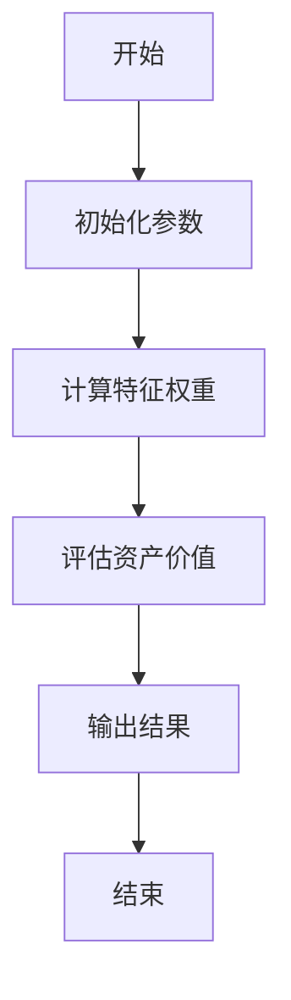
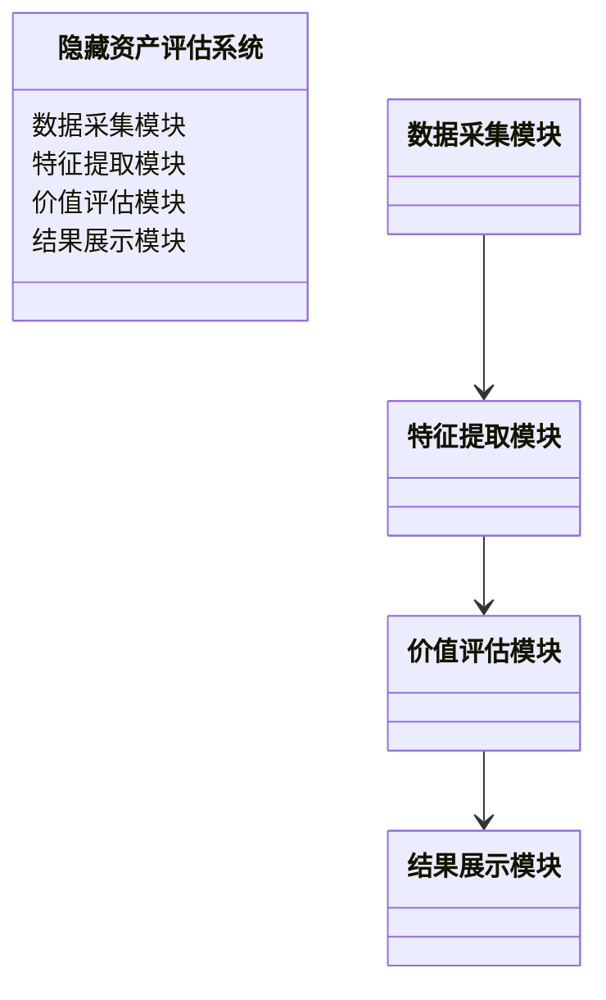
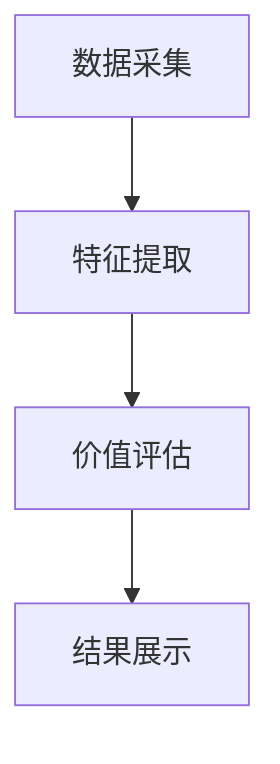

                 


# 布鲁斯·贝克威斯的隐藏资产价值发掘

## 关键词：
- 隐藏资产
- 价值评估
- 数学模型
- 机器学习
- 系统架构

## 摘要：
本文深入探讨了隐藏资产的定义、分类及其价值评估的方法，结合实际案例，系统地分析了隐藏资产的评估模型和算法实现。通过详细的技术分析和项目实战，帮助读者掌握隐藏资产价值发掘的核心技能，为企业决策提供科学依据。

---

## 目录大纲：

### 第一部分：隐藏资产价值发掘的背景与概念

#### 第1章：隐藏资产的定义与分类
- 1.1 隐藏资产的定义
  - 隐藏资产的特征
  - 隐藏资产与其他资产类型对比
- 1.2 隐藏资产的分类
  - 流动资产、固定资产、无形资产的对比
  - 隐藏资产的经济意义

#### 第2章：隐藏资产的经济意义与现状
- 2.1 隐藏资产对经济发展的影响
- 2.2 隐藏资产的现状与挑战
  - 隐藏资产分布的不均衡性
  - 评估技术的局限性

### 第二部分：隐藏资产价值发掘的核心概念与方法

#### 第3章：隐藏资产的价值评估模型
- 3.1 价值评估模型的构建
  - 模型输入变量与输出结果
  - 模型假设条件
- 3.2 价值评估模型的数学公式
  - $$ V = \sum_{i=1}^{n} w_i \cdot x_i $$
  - 其中，\( V \) 表示资产价值，\( w_i \) 表示权重，\( x_i \) 表示特征变量
- 3.3 模型的验证与优化
  - 验证方法：对比分析、回归测试
  - 优化策略：调整权重、引入新特征

#### 第4章：隐藏资产价值评估的算法实现
- 4.1 算法原理
  - 层次分析法（AHP）与神经网络模型的结合
- 4.2 算法流程图


### 第三部分：隐藏资产价值发掘的系统架构与实现

#### 第5章：系统分析与架构设计
- 5.1 项目介绍
  - 系统目标：评估隐藏资产价值
  - 项目背景：某公司的隐藏资产评估需求
- 5.2 系统功能设计
  - 功能模块：数据采集、特征提取、价值评估、结果展示
  - 领域模型：Mermaid类图


#### 第6章：系统架构设计
- 6.1 系统架构图

- 6.2 系统接口设计
  - 输入接口：数据输入模块
  - 输出接口：结果展示模块

### 第四部分：项目实战与应用

#### 第7章：项目实战
- 7.1 环境配置
  - Python 3.8+
  - NumPy、Pandas、Scikit-learn等库的安装
- 7.2 核心代码实现
  - 数据预处理代码
```python
import numpy as np
import pandas as pd

# 数据加载与预处理
data = pd.read_csv('assets.csv')
data = data.dropna().reset_index(drop=True)
```
  - 模型训练代码
```python
from sklearn.model_selection import train_test_split
from sklearn.metrics import accuracy_score

X = data.drop('value', axis=1)
y = data['value']

X_train, X_test, y_train, y_test = train_test_split(X, y, test_size=0.2)
model.fit(X_train, y_train)
y_pred = model.predict(X_test)
print(accuracy_score(y_test, y_pred))
```
- 7.3 案例分析
  - 以某公司为例，详细分析隐藏资产评估过程

### 第五部分：总结与最佳实践

#### 第8章：总结与最佳实践
- 8.1 小结
  - 隐藏资产价值评估的核心要点
- 8.2 注意事项
  - 数据质量的重要性
  - 模型调优的必要性
- 8.3 拓展阅读
  - 推荐相关书籍和文献

---

### 结语：
通过系统的学习与实践，读者将能够掌握隐藏资产价值发掘的核心技能，为企业创造更大的价值。

