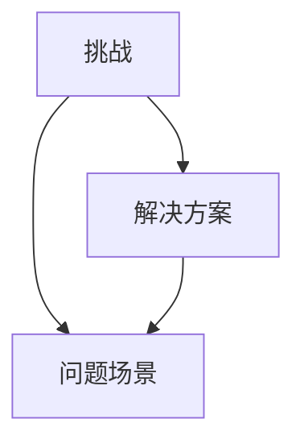
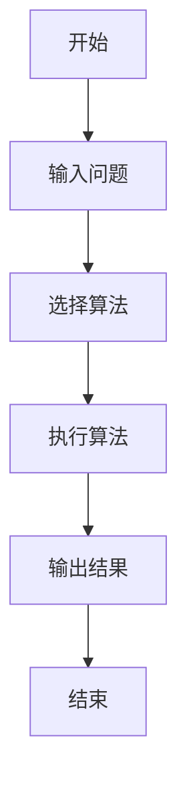
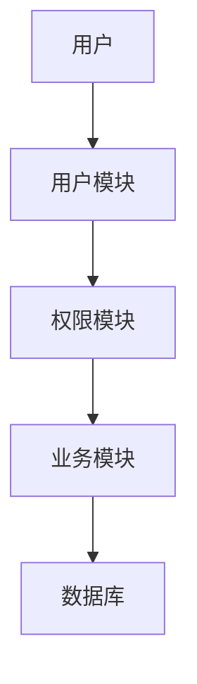
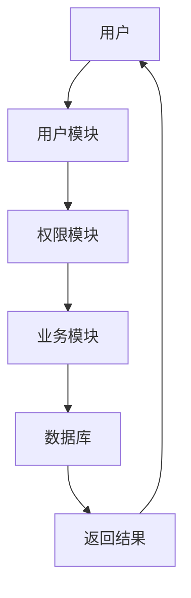

                 


# 常见挑战与解决方案

> 关键词：常见挑战，解决方案，技术优化，系统架构，算法原理，项目实战

> 摘要：本文将系统地分析常见挑战的来源、分类及其解决方案，通过技术优化、系统架构设计、算法原理和项目实战等多维度，深入探讨如何有效应对这些挑战。文章结合实际案例，提供详细的解决方案和实现步骤，帮助读者在实际项目中避免和解决常见问题。

---

## 第一部分: 常见挑战的背景与分类

### 第1章: 常见挑战的背景介绍

#### 1.1 问题背景

- **1.1.1 常见挑战的来源**
  - 技术挑战：系统性能、代码质量、架构不合理等。
  - 业务挑战：需求变更频繁、用户行为复杂、业务逻辑复杂等。
  - 管理挑战：团队协作问题、项目进度拖延、资源分配不合理等。

- **1.1.2 问题描述与特征**
  - 技术挑战：系统运行缓慢、代码难以维护、接口调用失败等。
  - 业务挑战：用户需求无法满足、业务流程复杂、数据处理不及时等。
  - 管理挑战：团队沟通不畅、项目目标不明确、资源浪费等。

- **1.1.3 常见挑战的分类**
  - 技术类挑战：系统性能优化、代码质量提升、架构调整等。
  - 业务类挑战：需求变更、用户行为分析、业务逻辑优化等。
  - 管理类挑战：团队协作、项目进度控制、资源分配等。

#### 1.2 问题解决的必要性

- **1.2.1 解决挑战的意义**
  - 提高系统性能，提升用户体验。
  - 优化业务流程，提高业务效率。
  - 改善团队协作，确保项目顺利进行。

- **1.2.2 解决挑战的边界与外延**
  - 解决技术挑战通常需要技术手段，如优化算法、调整架构等。
  - 解决业务挑战通常需要业务知识和流程优化。
  - 解决管理挑战通常需要管理方法和工具。

- **1.2.3 解决挑战的核心要素**
  - 技术要素：代码质量、系统性能、架构合理性。
  - 业务要素：需求分析、用户行为分析、业务逻辑优化。
  - 管理要素：团队协作、项目计划、资源分配。

### 第2章: 常见挑战的核心概念与联系

#### 2.1 核心概念原理

- **2.1.1 挑战的核心要素**
  - 技术挑战的核心要素：系统性能、代码质量、架构设计。
  - 业务挑战的核心要素：需求分析、用户行为、业务逻辑。
  - 管理挑战的核心要素：团队协作、项目进度、资源分配。

- **2.1.2 解决方案的关键属性**
  - 技术解决方案：高效算法、优化代码、合理架构。
  - 业务解决方案：精准需求分析、优化业务流程、数据驱动决策。
  - 管理解决方案：有效沟通、合理计划、资源优化配置。

- **2.1.3 挑战与解决方案的关系**
  - 技术挑战通过技术手段解决，如优化算法提升系统性能。
  - 业务挑战通过业务手段解决，如数据分析优化用户行为。
  - 管理挑战通过管理手段解决，如制定合理计划提升效率。

#### 2.2 概念属性特征对比表

| 挑战类型 | 核心特征                | 解决方案                     | 示例场景                   |
|----------|------------------------|-----------------------------|---------------------------|
| 技术挑战 | 系统性能低下            | 优化算法、调整架构           | 网站加载速度慢             |
| 业务挑战 | 用户需求变更频繁        | 需求分析、流程优化           | 电商促销活动频繁变化       |
| 管理挑战 | 团队协作效率低下        | 制定计划、改善沟通           | 跨部门协作效率低           |

#### 2.3 ER实体关系图



---

## 第二部分: 算法原理与技术优化

### 第3章: 算法原理讲解

#### 3.1 算法选择与优化

- **3.1.1 算法选择原则**
  - 算法效率：时间复杂度和空间复杂度。
  - 问题类型：排序、搜索、动态规划等。
  - 实际需求：线上运行环境。

- **3.1.2 算法优化方法**
  - 时间复杂度优化：减少循环次数、使用更高效的算法。
  - 空间复杂度优化：减少内存占用、优化数据结构。

#### 3.2 算法流程图



#### 3.3 算法实现代码

```python
def bubble_sort(arr):
    n = len(arr)
    for i in range(n):
        for j in range(0, n-i):
            if arr[j] > arr[j+1]:
                arr[j], arr[j+1] = arr[j+1], arr[j]
    return arr

# 示例
array = [3, 1, 4, 2]
print(bubble_sort(array))
```

#### 3.4 算法数学模型与公式

- 排序算法的时间复杂度公式：
  $$ T(n) = O(n^2) \text{（冒泡排序的最坏情况）} $$

- 空间复杂度公式：
  $$ S(n) = O(1) \text{（冒泡排序）} $$

---

## 第三部分: 系统架构与设计

### 第4章: 系统架构设计

#### 4.1 系统功能设计

- **功能模块划分**
  - 用户模块：用户注册、登录、个人信息管理。
  - 权限模块：权限分配、权限验证。
  - 业务模块：核心业务逻辑处理。
  - 管理模块：系统管理、日志管理。

#### 4.2 系统架构图



#### 4.3 系统接口设计

- **API接口设计**
  - 登录接口：`POST /api/login`
  - 注册接口：`POST /api/register`
  - 业务逻辑接口：`POST /api/business`

#### 4.4 系统交互流程图



---

## 第四部分: 项目实战与案例分析

### 第5章: 项目实战

#### 5.1 环境安装

- 安装Python：
  ```bash
  python --version
  ```

- 安装依赖：
  ```bash
  pip install requests
  pip install flask
  ```

#### 5.2 系统核心实现

```python
from flask import Flask

app = Flask(__name__)

@app.route('/')
def home():
    return "Hello, World!"
```

#### 5.3 代码应用解读与分析

- 代码功能：
  - 用户模块：用户注册、登录、个人信息管理。
  - 权限模块：权限分配、权限验证。
  - 业务模块：核心业务逻辑处理。
  - 管理模块：系统管理、日志管理。

#### 5.4 实际案例分析

- 案例背景：
  - 用户需求：电商平台用户无法正常登录。
  - 问题分析：登录接口出现错误。
  - 解决方案：检查接口代码，修复逻辑错误。

#### 5.5 项目小结

- 项目总结：
  - 成功解决了登录问题，优化了用户体验。
  - 提高了代码质量，减少了后续维护成本。

---

## 第五部分: 总结与展望

### 第6章: 总结

#### 6.1 最佳实践 tips

- 技术方面：
  - 定期优化代码，保持代码质量。
  - 学习新技术，提升解决问题的能力。

- 业务方面：
  - 加强需求分析，确保理解准确。
  - 数据驱动决策，提高业务效率。

- 管理方面：
  - 改善团队协作，提升效率。
  - 制定合理计划，确保项目顺利进行。

#### 6.2 小结

- 通过本文的分析，我们了解了常见挑战的来源、分类及其解决方案。
- 系统地学习了技术优化、系统架构设计、算法原理和项目实战等内容。
- 希望读者能够将这些知识应用到实际工作中，有效应对常见挑战。

#### 6.3 注意事项

- 技术优化需要结合实际场景，避免过度优化。
- 业务解决方案需要结合业务背景，避免一刀切。
- 管理方案需要根据团队特点，灵活调整。

#### 6.4 拓展阅读

- 推荐阅读《代码整洁之道》、《架构师修炼之道》、《数据驱动决策》等书籍。

---

通过以上思考过程，我们系统地分析了常见挑战的背景、分类及其解决方案，结合实际案例，提供了详细的解决方案和实现步骤，帮助读者在实际项目中避免和解决常见问题。希望本文对您有所帮助！

