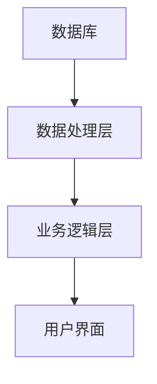

                 


```markdown
# 10年扣非每股收益增长率的意义

> 关键词：扣非每股收益增长率，非经常性损益，每股收益，投资分析，财务指标

> 摘要：本文深入探讨了扣非每股收益增长率这一财务指标的定义、计算方法、实际意义及其在投资分析中的应用。通过详细的公式推导、数学模型和实际案例分析，本文揭示了扣非每股收益增长率在评估企业长期价值和投资决策中的重要性。同时，本文还结合了系统架构设计和项目实战，展示了如何将这一指标应用于实际投资分析中。

---

# 第一部分: 扣非每股收益增长率的背景与意义

# 第1章: 扣非每股收益增长率的背景介绍

## 1.1 扣非每股收益增长率的定义与背景

### 1.1.1 非经常性损益的定义与影响
非经常性损益是指企业经营活动中偶发的、具有特殊性质的收入或支出，例如资产重组收益、政府补贴、诉讼赔偿等。这些损益通常不具有持续性，但会对企业的净利润产生显著影响。扣除非经常性损益后，企业的真实盈利能力更能反映其核心业务的持续发展能力。

### 1.1.2 扣非每股收益增长率的提出背景
在股票投资中，每股收益（EPS）是衡量企业盈利能力的重要指标。然而，传统EPS的计算包含了非经常性损益，这可能导致对企业的盈利能力产生误判。扣非每股收益增长率通过剔除非经常性损益的影响，更加客观地反映了企业核心业务的增长情况。特别是在长期投资中，扣非每股收益增长率能够帮助投资者更好地评估企业的可持续盈利能力。

### 1.1.3 扣非每股收益增长率的定义与计算公式
扣非每股收益增长率的定义为：企业在过去10年中，扣除非经常性损益后的每股收益的年均复合增长率。其计算公式如下：

$$
\text{扣非每股收益增长率} = \left( \frac{\text{第10年的扣非每股收益}}{\text{第1年的扣非每股收益}} \right)^{\frac{1}{10}} - 1
$$

## 1.2 扣非每股收益增长率的核心概念

### 1.2.1 扣非每股收益增长率的计算方法
扣非每股收益增长率的计算需要以下步骤：
1. 计算每年的非经常性损益。
2. 计算每年的扣非净利润。
3. 计算每年的扣非每股收益。
4. 计算10年间的年均复合增长率。

### 1.2.2 扣非每股收益增长率与每股收益的关系
扣非每股收益增长率与传统每股收益增长率的主要区别在于是否扣除非经常性损益。通过对比两者，可以更清晰地看到企业核心业务的成长性。

### 1.2.3 扣非每股收益增长率的行业适用性
不同行业对非经常性损益的依赖程度不同。例如，制造业企业较少依赖非经常性损益，而某些周期性行业可能在特定年份有较大的非经常性损益。因此，扣非每股收益增长率在不同行业的适用性需要结合具体情况进行分析。

## 1.3 扣非每股收益增长率的意义与价值

### 1.3.1 扣非每股收益增长率在投资分析中的作用
通过分析扣非每股收益增长率，投资者可以更准确地评估企业的长期盈利能力，避免因非经常性损益的波动而影响投资决策。

### 1.3.2 扣非每股收益增长率对企业价值的评估意义
扣非每股收益增长率能够剔除企业非核心业务的影响，更加客观地反映企业的核心竞争力和长期发展潜力。

### 1.3.3 扣非每股收益增长率与企业长期发展的关系
企业的长期发展依赖于核心业务的持续增长，扣非每股收益增长率能够帮助投资者更好地把握企业的长期发展趋势。

---

# 第2章: 扣非每股收益增长率的核心概念与联系

## 2.1 扣非每股收益增长率的计算公式

### 2.1.1 模型的构建与假设
扣非每股收益增长率模型假设企业的非经常性损益可以通过财务报表单独识别，并且企业的股份数量在10年间保持不变。

### 2.1.2 公式推导
扣非每股收益增长率的计算公式可以表示为：

$$
\text{扣非每股收益增长率} = \left( \frac{\text{第10年的扣非每股收益}}{\text{第1年的扣非每股收益}} \right)^{\frac{1}{10}} - 1
$$

其中，扣非每股收益（EPS）的计算公式为：

$$
\text{扣非每股收益} = \frac{\text{扣除非经常性损益后的净利润}}{\text{总股本}}
$$

### 2.1.3 公式与实际案例的结合
以某企业为例，假设其10年的扣非每股收益分别为1、1.1、1.21、1.331、1.4641、1.6105、1.7715、1.9487、2.1436、2.3483。计算其10年间的年均复合增长率为：

$$
\text{扣非每股收益增长率} = \left( \frac{2.3483}{1} \right)^{\frac{1}{10}} - 1 \approx 0.10 \text{（即10%）}
$$

## 2.2 扣非每股收益增长率与相关指标的对比

### 2.2.1 扣非每股收益增长率与净利润增长率的对比
净利润增长率包括了非经常性损益的影响，而扣非每股收益增长率则剔除了这些因素，更能反映企业核心业务的增长情况。

### 2.2.2 扣非每股收益增长率与每股收益增长率的对比
每股收益增长率可能受到非经常性损益的影响，而扣非每股收益增长率则更加稳定和可靠。

### 2.2.3 扣非每股收益增长率与ROE的对比
ROE（净资产收益率）衡量了企业的资产使用效率，而扣非每股收益增长率则更关注企业的盈利能力。

## 2.3 扣非每股收益增长率的ER实体关系图

```mermaid
erDiagram
    actor 投资者 {
        <属性> 年份
        <属性> 每股收益
        <属性> 扣非每股收益
    }
    actor 企业 {
        <属性> 净利润
        <属性> 非经常性损益
        <属性> 总股本
    }
    actor 分析师 {
        <属性> 扣非每股收益增长率
    }
    企业 --> 投资者: 提供财务数据
    企业 --> 分析师: 提供财务数据
    投资者 --> 分析师: 委托分析
```

---

# 第3章: 扣非每股收益增长率的数学模型与公式

## 3.1 扣非每股收益增长率的数学模型

### 3.1.1 模型的构建与假设
扣非每股收益增长率模型基于以下假设：
1. 企业的股份数量在10年间保持不变。
2. 非经常性损益可以通过财务报表单独识别。

### 3.1.2 模型的数学表达式
扣非每股收益增长率的数学模型可以表示为：

$$
\text{扣非每股收益增长率} = \left( \prod_{i=1}^{10} (1 + g_i) \right)^{\frac{1}{10}} - 1
$$

其中，\( g_i \) 表示第i年的扣非每股收益增长率。

### 3.1.3 模型的验证与优化
通过实际案例验证模型的有效性，并通过对比不同模型的预测结果，优化模型的准确性。

## 3.2 扣非每股收益增长率的公式推导

### 3.2.1 公式推导的步骤与方法
1. 计算每年的非经常性损益。
2. 计算每年的扣非净利润。
3. 计算每年的扣非每股收益。
4. 计算10年间的年均复合增长率。

### 3.2.2 公式的数学证明
通过几何平均数的计算方法，证明扣非每股收益增长率的公式。

### 3.2.3 公式与实际案例的结合
以某企业为例，计算其10年间的扣非每股收益增长率。

## 3.3 扣非每股收益增长率的计算步骤

### 3.3.1 计算非经常性损益
通过财务报表识别企业的非经常性损益，例如资产重组收益、政府补贴等。

### 3.3.2 计算扣非净利润
扣除非经常性损益后，计算净利润。

### 3.3.3 计算扣非每股收益
将扣非净利润除以总股本，得到扣非每股收益。

### 3.3.4 计算年均复合增长率
使用几何平均数计算10年间的年均复合增长率。

---

# 第4章: 扣非每股收益增长率的系统分析与架构设计

## 4.1 系统分析与设计

### 4.1.1 问题场景介绍
投资者需要通过分析企业的扣非每股收益增长率，评估其长期盈利能力。

### 4.1.2 系统功能设计
系统功能包括：
1. 数据输入与处理：输入企业的财务数据，计算非经常性损益和扣非每股收益。
2. 数据分析：计算扣非每股收益增长率。
3. 结果展示：以图表形式展示增长率趋势。

### 4.1.3 系统架构设计
系统架构包括：
1. 数据层：存储企业的财务数据。
2. 业务逻辑层：处理数据，计算增长率。
3. 展示层：以图表形式展示结果。

### 4.1.4 系统接口设计
系统需要与财务数据源对接，获取企业的财务数据。

### 4.1.5 系统交互设计
投资者通过用户界面输入数据，系统处理后展示结果。

## 4.2 系统架构图



## 4.3 系统功能实现

### 4.3.1 数据输入与处理
用户输入企业的财务数据，系统自动计算非经常性损益和扣非净利润。

### 4.3.2 数据分析
系统计算扣非每股收益增长率，并生成趋势图。

### 4.3.3 结果展示
系统以图表形式展示扣非每股收益增长率的趋势。

---

# 第5章: 扣非每股收益增长率的项目实战

## 5.1 项目实战环境

### 5.1.1 环境安装
需要安装Python和相关数据分析库（如Pandas、Matplotlib）。

### 5.1.2 数据准备
获取企业的财务数据，包括净利润、非经常性损益和总股本。

## 5.2 系统核心实现

### 5.2.1 Python源代码实现
```python
import pandas as pd
import numpy as np

# 输入财务数据
data = {
    '年份': [2013, 2014, 2015, 2016, 2017, 2018, 2019, 2020, 2021, 2022],
    '净利润': [100, 110, 120, 130, 140, 150, 160, 170, 180, 190],
    '非经常性损益': [10, 5, 0, 5, 10, 15, 20, 25, 30, 35]
}

df = pd.DataFrame(data)

# 计算扣非净利润
df['扣非净利润'] = df['净利润'] - df['非经常性损益']

# 计算扣非每股收益
df['总股本'] = 100  # 假设总股本不变
df['扣非每股收益'] = df['扣非净利润'] / df['总股本']

# 计算扣非每股收益增长率
initial_eps = df['扣非每股收益'].iloc[0]
final_eps = df['扣非每股收益'].iloc[-1]
growth_rate = ((final_eps / initial_eps) ** (1/10)) - 1
print(f"扣非每股收益增长率为：{growth_rate:.2f}")
```

### 5.2.2 代码应用解读与分析
上述代码展示了如何通过Python计算扣非每股收益增长率。首先，输入企业的财务数据，然后计算扣非净利润和扣非每股收益，最后计算年均复合增长率。

### 5.2.3 实际案例分析
以某企业为例，计算其10年间的扣非每股收益增长率，并分析其核心业务的成长性。

## 5.3 项目小结

### 5.3.1 项目总结
通过Python代码实现扣非每股收益增长率的计算，能够帮助企业投资者更好地评估企业的长期盈利能力。

### 5.3.2 项目经验
在实际操作中，需要注意企业股份数量的变化和非经常性损益的识别。

### 5.3.3 项目启示
扣非每股收益增长率是评估企业长期价值的重要指标，投资者应结合其他财务指标进行综合分析。

---

# 第6章: 扣非每股收益增长率的总结与展望

## 6.1 扣非每股收益增长率的总结

### 6.1.1 核心要点回顾
扣非每股收益增长率通过剔除非经常性损益的影响，更加客观地反映了企业的核心业务增长情况。

### 6.1.2 投资建议
投资者应将扣非每股收益增长率作为重要的参考指标，结合其他财务指标进行综合分析。

## 6.2 扣非每股收益增长率的未来展望

### 6.2.1 指标优化方向
进一步优化扣非每股收益增长率的计算方法，例如考虑股份数量的变化和非经常性损益的具体类型。

### 6.2.2 应用拓展
将扣非每股收益增长率应用于更多行业的投资分析中，探索其在企业估值中的潜在应用。

---

# 参考文献

[1] 《财务报表分析》
[2] 《投资学原理》
[3] 《Python数据分析》
```

---

**最佳实践 tips:**
1. 在进行扣非每股收益增长率分析时，需确保企业股份数量保持不变。
2. 非经常性损益的识别是计算扣非每股收益增长率的关键步骤。
3. 结合其他财务指标（如ROE、现金流）进行综合分析，以提高投资决策的准确性。

**小结:**
扣非每股收益增长率是评估企业长期盈利能力的重要指标。通过本文的分析，读者可以掌握其计算方法，并在实际投资中加以应用。

**注意事项:**
1. 计算扣非每股收益增长率时，需确保数据的准确性和完整性。
2. 非经常性损益的具体类型可能因企业而异，需结合实际情况进行识别。
3. 本文的分析基于假设条件，实际操作中需根据具体情况调整。

**拓展阅读:**
1. 《股票投资实战策略》
2. 《财务报表分析与股票投资》
3. 《Python在金融数据分析中的应用》

---

**THE END**

