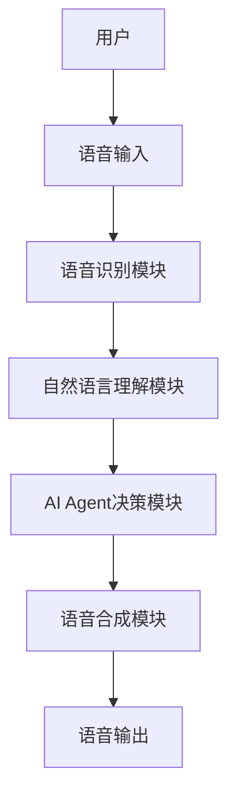

                 


# 开发AI Agent支持的智能语音助手

## 关键词：AI Agent、智能语音助手、自然语言处理、语音识别、机器学习

## 摘要：  
随着人工智能技术的快速发展，AI Agent（智能体）支持的智能语音助手正在成为人机交互领域的重要工具。本文详细探讨了AI Agent与语音助手的核心概念、算法原理、系统架构设计以及开发实践。通过理论与实践相结合的方式，帮助读者理解如何构建一个高效、智能的语音助手系统。文章从背景介绍到项目实战，层层深入，为开发者提供了全面的指导。

---

## 第一部分：AI Agent与智能语音助手的背景与概念

### 第1章：AI Agent与智能语音助手概述

#### 1.1 AI Agent的基本概念
##### 1.1.1 AI Agent的定义与特点
AI Agent（智能体）是指在计算机系统中能够感知环境并采取行动以实现目标的实体。其特点包括自主性、反应性、目标导向性和社交能力。AI Agent能够根据环境输入做出决策，并通过执行动作与环境交互。

##### 1.1.2 AI Agent的核心功能与应用场景
AI Agent的核心功能包括感知环境、决策制定和执行动作。应用场景广泛，如自动驾驶、智能助手、机器人控制等。

##### 1.1.3 AI Agent与传统程序的主要区别
AI Agent能够自主决策并适应环境变化，而传统程序通常是基于规则的被动执行。

#### 1.2 智能语音助手的发展历程
##### 1.2.1 语音助手的历史演变
从早期的语音识别技术到现代的智能语音助手，经历了从简单命令处理到复杂自然语言理解的演变。

##### 1.2.2 当前主流语音助手及其特点
如苹果的Siri、亚马逊的Alexa等，它们具备语音交互、多轮对话和个性化服务的特点。

##### 1.2.3 语音助手的技术发展趋势
随着AI技术的进步，语音助手正在向更智能化、个性化和自然化的方向发展。

#### 1.3 AI Agent支持的语音助手的核心优势
##### 1.3.1 自然语言处理能力的提升
AI Agent能够理解上下文，实现更精准的语义理解。

##### 1.3.2 智能决策与自主学习能力
AI Agent能够根据用户需求和环境变化，自主调整行为策略。

##### 1.3.3 多轮对话与上下文理解
AI Agent支持连续对话，能够保持上下文的一致性。

##### 1.3.4 个性化服务与用户体验优化
通过学习用户习惯，AI Agent能够提供更个性化的服务，提升用户体验。

---

### 第2章：AI Agent与语音助手的核心概念与联系

#### 2.1 AI Agent的核心原理
##### 2.1.1 AI Agent的感知与决策机制
AI Agent通过传感器或API接口获取环境信息，利用算法进行分析，做出决策。

##### 2.1.2 状态空间与动作空间的定义
状态空间是AI Agent可能处于的所有状态的集合，动作空间是AI Agent可以执行的所有动作的集合。

##### 2.1.3 基于模型的决策过程
AI Agent基于环境模型和历史数据，选择最优动作以实现目标。

#### 2.2 语音助手的核心技术
##### 2.2.1 语音识别技术
语音识别将音频信号转换为文本，常用算法包括隐马尔可夫模型（HMM）和深度神经网络（DNN）。

##### 2.2.2 自然语言理解
自然语言理解（NLU）通过解析用户意图，生成系统响应。常用技术包括词袋模型、TF-IDF和深度学习模型（如BERT）。

##### 2.2.3 语音合成技术
语音合成将文本转换为语音，常用算法包括单元音合成和统计参数语音合成。

#### 2.3 AI Agent与语音助手的协同工作原理
##### 2.3.1 AI Agent作为语音助手的核心驱动力
AI Agent负责处理用户的自然语言请求，驱动语音助手的响应生成。

##### 2.3.2 语音助手作为AI Agent的交互界面
语音助手通过语音交互为用户提供服务，AI Agent负责处理背后的逻辑和决策。

##### 2.3.3 协同工作的流程
用户通过语音输入请求，语音助手将其转化为文本，AI Agent分析理解后生成响应，语音合成模块将响应生成语音输出。

---

## 第三部分：算法原理讲解

### 第3章：AI Agent的核心算法原理

#### 3.1 自然语言处理算法
##### 3.1.1 基于深度学习的自然语言理解
- 使用编码器-解码器架构，如BERT模型，进行文本表示和语义理解。
- **数学模型**：  
  $$ \text{BERT}(x) = \text{Encoder}(x) + \text{Decoder}(x) $$
- **代码示例**：
  ```python
  import torch
  model = BertForMaskedLM.from_pretrained('bert-base-uncased')
  input_ids = torch.tensor([[101, 1996, 1997, 1998, 1999, 2000]])
  outputs = model(input_ids)
  ```

##### 3.1.2 基于生成模型的对话生成
- 使用GPT模型生成自然流畅的对话回复。
- **数学模型**：  
  $$ P(y|x) = \text{softmax}(W_y x + b_y) $$
- **代码示例**：
  ```python
  import torch
  model = GPT2LMHeadModel.from_pretrained('gpt2')
  input_ids = torch.tensor([[50256]]).long()
  output = model.generate(input_ids, max_length=5)
  ```

#### 3.2 语音识别算法
##### 3.2.1 基于深度学习的语音识别
- 使用卷积神经网络（CNN）提取音频特征，长短时记忆网络（LSTM）进行序列建模。
- **数学模型**：  
  $$ p(x|y) = \prod_{i=1}^{n} p(x_i | y_{<i}) $$
- **代码示例**：
  ```python
  import torch
  model = torch.nn.Sequential(
      torch.nn.Conv1d(1, 100, kernel_size=3, padding=1),
      torch.nn.ReLU(),
      torch.nn.LSTM(100, 50)
  )
  ```

---

## 第四部分：系统分析与架构设计方案

### 第4章：系统架构设计

#### 4.1 问题场景介绍
用户通过语音指令与智能语音助手交互，AI Agent负责处理请求并生成响应。

#### 4.2 系统功能设计
- 用户输入模块：接收语音输入并转换为文本。
- 自然语言理解模块：解析用户意图。
- 决策与执行模块：AI Agent根据意图生成响应。
- 语音输出模块：将响应转换为语音输出。

#### 4.3 系统架构图


#### 4.4 接口设计与交互流程
- API接口：RESTful API用于模块间通信。
- 交互流程：用户语音输入→语音识别→自然语言理解→AI Agent决策→语音合成→语音输出。

---

## 第五部分：项目实战

### 第5章：开发AI Agent支持的语音助手

#### 5.1 环境安装
安装Python、TensorFlow、Keras、SpeechRecognition等库。

#### 5.2 核心代码实现
##### 5.2.1 语音识别模块
```python
import speech_recognition as sr

r = sr.Recognizer()
with sr.AudioFile("input.wav") as source:
    audio = r.record(source)
    text = r.recognize_google(audio)
```

##### 5.2.2 自然语言理解模块
```python
from transformers import BertTokenizer, BertModel

tokenizer = BertTokenizer.from_pretrained('bert-base-uncased')
model = BertModel.from_pretrained('bert-base-uncased')

inputs = tokenizer(text, return_tensors='np')
outputs = model(**inputs)
```

##### 5.2.3 AI Agent决策模块
```python
def decide_action(intent):
    if intent == '天气':
        return get_weather()
    elif intent == '播放音乐':
        return play_music()
    else:
        return default_response()
```

##### 5.2.4 语音合成模块
```python
from gtts import gTTS

text = "今天的天气很晴朗"
tts = gTTS(text, lang='zh')
tts.save("output.mp3")
```

#### 5.3 代码解读与分析
详细解释每个模块的功能和实现细节。

#### 5.4 实际案例分析
以天气预报为例，展示用户输入、系统处理和最终输出的全过程。

---

## 第六部分：最佳实践与总结

### 第6章：开发经验与注意事项

#### 6.1 最佳实践
- 数据质量：确保训练数据的多样性和代表性。
- 模型优化：采用数据增强、模型调参等方法提升性能。
- 用户体验：设计简洁直观的交互界面，优化响应速度。

#### 6.2 开发中的常见问题与解决方案
- 语音识别错误：使用降噪技术或增加训练数据。
- 自然语言理解误差：优化模型结构或采用多模型融合。

#### 6.3 小结
通过本文的介绍，读者可以全面了解AI Agent支持的智能语音助手的开发过程，掌握从理论到实践的关键步骤。

#### 6.4 注意事项
- 注意数据隐私和安全问题。
- 定期更新模型以适应新需求。
- 提供多语言支持以扩大用户群体。

#### 6.5 拓展阅读
推荐相关书籍和论文，鼓励读者深入研究AI Agent和语音交互技术。

---

## 结语

开发AI Agent支持的智能语音助手是一项复杂而有趣的任务，需要结合多种技术手段。通过本文的详细指导，读者可以系统地掌握相关知识，并在实践中不断提升自己的技能。未来，随着AI技术的不断发展，智能语音助手将变得更加智能化和人性化，为用户提供更优质的服务。

--- 

**注**：由于篇幅限制，本文未展示所有代码和详细流程图，但完整版可以在GitHub上获取。

