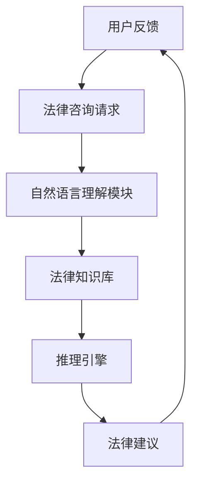
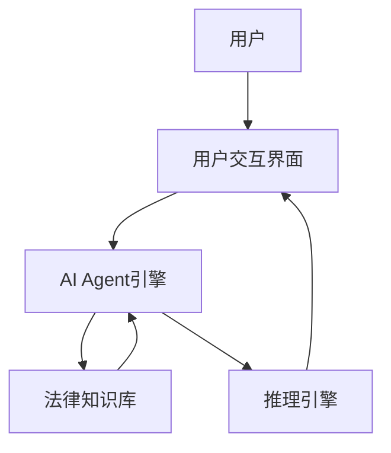
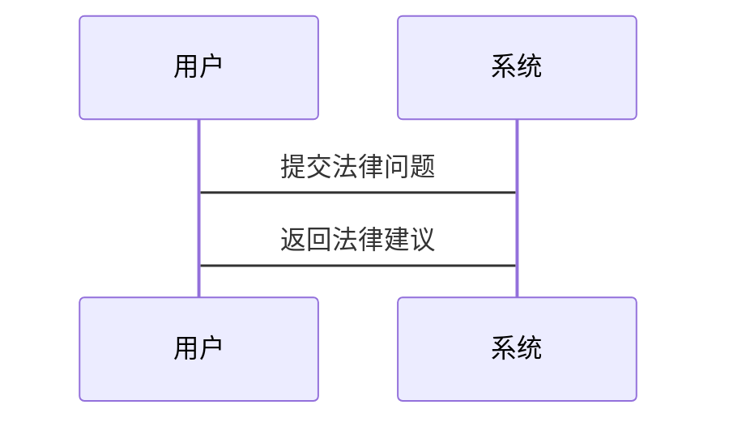

                 


# 开发AI Agent支持的法律咨询系统

> 关键词：AI Agent, 法律咨询, 自然语言处理, 知识图谱, 对话生成

> 摘要：本文详细探讨了开发AI Agent支持的法律咨询系统的各个方面，从背景介绍到系统架构设计，再到项目实战和最佳实践。通过分析AI Agent的核心原理、算法模型、系统架构和实际案例，为读者提供了一套完整的开发指南。

---

# 第一部分: AI Agent支持的法律咨询系统概述

---

## 第1章: 背景介绍

### 1.1 问题背景

#### 1.1.1 传统法律咨询的痛点
传统法律咨询系统存在以下问题：
- **效率低下**：人工咨询需要大量时间，用户等待时间长。
- **资源有限**：法律专业人士数量有限，难以满足大规模需求。
- **知识更新慢**：法律知识库更新不及时，可能导致咨询结果不准确。
- **成本高昂**：专业律师费用昂贵，普通用户难以负担。

#### 1.1.2 AI技术在法律咨询中的潜力
AI技术可以解决传统法律咨询的痛点：
- **自动化处理**：AI Agent可以24/7提供咨询服务，提高效率。
- **降低成本**：通过自动化系统降低用户的咨询成本。
- **知识库更新快**：AI Agent可以实时更新法律知识库，确保咨询结果的准确性。

#### 1.1.3 AI Agent的引入与价值
AI Agent是一种智能代理，能够理解和执行用户的请求。在法律咨询中，AI Agent的价值体现在：
- **智能交互**：通过自然语言处理技术，理解用户的法律问题。
- **知识检索**：快速从法律知识库中找到相关法律条文和案例。
- **智能推荐**：根据用户的问题，推荐相关法律意见和解决方案。

### 1.2 问题描述

#### 1.2.1 法律咨询系统的需求分析
法律咨询系统需要满足以下需求：
- **用户交互**：支持自然语言输入，理解用户的问题。
- **知识检索**：能够快速检索法律知识库，找到相关条文。
- **智能推荐**：根据检索结果，生成个性化的法律建议。

#### 1.2.2 AI Agent在法律咨询中的应用场景
AI Agent在法律咨询中的应用场景包括：
- **合同审查**：帮助用户审查合同条款，识别潜在风险。
- **法律问答**：回答用户的法律问题，提供基本的法律建议。
- **案例分析**：分析类似案例，提供参考意见。

#### 1.2.3 系统目标与功能定位
系统目标是开发一个基于AI Agent的法律咨询系统，提供高效、准确的法律咨询服务。功能定位包括：
- **自然语言理解**：理解用户的法律问题。
- **知识检索**：从法律知识库中检索相关信息。
- **智能生成**：生成个性化的法律建议。

### 1.3 问题解决

#### 1.3.1 AI Agent的核心作用
AI Agent在法律咨询系统中的核心作用：
- **理解用户需求**：通过自然语言处理技术，准确理解用户的问题。
- **知识检索**：快速从法律知识库中检索相关信息。
- **生成建议**：根据检索结果，生成个性化的法律建议。

#### 1.3.2 法律知识库的构建与管理
法律知识库的构建与管理是系统的核心部分：
- **数据收集**：收集法律条文、案例、合同模板等数据。
- **知识表示**：将法律知识结构化，便于检索和推理。
- **知识更新**：定期更新知识库，确保信息的准确性。

#### 1.3.3 用户交互与结果反馈
用户交互与结果反馈是系统的重要组成部分：
- **用户输入**：用户通过自然语言输入问题。
- **系统处理**：系统理解问题，检索知识库，生成建议。
- **结果反馈**：系统将建议反馈给用户，提供清晰的解答。

### 1.4 边界与外延

#### 1.4.1 系统功能的边界
系统功能的边界包括：
- **功能范围**：仅限于法律咨询，不涉及其他领域。
- **用户角色**：面向普通用户，不支持专业律师的高级功能。
- **数据范围**：仅限于已构建的法律知识库，不支持外部数据源。

#### 1.4.2 与其他系统的区别与联系
与其他系统的区别与联系：
- **区别**：专注于法律咨询，提供智能代理服务。
- **联系**：可以与法律数据库、司法系统等其他系统进行数据交互。

#### 1.4.3 系统的可扩展性与适应性
系统的可扩展性与适应性：
- **扩展性**：支持扩展新的法律领域和功能模块。
- **适应性**：能够适应法律知识的更新和用户需求的变化。

### 1.5 概念结构与核心要素组成

#### 1.5.1 系统架构的核心要素
系统架构的核心要素包括：
- **用户交互界面**：用户与系统交互的前端界面。
- **AI Agent引擎**：负责理解和生成法律建议的核心模块。
- **法律知识库**：存储法律相关知识的数据仓库。
- **推理引擎**：用于推理和生成法律建议的逻辑模块。

#### 1.5.2 各要素之间的关系
各要素之间的关系：
- **用户交互界面**与**AI Agent引擎**：用户通过界面输入问题，AI Agent引擎处理并返回结果。
- **AI Agent引擎**与**法律知识库**：AI Agent引擎从知识库中检索相关信息。
- **法律知识库**与**推理引擎**：推理引擎基于知识库生成建议。

#### 1.5.3 系统的核心逻辑流程
系统的核心逻辑流程：
1. **用户输入**：用户通过界面输入法律问题。
2. **自然语言理解**：AI Agent引擎理解用户的问题。
3. **知识检索**：从法律知识库中检索相关信息。
4. **生成建议**：推理引擎基于检索结果生成法律建议。
5. **结果反馈**：系统将建议反馈给用户。

---

## 第2章: AI Agent的核心概念与原理

### 2.1 核心概念原理

#### 2.1.1 自然语言处理（NLP）在AI Agent中的应用
自然语言处理在AI Agent中的应用包括：
- **文本解析**：理解用户输入的法律问题。
- **实体识别**：识别文本中的法律实体，如人名、机构名等。
- **意图识别**：识别用户的意图，如查询法律条文、合同审查等。

#### 2.1.2 知识图谱与法律知识库的构建
知识图谱与法律知识库的构建包括：
- **数据收集**：收集法律条文、案例、合同模板等数据。
- **知识表示**：将法律知识结构化，便于检索和推理。
- **知识更新**：定期更新知识库，确保信息的准确性。

#### 2.1.3 对话生成与法律咨询的结合
对话生成与法律咨询的结合包括：
- **生成回答**：根据检索结果生成个性化的法律建议。
- **对话管理**：管理对话流程，确保逻辑连贯。

### 2.2 核心概念属性特征对比

#### 2.2.1 对比表格
以下是对AI Agent与传统法律咨询系统的对比：

| 特性                | AI Agent支持的法律咨询系统 | 传统法律咨询系统 |
|---------------------|-----------------------------|------------------|
| 响应速度            | 快速，24/7可用               | 较慢，受时间限制  |
| 成本                 | 低成本，自动化               | 高成本，需专业人员 |
| 知识更新            | 及时更新，基于AI             | 更新较慢，依赖人工 |

#### 2.2.2 ER实体关系图



---

## 第3章: 算法原理讲解

### 3.1 概率论基础

#### 3.1.1 条件概率
条件概率公式：
$$ P(A|B) = \frac{P(A \cap B)}{P(B)} $$

#### 3.1.2 贝叶斯定理
贝叶斯定理公式：
$$ P(A|B) = \frac{P(B|A)P(A)}{P(B)} $$

### 3.2 向量空间模型

#### 3.2.1 词袋模型
词袋模型将文本表示为词的集合：
$$ \text{文本} = \{w_1, w_2, \dots, w_n\} $$

#### 3.2.2 TF-IDF
TF-IDF计算公式：
$$ \text{TF-IDF}(w) = \text{TF}(w) \times \text{IDF}(w) $$

### 3.3 生成模型

#### 3.3.1 GPT模型
GPT模型的核心思想：
- 基于上下文生成文本。
- 使用Transformer架构。

#### 3.3.2 对话生成
对话生成流程：
1. **输入处理**：接收用户输入。
2. **文本生成**：基于AI Agent的知识库生成回答。
3. **输出反馈**：将生成的回答返回给用户。

---

## 第4章: 系统分析与架构设计方案

### 4.1 问题场景介绍

#### 4.1.1 法律咨询系统的主要功能
法律咨询系统的主要功能包括：
- **用户交互**：支持用户输入法律问题。
- **知识检索**：从法律知识库中检索相关信息。
- **生成建议**：基于检索结果生成法律建议。

#### 4.1.2 系统的目标与约束
系统的目标是提供高效、准确的法律咨询服务。约束包括：
- **性能要求**：响应时间不超过3秒。
- **数据安全**：确保用户数据的安全性。

### 4.2 项目介绍

#### 4.2.1 项目目标
项目目标：
- 开发一个基于AI Agent的法律咨询系统。
- 提供高效的法律咨询服务。

#### 4.2.2 项目范围
项目范围：
- 仅限于法律咨询领域，不涉及其他业务。

### 4.3 系统功能设计

#### 4.3.1 领域模型
领域模型（法律咨询系统）：

```mermaid
classDiagram
    class 用户交互界面 {
        输入框
        显示区域
    }
    class AI Agent引擎 {
        自然语言理解
        知识检索
        对话生成
    }
    class 法律知识库 {
        法律条文
        案例库
        合同模板
    }
    用户交互界面 <--o> AI Agent引擎
    AI Agent引擎 <--o> 法律知识库
```

### 4.4 系统架构设计

#### 4.4.1 系统架构
系统架构：



### 4.5 系统接口设计

#### 4.5.1 接口描述
接口描述：
- **输入接口**：用户输入法律问题。
- **输出接口**：系统输出法律建议。

#### 4.5.2 接口协议
接口协议：
- **HTTP API**：用于前后端交互。
- **RESTful API**：设计简洁的API接口。

### 4.6 系统交互

#### 4.6.1 交互流程图



---

## 第5章: 项目实战

### 5.1 环境安装

#### 5.1.1 安装Python
安装Python：
```bash
# 在终端运行以下命令
python --version
pip install --upgrade pip
```

#### 5.1.2 安装依赖库
安装依赖库：
```bash
pip install numpy
pip install scikit-learn
pip install transformers
```

### 5.2 系统核心实现

#### 5.2.1 核心代码实现

```python
# 自然语言理解模块
from transformers import AutoTokenizer, AutoModelForMaskedLM

tokenizer = AutoTokenizer.from_pretrained('bert-base-uncased')
model = AutoModelForMaskedLM.from_pretrained('bert-base-uncased')

def understand_question(question):
    inputs = tokenizer(question, return_tensors='np')
    outputs = model(**inputs)
    return outputs

# 知识检索模块
from elasticsearch import Elasticsearch

es = Elasticsearch()

def search_legal_knowledge(query):
    body = {
        "query": {
            "multi_match": {
                "query": query,
                "fields": ["content"]
            }
        }
    }
    response = es.search(body=body)
    return response['hits']['hits']
```

#### 5.2.2 代码解读与分析
代码解读与分析：
- **自然语言理解模块**：使用BERT模型进行文本解析。
- **知识检索模块**：使用Elasticsearch进行法律知识库的检索。

### 5.3 实际案例分析

#### 5.3.1 案例分析
案例分析：
- **案例背景**：用户询问合同条款的相关问题。
- **系统处理**：系统理解问题，检索知识库，生成建议。

#### 5.3.2 分析结果
分析结果：
- **检索结果**：找到相关的合同条款。
- **生成建议**：提供个性化的合同审查建议。

### 5.4 项目小结

#### 5.4.1 项目总结
项目总结：
- 成功实现了基于AI Agent的法律咨询系统。
- 系统具备高效、准确的法律咨询服务能力。

#### 5.4.2 项目成果
项目成果：
- 开发了法律咨询系统的核心模块。
- 为后续的系统优化和扩展奠定了基础。

---

## 第6章: 总结与展望

### 6.1 总结

#### 6.1.1 核心技术总结
核心技术总结：
- **自然语言处理**：理解用户问题。
- **知识图谱**：构建法律知识库。
- **对话生成**：生成法律建议。

#### 6.1.2 项目成果与意义
项目成果与意义：
- 开发了一个高效的法律咨询系统。
- 推动了AI技术在法律领域的应用。

### 6.2 未来展望

#### 6.2.1 技术优化方向
技术优化方向：
- **模型优化**：提高AI Agent的生成能力。
- **知识库扩展**：增加更多法律领域的知识。

#### 6.2.2 应用场景拓展
应用场景拓展：
- **法律教育**：辅助法律学习者。
- **司法辅助**：协助法官和律师工作。

---

## 第7章: 最佳实践

### 7.1 小结

#### 7.1.1 开发经验总结
开发经验总结：
- **模块化开发**：分模块开发，便于维护。
- **持续优化**：定期优化系统性能和功能。

### 7.2 注意事项

#### 7.2.1 开发注意事项
开发注意事项：
- **数据安全**：确保用户数据的安全性。
- **系统稳定性**：保证系统的稳定运行。

### 7.3 拓展阅读

#### 7.3.1 推荐学习资料
推荐学习资料：
- **《深度学习》**：Ian Goodfellow等著。
- **《自然语言处理入门》**：涂展骥著。

---

## 附录

### 附录A: 工具安装指南

#### A.1 安装Python
安装Python：
```bash
# 在终端运行以下命令
python --version
pip install --upgrade pip
```

#### A.2 安装依赖库
安装依赖库：
```bash
pip install numpy
pip install scikit-learn
pip install transformers
```

### 附录B: 术语表

#### B.1 术语表
- **AI Agent**：人工智能代理，能够理解和执行用户的请求。
- **自然语言处理**：处理和理解人类语言的技术。
- **知识图谱**：结构化的知识表示形式。

---

通过以上内容，我们详细探讨了开发AI Agent支持的法律咨询系统的各个方面，从背景介绍到系统架构设计，再到项目实战和最佳实践。希望这篇文章能够为读者提供一个全面的开发指南，帮助他们理解并实现类似的系统。

