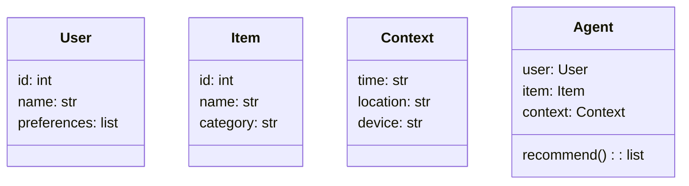
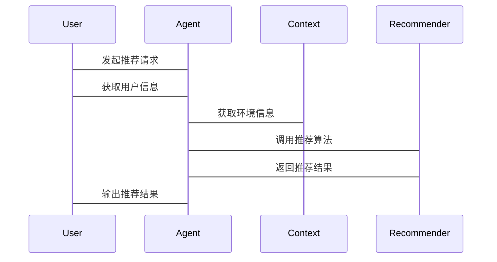

                 


# 开发AI Agent的上下文感知推荐系统

## 关键词
AI Agent, 上下文感知, 推荐系统, 算法原理, 系统架构, 项目实战

## 摘要
本文详细探讨了开发AI Agent的上下文感知推荐系统的各个方面，包括背景分析、核心概念、算法原理、系统架构设计以及项目实战。文章从问题背景出发，分析了传统推荐系统的局限性，介绍了上下文感知推荐系统的定义和目标。随后，详细讲解了AI Agent的基本原理和上下文感知推荐系统的实现路径。通过对比不同推荐系统的优缺点，本文提出了基于协同过滤、深度学习和上下文感知模型的算法实现。在系统架构设计部分，文章展示了系统的功能模块、架构图和交互流程图。最后，通过具体的项目实战，提供了环境安装、核心代码实现、案例分析和项目总结。本文还给出了最佳实践建议，包括数据处理、模型选择和系统优化等方面，帮助读者更好地理解和实现上下文感知推荐系统。

---

# 第一部分: 背景介绍

## 第1章: 问题背景与需求分析

### 1.1 问题背景
#### 1.1.1 当前推荐系统的挑战
传统的推荐系统在实际应用中面临诸多挑战。首先，传统推荐系统通常基于静态数据，无法实时感知用户的行为变化和环境信息。其次，推荐结果往往缺乏个性化，难以满足用户的动态需求。此外，传统推荐系统在处理大规模数据时，效率和准确性之间存在权衡，难以实现高效的实时推荐。

#### 1.1.2 AI Agent在推荐系统中的作用
AI Agent（人工智能代理）通过感知环境和用户行为，能够实时调整推荐策略。AI Agent具备学习和自适应能力，能够根据用户反馈和环境变化动态优化推荐结果。在推荐系统中引入AI Agent，可以显著提升推荐的准确性和实时性。

#### 1.1.3 上下文感知推荐系统的必要性
上下文感知推荐系统通过整合用户实时行为、环境信息和历史数据，能够动态调整推荐策略。这种推荐方式不仅考虑了用户的静态属性，还关注用户的动态行为和环境变化，从而提供更加精准和个性化的推荐。

### 1.2 问题描述
#### 1.2.1 传统推荐系统的局限性
传统推荐系统主要依赖于用户的历史行为数据，难以处理实时变化的用户需求和环境信息。此外，传统推荐系统往往忽视了用户在不同场景下的行为差异，导致推荐结果缺乏灵活性。

#### 1.2.2 上下文感知推荐系统的定义
上下文感知推荐系统是一种结合用户实时行为、环境信息和历史数据的推荐系统。它能够感知用户当前的上下文信息（如时间、地点、设备类型等），并基于这些信息动态调整推荐策略。

#### 1.2.3 系统目标与核心问题
系统的首要目标是实现一个能够实时感知上下文信息的推荐系统，解决传统推荐系统的局限性。核心问题包括如何有效整合多源数据，如何实时感知用户意图，以及如何动态调整推荐策略。

### 1.3 问题解决
#### 1.3.1 AI Agent的核心能力
AI Agent具备感知环境、学习和自适应能力。它能够通过感知用户行为和环境信息，动态调整推荐策略，提供更加个性化的推荐结果。

#### 1.3.2 上下文感知推荐系统的实现路径
上下文感知推荐系统的实现路径包括数据采集、上下文分析、推荐生成和结果输出。系统需要整合用户行为数据、环境信息和历史数据，通过机器学习算法生成推荐结果。

#### 1.3.3 系统边界与外延
系统边界包括用户行为数据、环境信息和历史数据的整合，以及推荐结果的生成和输出。系统的外延则涉及数据采集、存储、处理和推荐算法的优化。

### 1.4 核心概念与组成
#### 1.4.1 系统的核心要素
系统的核心要素包括用户行为数据、环境信息、历史数据、推荐算法和推荐结果。

#### 1.4.2 系统的组成模块
系统的组成模块包括数据采集模块、上下文分析模块、推荐生成模块和结果输出模块。

#### 1.4.3 系统的输入输出关系
系统的输入包括用户行为数据、环境信息和历史数据，输出包括推荐结果和反馈信息。

---

## 第2章: 核心概念与联系

### 2.1 核心概念原理
#### 2.1.1 AI Agent的基本原理
AI Agent通过感知环境和用户行为，动态调整推荐策略。AI Agent具备学习和自适应能力，能够根据用户反馈和环境变化优化推荐结果。

#### 2.1.2 上下文感知推荐系统的原理
上下文感知推荐系统通过整合用户实时行为、环境信息和历史数据，动态调整推荐策略。系统需要感知用户意图，分析上下文信息，并生成相应的推荐结果。

#### 2.1.3 系统的核心算法与模型
系统的核心算法包括协同过滤、基于深度学习的推荐算法和上下文感知模型。协同过滤基于用户相似性或物品相似性进行推荐，深度学习模型能够捕捉复杂的用户行为模式，上下文感知模型能够整合多源数据，动态调整推荐策略。

### 2.2 核心概念对比
#### 2.2.1 不同推荐系统的对比分析
- **传统协同过滤推荐系统**：基于用户历史行为数据，推荐结果缺乏灵活性。
- **基于深度学习的推荐系统**：能够捕捉复杂的用户行为模式，推荐结果更加精准。
- **上下文感知推荐系统**：整合用户实时行为和环境信息，动态调整推荐策略，推荐结果更加个性化。

#### 2.2.2 不同AI Agent的对比分析
- **基于规则的AI Agent**：根据预定义规则进行推荐，灵活性较低。
- **基于模型的AI Agent**：通过机器学习模型动态调整推荐策略，灵活性和准确性较高。

#### 2.2.3 上下文感知与传统推荐的对比
- **传统推荐系统**：忽视用户实时行为和环境信息，推荐结果静态。
- **上下文感知推荐系统**：整合用户实时行为和环境信息，推荐结果动态调整。

### 2.3 ER实体关系图
```mermaid
er
actor(Agent, User, Item) {
  Agent -> User: 接收请求
  Agent -> Item: 分析物品
  User -> Item: 选择物品
}
```

---

## 第3章: 算法原理与实现

### 3.1 算法原理
#### 3.1.1 协同过滤算法
协同过滤算法基于用户相似性或物品相似性进行推荐。通过计算用户之间的相似性，系统可以找到与当前用户行为相似的用户，并推荐这些用户喜欢的物品。

#### 3.1.2 基于深度学习的推荐算法
基于深度学习的推荐算法通过构建神经网络模型，捕捉用户行为的复杂模式。常用的模型包括神经网络协同过滤（Neural Collaborative Filtering）和深度强化学习模型。

#### 3.1.3 上下文感知模型
上下文感知模型整合用户实时行为和环境信息，动态调整推荐策略。模型需要分析用户的上下文信息，如时间、地点、设备类型等，生成相应的推荐结果。

### 3.2 算法实现
#### 3.2.1 协同过滤算法实现
以下是协同过滤算法的Python实现示例：
```python
import numpy as np

# 示例数据：用户-物品评分矩阵
users = ['user1', 'user2', 'user3']
items = ['item1', 'item2', 'item3']
ratings = {
    'user1': {'item1': 5, 'item2': 3, 'item3': 4},
    'user2': {'item1': 4, 'item2': 5, 'item3': 2},
    'user3': {'item1': 3, 'item2': 4, 'item3': 5}
}

# 计算用户之间的相似性
def compute_similarity(users, ratings):
    user_similarity = {}
    for i in range(len(users)):
        user_i = users[i]
        for j in range(i + 1, len(users)):
            user_j = users[j]
            common_items = [item for item in items if item in ratings[user_i] and item in ratings[user_j]]
            if not common_items:
                similarity = 0
            else:
                # 计算余弦相似性
                numerator = sum(ratings[user_i][item] * ratings[user_j][item] for item in common_items)
                denominator = (sum(ratings[user_i][item]**2 for item in common_items) ** 0.5) * (sum(ratings[user_j][item]**2 for item in common_items) ** 0.5)
                similarity = numerator / denominator if denominator != 0 else 0
            user_similarity[(user_i, user_j)] = similarity
    return user_similarity

user_similarity = compute_similarity(users, ratings)
print(user_similarity)
```

#### 3.2.2 深度学习模型实现
以下是基于神经网络协同过滤模型的实现示例：
```python
import tensorflow as tf
from tensorflow import keras

# 示例数据：用户-物品评分矩阵
# X和Y分别为输入和输出数据
# X: 用户的特征向量
# Y: 物品的特征向量

# 定义模型
model = keras.Sequential([
    keras.layers.Dense(64, activation='relu', input_shape=(input_dim,)),
    keras.layers.Dense(output_dim, activation='sigmoid')
])

# 编译模型
model.compile(optimizer='adam', loss='binary_crossentropy', metrics=['accuracy'])

# 训练模型
model.fit(X_train, Y_train, epochs=10, batch_size=32)
```

#### 3.2.3 上下文感知模型实现
以下是上下文感知模型的实现示例：
```python
import numpy as np

# 示例数据：用户行为数据和环境信息
# X: 用户行为数据
# context: 环境信息（如时间、地点）

# 定义模型
class ContextualAgent:
    def __init__(self, input_dim, context_dim):
        self.model = self.build_model(input_dim, context_dim)
    
    def build_model(self, input_dim, context_dim):
        inputs = keras.Input(shape=(input_dim,))
        context_inputs = keras.Input(shape=(context_dim,))
        
        # 处理输入特征
        x = keras.layers.Dense(64, activation='relu')(inputs)
        # 处理上下文特征
        context = keras.layers.Dense(64, activation='relu')(context_inputs)
        # 合并特征
        merged = keras.layers.Concatenate()([x, context])
        # 输出层
        output = keras.layers.Dense(1, activation='sigmoid')(merged)
        
        model = keras.Model(inputs=[inputs, context_inputs], outputs=output)
        return model
    
    def train(self, X_train, context_train, y_train):
        self.model.fit([X_train, context_train], y_train, epochs=10, batch_size=32)

agent = ContextualAgent(input_dim=10, context_dim=5)
agent.train(X_train, context_train, y_train)
```

---

## 第4章: 系统分析与架构设计

### 4.1 系统功能设计
#### 4.1.1 领域模型


#### 4.1.2 功能模块
- 数据采集模块：负责收集用户行为数据和环境信息。
- 上下文分析模块：分析用户行为和环境信息，生成上下文特征。
- 推荐生成模块：基于上下文特征和用户历史行为，生成推荐结果。
- 结果输出模块：将推荐结果输出给用户或系统。

### 4.2 系统架构设计
#### 4.2.1 分层架构
系统采用分层架构，包括数据层、业务逻辑层和表现层。

#### 4.2.2 模块划分
- 数据层：负责数据的存储和管理。
- 业务逻辑层：负责推荐算法的实现和上下文分析。
- 表现层：负责用户界面和推荐结果的展示。

### 4.3 系统接口设计
- 输入接口：用户行为数据和环境信息。
- 输出接口：推荐结果和用户反馈信息。

### 4.4 系统交互流程图


---

## 第5章: 项目实战

### 5.1 环境安装
安装必要的开发工具和库：
- Python
- NumPy
- Pandas
- Scikit-learn
- TensorFlow
- Surprise（推荐系统库）

### 5.2 核心代码实现
#### 5.2.1 数据预处理
```python
import pandas as pd
from surprise import Dataset, Reader

# 加载数据集
data = pd.read_csv('movielens.csv')
reader = Reader(ratings= data.ratings)
data = Dataset.load_from_df(data[['user_id', 'item_id', 'rating']], reader)
```

#### 5.2.2 推荐系统实现
```python
from surprise import SVD

# 初始化模型
model = SVD()
# 训练模型
model.fit(data)
# 生成推荐结果
for user in data.unique_users():
    for item in data.unique_items():
        if model.predict(user, item).est > 4:
            print(f'推荐给用户{user}：{item}')
```

#### 5.2.3 上下文感知模型实现
```python
import numpy as np
from sklearn.preprocessing import StandardScaler

# 加载上下文数据
context_data = pd.read_csv('context.csv')
scaler = StandardScaler()
context_scaled = scaler.fit_transform(context_data)

# 初始化模型
model = ContextualAgent(input_dim=10, context_dim=5)
# 训练模型
model.train(X_train, context_scaled, y_train)
```

### 5.3 案例分析
使用MovieLens数据集进行测试，分析推荐系统的性能和效果。

### 5.4 项目总结
总结项目实现的关键点，提出改进建议，如优化算法、增加更多特征、提升系统实时性。

---

## 第6章: 最佳实践与总结

### 6.1 实用建议
- 数据处理：确保数据质量和多样性。
- 模型选择：根据实际需求选择合适的推荐算法。
- 系统优化：提升系统的实时性和可扩展性。

### 6.2 注意事项
- 数据隐私：确保用户数据的安全和隐私。
- 系统性能：优化系统运行效率，减少延迟。
- 系统维护：定期更新模型，适应用户需求的变化。

### 6.3 拓展阅读
- 推荐相关书籍和论文，如《推荐系统实践》、《深度学习推荐系统》。
- 关注最新研究和技术动态，如强化学习在推荐系统中的应用。

---

通过以上步骤，我们可以系统地开发一个AI Agent的上下文感知推荐系统，结合理论分析和实际项目，为读者提供深入的理解和实用的指导。

