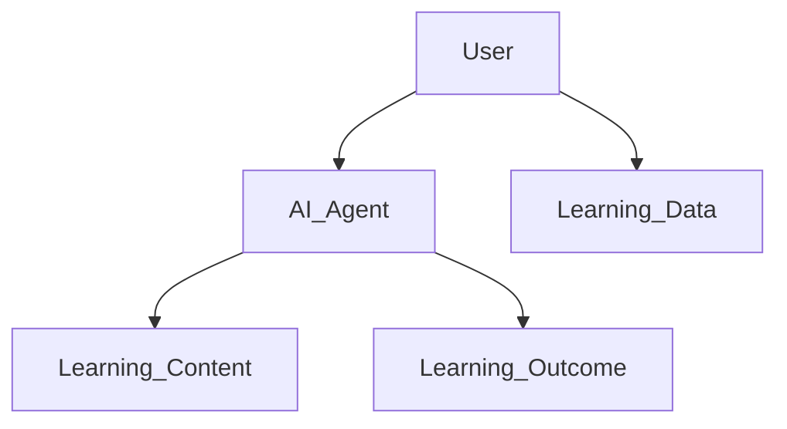
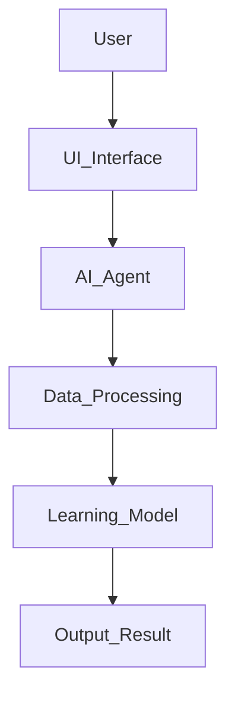
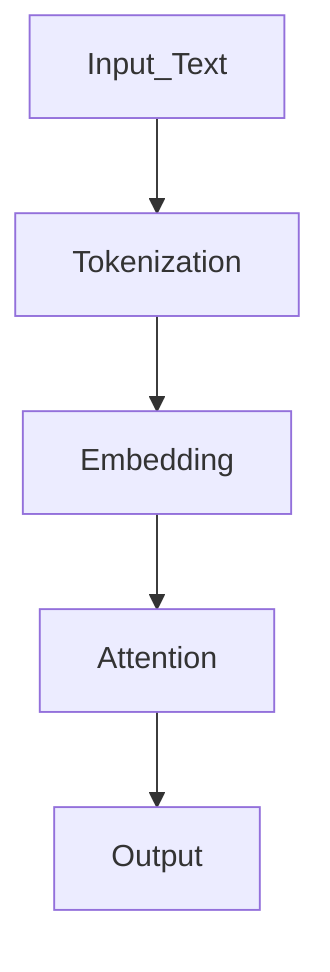
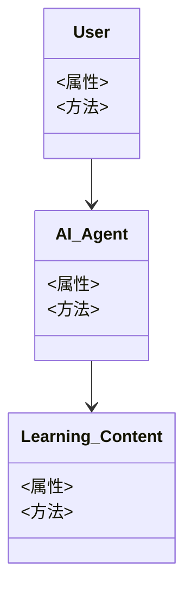
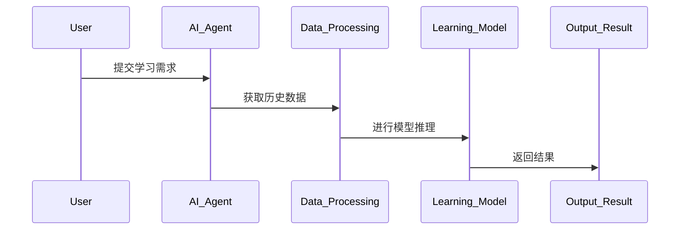

                 


# 开发AI Agent的个性化学习助手系统

## 关键词：AI Agent，个性化学习，自然语言处理，强化学习，系统架构

## 摘要：  
本文详细探讨了开发AI Agent的个性化学习助手系统的各个方面，从AI Agent的基本概念到系统架构设计，再到具体的算法实现和项目实战。通过系统的背景介绍、核心概念分析、算法原理阐述、系统架构设计以及实际案例分析，本文为读者提供了一个全面的视角，帮助理解如何利用AI技术构建高效的个性化学习助手系统。

---

# 第一部分: AI Agent的个性化学习助手系统背景与概述

# 第1章: AI Agent与个性化学习助手系统概述

## 1.1 AI Agent的基本概念

### 1.1.1 AI Agent的定义  
AI Agent（人工智能代理）是指能够感知环境、自主决策并执行任务的智能实体。它可以是一个软件程序，也可以是一个物理设备，通过与用户或环境的交互，完成特定的目标。AI Agent的核心特征包括自主性、反应性、目标导向和社会能力。

### 1.1.2 AI Agent的核心特征  
- **自主性**：AI Agent能够在没有外部干预的情况下独立运作。  
- **反应性**：能够实时感知环境并做出反应。  
- **目标导向**：通过明确的目标来指导行为和决策。  
- **社会能力**：能够与其他AI Agent或人类进行有效沟通和协作。  

### 1.1.3 AI Agent与传统软件的区别  
AI Agent与传统软件的主要区别在于其智能性和自主性。传统软件依赖于固定的规则和流程，而AI Agent能够通过学习和适应来优化其行为，具备处理复杂和不确定问题的能力。

## 1.2 个性化学习助手系统的背景

### 1.2.1 学习助手系统的发展历程  
个性化学习助手系统起源于教育技术的发展，早期的系统主要基于规则和模板提供简单的学习建议。随着人工智能技术的进步，学习助手系统逐渐具备了更强的智能化和个性化能力。

### 1.2.2 个性化学习的需求与挑战  
个性化学习的需求主要体现在以下几个方面：  
1. **学习者的多样性**：每个人的学习目标、能力和兴趣都不同。  
2. **学习内容的复杂性**：知识领域广泛且深度不同。  
3. **学习过程的动态性**：学习者的需求会随着时间和情境的变化而变化。  

个性化学习的挑战包括数据获取、算法设计和用户体验优化等方面。

### 1.2.3 AI Agent在学习助手中的应用潜力  
AI Agent可以通过自然语言处理、机器学习和强化学习等技术，实现对学习者需求的精准理解和智能推荐，从而为个性化学习提供强有力的支持。

## 1.3 本章小结  
本章从AI Agent的基本概念出发，介绍了个性化学习助手系统的背景和发展趋势，分析了其在教育领域的应用潜力。

---

# 第二部分: AI Agent的核心概念与原理

# 第2章: AI Agent的核心概念与联系

## 2.1 AI Agent的原理

### 2.1.1 感知模块  
AI Agent的感知模块负责接收输入信息并进行初步处理。常见的感知方式包括自然语言处理和多模态数据处理。

### 2.1.2 决策模块  
决策模块基于感知到的信息，结合历史数据和目标，生成决策策略。这通常涉及机器学习模型的训练和推理过程。

### 2.1.3 执行模块  
执行模块负责将决策策略转化为具体的行动，例如生成回答、推荐资源或调整学习计划。

## 2.2 实体关系图



图中展示了AI Agent与用户、学习内容和学习结果之间的关系。

## 2.3 系统架构图



该图展示了AI Agent系统的整体架构，包括用户界面、数据处理模块和学习模型。

## 2.4 本章小结  
本章通过分析AI Agent的核心模块和系统架构，帮助读者理解其工作原理和整体结构。

---

# 第三部分: AI Agent的算法原理

# 第3章: 自然语言处理算法

## 3.1 BERT模型原理

### 3.1.1 模型结构  
BERT（Bidirectional Encoder Representations from Transformers）是一种基于Transformer的预训练语言模型，具有双向编码能力。

### 3.1.2 训练过程  
BERT的训练包括两个阶段：无监督预训练和有监督微调。预训练目标包括Masked Language Modeling和Next Sentence Prediction。

### 3.1.3 应用场景  
BERT广泛应用于问答系统、文本摘要和情感分析等任务。

## 3.2 算法流程图



该流程图展示了BERT模型的基本处理流程。

## 3.3 Python代码实现

```python
import torch
from transformers import BertModel

class BERTProcessor:
    def __init__(self):
        self.bert = BertModel.from_pretrained('bert-base-uncased')

    def encode(self, text):
        inputs = self.tokenizer(text, return_tensors='pt')
        outputs = self.bert(**inputs)
        return outputs.last_hidden_state
```

该代码展示了如何使用BERT模型进行文本编码。

---

# 第四部分: 系统分析与架构设计方案

# 第4章: 系统分析与架构设计

## 4.1 系统功能设计

### 4.1.1 领域模型类图



该类图展示了用户、AI Agent和学习内容之间的关系。

### 4.1.2 系统架构图


该图展示了系统的整体架构。

## 4.2 系统接口设计

### 4.2.1 接口描述  
系统主要接口包括用户输入接口、AI Agent调用接口和数据存储接口。

### 4.2.2 接口交互流程图



---

# 第五部分: 项目实战

# 第5章: 项目实战

## 5.1 环境安装

```bash
pip install transformers torch
```

## 5.2 核心代码实现

### 5.2.1 AI Agent实现

```python
class AI_Agent:
    def __init__(self):
        self.nlp_model = BERTProcessor()

    def process_request(self, user_input):
        encoded_input = self.nlp_model.encode(user_input)
        # 处理编码结果并生成响应
        return response
```

### 5.2.2 学习内容管理

```python
class Learning_Content_Manager:
    def __init__(self):
        self.content_db = {}

    def fetch_content(self, topic):
        return self.content_db.get(topic, [])
```

## 5.3 代码解读与分析  
上述代码展示了AI Agent的核心功能，包括自然语言处理和学习内容管理。

## 5.4 实际案例分析  
通过具体案例，分析AI Agent在个性化学习中的应用。

---

# 第六部分: 最佳实践与总结

# 第6章: 最佳实践

## 6.1 小结  
开发AI Agent的个性化学习助手系统需要综合运用多种AI技术，包括自然语言处理和强化学习。

## 6.2 注意事项  
- 确保数据隐私和安全。  
- 定期更新模型以保持性能。  
- 考虑用户体验，提供友好交互界面。  

## 6.3 拓展阅读  
推荐阅读相关技术书籍和论文，深入学习AI Agent和个性化学习的最新进展。

---

# 结语  
通过本文的详细讲解，读者可以全面理解AI Agent的个性化学习助手系统的开发过程和应用价值。希望本文能够为相关领域的开发者和研究者提供有价值的参考。

