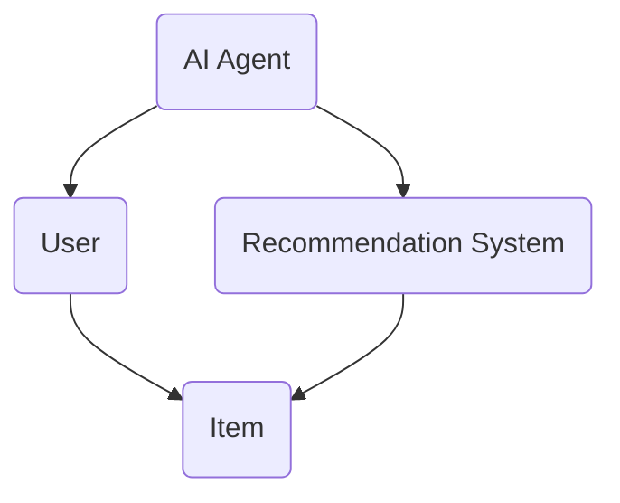
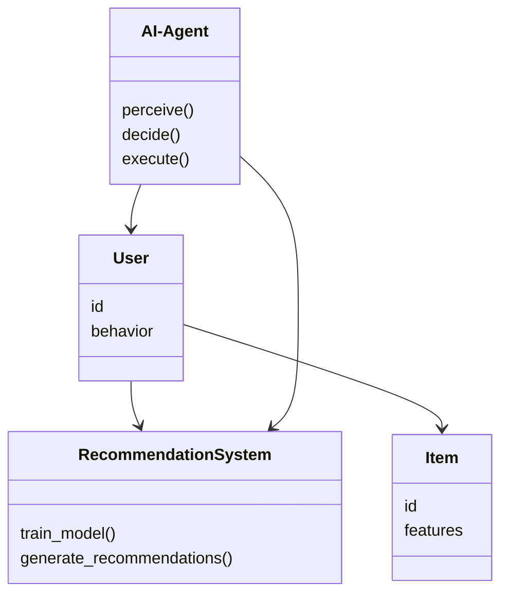
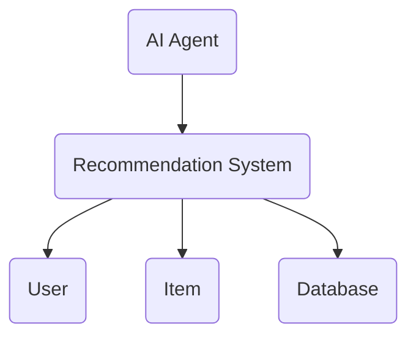
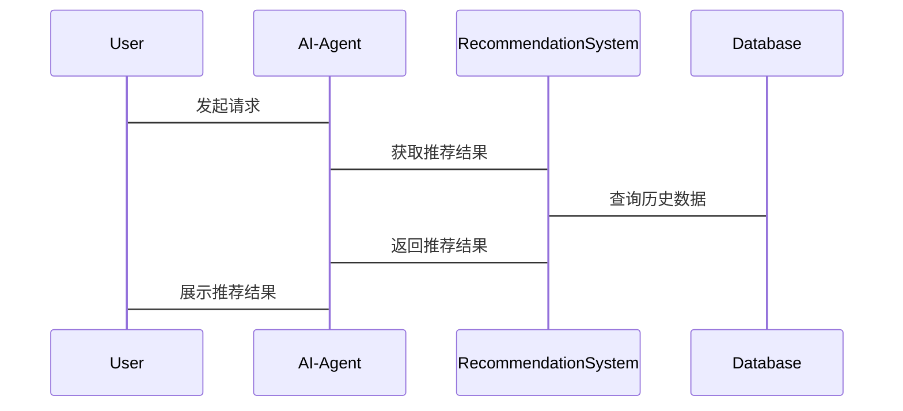

                 


# 开发AI Agent的个性化推荐系统

## 关键词：AI Agent, 个性化推荐系统, 协同过滤, 深度学习, 推荐算法, 系统架构, 项目实战

## 摘要：  
本文详细探讨了AI Agent与个性化推荐系统的结合，从基本概念到算法原理，再到系统架构和项目实战，系统地阐述了开发AI Agent个性化推荐系统的全过程。文章首先介绍了AI Agent和个性化推荐系统的背景与核心概念，接着深入分析了协同过滤、基于内容的推荐和深度学习推荐算法的原理，并通过Mermaid流程图和数学公式进行了直观的展示。随后，文章详细设计了系统的架构，并通过具体的项目实战指导读者如何实现推荐系统。最后，文章总结了开发过程中的一些最佳实践和注意事项，为读者提供了宝贵的实践经验。

---

# 第一部分: AI Agent与个性化推荐系统背景

# 第1章: AI Agent与个性化推荐系统概述

## 1.1 AI Agent的基本概念

### 1.1.1 AI Agent的定义与特点
AI Agent（人工智能代理）是一种能够感知环境、自主决策并执行任务的智能实体。它具有以下特点：
- **自主性**：能够在没有外部干预的情况下自主完成任务。
- **反应性**：能够根据环境变化动态调整行为。
- **学习能力**：通过数据和反馈不断优化自身的决策模型。
- **交互性**：能够与用户或其他系统进行交互。

### 1.1.2 AI Agent的核心功能与应用场景
AI Agent的核心功能包括感知、推理、决策和执行。它广泛应用于智能助手、推荐系统、自动驾驶、智能客服等领域。

### 1.1.3 AI Agent与传统推荐系统的区别
传统推荐系统主要基于用户行为数据进行推荐，而AI Agent不仅能够推荐内容，还能根据推荐结果动态调整推荐策略，甚至执行相关任务。

## 1.2 个性化推荐系统的背景与意义

### 1.2.1 个性化推荐系统的定义
个性化推荐系统是一种基于用户特征和行为数据，提供个性化内容或产品的技术。

### 1.2.2 个性化推荐系统的应用场景
个性化推荐系统广泛应用于电商、音乐、视频、新闻等领域，能够显著提升用户体验和用户满意度。

### 1.2.3 个性化推荐系统的核心价值
个性化推荐系统的核心价值在于通过精准推荐提高用户粘性和转化率，同时降低信息过载问题。

## 1.3 AI Agent与个性化推荐系统的结合

### 1.3.1 AI Agent在推荐系统中的作用
AI Agent能够通过学习用户偏好和行为模式，动态优化推荐策略，并执行推荐任务。

### 1.3.2 个性化推荐系统如何赋能AI Agent
个性化推荐系统为AI Agent提供了丰富的用户行为数据和推荐算法，帮助其更好地理解用户需求。

### 1.3.3 二者的结合带来的创新价值
结合AI Agent和个性化推荐系统，能够实现智能化、动态化的推荐服务，显著提升用户体验。

## 1.4 本章小结
本章介绍了AI Agent和个性化推荐系统的基本概念、核心功能和应用场景，阐述了两者结合的重要性和创新价值。

---

# 第二部分: AI Agent与个性化推荐系统的核心概念

# 第2章: AI Agent的核心原理与实现

## 2.1 AI Agent的基本原理

### 2.1.1 AI Agent的感知与决策机制
AI Agent通过感知环境数据，利用推理引擎进行决策，并执行相应的动作。

### 2.1.2 AI Agent的自主学习能力
AI Agent通过强化学习等方法，不断优化自身的决策模型。

### 2.1.3 AI Agent的交互方式
AI Agent可以通过自然语言处理技术与用户进行交互，或者通过API与其他系统进行交互。

## 2.2 个性化推荐系统的实现原理

### 2.2.1 基于协同过滤的推荐算法
协同过滤是一种基于用户行为相似性进行推荐的算法，分为基于用户的协同过滤和基于物品的协同过滤。

### 2.2.2 基于内容的推荐算法
基于内容的推荐算法通过分析商品或内容的特征，向用户推荐相似的内容。

### 2.2.3 基于深度学习的推荐算法
基于深度学习的推荐算法利用神经网络模型，从海量数据中学习用户的偏好和行为模式。

## 2.3 AI Agent与个性化推荐系统的协同工作原理

### 2.3.1 数据流分析
AI Agent通过收集用户行为数据，传递给推荐系统，推荐系统返回推荐结果，AI Agent根据推荐结果执行相应任务。

### 2.3.2 知识表示与推理
AI Agent利用知识图谱和推理引擎，对推荐结果进行分析和推理，进一步优化推荐策略。

### 2.3.3 动态调整与优化机制
AI Agent和推荐系统通过实时反馈不断优化推荐模型和策略。

## 2.4 核心概念对比分析表

| 概念 | AI Agent | 个性化推荐系统 |
|------|----------|----------------|
| 核心目标 | 自主完成任务 | 提供个性化内容推荐 |
| 输入 | 多模态数据 | 用户行为数据 |
| 输出 | 行动指令 | 推荐列表 |
| 学习机制 | 增强学习 | 监督学习或无监督学习 |

## 2.5 ER实体关系图



---

# 第三部分: 算法原理与数学模型

# 第3章: AI Agent与推荐系统的算法原理

## 3.1 协同过滤算法

### 3.1.1 基于用户的协同过滤
基于用户的协同过滤算法通过寻找与目标用户行为相似的用户，推荐这些用户喜欢的内容。

### 3.1.2 基于物品的协同过滤
基于物品的协同过滤算法通过分析物品之间的相似性，推荐与目标用户已感兴趣物品相似的内容。

### 3.1.3 混合协同过滤
混合协同过滤算法结合基于用户和基于物品的协同过滤方法，通过加权平均的方式生成推荐结果。

## 3.2 基于内容的推荐算法

### 3.2.1 文本挖掘与特征提取
文本挖掘技术用于提取商品或内容的特征，例如TF-IDF向量。

### 3.2.2 基于向量空间模型的推荐
基于向量空间模型的推荐算法通过计算目标商品与候选商品的向量相似性，进行推荐。

### 3.2.3 基于深度学习的内容推荐
基于深度学习的内容推荐算法利用神经网络模型，从海量数据中学习内容特征和用户偏好。

## 3.3 基于深度学习的推荐算法

### 3.3.1 基于神经网络的推荐模型
基于神经网络的推荐模型通过多层神经网络对用户行为数据进行特征提取和建模。

### 3.3.2 基于注意机制的推荐算法
基于注意机制的推荐算法通过自注意力机制捕捉用户行为中的关键特征。

## 3.4 协同过滤算法的数学模型

协同过滤的数学模型可以表示为：

$$
\hat{r}_{u,i} = \bar{r}_u + \sum_{v \in N(u)} w_{u,v} (r_{v,i} - \bar{r}_v)
$$

其中，$\hat{r}_{u,i}$是用户u对商品i的预测评分，$\bar{r}_u$是用户u的平均评分，$N(u)$是用户u的邻居集合，$w_{u,v}$是用户u和用户v的相似度权重，$r_{v,i}$是用户v对商品i的实际评分，$\bar{r}_v$是用户v的平均评分。

---

# 第四部分: 系统分析与架构设计

# 第4章: 系统分析与架构设计方案

## 4.1 问题场景介绍

### 4.1.1 用户需求分析
用户需要一个能够根据其行为和偏好，实时提供个性化推荐的系统。

### 4.1.2 系统功能设计
系统功能包括用户行为收集、推荐模型训练、推荐结果生成和推荐结果展示。

## 4.2 项目介绍

### 4.2.1 项目目标
开发一个基于AI Agent的个性化推荐系统，能够实时分析用户行为，动态优化推荐策略。

### 4.2.2 领域模型类图



### 4.2.3 系统架构图



### 4.2.4 系统交互序列图



---

# 第五部分: 项目实战

# 第5章: 项目实战与案例分析

## 5.1 环境安装与配置

### 5.1.1 安装Python与相关库
```bash
pip install numpy
pip install pandas
pip install scikit-learn
pip install matplotlib
pip install pymermaid
```

### 5.1.2 安装Jupyter Notebook
```bash
pip install jupyter
jupyter notebook
```

## 5.2 系统核心实现源代码

### 5.2.1 协同过滤算法实现

```python
import numpy as np

def user_based_collaborative_filtering(ratings, user_id, n_neighbors=5):
    # 计算用户平均评分
    user_mean = ratings.groupby('user_id')['rating'].mean()
    # 计算用户与目标用户的相似度
    similarity = ratings.pivot_table(index='user_id', columns='item_id', values='rating', fill_value=0)
    # 计算余弦相似度
    cosine_sim = (similarity.T @ similarity) / (similarity.T.norm() * similarity.norm())
    # 获取目标用户的相似用户
    similar_users = cosine_sim[user_id].sort_values(ascending=False).index[:n_neighbors]
    # 生成推荐列表
   推荐结果 = ratings.loc[similar_users].groupby('item_id')['rating'].mean().sort_values(ascending=False)
    return 推荐结果
```

### 5.2.2 基于深度学习的推荐算法实现

```python
import tensorflow as tf
from tensorflow.keras import layers

def deep_learning_recommendation_model(users, items, embedding_dim=32):
    # 用户嵌入层
    user_embeddings = layers.Embedding(users, embedding_dim)(输入用户ID)
    # 物品嵌入层
    item_embeddings = layers.Embedding(items, embedding_dim)(输入物品ID)
    # 拼接嵌入层
    concat_layer = layers.Concatenate()([user_embeddings, item_embeddings])
    # 全连接层
    dense_layer = layers.Dense(64, activation='relu')(concat_layer)
    # 输出层
    output_layer = layers.Dense(1)(dense_layer)
    return 模型
```

## 5.3 代码应用解读与分析

### 5.3.1 协同过滤算法实现解读
协同过滤算法通过计算用户之间的相似度，找到与目标用户行为相似的用户，推荐这些用户喜欢的内容。这种方法简单易懂，但计算量较大。

### 5.3.2 基于深度学习的推荐算法实现解读
基于深度学习的推荐算法利用神经网络模型，从海量数据中学习用户偏好和内容特征，具有更高的推荐精度，但实现复杂度较高。

## 5.4 实际案例分析和详细讲解剖析

### 5.4.1 案例背景
以电商推荐系统为例，用户在平台上购买了某些商品，我们需要根据用户的购买历史和行为，推荐相关商品。

### 5.4.2 数据收集与预处理
收集用户的行为数据，包括点击、收藏、购买等，进行清洗和特征提取。

### 5.4.3 模型训练与优化
选择合适的推荐算法，训练模型，并通过交叉验证进行优化。

### 5.4.4 模型部署与测试
将模型部署到生产环境，通过A/B测试验证推荐效果。

## 5.5 项目小结

### 5.5.1 项目总结
本项目通过协同过滤和深度学习两种推荐算法，展示了如何开发一个基于AI Agent的个性化推荐系统。

### 5.5.2 经验与教训
在项目中，我们需要注意数据质量和模型的实时性，同时要平衡推荐的准确性和多样性。

### 5.5.3 未来改进方向
未来可以尝试引入强化学习算法，进一步优化推荐策略，同时探索多模态数据的推荐方法。

---

# 第六部分: 最佳实践

# 第6章: 最佳实践与总结

## 6.1 小结

### 6.1.1 核心知识点回顾
本文详细讲解了AI Agent和个性化推荐系统的结合，介绍了协同过滤、基于内容的推荐和深度学习推荐算法的原理，并通过实际案例展示了如何开发一个基于AI Agent的个性化推荐系统。

## 6.2 注意事项

### 6.2.1 数据隐私与安全
在实际应用中，需要特别注意用户数据的隐私和安全问题。

### 6.2.2 模型的实时性与准确性
推荐系统的实时性和准确性是影响用户体验的重要因素，需要在设计和实现过程中加以优化。

### 6.2.3 系统的可扩展性
随着用户数量和数据规模的增加，推荐系统的可扩展性显得尤为重要。

## 6.3 拓展阅读

### 6.3.1 推荐系统领域的经典论文
- "Collaborative Filtering for Digital Media"（协同过滤在数字媒体中的应用）
- "Deep Learning for Recommendation Systems"（深度学习在推荐系统中的应用）

### 6.3.2 AI Agent领域的最新研究
- "Intelligent Agents in Recommender Systems"（推荐系统中的智能代理）
- "Multi-Agent Systems for Personalized Recommendations"（多代理系统在个性化推荐中的应用）

---

# 结语

开发AI Agent的个性化推荐系统是一个复杂但充满潜力的领域。通过本文的学习，读者可以掌握AI Agent与推荐系统的核心概念，理解各种推荐算法的原理，并通过实际案例掌握推荐系统的开发方法。希望本文能够为读者提供有价值的指导和启发，帮助他们在个性化推荐系统和AI Agent领域取得更大的突破。

