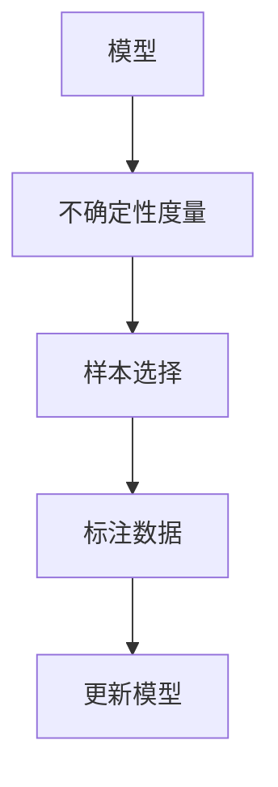
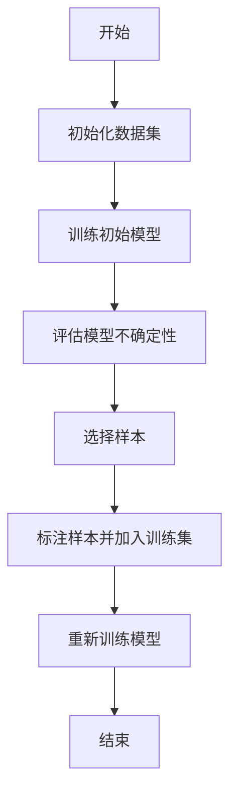
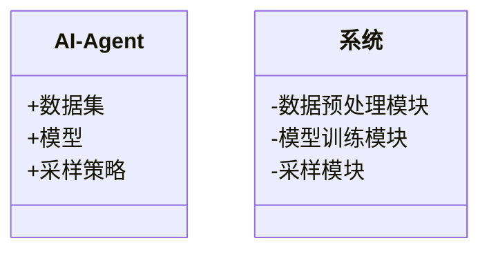
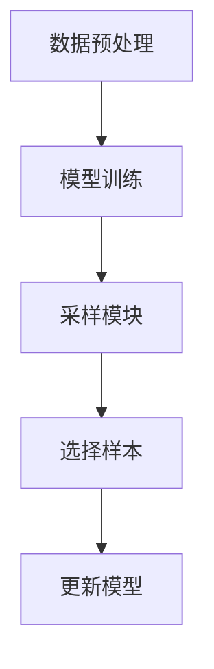

                 


# 开发AI Agent的主动学习能力：优化学习效率

## 关键词
主动学习，AI Agent，学习效率，算法原理，系统架构，项目实战

## 摘要
本文详细探讨了开发AI Agent的主动学习能力，以优化其学习效率。文章从背景介绍、核心概念、算法原理、系统架构设计、项目实战等方面进行深入分析，结合实际案例和详细代码示例，帮助读者理解并掌握主动学习在AI Agent中的应用。

## 第1章: 主动学习的背景与概念

### 1.1 主动学习的定义与背景
主动学习是一种机器学习技术，允许模型主动选择最有益于改进其性能的数据进行学习。与监督学习不同，主动学习不需要大量标注数据，而是通过模型主动选择数据进行学习，从而提高学习效率和效果。

#### 1.1.1 主动学习的定义
主动学习是指模型能够主动选择数据进行学习，而不是被动接收数据。这种技术特别适用于数据稀缺或标注成本高的场景。

#### 1.1.2 主动学习的背景与重要性
在AI Agent开发中，主动学习可以帮助模型更快地适应新环境，提高学习效率，减少对大量标注数据的依赖。

#### 1.1.3 AI Agent中的主动学习
AI Agent需要在动态环境中进行学习和决策，主动学习可以帮助其快速适应新任务，提高整体性能。

### 1.2 主动学习的核心概念
主动学习的核心在于通过选择性学习来优化模型性能。不确定性采样是一种常见的策略，模型选择最不确定的样本进行学习，从而提高分类准确性。

#### 1.2.1 核心概念的定义
- 不确定性：模型对某个样本的分类概率接近0.5，表示模型对该样本的不确定性较高。
- 采样策略：选择样本的方法，如不确定性采样、多样性采样等。

#### 1.2.2 主动学习与监督学习的对比
| 特性 | 主动学习 | 监督学习 |
|------|----------|----------|
| 数据标注 | 部分标注 | 全部标注 |
| 数据选择 | 主动选择 | 被动接受 |
| 适用场景 | 数据稀缺 | 数据充足 |

#### 1.2.3 主动学习的边界与外延
主动学习主要用于分类任务，但也可以扩展到回归、聚类等任务。

---

## 第2章: 主动学习的核心概念与联系

### 2.1 主动学习的原理
主动学习通过不断选择最具代表性的样本进行学习，以最小化模型的不确定性。

#### 2.1.1 不确定性采样
不确定性采样是主动学习中常用的一种策略，模型选择不确定性最高的样本进行标注和学习。

#### 2.1.2 多样性采样
多样性采样选择具有代表性的样本，确保模型覆盖整个数据分布。

#### 2.1.3 其他采样策略
其他策略包括类别不平衡采样、边界区域采样等。

### 2.2 核心概念对比分析
#### 2.2.1 主要概念对比表
| 概念 | 不确定性采样 | 多样性采样 |
|------|--------------|------------|
| 焦点 | 高不确定性 | 高多样性 |
| 优势 | 提高分类准确性 | 提高模型泛化能力 |

#### 2.2.2 ER实体关系图


---

## 第3章: 主动学习的算法原理

### 3.1 主动学习算法的流程
#### 3.1.1 数据预处理
对原始数据进行清洗和特征提取，确保数据质量。

#### 3.1.2 模型训练
使用初始标注数据训练模型，得到初步分类结果。

#### 3.1.3 采样策略
根据模型输出选择最具代表性的样本进行标注。

### 3.2 算法实现
#### 3.2.1 Mermaid流程图


#### 3.2.2 Python代码示例
```python
import numpy as np
from sklearn.svm import SVC

def uncertainty_sampling(X, y, model, num_samples=10):
    # 计算模型对每个样本的不确定性
    prob = model.predict_proba(X)
    uncertainty = np.max(prob, axis=1)
    # 选择不确定性最高的num_samples个样本
    indices = np.argsort(-uncertainty)[:num_samples]
    return X[indices], y[indices]

# 初始化数据集
X_train, y_train = initial_dataset()
# 训练初始模型
model = SVC(probability=True)
model.fit(X_train, y_train)
# 选择样本
selected_X, selected_y = uncertainty_sampling(X, y, model)
# 更新训练数据
X_train_new = np.concatenate([X_train, selected_X])
y_train_new = np.concatenate([y_train, selected_y])
# 重新训练模型
model.fit(X_train_new, y_train_new)
```

#### 3.2.3 数学模型与公式
模型的不确定性可以用概率差来衡量：
$$ \text{uncertainty}(x) = |P(y|x) - (1 - P(y|x))| $$
其中，$P(y|x)$是模型对样本$x$属于类别$y$的概率预测。

---

## 第4章: 系统分析与架构设计

### 4.1 系统功能设计
#### 4.1.1 领域模型


#### 4.1.2 系统架构图


---

## 第5章: 项目实战

### 5.1 环境安装
安装所需的库：
```bash
pip install numpy scikit-learn mermaid4jupyter
```

### 5.2 核心实现
实现主动学习的代码：
```python
def active_learning_loop(X, y_initial, model, num_iterations=10):
    model.fit(X, y_initial)
    for _ in range(num_iterations):
        uncertainty = model.predict_proba(X)[:, -1]
        selected_idx = np.argmax(uncertainty)
        selected_X = X[selected_idx:selected_idx+1]
        selected_y = y_initial[selected_idx:selected_idx+1]
        model.fit(selected_X, selected_y)
```

### 5.3 案例分析
通过实际案例分析，展示主动学习在分类任务中的效果，比较主动学习与监督学习在相同数据量下的性能差异。

---

## 第6章: 总结与展望

### 6.1 总结
主动学习是一种有效的技术，能够帮助AI Agent在数据稀缺的情况下快速优化性能。

### 6.2 注意事项
- 数据质量对主动学习的效果影响较大。
- 采样策略的选择需要根据具体任务进行调整。

### 6.3 拓展阅读
- 《主动学习的理论与实践》
- 《机器学习中的不确定性采样方法》

---

## 附录: 数学公式与工具推荐

### 附录A: 数学公式
模型的不确定性可以用以下公式计算：
$$ \text{uncertainty}(x) = 1 - \max(P(y|x)) $$

### 附录B: 工具推荐
- **库推荐**：使用scikit-learn中的主动学习相关库。
- **可视化工具**：使用Matplotlib或Seaborn进行数据可视化。

---

通过本文的详细讲解，读者可以深入了解主动学习的核心概念、算法原理和实际应用，掌握开发AI Agent主动学习能力的关键技术，从而优化其学习效率。

