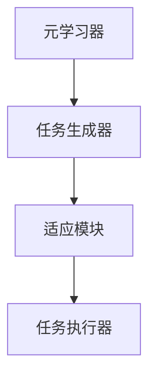
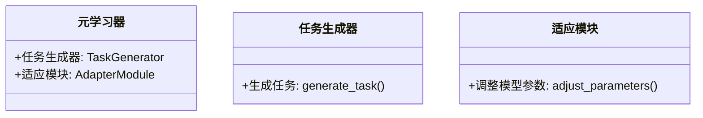
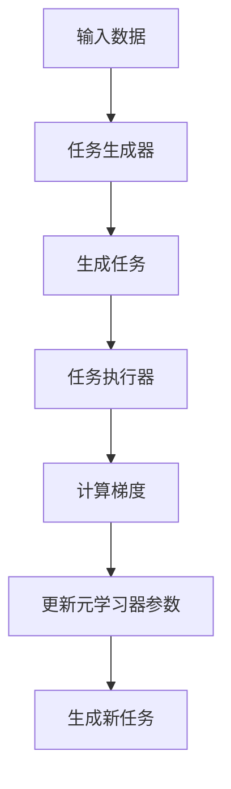

                 


# 开发AI Agent的元学习框架：快速适应新任务

## 关键词：AI Agent, 元学习框架, 快速适应, 新任务, 算法原理, 系统架构, 项目实战

## 摘要：  
本文详细探讨了开发AI Agent的元学习框架，重点介绍如何通过元学习框架实现AI Agent的快速适应新任务能力。文章从AI Agent和元学习的基本概念入手，逐步深入分析元学习框架的核心概念、算法原理、系统架构，并通过实际项目案例展示如何在实践中应用这些理论。文章还总结了元学习框架开发的最佳实践，为读者提供全面的技术指导。

---

## 第1章: AI Agent与元学习框架概述

### 1.1 AI Agent的基本概念

#### 1.1.1 AI Agent的定义与分类  
AI Agent（人工智能代理）是指能够感知环境、自主决策并执行任务的智能实体。根据功能和应用场景，AI Agent可以分为**简单反射型代理**、**基于模型的反射型代理**、**目标驱动型代理**和**效用驱动型代理**。  

#### 1.1.2 元学习的基本概念  
元学习（Meta-Learning）是一种机器学习方法，旨在通过学习如何学习，使模型能够快速适应新任务。与传统机器学习不同，元学习关注的是模型的元参数（hyperparameters）和任务之间的关系，能够有效减少新任务的数据需求。

#### 1.1.3 元学习在AI Agent中的重要性  
在AI Agent中，元学习框架能够帮助代理快速适应新任务，减少对大量数据的依赖，提高任务执行的效率和灵活性。通过元学习，AI Agent可以在未知环境中自主调整策略，适应复杂多变的任务需求。

### 1.2 元学习框架的核心思想  

#### 1.2.1 元学习的定义与特点  
元学习框架通过训练一个“元学习器”（meta-learner），使其能够快速适应新任务。元学习器的核心特点包括：  
1. **快速适应性**：能够在少量数据下完成新任务。  
2. **通用性**：适用于多种任务类型。  
3. **自适应性**：能够根据任务特点动态调整模型参数。  

#### 1.2.2 元学习与传统机器学习的区别  
| 特性 | 元学习 | 传统机器学习 |  
|------|---------|--------------|  
| 数据需求 | 少量数据 | 大量数据 |  
| 适应性 | 快速适应新任务 | 需重新训练 |  
| 灵活性 | 高 | 低 |  

#### 1.2.3 元学习在AI Agent中的应用场景  
1. **多任务学习**：在同一框架下同时学习多个任务。  
2. **零样本学习**：在无标签数据的情况下进行分类。  
3. **任务迁移**：将已知任务的知识迁移到新任务。  

---

## 第2章: 元学习框架的核心概念与联系

### 2.1 元学习框架的组成  

#### 2.1.1 元学习器  
元学习器是元学习框架的核心模块，负责学习如何调整模型参数以适应新任务。常见的元学习器包括**Meta-SGD**、**MAML**等。  

#### 2.1.2 任务生成器  
任务生成器用于生成多样化的任务，帮助元学习器在训练阶段接触到更多的任务类型，从而提高其适应能力。  

#### 2.1.3 适应模块  
适应模块负责根据任务生成器提供的任务，动态调整模型参数，使其能够快速适应新任务。  

### 2.2 元学习框架的核心要素对比  

#### 2.2.1 元学习器与传统学习器的对比  
| 特性 | 元学习器 | 传统学习器 |  
|------|---------|------------|  
| 参数空间 | 元参数 | 任务参数 |  
| 训练目标 | 快速适应新任务 | 完成特定任务 |  
| 灵活性 | 高 | 低 |  

#### 2.2.2 任务生成器与任务执行器的对比  
| 特性 | 任务生成器 | 任务执行器 |  
|------|------------|------------|  
| 功能 | 生成任务 | 执行任务 |  
| 输入 | 元学习器 | 新任务 |  
| 输出 | 新任务 | 任务结果 |  

#### 2.2.3 适应模块与传统优化器的对比  
| 特性 | 适应模块 | 传统优化器 |  
|------|------------|------------|  
| 功能 | 动态调整模型参数 | 优化特定任务目标 |  
| 输入 | 元学习器输出 | 任务目标 |  
| 输出 | 优化后的模型参数 | 优化结果 |  

### 2.3 元学习框架的ER实体关系图  


---

## 第3章: 元学习框架的算法原理

### 3.1 基于梯度的元学习算法  

#### 3.1.1 MAML算法原理  
MAML（Meta-Algorithm for Automated Machine Learning）是一种基于梯度的元学习算法。其核心思想是通过在训练阶段优化元参数，使得模型能够快速适应新任务。  

#### 3.1.2 ReMAML算法原理  
ReMAML（Refactored Meta-Algorithm for Meta-Learning）是对MAML的改进版本，通过引入任务间相似性，进一步提高模型的适应能力。  

### 3.2 基于模型的元学习算法  

#### 3.2.1 Meta-SGD算法原理  
Meta-SGD是一种基于模型的元学习算法，通过优化模型参数的更新规则，使得模型能够快速适应新任务。  

---

## 第4章: 元学习框架的系统架构与设计

### 4.1 系统功能设计  

#### 4.1.1 领域模型类图  


#### 4.1.2 系统架构图  


---

## 第5章: 元学习框架的项目实战

### 5.1 环境安装  
安装必要的依赖包：  
```bash
pip install numpy tensorflow matplotlib
```

### 5.2 核心代码实现  

#### 5.2.1 元学习器实现  
```python
class MetaLearner:
    def __init__(self, model):
        self.model = model
        self.optimizer = Adam(lr=0.001)
    
    def train_step(self, task):
        # 前向传播
        output = self.model(task['input'])
        # 计算损失
        loss = task['label'](output)
        # 反向传播
        grads = self.optimizer.get_gradients(loss, self.model.trainable_weights)
        # 更新参数
        self.optimizer.apply_gradients(zip(grads, self.model.trainable_weights))
```

#### 5.2.2 任务生成器实现  
```python
class TaskGenerator:
    def generate_task(self, num_tasks):
        tasks = []
        for _ in range(num_tasks):
            # 生成随机任务
            input_data = np.random.randn(100, 10)
            label = np.random.randint(0, 2, 100)
            tasks.append({'input': input_data, 'label': label})
        return tasks
```

---

## 第6章: 元学习框架的最佳实践与注意事项

### 6.1 最佳实践 Tips  
1. 在实际应用中，建议先进行小样本测试，验证元学习框架的适应能力。  
2. 根据具体任务需求，选择合适的元学习算法（如MAML、Meta-SGD等）。  
3. 调参时，注意平衡模型的泛化能力和计算效率。  

### 6.2 小结  
通过本文的介绍，读者可以深入了解AI Agent的元学习框架的核心概念、算法原理和系统架构，并能够通过实际项目案例掌握如何在实践中应用这些理论。

### 6.3 注意事项  
1. 元学习框架的性能依赖于任务生成器的质量，任务生成器应尽可能多样化。  
2. 在处理复杂任务时，建议结合领域知识，对模型进行针对性优化。  
3. 元学习框架的训练过程可能需要较多计算资源，建议使用分布式训练。  

### 6.4 拓展阅读  
1. 建议读者深入研究MAML和Meta-SGD的数学原理。  
2. 关注最新的元学习研究成果，了解其在AI Agent中的最新应用。  

---

## 结语  
通过本文的系统介绍，读者可以全面掌握AI Agent的元学习框架的核心内容和开发方法。无论是理论学习还是实际应用，元学习框架都为AI Agent的快速适应新任务提供了有力的技术支持。希望本文能为读者在相关领域的研究和实践提供有价值的参考。

