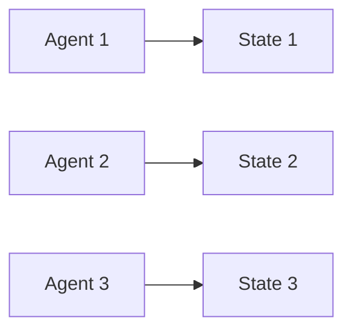
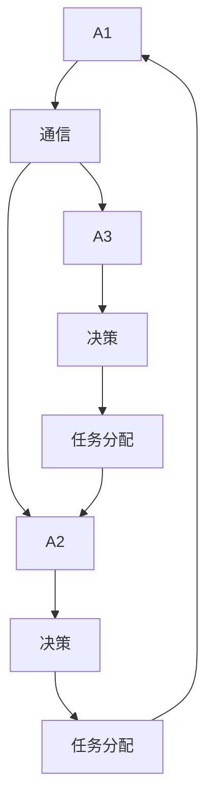
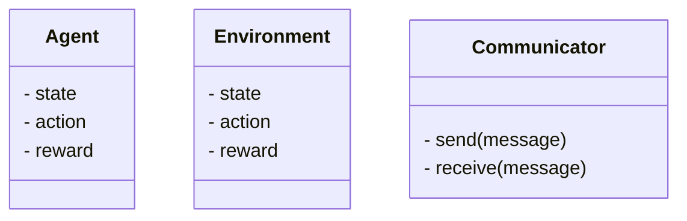

                 


# 开发AI Agent的多智能体协作学习系统

> 关键词：AI Agent, 多智能体协作学习, 算法原理, 系统架构, 项目实战

> 摘要：本文详细介绍了AI Agent在多智能体协作学习系统中的开发过程，涵盖了从基本概念到实际应用的各个方面。通过分析多智能体协作学习的核心原理、算法实现、系统架构设计以及项目实战，为读者提供了一个全面的视角，帮助理解如何构建高效的多智能体协作学习系统。

---

## 第一部分: AI Agent与多智能体协作学习系统背景介绍

### 第1章: AI Agent的基本概念与背景

#### 1.1 AI Agent的定义与核心要素

##### 1.1.1 AI Agent的定义
AI Agent（人工智能代理）是指能够感知环境、做出决策并采取行动以实现目标的智能实体。Agent可以是软件程序、机器人或其他具备智能行为的实体，其核心目标是通过与环境的交互来完成特定任务。

##### 1.1.2 AI Agent的核心要素
- **感知（Perception）**：通过传感器或数据输入获取环境信息。
- **推理（Reasoning）**：基于感知的信息进行逻辑推理，制定决策。
- **行动（Action）**：根据推理结果执行具体操作，影响环境状态。
- **学习（Learning）**：通过经验或数据优化自身的决策能力。

##### 1.1.3 AI Agent的分类与特点
- **简单反射型Agent**：基于预定义规则直接响应输入。
- **基于模型的反应式Agent**：利用内部模型分析环境并做出决策。
- **基于目标的Agent**：根据目标选择最优行动。
- **基于效用的Agent**：通过最大化效用来优化决策。

#### 1.2 多智能体协作学习的背景与意义

##### 1.2.1 多智能体协作学习的定义
多智能体协作学习（Multi-Agent Collaborative Learning, MACL）是指多个AI Agent通过协作与交互，共同完成复杂任务的学习过程。与单智能体学习不同，MACL强调多个Agent之间的协作与信息共享。

##### 1.2.2 多智能体协作学习的背景
随着AI技术的发展，单智能体学习在复杂场景中的局限性日益显现。多智能体协作学习通过多个Agent的分工合作，能够更好地处理复杂任务，如游戏AI、自动驾驶、机器人协作等领域。

##### 1.2.3 多智能体协作学习的意义
- **任务分解**：通过协作将复杂任务分解为简单子任务，降低单个Agent的计算负担。
- **信息互补**：多个Agent可以共享信息，提升整体系统的感知和决策能力。
- **鲁棒性增强**：通过多个Agent的协作，系统能够更好地应对复杂多变的环境。

#### 1.3 AI Agent与多智能体协作学习的关联

##### 1.3.1 AI Agent在多智能体系统中的角色
- **独立决策**：每个Agent根据自身状态和环境信息做出决策。
- **协作与竞争**：在多智能体系统中，Agent之间可以协作完成任务，也可以通过竞争优化整体性能。

##### 1.3.2 多智能体协作学习的核心问题
- **协作机制**：如何设计有效的协作策略，使得多个Agent能够高效协作。
- **信息共享**：如何在不损失隐私的前提下实现信息的有效共享。
- **任务分配**：如何动态分配任务，确保每个Agent都能发挥其优势。

##### 1.3.3 多智能体协作学习的应用场景
- **游戏AI**：多个AI Agent协作完成游戏任务。
- **自动驾驶**：多辆自动驾驶汽车协作完成交通任务。
- **机器人协作**：工业机器人协作完成生产任务。

---

## 第2章: 多智能体协作学习的背景与发展

### 2.1 多智能体协作学习的起源

#### 2.1.1 多智能体系统的发展历程
多智能体系统起源于分布式人工智能（DAI）领域，随着计算能力的提升，多智能体协作学习逐渐成为研究热点。

#### 2.1.2 多智能体协作学习的起源
多智能体协作学习的起源可以追溯到20世纪90年代，随着分布式计算和机器学习技术的发展，多智能体协作学习逐渐从理论研究走向实际应用。

### 2.2 多智能体协作学习的现状

#### 2.2.1 当前多智能体协作学习的研究热点
- **协作机制设计**：如何设计高效的协作策略。
- **信息共享技术**：如何实现信息的有效共享。
- **学习算法优化**：如何优化多智能体协作学习算法的性能。

#### 2.2.2 多智能体协作学习在不同领域的应用
- **游戏AI**：多智能体协作学习在游戏AI中的应用。
- **自动驾驶**：多智能体协作学习在自动驾驶中的应用。
- **机器人协作**：多智能体协作学习在机器人协作中的应用。

### 2.3 多智能体协作学习的未来趋势

#### 2.3.1 技术发展的潜在方向
- **更高效的协作机制**：研究更高效的协作策略，提升系统性能。
- **更智能的信息共享**：研究更智能的信息共享方法，降低通信开销。
- **更强大的学习算法**：研究更强大的学习算法，提升系统自适应能力。

#### 2.3.2 多智能体协作学习的未来挑战
- **协作效率**：如何在大规模多智能体系统中实现高效的协作。
- **信息隐私**：如何在协作过程中保护信息隐私。
- **动态环境适应**：如何应对动态变化的环境。

---

## 第三部分: 多智能体协作学习的核心概念与联系

### 第3章: 多智能体协作学习的核心概念

#### 3.1 多智能体协作学习的基本原理

##### 3.1.1 多智能体协作学习的定义
多智能体协作学习是指多个AI Agent通过协作与交互，共同完成复杂任务的学习过程。

##### 3.1.2 多智能体协作学习的基本原理
- **协作与竞争**：Agent之间可以协作完成任务，也可以通过竞争优化整体性能。
- **信息共享**：通过信息共享，多个Agent可以更好地协作。
- **任务分配**：根据任务特点动态分配任务，确保每个Agent都能发挥其优势。

##### 3.1.3 多智能体协作学习的核心要素
- **协作机制**：如何设计有效的协作策略。
- **信息共享**：如何在不损失隐私的前提下实现信息的有效共享。
- **任务分配**：如何动态分配任务，确保每个Agent都能发挥其优势。

#### 3.2 多智能体协作学习的关键技术

##### 3.2.1 通信与协作机制
- **通信协议**：设计有效的通信协议，确保Agent之间能够高效通信。
- **协作策略**：设计有效的协作策略，确保Agent之间能够高效协作。

##### 3.2.2 协作策略
- **分布式协作策略**：每个Agent根据自身状态和环境信息做出决策。
- **集中式协作策略**：通过集中式决策中心统一制定协作策略。

##### 3.2.3 学习与优化算法
- **强化学习算法**：通过强化学习算法优化协作策略。
- **分布式优化算法**：通过分布式优化算法优化系统性能。

#### 3.3 多智能体协作学习的数学模型

##### 3.3.1 多智能体协作学习的数学表达
$$ V(s) = \max_a \sum_{i=1}^n v_i(s,a_i) $$
其中，$V(s)$ 表示系统整体价值，$v_i(s,a_i)$ 表示第i个Agent在状态$s$和动作$a_i$下的价值。

##### 3.3.2 协作策略的数学建模
$$ \pi(a|s) = \arg\max_a \sum_{i=1}^n v_i(s,a_i) $$
其中，$\pi(a|s)$ 表示在状态$s$下选择动作$a$的策略。

##### 3.3.3 学习过程的数学分析
$$ Q(s,a) = \sum_{i=1}^n Q_i(s,a_i) $$
其中，$Q(s,a)$ 表示在状态$s$下执行动作$a$的Q值，$Q_i(s,a_i)$ 表示第i个Agent的Q值。

---

## 第4章: 多智能体协作学习的核心概念与联系

### 4.1 多智能体协作学习的核心概念对比

#### 4.1.1 单智能体学习与多智能体学习的对比

| 特性               | 单智能体学习             | 多智能体学习             |
|--------------------|--------------------------|--------------------------|
| 系统复杂度         | 较低                     | 较高                     |
| 协作性             | 无                      | 有                      |
| 信息共享           | 无                      | 有                      |
| 任务分配           | 单一                     | 多样                     |

#### 4.1.2 协作学习与竞争学习的对比

| 特性               | 协作学习                 | 竞争学习                 |
|--------------------|--------------------------|--------------------------|
| 目标               | 共同完成任务             | 争夺资源或目标           |
| 信息共享           | 高                     | 低                     |
| 协作机制           | 明确                     | 潜在                     |

### 4.2 多智能体协作学习的ER实体关系图



### 4.3 多智能体协作学习的协作流程



---

## 第五部分: 算法原理讲解

### 第5章: 多智能体协作学习算法的实现

#### 5.1 多智能体强化学习算法

##### 5.1.1 多智能体强化学习算法的定义
多智能体强化学习（Multi-Agent Reinforcement Learning, MARL）是指多个智能体通过强化学习算法协作完成任务的过程。

##### 5.1.2 多智能体强化学习算法的实现


##### 5.1.3 多智能体强化学习算法的数学模型

$$ Q(s,a) = \sum_{i=1}^n Q_i(s,a_i) $$

---

## 第六部分: 系统分析与架构设计

### 第6章: 多智能体协作学习系统的架构设计

#### 6.1 项目背景介绍

##### 6.1.1 项目背景
本项目旨在开发一个多智能体协作学习系统，用于解决复杂任务中的协作与优化问题。

#### 6.2 系统功能设计

##### 6.2.1 功能模块划分
- **通信模块**：负责Agent之间的通信。
- **决策模块**：负责Agent的决策制定。
- **学习模块**：负责Agent的学习与优化。

##### 6.2.2 领域模型类图



#### 6.3 系统架构设计

##### 6.3.1 系统架构图


---

## 第七部分: 项目实战

### 第7章: 多智能体协作学习系统的实现

#### 7.1 环境安装与配置

##### 7.1.1 环境要求
- Python 3.8+
- TensorFlow 2.0+
- Gym库

#### 7.2 系统核心实现源代码

##### 7.2.1 Agent类实现

```python
class Agent:
    def __init__(self, state_space, action_space):
        self.state_space = state_space
        self.action_space = action_space
        # 初始化策略网络
        self.policy = ...
    def act(self, state):
        # 根据策略选择动作
        action = ...
        return action
```

##### 7.2.2 通信模块实现

```python
class Communicator:
    def __init__(self):
        self.agents = []
    def send(self, message):
        # 发送消息
        pass
    def receive(self, message):
        # 接收消息
        pass
```

#### 7.3 代码解读与分析

##### 7.3.1 代码解读
- **Agent类**：负责Agent的感知、决策和行动。
- **Communicator类**：负责Agent之间的通信。

#### 7.4 实际案例分析

##### 7.4.1 案例分析
- **任务分配**：根据任务特点动态分配任务，确保每个Agent都能发挥其优势。
- **协作机制**：设计有效的协作策略，确保Agent之间能够高效协作。

---

## 第八部分: 总结与展望

### 第8章: 多智能体协作学习系统的总结

#### 8.1 项目总结
- **核心观点**：多智能体协作学习通过多个Agent的协作与交互，能够更好地处理复杂任务。
- **关键结论**：设计高效的协作机制和信息共享技术是多智能体协作学习的核心。

#### 8.2 注意事项
- **协作效率**：在大规模多智能体系统中，如何实现高效的协作是一个重要挑战。
- **信息隐私**：在协作过程中，如何保护信息隐私是一个重要问题。

#### 8.3 拓展阅读
- **推荐书籍**：《Multi-Agent Systems: Algorithmic, Complexity Theoretic, and Game Theoretic Foundations》
- **推荐论文**：《Multi-Agent Reinforcement Learning: A Survey》

---

## 第九部分: 最佳实践与小结

### 第9章: 多智能体协作学习系统的最佳实践

#### 9.1 最佳实践 tips
- **模块化设计**：将系统划分为多个模块，便于开发和维护。
- **通信机制**：设计高效的通信机制，确保Agent之间的高效协作。
- **学习算法**：选择合适的强化学习算法，优化系统性能。

#### 9.2 小结
多智能体协作学习系统是一个复杂但充满潜力的领域，通过合理的系统设计和高效的算法优化，可以实现高效的协作与学习。

---

## 第十部分: 思考与总结

### 第10章: 多智能体协作学习系统的思考与总结

#### 10.1 多智能体协作学习系统的核心思想
- **协作与竞争**：通过协作与竞争的结合，实现高效的系统性能。
- **信息共享**：通过有效的信息共享，提升系统的整体性能。

#### 10.2 多智能体协作学习系统的未来展望
- **更高效的协作机制**：研究更高效的协作策略，提升系统性能。
- **更智能的信息共享**：研究更智能的信息共享方法，降低通信开销。
- **更强大的学习算法**：研究更强大的学习算法，提升系统自适应能力。

---

## 第十一部分: 附录

### 附录A: 术语表

- **AI Agent**：人工智能代理，能够感知环境、做出决策并采取行动的智能实体。
- **多智能体协作学习**：多个AI Agent通过协作与交互，共同完成复杂任务的学习过程。

### 附录B: 参考文献

- [1] L.reamble, Multi-Agent Systems: Algorithmic, Complexity Theoretic, and Game Theoretic Foundations, MIT Press, 2003.
- [2] D. Crites and R. Sutton, “Multi-agent reinforcement learning,” in Proceedings of the 11th International Conference on Machine Learning, 1994.

---

通过以上内容，我们详细介绍了AI Agent在多智能体协作学习系统中的开发过程，涵盖了从基本概念到实际应用的各个方面。从AI Agent的基本概念到多智能体协作学习的核心原理，再到具体的算法实现和系统设计，为读者提供了一个全面的视角，帮助理解如何构建高效的多智能体协作学习系统。

