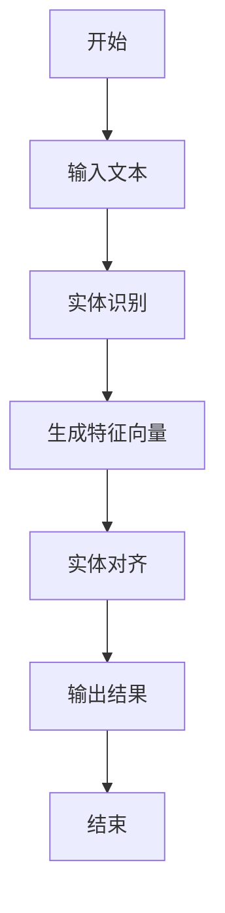
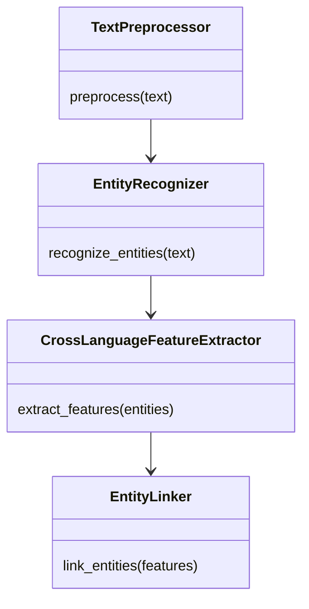
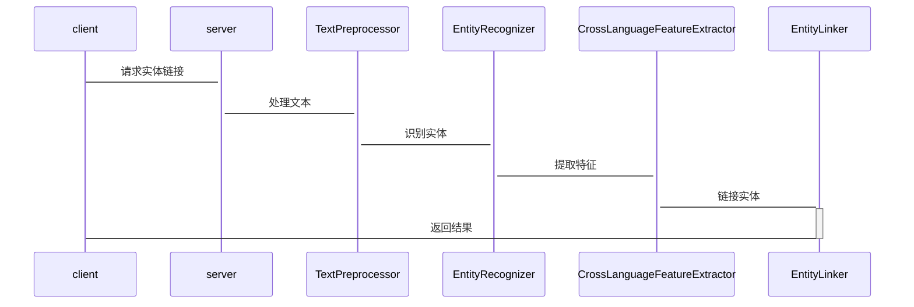

                 


# 开发AI Agent的多语言实体链接系统

## 关键词：AI Agent, 多语言实体链接, 自然语言处理, 跨语言信息检索, 实体链接算法

## 摘要：本文探讨了开发AI Agent的多语言实体链接系统的核心概念、算法原理和系统架构。通过分析实体链接的背景、核心原理和实现方法，结合具体的系统设计和项目实战，详细阐述了如何构建一个高效的多语言实体链接系统。

---

# 第一章: AI Agent与多语言实体链接系统概述

## 1.1 问题背景与描述

### 1.1.1 多语言实体链接的背景
在跨语言信息检索和自然语言处理中，实体链接是一项关键任务。随着全球化的发展，多语言数据的处理需求日益增加。实体链接的目标是将文本中的实体与知识库中的概念进行匹配，解决信息孤岛问题。

### 1.1.2 AI Agent在多语言实体链接中的作用
AI Agent能够处理多语言实体链接任务，通过理解上下文和语义，提升跨语言信息处理的准确性。AI Agent的应用场景包括智能问答、机器翻译、信息抽取等。

### 1.1.3 多语言实体链接的核心问题
多语言实体链接的核心问题包括跨语言实体对齐、实体消歧、语义理解等。这些问题需要结合语言学知识和机器学习算法来解决。

## 1.2 多语言实体链接系统的核心概念

### 1.2.1 实体链接的定义与属性
实体链接是指将文本中的实体词汇映射到知识库中的概念。实体链接的属性包括实体类型、语言、语义相似度等。

### 1.2.2 多语言实体链接的挑战与解决方案
多语言实体链接的挑战包括语言差异、实体对齐困难、语义模糊等。解决方案包括跨语言特征提取、多模态信息融合、基于知识图谱的对齐方法。

### 1.2.3 系统的边界与外延
系统的边界包括输入文本、知识库、输出实体链接结果。外延包括支持多种语言、处理大规模数据、提供高精度的实体链接结果。

## 1.3 实体链接系统的结构与核心要素

### 1.3.1 实体链接系统的组成
系统组成包括文本预处理模块、实体识别模块、跨语言特征提取模块、实体对齐模块、结果输出模块。

### 1.3.2 核心要素的定义与关系
核心要素包括输入文本、知识库、实体识别结果、特征向量、实体链接结果。各要素之间的关系需要通过算法进行处理。

### 1.3.3 系统的输入输出与流程
系统的输入包括多语言文本，输出实体链接结果。流程包括预处理、实体识别、特征提取、实体对齐、结果输出。

## 1.4 本章小结
本章介绍了多语言实体链接系统的背景、核心概念和系统结构。为后续的算法设计和系统实现奠定了基础。

---

# 第二章: 多语言实体链接的核心原理

## 2.1 实体链接的基本原理

### 2.1.1 实体表示与匹配
实体表示包括词汇表示和语义表示。实体匹配基于相似度计算，如余弦相似度。

### 2.1.2 多语言实体链接的特征对比
特征对比包括语言特征、语义特征、上下文特征。通过对比分析，选择合适的特征进行实体对齐。

### 2.1.3 实体关系的ER图架构
ER图展示实体之间的关系，帮助理解实体链接的结构和复杂性。

## 2.2 多语言实体链接的属性特征对比

### 2.2.1 不同实体链接方法的对比分析
通过表格对比不同算法的优缺点，如精确度、计算效率、适应性等。

### 2.2.2 实体链接的性能指标
性能指标包括精确度、召回率、F1值、处理时间等。

### 2.2.3 实体链接的优缺点总结
总结不同算法的优缺点，帮助选择合适的算法。

## 2.3 实体关系的ER图架构

### 2.3.1 实体关系的定义
定义实体之间的关系，如“属于”、“部分”、“整体”等。

### 2.3.2 实体关系的可视化展示
使用Mermaid图展示实体关系，帮助理解复杂性。

### 2.3.3 实体关系的复杂性分析
分析实体关系的复杂性，为系统设计提供依据。

## 2.4 本章小结
本章详细阐述了实体链接的核心原理和特征对比，为后续的算法设计提供了理论基础。

---

# 第三章: 多语言实体链接的算法原理

## 3.1 实体链接算法的基本原理

### 3.1.1 基于向量的实体表示
使用Word2Vec或BERT等模型生成实体向量。

### 3.1.2 基于概率的实体匹配
通过概率模型计算实体匹配的概率，如条件概率。

### 3.1.3 基于图的实体链接
构建知识图谱，通过图结构进行实体对齐。

## 3.2 实体链接算法的流程图

### 3.2.1 算法流程图的Mermaid图


## 3.3 实体链接算法的数学模型

### 3.3.1 基于余弦相似度的实体匹配公式
$$ \text{相似度} = \frac{\vec{u} \cdot \vec{v}}{|\vec{u}| |\vec{v}|} $$

### 3.3.2 基于概率的实体匹配公式
$$ P(a|b) = \frac{P(b|a)P(a)}{P(b)} $$

## 3.4 算法实现与代码示例

### 3.4.1 使用Word2Vec进行实体表示
```python
from gensim.models import Word2Vec

# 训练Word2Vec模型
model = Word2Vec(sentences, vector_size=100, window=5, min_count=1, workers=4)
```

### 3.4.2 使用余弦相似度进行匹配
```python
from sklearn.metrics.pairwise import cosine_similarity

# 计算相似度
similarity = cosine_similarity(model.wv['entity1'].reshape(1, -1), model.wv['entity2'].reshape(1, -1))
```

## 3.5 本章小结
本章详细讲解了实体链接算法的原理和实现，通过代码示例帮助读者理解算法的应用。

---

# 第四章: 多语言实体链接系统的架构设计

## 4.1 系统分析与需求分析

### 4.1.1 问题场景介绍
系统需要处理多语言文本，实现实体链接。

### 4.1.2 项目介绍
项目目标是开发一个高效的多语言实体链接系统。

## 4.2 系统功能设计

### 4.2.1 领域模型设计
使用Mermaid类图展示系统模块和类的关系。



### 4.2.2 系统架构设计
使用Mermaid架构图展示系统整体架构。


## 4.3 系统接口与交互设计

### 4.3.1 系统接口设计
接口包括文本输入接口、实体链接结果输出接口。

### 4.3.2 系统交互设计
使用Mermaid序列图展示系统交互流程。



## 4.4 本章小结
本章详细阐述了系统的架构设计，为后续的实现提供了指导。

---

# 第五章: 多语言实体链接系统的项目实战

## 5.1 环境安装与配置

### 5.1.1 安装Python环境
```bash
python -m pip install --upgrade pip
pip install numpy gensim spacy
```

### 5.1.2 安装spaCy和语言模型
```bash
pip install -r requirements.txt
python -m spacy download en_core_web_sm
python -m spacy download es_core_web_sm
```

## 5.2 系统核心代码实现

### 5.2.1 文本预处理代码
```python
def preprocess(text):
    # 分词和停用词处理
    return [token for token in text.split() if token not in STOP_WORDS]
```

### 5.2.2 实体识别代码
```python
import spacy

nlp = spacy.load("en_core_web_sm")
doc = nlp(text)
entities = [ent.text for ent in doc.ents]
```

### 5.2.3 特征提取代码
```python
from gensim.models import Word2Vec

def extract_features(entities):
    model = Word2Vec.load('model.bin')
    features = []
    for ent in entities:
        if ent in model:
            features.append(model[ent])
    return features
```

## 5.3 代码应用解读与分析

### 5.3.1 代码功能解读
解释每个模块的功能和作用。

### 5.3.2 代码实现细节分析
分析代码实现的细节，如模型训练、特征提取等。

## 5.4 实际案例分析与详细讲解

### 5.4.1 案例分析
以实际案例展示系统运行过程。

### 5.4.2 详细讲解
详细解释案例中的每一步操作和结果。

## 5.5 本章小结
本章通过实际项目实战，帮助读者理解系统的实现过程。

---

# 第六章: 多语言实体链接系统的优化与展望

## 6.1 系统优化建议

### 6.1.1 算法优化
建议使用更先进的算法，如图神经网络。

### 6.1.2 系统性能优化
优化系统架构，提升处理速度。

## 6.2 开发注意事项

### 6.2.1 注意事项
注意事项包括数据质量、模型训练、性能优化等。

### 6.2.2 实际应用中的问题
分析实际应用中可能遇到的问题，并提供解决方案。

## 6.3 未来展望

### 6.3.1 技术发展
展望多语言实体链接技术的未来发展方向。

### 6.3.2 应用领域拓展
探讨系统在更多领域的应用潜力。

## 6.4 本章小结
本章总结了系统的优化建议，并展望了未来的发展方向。

---

# 第七章: 总结与展望

## 7.1 核心内容回顾
回顾文章的核心内容，强调多语言实体链接的重要性和实现方法。

## 7.2 项目总结

### 7.2.1 项目成果
总结项目实现的成果和意义。

### 7.2.2 项目不足
分析项目的不足之处，如算法精度、处理速度等。

## 7.3 未来工作方向

### 7.3.1 研究方向
提出未来的研究方向，如跨语言信息检索、知识图谱构建等。

### 7.3.2 技术展望
展望多语言实体链接技术的未来发展。

## 7.4 本章小结
本章总结了文章的核心内容，并展望了未来的发展方向。

---

# 参考文献

[此处列出参考文献]

---

# 致谢

感谢读者的支持和关注。

--- 

以上就是《开发AI Agent的多语言实体链接系统》的技术博客文章的完整目录和内容框架。希望这篇文章能为读者提供深入的理论和技术指导，帮助他们在实际项目中开发出高效的多语言实体链接系统。

