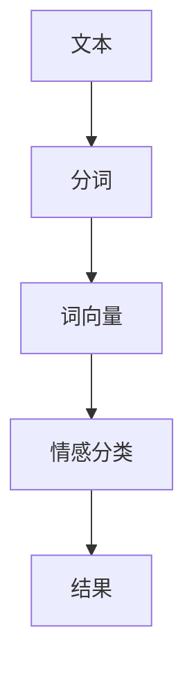
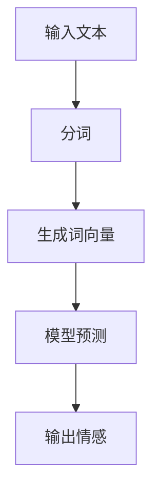
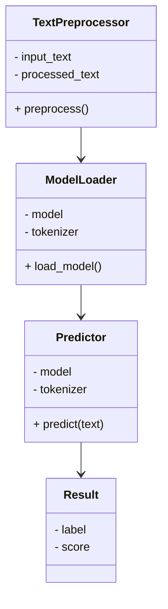
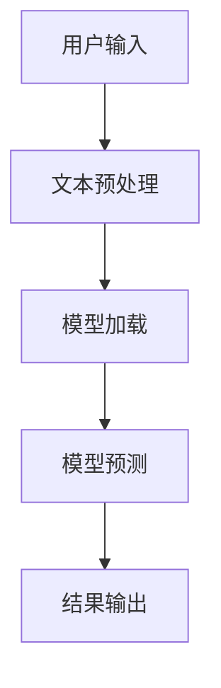

                 


# 开发AI Agent的多语言情感分析引擎

---

## 关键词：AI Agent，多语言情感分析，自然语言处理，深度学习，文本挖掘，预训练模型

---

## 摘要

本文详细探讨了开发AI Agent的多语言情感分析引擎的关键技术与实现方法。文章从情感分析的背景出发，分析了多语言情感分析的核心概念与挑战，深入讲解了基于深度学习的算法原理，包括预训练模型的选择与优化、跨语言迁移学习的实现，以及情感分类算法的设计与实现。同时，文章从系统架构的角度，介绍了引擎的设计与实现，包括领域模型的设计、系统架构的构建以及接口设计。最后，通过项目实战，展示了如何基于开源工具实现一个多语言情感分析引擎，并提供了具体的代码实现和案例分析。本文旨在为开发者提供一套完整的解决方案，帮助他们快速构建和优化一个多语言情感分析引擎，提升AI Agent的交互体验。

---

# 第1章: 多语言情感分析与AI Agent背景介绍

## 1.1 问题背景

### 1.1.1 情感分析的定义与应用

情感分析（Sentiment Analysis）是一种自然语言处理技术，旨在通过分析文本内容，判断文本的情感倾向（如正面、负面或中性）。情感分析广泛应用于社交媒体监控、客户反馈分析、产品推荐等领域。例如，电商平台上用户对产品的评价可以通过情感分析判断其满意度，从而帮助企业改进产品和服务。

### 1.1.2 多语言情感分析的挑战

随着全球化进程的加速，企业需要处理来自不同语言的用户反馈。然而，情感分析在多语言场景下面临诸多挑战，包括不同语言的语法规则差异、文化差异导致的情感表达不同、多语言数据的获取与标注难度等。此外，跨语言情感分析需要处理语言间的语义差异，这对模型的泛化能力提出了更高的要求。

### 1.1.3 AI Agent在情感分析中的作用

AI Agent（智能代理）是一种能够感知环境并执行任务的智能实体。在情感分析场景下，AI Agent可以通过多语言情感分析引擎实时理解用户的情感倾向，从而提供更个性化的服务。例如，AI Agent可以根据用户的情感反馈动态调整对话内容，提升用户体验。

## 1.2 核心概念与问题描述

### 1.2.1 多语言情感分析的核心要素

- **文本预处理**：包括分词、去除停用词等步骤，为后续分析提供基础。
- **跨语言表示**：通过预训练模型将不同语言的文本映射到共享的语义空间。
- **情感分类**：基于训练好的模型对文本进行情感类别预测。

### 1.2.2 AI Agent的定义与功能

- **定义**：AI Agent是一种能够感知环境、理解用户需求并执行任务的智能实体。
- **功能**：包括自然语言理解、上下文记忆、自适应学习等，能够与用户进行自然交互。

### 1.2.3 问题解决的边界与外延

- **边界**：多语言情感分析引擎仅负责对用户输入的情感进行分类，不涉及具体的业务逻辑处理。
- **外延**：AI Agent可以根据情感分析结果执行后续操作，例如调整响应策略或触发特定事件。

## 1.3 情感分析引擎的架构与核心要素

### 1.3.1 引擎的组成模块

- **输入模块**：接收多语言文本输入。
- **预处理模块**：对文本进行分词、去停用词等处理。
- **模型模块**：基于预训练模型进行情感分类。
- **输出模块**：返回情感分析结果。

### 1.3.2 多语言支持的实现方式

- **预训练模型选择**：选择支持多语言的预训练模型（如XLM-R）。
- **跨语言迁移学习**：利用多语言预训练模型进行微调。

### 1.3.3 AI Agent与情感分析引擎的结合

- AI Agent通过调用情感分析引擎获取用户情感信息，从而动态调整交互策略。

## 1.4 本章小结

本章从背景介绍出发，详细阐述了多语言情感分析的核心概念与挑战，分析了AI Agent在情感分析中的作用，并提出了情感分析引擎的架构与核心要素。这些内容为后续章节的深入分析奠定了基础。

---

# 第2章: 多语言情感分析的核心概念与联系

## 2.1 情感分析的基本原理

### 2.1.1 文本表示方法

- **词向量表示**：通过Word2Vec、GloVe等工具将文本转化为向量表示。
- **句子向量表示**：通过BERT、XLM-R等模型将句子转化为固定长度的向量表示。

### 2.1.2 情感分类算法

- **基于深度学习的方法**：如BERT、XLM-R等模型直接进行情感分类。
- **基于规则的方法**：通过关键词匹配进行情感判断。

### 2.1.3 跨语言文本处理的难点

- **语义差异**：不同语言之间可能存在语义差异，导致情感表达不一致。
- **数据稀疏性**：某些语言的数据量较少，导致模型训练困难。

## 2.2 多语言情感分析的实体关系图

### 2.2.1 实体关系表

| 实体 | 关系 | 示例 |
|------|------|------|
| 文本 | 包含 | 中文文本、英文文本 |
| 分词 | 实现 | 中文分词工具、英文分词工具 |
| 情感分类 | 使用 | 使用预训练模型进行分类 |

### 2.2.2 Mermaid实体关系图



## 2.3 AI Agent的交互流程

### 2.3.1 用户输入

- 用户通过多语言输入与AI Agent进行交互。

### 2.3.2 引擎处理

- 引擎对输入文本进行预处理、模型推理，输出情感结果。

### 2.3.3 结果反馈

- AI Agent根据情感结果反馈给用户。

## 2.4 本章小结

本章详细讲解了情感分析的基本原理，分析了多语言情感分析的难点，并通过实体关系图和交互流程图展示了情感分析的整体架构。这些内容为后续算法实现提供了理论基础。

---

# 第3章: 多语言情感分析的算法原理

## 3.1 预训练模型的选择与优化

### 3.1.1 BERT与XLM-R模型对比

| 模型 | 语言支持 | 参数量 | 是否多语言 |
|------|----------|--------|------------|
| BERT | 单语言    | 1.1B   | 否         |
| XLM-R | 多语言    | 2.0B   | 是         |

### 3.1.2 跨语言迁移学习的原理

- **跨语言迁移学习**：通过共享预训练模型的参数，在目标语言上进行微调，提升模型的跨语言能力。

### 3.1.3 模型微调的流程

1. **预训练模型加载**：加载多语言预训练模型（如XLM-R）。
2. **数据准备**：收集并标注多语言情感分析数据。
3. **模型微调**：在特定语言或领域上进行微调，优化模型性能。

## 3.2 情感分类算法的实现

### 3.2.1 基于深度学习的分类算法

- **模型结构**：采用预训练模型进行特征提取，通过全连接层进行分类。
- **损失函数**：使用交叉熵损失函数。

### 3.2.2 基于规则的分类方法

- **关键词匹配**：通过匹配情感相关关键词进行分类。

### 3.2.3 混合模型的优势

- **优势**：结合深度学习和规则方法，提升分类准确率。

## 3.3 Mermaid算法流程图



## 3.4 Python代码实现示例

### 3.4.1 环境安装

```bash
pip install transformers torch
```

### 3.4.2 模型加载与微调

```python
from transformers import XLMRobertaForSequenceClassification, XLMRobertaTokenizer
import torch

model = XLMRobertaForSequenceClassification.from_pretrained('xlm-roberta-base')
tokenizer = XLMRobertaTokenizer.from_pretrained('xlm-roberta-base')

# 微调模型
optimizer = torch.optim.Adam(model.parameters(), lr=1e-5)
criterion = torch.nn.CrossEntropyLoss()

# 示例输入
input_text = "This is a great product."
inputs = tokenizer(input_text, return_tensors='pt', padding=True, truncation=True)
outputs = model(**inputs)
loss = criterion(outputs.logits, labels)
loss.backward()
optimizer.step()
```

### 3.4.3 情感分类数学模型

损失函数：
$$ L = -\sum_{i=1}^{n} y_i \log(p_i) $$
其中，$y_i$ 是真实标签，$p_i$ 是预测概率。

分类器输出：
$$ y = \arg\max(p_1, p_2, p_3) $$

## 3.5 本章小结

本章详细讲解了预训练模型的选择与优化，分析了情感分类算法的实现原理，并通过代码示例展示了模型的微调流程。这些内容为后续系统设计与实现提供了技术支撑。

---

# 第4章: 多语言情感分析的数学模型

## 4.1 预训练模型的数学表达

### 4.1.1 预训练模型的损失函数

$$ L = -\sum_{i=1}^{n} y_i \log(p_i) $$

### 4.1.2 情感分类的数学公式

$$ y = \arg\max(p_1, p_2, p_3) $$

## 4.2 跨语言迁移学习的数学推导

### 4.2.1 跨语言迁移学习的参数共享

$$ \theta_{shared} \in \mathbb{R}^d $$

### 4.2.2 语言特定参数的优化

$$ \theta_{lang} = \theta_{shared} + \Delta \theta_{lang} $$

## 4.3 情感分类器的损失函数优化

### 4.3.1 情感分类的损失函数

$$ L_{\text{cls}} = -\sum_{i=1}^{n} y_i \log(p_i) $$

### 4.3.2 联合优化目标

$$ L_{\text{total}} = L_{\text{pre}} + L_{\text{cls}} $$

## 4.4 本章小结

本章通过数学推导，详细讲解了预训练模型和情感分类器的数学表达，分析了跨语言迁移学习的参数共享机制。这些内容为后续系统设计与实现提供了理论依据。

---

# 第5章: 多语言情感分析的系统分析与架构设计

## 5.1 项目介绍与问题场景

### 5.1.1 项目介绍

开发一个多语言情感分析引擎，支持多种语言的文本情感分类，满足AI Agent的交互需求。

### 5.1.2 问题场景

- **用户输入**：用户通过多种语言与AI Agent进行交互。
- **情感分析**：引擎对输入文本进行情感分类，输出结果。

## 5.2 系统功能设计

### 5.2.1 领域模型设计



### 5.2.2 系统架构设计



### 5.2.3 接口设计

- **输入接口**：接收多语言文本输入。
- **输出接口**：返回情感分类结果。

## 5.3 本章小结

本章通过系统分析与架构设计，明确了项目的功能需求和系统架构，为后续的代码实现奠定了基础。

---

# 第6章: 多语言情感分析项目的实战

## 6.1 项目介绍与环境安装

### 6.1.1 项目介绍

开发一个多语言情感分析引擎，支持多种语言的文本情感分类。

### 6.1.2 环境安装

```bash
pip install transformers torch
```

## 6.2 核心代码实现

### 6.2.1 文本预处理代码

```python
def preprocess(text, language):
    # 根据语言进行分词处理
    pass
```

### 6.2.2 模型加载与预测代码

```python
from transformers import XLMRobertaForSequenceClassification, XLMRobertaTokenizer
import torch

model = XLMRobertaForSequenceClassification.from_pretrained('xlm-roberta-base')
tokenizer = XLMRobertaTokenizer.from_pretrained('xlm-roberta-base')

def predict(text):
    inputs = tokenizer(text, return_tensors='pt', padding=True, truncation=True)
    outputs = model(**inputs)
    return outputs.logits.argmax().item()
```

### 6.2.3 代码解读与分析

- **文本预处理**：根据输入语言进行文本分词和格式化处理。
- **模型加载**：加载预训练模型，并进行微调。
- **预测函数**：接收文本输入，返回情感分类结果。

## 6.3 案例分析与详细解读

### 6.3.1 案例分析

```python
text = "这是一个很好的产品。"
print(predict(text))  # 输出：1（假设1表示正面）
```

### 6.3.2 详细解读

- **输入文本**：中文文本“这是一个很好的产品。”
- **预处理**：文本分词，去除停用词。
- **模型预测**：预测结果为正面情感。

## 6.4 本章小结

本章通过项目实战，展示了如何基于开源工具实现一个多语言情感分析引擎。通过具体代码实现和案例分析，帮助读者快速掌握情感分析引擎的开发方法。

---

# 第7章: 最佳实践与小结

## 7.1 小结

本文详细探讨了开发AI Agent的多语言情感分析引擎的关键技术与实现方法，从背景介绍、核心概念、算法原理到系统设计与项目实战，为读者提供了一套完整的解决方案。

## 7.2 注意事项

- **数据质量**：情感分析数据的质量直接影响模型性能。
- **模型选择**：选择合适的预训练模型是关键。
- **性能优化**：通过模型压缩、并行计算等方法优化性能。

## 7.3 拓展阅读

- **预训练模型研究**：深入研究XLM-R等多语言预训练模型。
- **情感分析应用**：探索情感分析在不同领域的应用。

---

# 附录

## 附录A: 代码实现细节

```python
import torch
from transformers import XLMRobertaForSequenceClassification, XLMRobertaTokenizer

class SentimentAnalyzer:
    def __init__(self, model_name='xlm-roberta-base'):
        self.model = XLMRobertaForSequenceClassification.from_pretrained(model_name)
        self.tokenizer = XLMRobertaTokenizer.from_pretrained(model_name)
    
    def predict(self, text):
        inputs = self.tokenizer(text, return_tensors='pt', padding=True, truncation=True)
        outputs = self.model(**inputs)
        return outputs.logits.argmax().item()

# 示例使用
analyzer = SentimentAnalyzer()
text = "This is a great product."
print(analyzer.predict(text))  # 输出：1（假设1表示正面）
```

## 附录B: Mermaid图表


---

# 结束语

通过本文的详细讲解，读者可以掌握开发AI Agent的多语言情感分析引擎的核心技术与实现方法。希望本文能为相关领域的开发者提供有价值的参考，帮助他们快速构建和优化情感分析引擎，提升AI Agent的交互体验。

