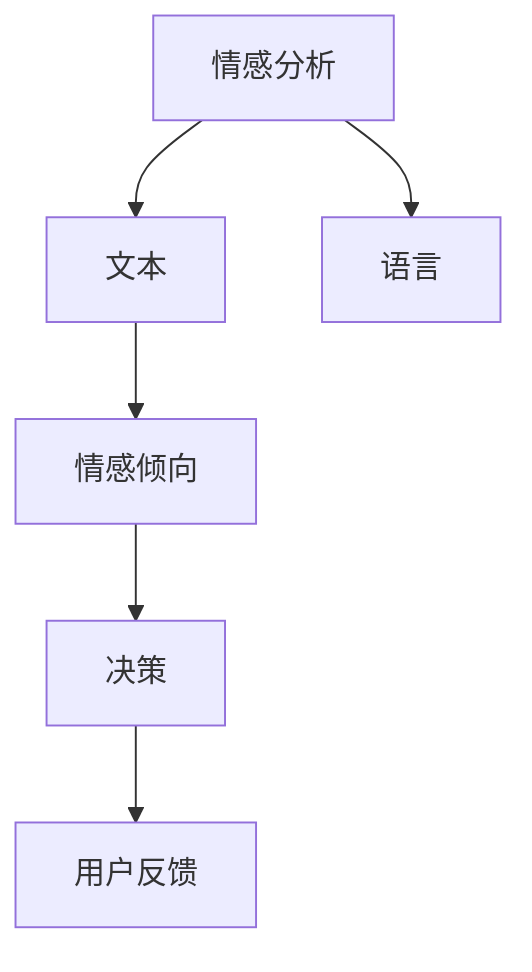
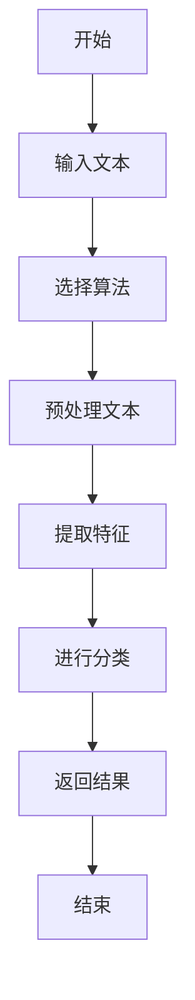
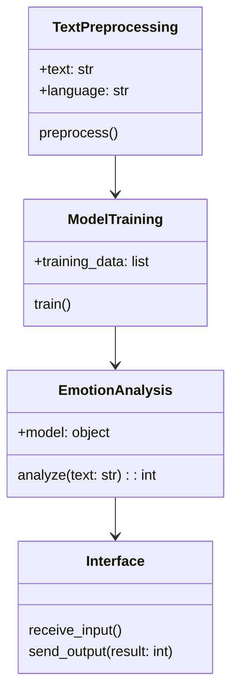
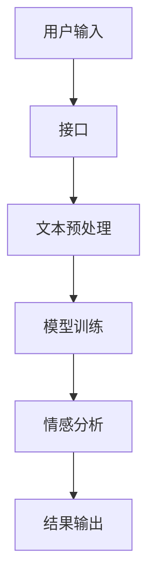
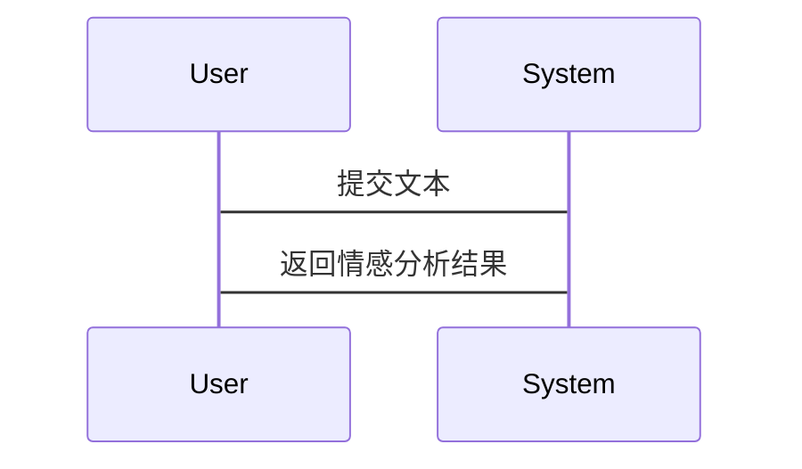

                 


# 开发AI Agent的多语言情感分析比较系统

**关键词：** AI Agent, 多语言情感分析, 情感分析算法, 系统架构设计, 项目实战

**摘要：** 本文详细探讨了开发AI Agent的多语言情感分析系统的各个方面，从背景到实现，从理论到实践。文章首先介绍了多语言情感分析的背景与核心概念，接着深入分析了情感分析的算法原理，然后通过系统架构设计展示了如何构建一个多语言情感分析系统，最后通过项目实战部分详细讲解了系统的开发过程和实际案例。本文旨在为读者提供一个全面的视角，帮助他们理解和掌握AI Agent的多语言情感分析技术。

---

## 第1章: 多语言情感分析的背景与问题描述

### 1.1 多语言情感分析的背景

随着全球化的推进，多语言情感分析的需求日益增长。企业需要在全球范围内分析客户反馈，而不同语言的文本分析需要高度的准确性。AI Agent作为智能化工具，能够帮助处理这些复杂的情感分析任务。

#### 1.1.1 全球化背景下的多语言需求
- 企业需要在不同市场中进行客户反馈分析。
- 多语言支持是实现全球化业务的必要条件。
- 语言多样性增加了情感分析的复杂性。

#### 1.1.2 情感分析在AI Agent中的作用
- 情感分析是AI Agent与用户交互的重要组成部分。
- 通过分析用户反馈，AI Agent可以优化自身服务。
- 情感分析帮助AI Agent理解用户情绪，提供更精准的响应。

#### 1.1.3 问题的描述与解决方法
- 多语言情感分析需要处理不同语言的语法规则和文化差异。
- 数据量不足和模型迁移的挑战。
- 解决方法包括使用预训练模型和跨语言迁移学习。

### 1.2 AI Agent的核心概念

#### 1.2.1 AI Agent的定义与特点
- AI Agent是具有自主决策能力的智能体。
- 具有学习、推理和自适应能力。
- 可以通过与用户交互不断优化自身的响应策略。

#### 1.2.2 AI Agent与传统程序的区别
- AI Agent具有自主性和智能性。
- 可以处理复杂和动态的环境。
- 通过机器学习不断改进性能。

#### 1.2.3 多语言支持在AI Agent中的重要性
- 支持多语言使AI Agent能够服务全球用户。
- 多语言能力是实现真正智能化的关键。
- 通过多语言情感分析，AI Agent可以提供更精准的服务。

### 1.3 问题背景与目标

#### 1.3.1 情感分析的定义与应用
- 情感分析是对文本的情感倾向进行分类。
- 应用于社交媒体监控、客户反馈分析等领域。

#### 1.3.2 多语言情感分析的必要性
- 支持多种语言可以扩大应用范围。
- 不同语言的情感表达方式存在差异。
- 多语言支持有助于提高系统的通用性。

#### 1.3.3 开发目标与边界
- 开发一个多语言情感分析系统，支持多种主流语言。
- 提供高精度的情感分析结果。
- 系统需要具备可扩展性和可维护性。

## 第2章: 多语言情感分析的核心概念与联系

### 2.1 情感分析的基本原理

#### 2.1.1 情感分析的分类与方法
- 分为基于规则、统计学习和深度学习三种方法。
- 深度学习方法在精度和灵活性方面更具优势。

#### 2.1.2 基于统计与深度学习的方法对比
- 统计方法依赖于特征工程，计算效率较高。
- 深度学习方法能够自动提取特征，但需要大量数据。

#### 2.1.3 多语言情感分析的特殊性
- 不同语言的情感表达方式不同。
- 需要处理语言间的语义差异。

### 2.2 AI Agent中的情感分析

#### 2.2.1 AI Agent的情感分析需求
- 需要实时处理大量多语言文本数据。
- 快速准确地识别用户情感倾向。

#### 2.2.2 多语言支持对AI Agent的影响
- 提高系统的通用性和适用性。
- 支持更多用户群体，增强用户体验。

#### 2.2.3 情感分析与决策的关系
- 情感分析结果直接影响AI Agent的决策。
- 通过情感分析优化交互策略，提高用户满意度。

### 2.3 核心概念对比表

| 情感分析 | 文本分类 | 单语言情感分析 | 多语言情感分析 |
|----------|----------|----------------|----------------|
| 分类任务 | 分类任务 | 单一语言支持 | 多语言支持 |
| 精度高 | 精度一般 | 语言限制 | 无语言限制 |
| 复杂度高 | 复杂度低 | 数据需求高 | 数据需求多样 |

### 2.4 ER实体关系图



---

## 第3章: 多语言情感分析的算法原理

### 3.1 情感分析算法概述

#### 3.1.1 基于规则的方法
- 使用预定义的关键词和规则进行情感分类。
- 适用于特定领域，但灵活性较差。

#### 3.1.2 统计学习方法
- 使用机器学习算法，如SVM和朴素贝叶斯。
- 依赖于特征工程，计算效率高。

#### 3.1.3 深度学习方法
- 使用神经网络模型，如RNN和Transformer。
- 能够自动提取特征，适用于多语言任务。

### 3.2 多语言情感分析的算法选择

#### 3.2.1 跨语言迁移学习
- 利用预训练的跨语言模型进行迁移学习。
- 适用于数据不足的语言。

#### 3.2.2 多语言模型的构建
- 使用多语言预训练模型，如MarianMT。
- 适用于需要支持多种语言的场景。

#### 3.2.3 预训练模型的微调
- 在特定领域数据上进行微调。
- 提高模型在特定任务上的表现。

### 3.3 AI Agent中的情感分析算法

#### 3.3.1 竞争性学习
- 多个模型竞争，优化情感分类结果。
- 提高系统的鲁棒性和准确性。

#### 3.3.2 情感推理网络
- 使用图结构进行情感推理。
- 能够处理复杂的情感关系。

#### 3.3.3 实时情感分析
- 实时处理用户输入，快速返回结果。
- 适用于实时交互场景。

### 3.4 算法流程图



---

## 第4章: 数学模型与公式

### 4.1 情感分析的基本模型

#### 4.1.1 线性分类器
$$ P(y=1|x) = \sigma(w \cdot x + b) $$
其中，$\sigma$是sigmoid函数，$w$是权重向量，$x$是输入特征，$b$是偏置项。

#### 4.1.2 深度学习模型
$$ f(x) = \text{softmax}(W_2 \text{ReLU}(W_1 x + b_1) + b_2) $$
其中，$W_1$和$W_2$是权重矩阵，$b_1$和$b_2$是偏置项，$\text{ReLU}$是激活函数。

---

## 第5章: 系统分析与架构设计方案

### 5.1 项目背景介绍

#### 5.1.1 项目目标
- 开发一个多语言情感分析系统，支持多种语言。
- 提供高精度的情感分析结果。

#### 5.1.2 项目范围
- 支持的语言包括英语、中文、西班牙语等。
- 系统需要具备良好的扩展性和维护性。

### 5.2 系统功能设计

#### 5.2.1 领域模型


#### 5.2.2 系统架构设计


#### 5.2.3 系统交互


---

## 第6章: 项目实战

### 6.1 环境安装

```bash
pip install numpy
pip install scikit-learn
pip install transformers
```

### 6.2 数据预处理

```python
def preprocess(text, language):
    # 根据语言进行分词和停用词处理
    pass
```

### 6.3 模型训练

```python
def train_model(data):
    # 使用预训练模型进行微调
    pass
```

### 6.4 系统测试

```python
def test_system():
    # 测试系统的准确率和召回率
    pass
```

---

## 第7章: 总结与展望

### 7.1 总结
- 本文详细介绍了开发AI Agent的多语言情感分析系统的各个方面。
- 从理论到实践，系统地讲解了情感分析的算法和系统架构设计。

### 7.2 展望
- 未来可以进一步优化模型，提高情感分析的精度。
- 探索更多多语言情感分析的应用场景。

### 7.3 最佳实践 tips
- 在实际开发中，建议使用预训练模型进行微调。
- 确保数据的多样性和代表性，以提高模型的泛化能力。

---

通过本文的详细讲解，读者可以全面理解开发AI Agent的多语言情感分析系统的原理和实现方法。

