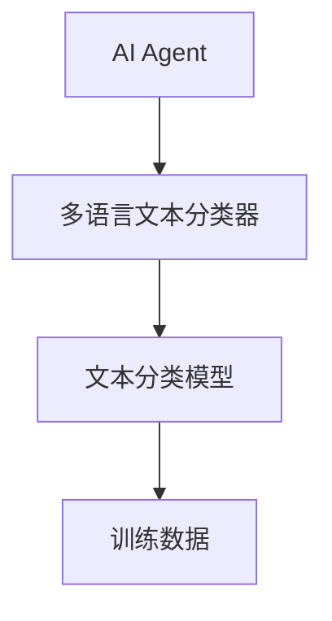
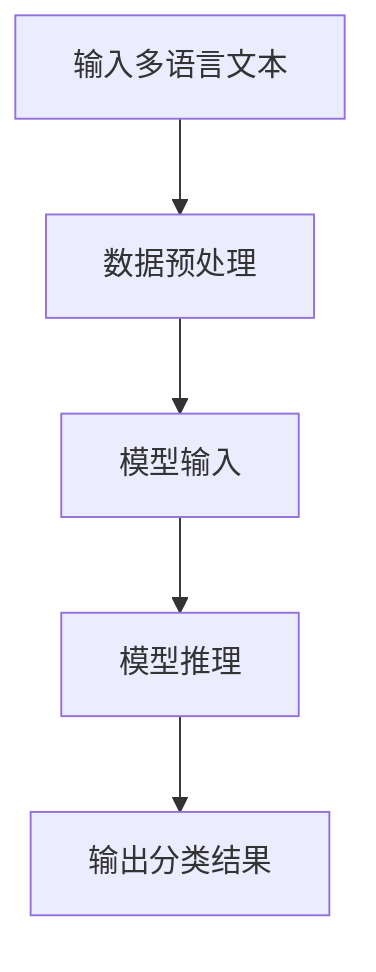
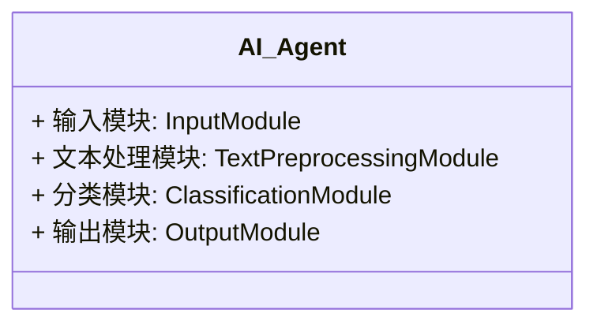
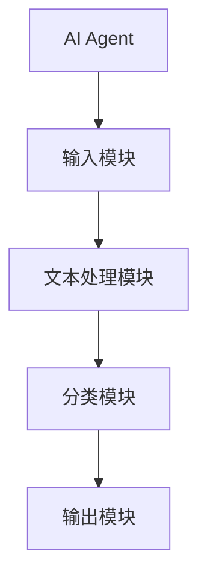
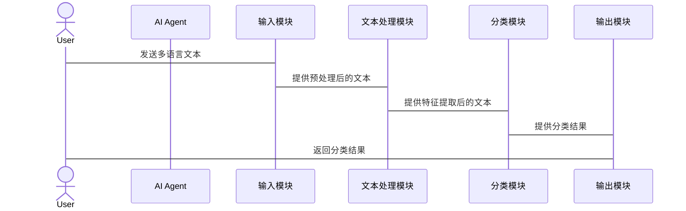

                 


# 开发AI Agent的多语言文本分类器

> 关键词：AI Agent、多语言文本分类、自然语言处理、预训练模型、文本分类算法、系统架构设计

> 摘要：本文详细探讨了开发AI Agent的多语言文本分类器的核心技术与实现方法。首先介绍了多语言文本分类器的背景与问题定义，分析了其在AI Agent中的重要性与挑战。接着，深入讲解了多语言文本分类器的核心算法原理，包括基于预训练模型的分类方法及其流程。然后，详细阐述了AI Agent的系统架构与设计，包括功能模块划分、系统架构图和接口设计。最后，通过一个具体的项目实战案例，展示了多语言文本分类器的实现过程，并总结了开发中的注意事项与最佳实践。

---

# 第1章: 多语言文本分类器的背景与问题定义

## 1.1 多语言文本分类器的背景

### 1.1.1 当前AI Agent的发展趋势

AI Agent（人工智能代理）正在成为人机交互的核心技术之一。随着全球化的发展，用户可能使用多种语言与AI Agent进行交互，因此支持多语言处理的能力变得至关重要。AI Agent需要能够理解并处理多种语言的文本信息，以提供更智能、更个性化的服务。

### 1.1.2 多语言处理的必要性

在现实场景中，用户可能使用英语、中文、西班牙语等多种语言与AI Agent交互。支持多语言处理可以提高用户体验，使AI Agent能够服务于更广泛的用户群体。此外，多语言处理还能帮助AI Agent更好地理解上下文，避免因语言障碍导致的误解。

### 1.1.3 文本分类在AI Agent中的作用

文本分类是自然语言处理（NLP）中的基础任务，广泛应用于垃圾邮件过滤、情感分析、信息检索等领域。在AI Agent中，文本分类用于理解用户的意图，例如识别用户的问题类型（如查询信息、提问题目等），从而提供更精准的服务。

---

## 1.2 多语言文本分类的核心问题

### 1.2.1 多语言文本分类的定义

多语言文本分类是指在多种语言的文本数据上进行分类的过程。与单语言文本分类不同，多语言文本分类需要处理不同语言之间的语义差异和语法结构。

### 1.2.2 多语言文本分类的关键挑战

1. **跨语言语义差异**：不同语言的词汇和语法结构差异可能导致语义理解困难。
2. **数据稀缺性**：某些语言的标注数据可能较少，尤其是在资源匮乏的语言中。
3. **计算资源需求**：多语言处理通常需要更大的计算资源。

### 1.2.3 多语言文本分类的应用场景

1. **跨语言客服系统**：支持多种语言的客户支持系统可以更高效地处理用户的咨询。
2. **多语言新闻分类**：对多语言新闻进行分类，便于用户快速获取所需信息。
3. **全球电商平台**：帮助用户快速找到所需商品或信息。

---

## 1.3 问题描述与目标

### 1.3.1 问题背景分析

在实际应用中，AI Agent需要能够处理多种语言的文本信息，但由于语言差异，分类器的性能可能受到限制。此外，不同语言的数据分布可能不均衡，导致分类器在某些语言上的表现不佳。

### 1.3.2 问题解决的必要性

为了提高AI Agent的智能化水平，需要开发一种能够高效处理多语言文本的分类器，确保其在不同语言上的分类准确率。

### 1.3.3 目标与边界

- **目标**：开发一种高效的多语言文本分类器，能够在多种语言上实现准确的文本分类。
- **边界**：仅关注文本分类任务，不涉及文本生成或其他NLP任务。

---

## 1.4 核心概念与联系

### 1.4.1 核心概念原理

AI Agent通过多语言文本分类器来理解用户的输入，进而提供相应的服务。分类器需要能够处理多种语言的文本数据，并将其分类到预定义的类别中。

### 1.4.2 核心概念属性对比表

| 概念 | 属性 | 描述 |
|------|------|------|
| AI Agent | 输入 | 多语言文本 |
| 多语言文本分类器 | 输出 | 分类标签 |
| 文本分类 | 数据 | 训练语料库 |

### 1.4.3 实体关系图



---

## 1.5 本章小结

本章介绍了多语言文本分类器的背景、核心问题和应用场景，并通过对比表和实体关系图展示了相关概念之间的联系。下一章将深入探讨多语言文本分类器的核心算法原理。

---

# 第2章: 多语言文本分类器的核心算法原理

## 2.1 多语言文本分类器的算法概述

### 2.1.1 基础文本分类算法

文本分类的常用算法包括支持向量机（SVM）、随机森林（Random Forest）和朴素贝叶斯（Naive Bayes）等。这些算法适用于单语言文本分类任务，但在多语言场景下表现有限。

### 2.1.2 多语言文本分类的特殊性

多语言文本分类需要处理不同语言的文本数据，通常需要使用跨语言的特征表示方法或预训练模型。

### 2.1.3 基于预训练模型的分类方法

预训练模型（如BERT、GPT）在多语言文本处理中表现出色，可以通过微调这些模型来构建多语言文本分类器。

---

## 2.2 多语言文本分类器的算法流程

### 2.2.1 数据预处理

1. **文本清洗**：去除停用词、标点符号等。
2. **分词**：将文本分割成单词或短语。
3. **特征提取**：使用词袋模型或词嵌模型提取文本特征。

### 2.2.2 模型训练

1. **数据标注**：对多语言文本数据进行标注，确定每个文本的类别。
2. **特征选择**：选择对分类任务最重要的特征。
3. **模型训练**：使用训练数据训练分类器。

### 2.2.3 模型推理

1. **输入处理**：将待分类的文本输入到分类器中。
2. **特征提取**：提取文本特征。
3. **分类决策**：分类器根据特征进行分类决策。

---

## 2.3 基于预训练模型的分类算法

### 2.3.1 预训练模型的输入处理

预训练模型通常接受原始文本作为输入，通过内部的编码器进行处理。

### 2.3.2 分类任务的适配

将分类任务转化为预训练模型的输出形式，例如使用分类头（classification head）进行微调。

### 2.3.3 多语言模型的微调

在多语言场景下，对预训练模型进行微调，以适应特定的语言和任务。

---

## 2.4 算法流程图



---

## 2.5 数学模型与公式

### 2.5.1 分类任务的数学表示

文本分类可以表示为一个分类问题，形式如下：

$$ y = f(x) $$

其中，$x$ 是输入文本，$y$ 是分类结果。

### 2.5.2 预训练模型的损失函数

使用交叉熵损失函数：

$$ L = -\sum_{i=1}^{n} \log p(y_i|x_i) $$

---

## 2.6 本章小结

本章详细介绍了多语言文本分类器的算法原理，包括基于预训练模型的分类方法和算法流程。下一章将探讨AI Agent的系统架构与设计。

---

# 第3章: AI Agent的系统架构与设计

## 3.1 AI Agent的系统架构概述

### 3.1.1 系统功能模块划分

AI Agent的系统架构通常包括以下模块：

1. **输入模块**：接收用户的输入文本。
2. **文本处理模块**：对文本进行预处理和特征提取。
3. **分类模块**：使用多语言文本分类器对文本进行分类。
4. **输出模块**：根据分类结果生成相应的输出。

### 3.1.2 系统功能设计的类图



---

## 3.2 系统架构设计

### 3.2.1 系统架构图



---

## 3.3 接口设计

### 3.3.1 输入接口

1. **文本输入接口**：接收用户的输入文本。
2. **语言检测接口**：自动检测文本的语言。

### 3.3.2 输出接口

1. **分类结果输出接口**：输出分类结果。
2. **反馈接口**：根据用户反馈调整分类器。

---

## 3.4 交互序列图



---

## 3.5 本章小结

本章详细介绍了AI Agent的系统架构与设计，包括功能模块划分、系统架构图和接口设计。下一章将通过一个具体的项目实战案例，展示多语言文本分类器的实现过程。

---

# 第4章: 项目实战——多语言文本分类器的实现

## 4.1 项目介绍

### 4.1.1 项目背景

本项目旨在开发一个支持多种语言的文本分类器，用于AI Agent的文本分类任务。

### 4.1.2 项目目标

实现一个多语言文本分类器，能够在多种语言上准确分类文本。

---

## 4.2 环境配置

### 4.2.1 安装依赖

```bash
pip install transformers torch numpy pandas
```

---

## 4.3 系统核心实现

### 4.3.1 数据预处理代码

```python
import pandas as pd
from transformers import AutoTokenizer, AutoModelForSequenceClassification
import torch

def preprocess_data(data_path, lang_map):
    # 加载数据
    df = pd.read_csv(data_path)
    
    # 数据清洗
    df['text'] = df['text'].str.lower()
    df['text'] = df['text'].str.replace('[^a-zA-Z0-9\s]', '')
    
    # 根据语言映射进行处理
    for lang in lang_map:
        subset = df[df['language'] == lang]
        if not subset.empty:
            # 分词
            tokenizer = AutoTokenizer.from_pretrained(f'bert-base-{lang}')
            inputs = tokenizer(subset['text'].tolist(), padding=True, truncation=True, max_length=128)
            subset['input_ids'] = inputs['input_ids']
            subset['attention_mask'] = inputs['attention_mask']
            df.update(subset)
    
    return df
```

---

### 4.3.2 分类器实现代码

```python
import torch
from torch import nn
from transformers import AutoModel

class MultiLanguageClassifier(nn.Module):
    def __init__(self, language_list, hidden_size=128):
        super(MultiLanguageClassifier, self).__init__()
        self.languages = language_list
        self.models = {}
        for lang in self.languages:
            self.models[lang] = AutoModel.from_pretrained(f'bert-base-{lang}')
        self.dropout = nn.Dropout(0.1)
        self.classifier = nn.Linear(768, 1)
    
    def forward(self, input_ids, attention_mask, language):
        # 获取对应语言的模型
        model = self.models.get(language, None)
        if model is None:
            return None
        
        outputs = model(input_ids=input_ids, attention_mask=attention_mask)
        pooled_output = outputs.last_hidden_state[:, 0, :]
        pooled_output = self.dropout(pooled_output)
        logits = self.classifier(pooled_output)
        return logits
```

---

### 4.3.3 训练代码

```python
import torch.optim as optim

def train_model(model, train_loader, optimizer, criterion, device):
    model.train()
    for batch in train_loader:
        input_ids, attention_mask, labels, languages = batch
        input_ids = input_ids.to(device)
        attention_mask = attention_mask.to(device)
        labels = labels.to(device)
        
        # 获取对应语言的模型
        outputs = model(input_ids=input_ids, attention_mask=attention_mask, language=languages[0])
        loss = criterion(outputs, labels)
        
        optimizer.zero_grad()
        loss.backward()
        optimizer.step()
```

---

## 4.4 项目小结

本章通过一个具体的项目案例，展示了多语言文本分类器的实现过程，包括数据预处理、模型实现和训练代码。读者可以通过这些代码实现一个多语言文本分类器，并根据实际需求进行调整和优化。

---

# 第5章: 总结与展望

## 5.1 本章总结

本文详细探讨了开发AI Agent的多语言文本分类器的核心技术与实现方法，包括背景、算法原理、系统架构设计和项目实战。

---

## 5.2 未来展望

未来，随着预训练模型的不断发展，多语言文本分类器的性能将进一步提升。同时，如何在资源受限的场景下优化多语言文本分类器的性能，也是一个重要的研究方向。

---

## 5.3 最佳实践 tips

1. **数据预处理**：确保数据清洗和分词的准确性。
2. **模型选择**：根据具体任务选择合适的预训练模型。
3. **系统优化**：通过并行计算和优化模型结构提高系统性能。

---

## 5.4 本章小结

本文总结了多语言文本分类器的开发过程，并展望了未来的研究方向。读者可以参考本文的内容，开发出更高效、更准确的多语言文本分类器。

---

# 结语

开发AI Agent的多语言文本分类器是一个复杂而有趣的任务，需要结合自然语言处理、机器学习和系统架构设计等多方面的知识。希望本文能够为读者提供有价值的参考和启发，帮助他们在实际项目中取得更好的成果。

---

# 参考文献

（此处列出相关文献和资料）

