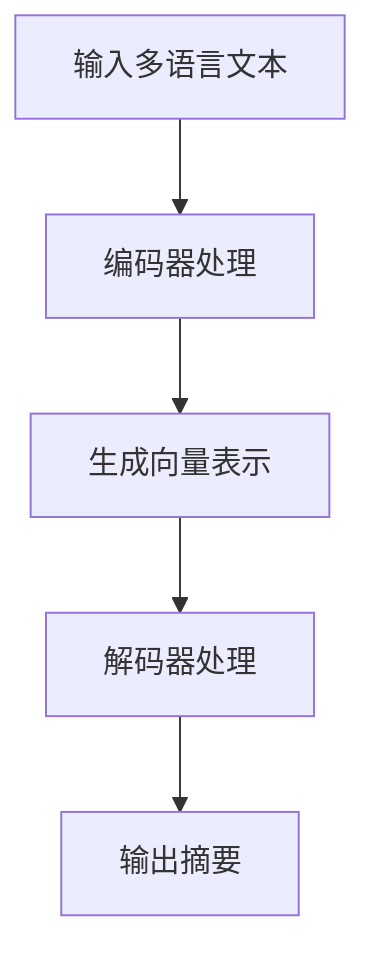
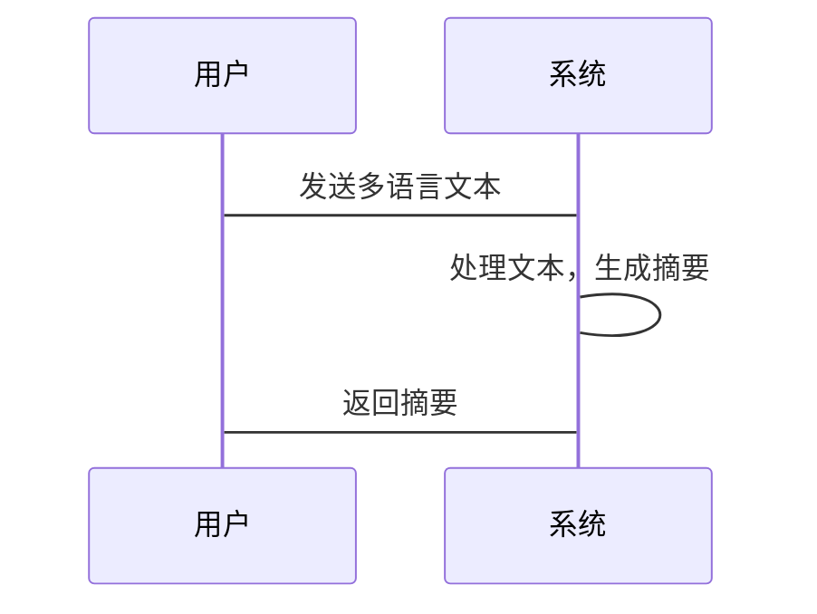

                 


# 开发AI Agent的多语言文本摘要生成器

## 关键词
- AI Agent
- 多语言文本摘要
- 自然语言处理
- 深度学习
- 文本生成

## 摘要
本文详细介绍AI Agent在多语言文本摘要生成器中的应用，涵盖从核心概念到系统架构设计，再到项目实战的全过程。通过逐步分析，读者将掌握如何开发高效的多语言文本摘要系统，包括算法原理、数学模型和系统架构等内容。

# 第一部分: AI Agent与多语言文本摘要生成器的背景与概念

## 第1章: AI Agent与多语言文本摘要生成器概述

### 1.1 AI Agent的基本概念
#### 1.1.1 什么是AI Agent
人工智能代理（AI Agent）是一种能够感知环境并采取行动以实现目标的智能实体。AI Agent能够处理多语言文本，通过自然语言处理技术生成摘要。

#### 1.1.2 AI Agent的核心特征
- **自主性**：AI Agent能够自主决策。
- **反应性**：能够实时响应输入。
- **目标导向**：行为基于明确的目标。
- **学习能力**：通过数据不断优化性能。

#### 1.1.3 多语言文本摘要生成器的定义
多语言文本摘要生成器是一种AI Agent，能够理解多种语言的文本并生成相应语言的摘要。

### 1.2 多语言文本摘要生成器的背景与应用
#### 1.2.1 当前多语言处理的挑战
- **语言多样性**：全球有数百种语言，每种语言都有独特的语法结构。
- **数据稀疏性**：某些语言的数据量有限，影响模型训练效果。
- **文化差异**：不同语言的表达习惯不同，影响摘要的准确性。

#### 1.2.2 文本摘要生成的必要性
- **信息过载**：在信息爆炸的时代，摘要帮助用户快速获取关键信息。
- **跨语言交流**：多语言摘要有助于不同语言背景的人进行有效沟通。
- **自动化需求**：在实时应用中，自动化生成摘要的需求日益增加。

#### 1.2.3 AI Agent在多语言摘要中的作用
AI Agent通过自然语言处理技术，将多语言文本转化为简洁的摘要，满足用户的信息需求。

### 1.3 本章小结
本章介绍了AI Agent的基本概念和多语言文本摘要生成器的应用背景，为后续内容打下基础。

# 第二部分: 多语言文本摘要生成器的核心概念与原理

## 第2章: 多语言文本处理的核心概念

### 2.1 多语言模型的基本原理
#### 2.1.1 多语言模型的分类
- **基于统计的模型**：利用语言学规则和语料库统计信息进行翻译和摘要。
- **基于规则的模型**：通过预定义的规则进行文本处理。
- **基于深度学习的模型**：利用神经网络结构学习语言特征。

#### 2.1.2 多语言模型的优势与劣势
- **优势**：能够处理多种语言，适应不同场景需求。
- **劣势**：需要大量多语言数据进行训练，计算资源消耗大。

### 2.2 文本摘要生成的原理
#### 2.2.1 文本摘要的基本流程
1. **输入处理**：接收多语言文本输入。
2. **文本理解**：通过NLP技术理解文本内容。
3. **摘要生成**：生成目标语言的摘要。

#### 2.2.2 基于AI Agent的摘要生成方法
- **基于Seq2Seq模型**：编码器将源语言文本编码为向量，解码器生成目标语言摘要。
- **基于Transformer的模型**：利用自注意力机制捕捉文本中的关键信息。

## 第3章: 多语言文本摘要生成器的核心技术

### 3.1 多语言文本预处理技术
#### 3.1.1 文本清洗与标准化
- **去除停用词**：删除无意义词汇，如“的”、“是”等。
- **分词处理**：将文本分割成有意义的词汇或短语。

#### 3.1.2 多语言分词技术
- **分词工具**：使用如jieba（中文）、MeCab（日语）等工具进行分词。
- **跨语言处理**：处理不同语言的文本结构差异。

#### 3.1.3 跨语言信息抽取
- **命名实体识别**：识别文本中的专有名词。
- **关系抽取**：提取文本中的语义关系。

### 3.2 基于AI Agent的摘要生成算法
#### 3.2.1 基于Seq2Seq的多语言摘要生成
- **编码器结构**：使用双向LSTM编码源语言文本。
- **解码器结构**：生成目标语言摘要，使用注意力机制提升生成质量。

#### 3.2.2 基于Transformer的多语言摘要模型
- **自注意力机制**：捕捉文本中的关键信息。
- **多语言词表**：使用包含多种语言词汇的词表进行训练。

#### 3.2.3 跨语言注意力机制
- **跨语言对比**：在不同语言间建立联系，提升摘要的准确性。

## 第4章: 多语言文本摘要生成器的数学模型与算法

### 4.1 多语言文本表示模型
#### 4.1.1 Word Embedding的多语言扩展
- **多语言词嵌入**：使用如MULTEC等模型生成多语言词嵌入。

#### 4.1.2 Sentence-BERT的多语言应用
- **句子嵌入**：将句子表示为固定长度的向量，用于跨语言相似性计算。

#### 4.1.3 多语言BERT模型的原理
- **BERT模型**：基于Transformer的预训练模型，支持多语言训练。

### 4.2 文本摘要生成的数学模型与算法
#### 4.2.1 基于概率论的摘要生成模型
- **最大熵生成模型**：通过优化概率分布生成摘要。

#### 4.2.2 基于图论的摘要生成算法
- **图结构分析**：将文本视为图结构，通过节点重要性排序生成摘要。

#### 4.2.3 基于深度学习的摘要生成模型
- **Seq2Seq模型**：编码器-解码器结构，用于生成目标语言摘要。

### 4.3 算法流程图


## 第5章: 多语言文本摘要生成器的系统架构设计

### 5.1 系统功能设计
#### 5.1.1 用户输入与处理模块
- **输入接收**：接收多语言文本输入。
- **文本清洗**：去除无关字符，标准化文本格式。

#### 5.1.2 多语言文本分析模块
- **文本理解**：通过NLP技术理解文本内容。
- **信息提取**：提取关键信息，如实体和关系。

#### 5.1.3 文本摘要生成模块
- **摘要生成**：生成目标语言的文本摘要。
- **质量评估**：评估摘要质量，调整生成策略。

#### 5.1.4 结果展示与反馈模块
- **结果展示**：以用户友好的方式展示摘要。
- **用户反馈**：收集用户反馈，优化系统性能。

### 5.2 系统架构设计
#### 5.2.1 分层架构设计
- **表示层**：展示用户界面，接收输入并显示输出。
- **业务逻辑层**：处理用户的请求，协调各模块工作。
- **数据访问层**：与数据源交互，处理文本数据。

#### 5.2.2 微服务架构设计
- **文本处理服务**：负责文本清洗和分词。
- **摘要生成服务**：负责生成摘要。
- **结果展示服务**：负责展示摘要结果。

#### 5.2.3 可扩展性设计
- **模块化设计**：各模块独立，便于扩展和维护。
- **负载均衡**：分散请求压力，提高系统可用性。

### 5.3 接口设计与交互流程
#### 5.3.1 API接口定义
- **输入接口**：接收多语言文本。
- **输出接口**：返回生成的摘要。

#### 5.3.2 用户交互流程设计


#### 5.3.3 系统日志与监控
- **日志记录**：记录系统运行状态和错误信息。
- **监控系统**：实时监控系统性能，及时发现和解决问题。

# 第三部分: 多语言文本摘要生成器的项目实战

## 第6章: 项目环境搭建与核心代码实现

### 6.1 开发环境安装
#### 6.1.1 Python环境配置
- **安装Python**：建议使用Python 3.8或更高版本。
- **安装虚拟环境**：使用virtualenv管理环境。

#### 6.1.2 安装必要的库
- **自然语言处理库**：如spaCy、jieba。
- **深度学习库**：如TensorFlow、Keras。
- **文本摘要库**：如transformers。

#### 代码示例
```python
# 安装必要的库
pip install spacy transformers tensorflow
```

### 6.2 核心代码实现
#### 6.2.1 文本清洗模块
```python
def clean_text(text):
    # 去除特殊字符
    text = re.sub(r'[^\w\s]', '', text)
    # 转换为小写
    text = text.lower()
    return text
```

#### 6.2.2 多语言分词模块
```python
import spacy

nlp = spacy.load("en_core_web_sm")  # 加载英文模型

def tokenize(text):
    doc = nlp(text)
    tokens = [token.text for token in doc]
    return tokens
```

#### 6.2.3 文本摘要生成模块
```python
from transformers import AutoTokenizer, AutoModelForSeq2Seq

tokenizer = AutoTokenizer.from_pretrained("facebook/m2m-large-4m")
model = AutoModelForSeq2Seq.from_pretrained("facebook/m2m-large-4m")

def generate_summary(text, target_lang):
    inputs = tokenizer(text, return_tensors="pt")
    with torch.no_grad():
        outputs = model.generate(inputs['input_ids'], max_length=100, forced_bos_token_id=tokenizer.get_lang_id(target_lang))
    summary = tokenizer.decode(outputs[0], skip_special_tokens=True)
    return summary
```

### 6.3 项目实战案例
#### 6.3.1 案例背景
假设我们有一个包含中英文的科技新闻文本，需要生成中文摘要。

#### 6.3.2 代码实现
```python
text = "This is a sample text in English. It needs to be summarized in Chinese."
print(generate_summary(text, "zh"))
```

#### 6.3.3 结果分析
输出的中文摘要应该准确反映原文内容，同时语言流畅自然。

### 6.4 系统优化与调优
#### 6.4.1 参数调整
- **批次大小**：调整batch_size，影响训练效率。
- **学习率**：调整learning_rate，影响模型收敛速度。

#### 6.4.2 模型选择
选择适合多语言摘要的模型，如M2M模型，优化摘要质量。

## 第7章: 系统测试与性能优化

### 7.1 系统测试
#### 7.1.1 功能测试
- **输入测试**：测试不同语言的文本输入。
- **输出测试**：检查生成摘要的准确性。

#### 7.1.2 性能测试
- **响应时间**：测试系统在高并发下的响应时间。
- **资源消耗**：监控系统资源使用情况，优化内存和CPU使用。

### 7.2 性能优化策略
#### 7.2.1 并行处理
- **多线程处理**：利用多线程提高处理效率。
- **分布式处理**：在多台机器上分担任务，提高处理能力。

#### 7.2.2 模型优化
- **剪枝优化**：去除模型中的冗余部分，减少计算量。
- **量化优化**：降低模型参数精度，减少存储空间。

### 7.3 最佳实践
#### 7.3.1 日志记录
- **记录错误**：及时发现和解决问题。
- **性能监控**：持续监控系统性能，及时调整优化策略。

#### 7.3.2 模型更新
- **定期更新**：保持模型性能，适应新数据。
- **版本控制**：管理不同版本的模型，方便回滚和维护。

## 第8章: 总结与最佳实践

### 8.1 本章小结
本文详细介绍了AI Agent在多语言文本摘要生成器中的应用，从理论基础到系统实现，再到项目实战，为读者提供了全面的知识体系。

### 8.2 最佳实践
- **持续学习**：关注最新的NLP技术和工具，保持知识更新。
- **实践项目**：通过实际项目积累经验，提升技能水平。
- **团队合作**：与团队成员密切合作，共同解决问题，提升效率。

### 8.3 注意事项
- **数据质量**：确保训练数据的多样性和质量，避免偏差。
- **模型选择**：根据具体需求选择合适的模型，避免过度复杂化。
- **系统维护**：定期维护和更新系统，确保其稳定性和高性能。

### 8.4 拓展阅读
- **相关书籍**：推荐《深度学习》、《自然语言处理入门》等书籍。
- **在线资源**：查阅官方文档和GitHub仓库，获取最新技术动态。

---

通过以上内容，读者可以系统地学习AI Agent多语言文本摘要生成器的开发，从基础理论到实际应用，逐步掌握相关技术和方法。希望本文能为开发者提供有价值的参考和指导。

