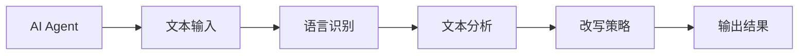
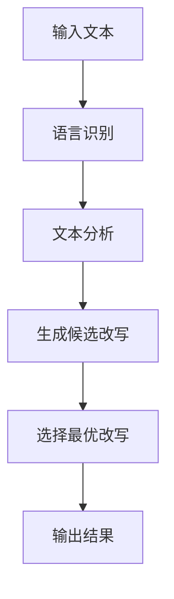
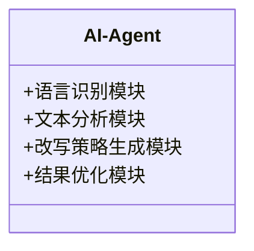
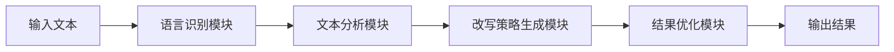

                 


# 开发AI Agent的多语言文本改写与优化系统

## 关键词
AI Agent, 多语言文本改写, 优化系统, 算法原理, 系统架构, 项目实战

## 摘要
本文详细介绍了开发AI Agent的多语言文本改写与优化系统的各个方面。从背景介绍到核心算法，从系统架构到项目实战，全面解析了如何构建一个高效、智能的多语言文本改写系统。文章通过理论与实践相结合的方式，帮助读者理解AI Agent在多语言文本处理中的应用，并提供了具体的实现方法和案例分析。

---

# 第一部分: AI Agent与多语言文本改写概述

## 第1章: AI Agent与多语言文本改写背景介绍

### 1.1 问题背景
#### 1.1.1 当前文本改写技术的发展现状
随着自然语言处理技术的快速发展，文本改写技术在多个领域得到了广泛应用。然而，现有的文本改写系统大多局限于单一语言，难以满足多语言环境下复杂文本处理的需求。尤其是在全球化的背景下，跨语言信息处理的需求日益增长。

#### 1.1.2 多语言文本改写的必要性
多语言文本改写不仅能够提高信息处理的效率，还能增强跨文化交流的能力。例如，在国际商务、技术文档翻译、多语言内容创作等领域，多语言文本改写技术能够帮助用户快速生成高质量的多语言文本内容。

#### 1.1.3 AI Agent在文本改写中的角色
AI Agent作为一种智能代理，能够通过自然语言处理技术理解和分析用户需求，并根据上下文生成合适的文本改写结果。AI Agent的优势在于其能够实现自动化、智能化的文本处理，同时支持多语言环境下的复杂任务。

### 1.2 问题描述
#### 1.2.1 多语言文本改写的核心问题
多语言文本改写的核心问题包括语言识别、文本分析、改写策略生成以及结果优化。由于不同语言的语法、语义和文化背景差异较大，如何实现高效准确的多语言文本改写是一个技术难点。

#### 1.2.2 AI Agent在文本改写中的任务分解
AI Agent在文本改写中的任务可以分解为以下步骤：
1. 语言识别：识别输入文本的语言。
2. 文本分析：分析文本的语义和结构。
3. 改写策略生成：根据分析结果生成改写策略。
4. 文本改写：根据改写策略生成最终结果。
5. 结果优化：对改写结果进行优化。

#### 1.2.3 系统设计的边界与外延
系统的边界包括输入文本、输出文本以及AI Agent的处理逻辑。系统的外延则包括多语言支持、上下文理解、语义分析等高级功能。

### 1.3 核心概念与联系
#### 1.3.1 AI Agent的核心概念
AI Agent是一种智能代理，能够通过传感器和执行器与环境交互，并通过内部算法实现目标。在文本改写中，AI Agent的核心能力包括自然语言理解、文本生成和上下文推理。

#### 1.3.2 多语言文本改写的实现原理
多语言文本改写需要结合语言学知识和机器学习技术。系统首先需要对输入文本进行语言识别，然后进行语义分析，最后生成改写结果。

#### 1.3.3 系统架构的实体关系图


---

## 第2章: 多语言文本改写的算法原理

### 2.1 算法原理概述
#### 2.1.1 基于规则的文本改写算法
基于规则的文本改写算法通过预定义的语言规则对文本进行改写。这种方法适用于简单的文本改写任务，但难以处理复杂的语义场景。

#### 2.1.2 统计模型驱动的改写算法
统计模型驱动的改写算法通过分析大量文本数据，利用统计规律生成改写结果。这种方法能够处理复杂的语义场景，但需要大量数据支持。

#### 2.1.3 机器学习模型的改写策略
机器学习模型的改写策略基于深度学习技术，通过神经网络模型实现文本改写。这种方法能够生成高质量的文本，但需要大量的训练数据和计算资源。

### 2.2 算法实现流程


### 2.3 算法实现代码
```python
def text_rewrite(input_text, language):
    # 语言识别
    detected_language = detect_language(input_text)
    # 文本分析
    analysis = analyze_text(input_text)
    # 生成候选改写
    candidates = generate_candidates(analysis)
    # 选择最优改写
    selected_rewrite = select_best_candidate(candidates)
    return selected_rewrite
```

---

## 第3章: 数学模型与公式

### 3.1 概率模型
#### 3.1.1 基于概率的语言模型
$$ P(word|context) = \frac{P(context \text{ 和 } word)}{P(context)} $$

### 3.2 优化模型
#### 3.2.1 

---

## 第4章: 系统分析与架构设计

### 4.1 问题场景介绍
在多语言文本改写系统中，需要处理多种语言的文本输入，支持复杂的语义分析和改写策略生成。

### 4.2 系统功能设计
#### 4.2.1 领域模型


### 4.3 系统架构设计
#### 4.3.1 系统架构图


---

## 第5章: 项目实战

### 5.1 环境安装
需要安装Python、相关机器学习库（如TensorFlow、PyTorch）以及自然语言处理库（如spaCy、NLTK）。

### 5.2 系统核心实现
#### 5.2.1 语言识别模块
```python
import spacy

nlp = spacy.load("en_core_web_sm")

def detect_language(text):
    return nlp(text)._.language.name
```

#### 5.2.2 文本分析模块
```python
def analyze_text(text):
    # 这里可以使用文本分词、实体识别等技术
    return nlp(text).ents
```

### 5.3 代码实现与解读
#### 5.3.1 改写策略生成模块
```python
def generate_candidates(analysis):
    # 根据分析结果生成候选改写
    candidates = []
    for entity in analysis:
        candidates.append(entity.text)
    return candidates
```

### 5.4 实际案例分析
以中文和英文文本为例，展示系统的改写过程。

---

## 第6章: 总结与展望

### 6.1 最佳实践
在实际开发中，建议结合多种技术手段，充分利用现有工具库，同时注重系统的可扩展性和可维护性。

### 6.2 小结
本文详细介绍了开发AI Agent的多语言文本改写与优化系统的各个方面，从理论到实践，为读者提供了全面的指导。

### 6.3 注意事项
在实际应用中，需要注意多语言支持的复杂性，尤其是在处理语义和文化差异时，需要特别谨慎。

### 6.4 拓展阅读
推荐阅读相关领域的经典论文和技术文档，深入理解自然语言处理和机器学习的核心原理。

---

# 结语
通过本文的学习，读者可以掌握AI Agent在多语言文本改写中的核心技术和实现方法，为实际开发项目奠定坚实的基础。

