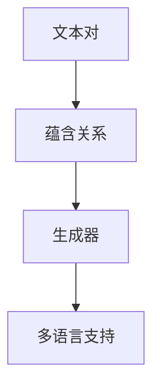
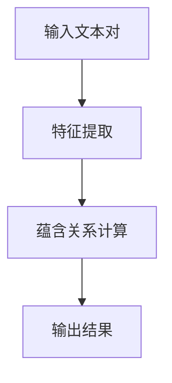
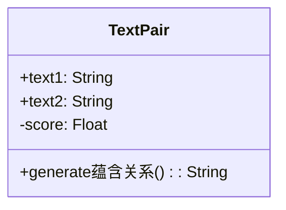
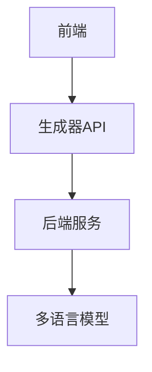
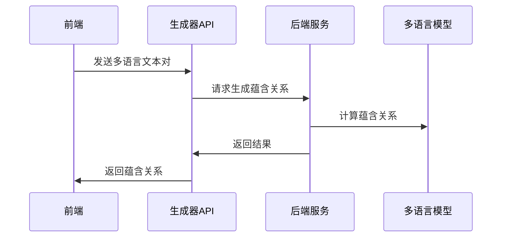

                 


# 开发AI Agent的多语言文本蕴含生成器

## 关键词：AI Agent, 多语言, 文本蕴含, 生成器, 自然语言处理, 深度学习

## 摘要：  
本文系统地介绍如何开发一个用于AI Agent的多语言文本蕴含生成器。从问题背景、核心概念、算法原理到系统架构设计，再到实际项目实现，全面解析其开发过程。通过案例分析和代码实现，帮助读者深入理解多语言文本蕴含生成器的工作原理和应用方法。

---

## 第一部分: 多语言文本蕴含生成器的背景与概念

### 第1章: 问题背景与概念

#### 1.1 问题背景
- **AI Agent的发展现状**：AI Agent广泛应用于自然语言处理、智能对话系统等领域，但多语言支持仍是一个挑战。
- **多语言文本处理的需求**：随着全球化的推进，AI Agent需要处理多种语言的文本，以满足不同用户的语言需求。
- **文本蕴含生成器的必要性**：文本蕴含是指从文本中生成合理的结论，是自然语言处理中的核心任务。

#### 1.2 问题描述
- **多语言文本蕴含的定义**：在多种语言中，判断文本之间的蕴含关系并生成新的蕴含关系。
- **AI Agent中的文本蕴含生成问题**：AI Agent需要理解多种语言的文本并生成新的蕴含关系，以提高其智能性和交互能力。
- **问题解决的边界与外延**：限定于生成蕴含关系，不涉及其他自然语言处理任务。

#### 1.3 核心概念与联系
- **多语言文本蕴含生成器的核心要素**：输入多语言文本对，输出蕴含关系判断。
- **实体关系图**：通过Mermaid图展示实体关系。


---

## 第二部分: 多语言文本蕴含生成器的核心原理

### 第2章: 核心概念原理

#### 2.1 蕴含关系的计算原理
- **多语言模型的处理机制**：使用多语言模型（如Marian、T5）处理多种语言的文本。
- **生成器的训练方法**：基于监督学习，利用标注数据训练生成器。

#### 2.2 核心概念属性对比
| 属性 | 描述 |
|------|------|
| 输入 | 多语言文本对 |
| 输出 | 蕴含关系判断 |
| 模型 | 多语言大模型 |
| 任务 | 生成蕴含关系 |

#### 2.3 算法原理
- **蕴含关系计算的算法流程**：通过Mermaid图展示算法流程。


### 第3章: 数学模型与算法实现

#### 3.1 模型结构
- **多语言模型的表示**：使用嵌入层表示多语言文本。
- **蕴含关系的数学表达**：使用 sigmoid 函数计算概率。
$$ p(y|x) = \text{sigmoid}(f(x)) $$

#### 3.2 损失函数
- **二元交叉熵损失**：定义损失函数。
$$ L = -\frac{1}{N}\sum_{i=1}^{N} [y_i \log p_i + (1-y_i)\log(1-p_i)] $$

#### 3.3 模型优化
- **优化算法选择**：使用Adam优化器。
- **学习率调整策略**：采用学习率衰减。

---

## 第三部分: 系统分析与架构设计

### 第4章: 系统分析与架构设计

#### 4.1 问题场景介绍
- **AI Agent的应用场景**：智能客服、多语言对话系统。
- **多语言文本处理的典型问题**：文本理解、生成蕴含关系。

#### 4.2 系统功能设计
- **领域模型类图**：通过Mermaid图展示领域模型类图。


- **系统架构设计**：通过Mermaid图展示系统架构图。


- **系统交互序列图**：展示前端与后端的交互流程。


---

## 第四部分: 项目实战

### 第5章: 项目实战与实现

#### 5.1 环境安装
- **安装Python和相关库**：如numpy、tensorflow、transformers。
```bash
pip install numpy tensorflow transformers
```

#### 5.2 核心代码实现
- **定义模型类**：使用TensorFlow或PyTorch定义模型。
```python
import tensorflow as tf
from tensorflow.keras import layers

class TextPairGenerator(tf.keras.Model):
    def __init__(self):
        super().__init__()
        self.embedding = layers.Embedding(...)
        self.dense = layers.Dense(1, activation='sigmoid')
    
    def call(self, inputs):
        text1, text2 = inputs
        x = tf.concat([text1, text2], axis=-1)
        x = self.embedding(x)
        x = self.dense(x)
        return x
```

- **定义损失函数和优化器**：实现二元交叉熵损失函数。
```python
def binary_crossentropy(y_true, y_pred):
    return tf.losses.binary_crossentropy(y_true, y_pred)
```

- **训练模型**：使用训练数据训练模型。
```python
model = TextPairGenerator()
model.compile(optimizer='adam', loss=binary_crossentropy, metrics=['accuracy'])
model.fit(x_train, y_train, epochs=10, batch_size=32)
```

#### 5.3 案例分析
- **输入文本对**：例如，中文和英文文本对。
- **生成蕴含关系**：模型输出蕴含关系判断。
- **代码应用解读**：解释每个部分的代码作用和模型运行过程。

---

## 第五部分: 总结与展望

### 第6章: 总结与最佳实践

#### 6.1 小结
- 本文系统地介绍了开发AI Agent的多语言文本蕴含生成器的过程，从背景、原理到实现。

#### 6.2 最佳实践 tips
- 使用高质量的多语言模型，如Marian、T5。
- 确保标注数据的多样性和平衡性。
- 定期更新模型以适应语言的变化。

#### 6.3 注意事项
- 注意模型的泛化能力，避免过拟合。
- 处理多语言数据时，注意语言间的差异。

#### 6.4 拓展阅读
- 《多语言自然语言处理》
- 《深度学习与生成模型》

---

通过以上步骤，我们可以系统地开发一个多语言文本蕴含生成器，提升AI Agent的多语言处理能力。希望本文能为读者提供有价值的指导和启示。

