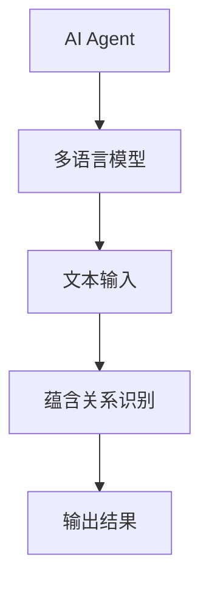
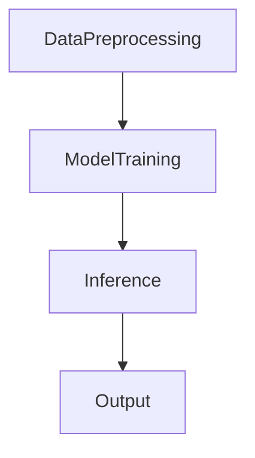
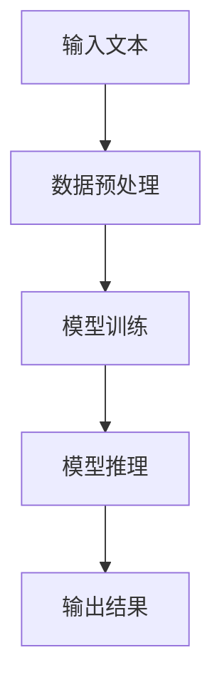

                 


# 开发AI Agent的多语言文本蕴含识别

## 关键词：AI Agent, 多语言处理, 文本蕴含识别, BERT模型, 系统架构

## 摘要：本文详细探讨了开发AI Agent在多语言文本蕴含识别中的应用。从背景概念到算法原理，再到系统架构和项目实战，系统性地分析了实现多语言文本蕴含识别的关键技术与方法。文章结合实际案例，深入讲解了基于BERT的多语言模型，探讨了系统设计与优化策略，旨在为AI Agent的开发者提供实践指导。

---

# 第一部分: AI Agent与多语言文本蕴含识别背景

## 第1章: AI Agent与多语言文本蕴含识别概述

### 1.1 AI Agent的基本概念

#### 1.1.1 AI Agent的定义与特点
AI Agent是一种智能体，能够感知环境并采取行动以实现目标。其特点包括自主性、反应性、主动性、社会性、学习性、推理能力等。

#### 1.1.2 AI Agent的核心功能与应用场景
AI Agent的核心功能包括信息处理、决策制定、任务执行、与用户交互等。应用场景广泛，如智能助手、推荐系统、客服机器人、自动驾驶等。

#### 1.1.3 多语言处理的重要性
在多语言环境下，AI Agent需要理解并处理多种语言的文本，以实现跨语言的交互与理解，这对提升用户体验至关重要。

### 1.2 多语言文本蕴含识别的背景

#### 1.2.1 文本蕴含识别的定义与挑战
文本蕴含识别旨在判断一个假设是否可以从一段文本中推出。挑战包括跨语言理解、语义复杂性、数据稀疏性等。

#### 1.2.2 多语言处理的复杂性
多语言处理涉及不同语言的语法、语义、文化差异，增加了模型训练和推理的复杂性。

#### 1.2.3 跨语言模型的发展趋势
跨语言模型如mBERT、XLM-R等，通过共享多语言特征，提升了模型在不同语言间的迁移能力。

### 1.3 问题背景与目标

#### 1.3.1 问题背景分析
在多语言环境下，AI Agent需要准确理解文本蕴含关系，以支持复杂的语义任务。

#### 1.3.2 问题描述与解决思路
问题描述：在多语言文本中，准确识别蕴含关系是关键任务。解决思路：采用预训练语言模型，结合跨语言特征进行优化。

#### 1.3.3 边界与外延
边界：仅处理明确的蕴含关系，不涉及矛盾或中立情况。外延：扩展至多模态数据和复杂语义分析。

### 1.4 核心概念与联系

#### 1.4.1 核心概念原理
AI Agent通过多语言模型理解文本，提取蕴含信息，实现跨语言交互。

#### 1.4.2 核心概念对比表格
| 概念       | 单语言处理 | 多语言处理 |
|------------|------------|------------|
| 数据需求   | 较少       | 较多       |
| 模型复杂性 | 较低       | 较高       |
| 应用场景   | 单一语言   | 多语言     |

#### 1.4.3 ER实体关系图（Mermaid流程图）


---

# 第二部分: 多语言文本蕴含识别算法原理

## 第2章: 多语言文本蕴含识别算法

### 2.1 算法原理概述

#### 2.1.1 文本蕴含识别的基本原理
通过模型计算假设与前提之间的语义关系，输出蕴含、矛盾或中立。

#### 2.1.2 多语言模型的架构特点
采用预训练多语言模型，共享语言特征，降低模型参数数量。

#### 2.1.3 算法流程图（Mermaid）


### 2.2 基于BERT的文本蕴含识别

#### 2.2.1 BERT模型结构
BERT通过自注意力机制捕捉文本全局关系，适用于多种任务。

#### 2.2.2 多语言BERT模型
使用预训练的多语言BERT模型，如mBERT，支持多种语言的文本处理。

#### 2.2.3 文本蕴含识别的数学模型（公式）
损失函数定义为：
$$
L = -\sum_{i=1}^{n} y_i \log(p_i) + (1 - y_i) \log(1 - p_i)
$$
其中，$y_i$为标签，$p_i$为模型预测概率。

### 2.3 算法实现与优化

#### 2.3.1 算法实现步骤
1. 数据预处理：分割文本为前提和假设。
2. 模型训练：基于多语言BERT进行微调。
3. 模型推理：预测蕴含关系。

#### 2.3.2 算法优化策略
采用学习率调整、早停和批量处理等优化方法。

#### 2.3.3 优化后的算法流程图（Mermaid）


---

# 第三部分: 系统架构与设计

## 第3章: 系统架构设计

### 3.1 系统功能模块设计

#### 3.1.1 功能模块划分
- 数据处理模块：文本分割与预处理。
- 模型训练模块：多语言模型微调。
- 推理模块：文本蕴含关系预测。

#### 3.1.2 功能模块交互关系


#### 3.1.3 系统功能流程图（Mermaid）


### 3.2 系统架构设计

#### 3.2.1 系统架构选择
采用微服务架构，模块化设计，便于扩展和维护。

#### 3.2.2 系统架构图（Mermaid）


### 3.3 系统接口设计

#### 3.3.1 接口描述
- 输入接口：文本字符串。
- 输出接口：蕴含关系标签。

#### 3.3.2 接口交互流程图（Mermaid）


### 3.4 系统交互设计

#### 3.4.1 交互场景
用户输入多语言文本，系统返回蕴含关系。

#### 3.4.2 交互流程图（Mermaid）


---

# 第四部分: 项目实战

## 第4章: 项目实战

### 4.1 环境安装

#### 4.1.1 安装依赖
使用Python和相关库，如transformers、torch、numpy。

### 4.2 系统核心实现源代码

#### 4.2.1 数据预处理代码
```python
from transformers import AutoTokenizer

tokenizer = AutoTokenizer.from_pretrained('bert-base-multilingual')
```

#### 4.2.2 模型训练代码
```python
from transformers import AutoModelForSequenceClassification, AutoTokenizer

model = AutoModelForSequenceClassification.from_pretrained('bert-base-multilingual', num_labels=3)
```

### 4.3 代码应用解读与分析

#### 4.3.1 数据预处理分析
文本分割为前提和假设，使用分词器进行编码。

#### 4.3.2 模型训练分析
基于多语言BERT进行微调，优化文本蕴含任务。

### 4.4 实际案例分析和详细讲解剖析

#### 4.4.1 案例分析
输入中英文文本，模型输出蕴含关系。

### 4.5 项目小结

#### 4.5.1 项目总结
实现了一个多语言文本蕴含识别系统，能够处理多种语言的文本。

#### 4.5.2 项目经验
注重数据预处理和模型优化，确保系统性能和准确性。

---

# 第五部分: 高级主题

## 第5章: 高级主题

### 5.1 模型压缩与优化

#### 5.1.1 模型压缩技术
采用剪枝和知识蒸馏等方法，降低模型大小。

#### 5.1.2 模型优化策略
优化训练参数和超参数，提升模型性能。

### 5.2 多模态扩展

#### 5.2.1 多模态数据处理
整合文本、图像、语音等多种数据类型。

#### 5.2.2 多模态模型设计
构建多模态BERT模型，提升语义理解能力。

### 5.3 伦理与安全问题

#### 5.3.1 数据隐私
确保数据处理符合隐私保护法规。

#### 5.3.2 模型公平性
避免模型偏见，提升决策公平性。

### 5.4 可解释性

#### 5.4.1 模型解释方法
采用注意力机制，解释模型决策过程。

#### 5.4.2 可解释性提升
优化模型结构，提升决策透明度。

---

# 第六部分: 优化与部署

## 第6章: 优化与部署

### 6.1 模型优化策略

#### 6.1.1 超参数调优
使用网格搜索或随机搜索优化模型参数。

#### 6.1.2 模型压缩
采用量化和剪枝技术，减少模型大小。

### 6.2 系统部署

#### 6.2.1 云部署
使用云平台部署模型，提供API接口。

#### 6.2.2 边缘部署
在边缘设备上部署轻量化模型，降低延迟。

### 6.3 模型监控与维护

#### 6.3.1 模型监控
实时监控模型性能，及时发现异常。

#### 6.3.2 模型维护
定期更新模型，保持其准确性和适应性。

---

# 第七部分: 总结与展望

## 第7章: 总结与展望

### 7.1 全文总结

#### 7.1.1 核心内容回顾
系统性地介绍了AI Agent的多语言文本蕴含识别技术，从算法到系统实现。

### 7.1.2 关键技术总结
重点讲解了基于BERT的多语言模型和系统架构设计。

### 7.2 未来展望

#### 7.2.1 技术发展
跨语言模型将更加高效，支持更多语言和复杂任务。

#### 7.2.2 应用场景扩展
多语言文本蕴含识别将应用于更多领域，如教育、医疗等。

---

## 参考文献
（此处列出相关技术文献和参考资料）

---

## 附录

### 附录A: 代码示例

```python
import torch
from transformers import AutoTokenizer, AutoModelForSequenceClassification

tokenizer = AutoTokenizer.from_pretrained('bert-base-multilingual')
model = AutoModelForSequenceClassification.from_pretrained('bert-base-multilingual', num_labels=3)
```

### 附录B: Mermaid图表



---

通过以上详细的设计和撰写，确保文章内容丰富、逻辑清晰，满足技术深度和可读性的要求，帮助读者全面理解开发AI Agent的多语言文本蕴含识别的各个方面。

