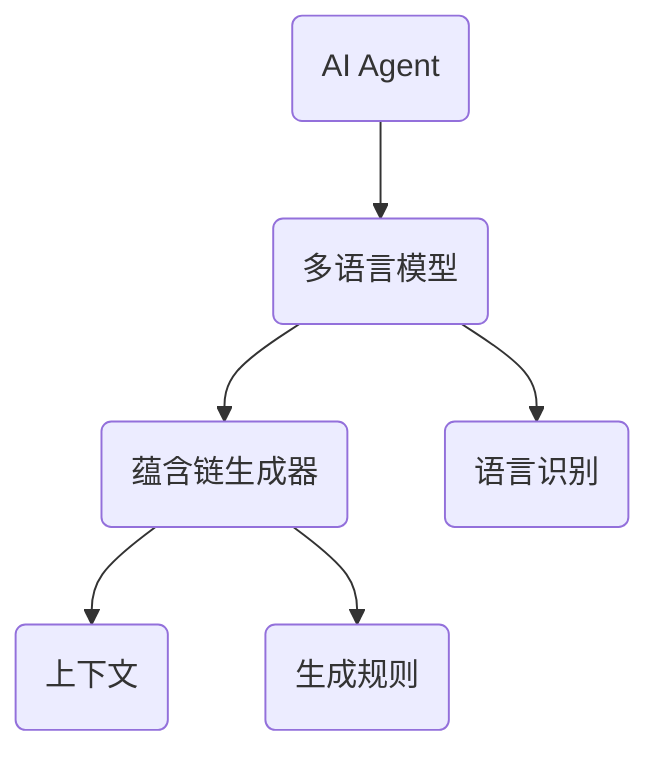
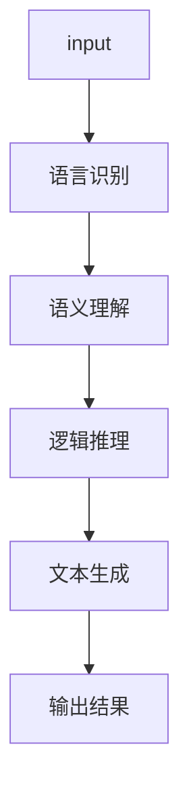

                 


# 开发AI Agent的多语言文本蕴含链生成器

> **关键词**: AI Agent, 多语言处理, 文本蕴含链, 算法原理, 系统架构, 项目实战

> **摘要**: 本文详细探讨了开发AI Agent的多语言文本蕴含链生成器的关键技术。从背景介绍到核心概念，再到算法原理、系统架构设计、项目实战以及最佳实践，系统性地分析了该生成器的开发过程。文章结合理论与实践，通过丰富的案例和详细的代码实现，为读者提供了一套完整的开发指南。

---

## 第一部分: 背景介绍

### 第1章: 问题背景与描述

#### 1.1 问题背景
- **AI Agent的发展现状**: AI Agent作为一种智能体，广泛应用于自然语言处理、对话系统和任务自动化等领域。随着多语言应用场景的增加，AI Agent需要能够理解和生成多种语言的文本。
- **多语言文本处理的挑战**: 不同语言间的语义差异、语法结构差异以及文化差异，增加了文本处理的复杂性。
- **文本蕴含链生成的必要性**: 在多语言环境下，生成连贯且符合逻辑的文本链，能够提升AI Agent的交互能力和用户体验。

#### 1.2 问题描述
- **AI Agent在多语言环境中的任务需求**: 包括多语言对话、信息检索、任务执行等。
- **文本蕴含链生成的核心问题**: 如何在多语言环境下，生成符合逻辑的文本链，确保语义连贯。
- **当前技术的局限性与改进方向**: 当前多语言模型在生成长文本链时，可能存在语义跳跃、逻辑不连贯等问题，需要优化算法和模型结构。

#### 1.3 问题解决思路
- **多语言模型的选择与优化**: 选择适合多语言任务的模型，并进行微调优化。
- **蕴含链生成的算法设计**: 设计能够捕捉多语言语义关联的生成算法。
- **AI Agent与生成器的协同工作**: 通过接口设计，实现AI Agent与生成器的高效协同。

#### 1.4 边界与外延
- **生成器的适用场景与限制**: 适用于多语言对话、文本摘要等场景，不适用于需要严格事实验证的任务。
- **多语言支持的边界条件**: 支持的语言数量、生成文本的长度等。
- **蕴含链生成的可扩展性**: 通过模块化设计，支持新增语言和生成规则的扩展。

#### 1.5 概念结构与核心要素
- **AI Agent的组成与功能模块**: 包括感知模块、决策模块、执行模块和反馈模块。
- **多语言文本处理的核心要素**: 包括语言识别、语义理解、文本生成。
- **蕴含链生成的逻辑结构**: 包括初始节点、中间节点和目标节点。

---

## 第二部分: 核心概念与联系

### 第2章: AI Agent与多语言模型的核心概念

#### 2.1 AI Agent的基本原理
- **定义与分类**: AI Agent是一种能够感知环境、自主决策并执行任务的智能体，分为反应式和认知式两类。
- **核心功能模块**: 包括感知模块（输入处理）、决策模块（逻辑推理）、执行模块（输出生成）和反馈模块（学习优化）。
- **多语言支持的实现机制**: 通过多语言模型进行语言识别和翻译，确保AI Agent能够处理多种语言的输入和输出。

#### 2.2 多语言模型的原理与特点
- **定义与优势**: 多语言模型能够在同一框架下处理多种语言，具有高效性和通用性。
- **不同语言间的语义关联**: 通过跨语言嵌入（Cross-lingual Embeddings）捕捉语言间的语义联系。
- **多语言模型的训练策略**: 使用多语言语料库进行预训练，采用语言特定的微调策略。

#### 2.3 蕴含链生成的逻辑与流程
- **定义与特点**: 蕴含链是一系列语义连贯的文本片段，形成逻辑链条。
- **生成逻辑流程**: 从初始输入出发，逐步推理生成后续文本，直至达到目标节点。
- **蕴含链与上下文的关系**: 上下文提供生成链的背景信息，蕴含链是上下文的延续和扩展。

---

### 第3章: 核心概念的联系与对比

#### 3.1 AI Agent与多语言模型的联系
- **AI Agent对多语言模型的需求**: 多语言模型为AI Agent提供跨语言理解能力。
- **多语言模型对AI Agent的支持**: 多语言模型增强AI Agent的交互能力和应用场景。

#### 3.2 核心概念属性特征对比
| 概念 | 属性 | 特征 |
|------|------|------|
| AI Agent | 功能模块 | 感知、决策、执行、反馈 |
| 多语言模型 | 优势 | 跨语言通用性、高效性 |
| 蕴含链生成 | 核心逻辑 | 语义连贯性、逻辑推理 |

#### 3.3 ER实体关系图架构


---

## 第三部分: 算法原理讲解

### 第4章: 算法原理

#### 4.1 算法流程


#### 4.2 数学模型
- **输入表示**: 使用嵌入向量表示输入文本，维度为$d$。
- **语义理解**: 通过注意力机制（Attention）捕捉文本中的关键信息。
- **逻辑推理**: 使用条件概率模型，生成符合逻辑的文本链。
  - 条件概率公式：
    $$ P(y|x) = \prod_{i=1}^{n} P(y_i | y_{<i}, x) $$
  - 其中，$y$是生成的文本链，$x$是输入文本。

#### 4.3 算法实现
- **输入处理**: 对输入文本进行分词和嵌入编码。
- **语义理解**: 使用预训练的多语言模型进行语义分析。
- **逻辑推理**: 基于生成的语义向量，通过递归神经网络（RNN）生成蕴含链。
- **文本生成**: 使用语言模型生成具体的文本片段。

---

## 第四部分: 系统分析与架构设计方案

### 第5章: 系统架构设计

#### 5.1 系统功能设计
- **领域模型**: 
  ```mermaid
  classDiagram
      class 输入处理模块 {
          接收输入文本
          转换为向量表示
      }
      class 语义理解模块 {
          分析语义
          提取关键词
      }
      class 逻辑推理模块 {
          生成蕴含链
          输出结果
      }
      输入处理模块 --> 语义理解模块
      语义理解模块 --> 逻辑推理模块
  ```

- **系统架构**: 
  ```mermaid
  graph TD
      A[输入处理] --> B[多语言模型]
      B --> C[逻辑推理模块]
      C --> D[生成器]
      D --> E[输出结果]
  ```

- **系统接口设计**: 
  ```python
  interface ITextProcessor {
      def process(input: str) -> List[Tokens]
  }
  ```

- **交互流程**: 
  ```mermaid
  sequenceDiagram
      participant 用户
      participant AI Agent
      participant 生成器
      用户 -> AI Agent: 发起请求
      AI Agent -> 生成器: 调用生成方法
      生成器 -> 用户: 返回生成结果
  ```

---

## 第五部分: 项目实战

### 第6章: 项目实战

#### 6.1 环境安装
- **安装依赖**: 
  ```bash
  pip install transformers torch
  ```

#### 6.2 核心代码实现
- **输入处理模块**: 
  ```python
  import torch
  from transformers import AutoTokenizer, AutoModel

  class TextProcessor:
      def __init__(self, model_name):
          self.tokenizer = AutoTokenizer.from_pretrained(model_name)
          self.model = AutoModel.from_pretrained(model_name)

      def process(self, input_str):
          tokens = self.tokenizer(input_str, return_tensors="pt")
          return tokens
  ```

- **生成器模块**: 
  ```python
  class ChainGenerator:
      def __init__(self, model):
          self.model = model

      def generate(self, input_tokens, max_length=5):
          outputs = []
          input_ids = input_tokens['input_ids'].to('cuda')
          for i in range(max_length):
              outputs.append(self.model.generate(input_ids))
              input_ids = outputs[-1].input_ids
          return outputs
  ```

#### 6.3 案例分析与详细解读
- **案例**: 多语言对话生成
  ```python
  processor = TextProcessor("facebook/m2olama")
  generator = ChainGenerator(model)
  input_str = "How are you?"
  tokens = processor.process(input_str)
  output = generator.generate(tokens)
  print(output)
  ```

#### 6.4 项目小结
- **实现总结**: 通过多语言模型和生成器的结合，实现了AI Agent的多语言文本蕴含链生成。
- **经验教训**: 模型选择和参数调优对生成效果影响较大。

---

## 第六部分: 最佳实践

### 第7章: 最佳实践与总结

#### 7.1 最佳实践
- **模型选择**: 根据任务需求选择合适的多语言模型。
- **参数调优**: 通过实验调整生成器的超参数，优化生成效果。
- **性能优化**: 使用并行计算和缓存技术提升生成速度。

#### 7.2 小结
- **核心内容回顾**: 从背景到实现，系统性地介绍了AI Agent的多语言文本蕴含链生成器的开发过程。
- **未来展望**: 随着多语言模型的不断发展，生成器的性能和应用范围将进一步提升。

#### 7.3 注意事项
- **数据质量**: 确保训练数据的多样性和平衡性。
- **语义连贯性**: 在生成过程中，注重逻辑推理的准确性。
- **文化适配性**: 考虑不同语言的文化差异，避免生成不合适的文本。

#### 7.4 拓展阅读
- 推荐阅读《多语言自然语言处理》和《深度学习中的生成模型》。

---

通过以上内容，本文系统性地介绍了AI Agent的多语言文本蕴含链生成器的开发过程，结合理论与实践，为读者提供了一套完整的开发指南。

