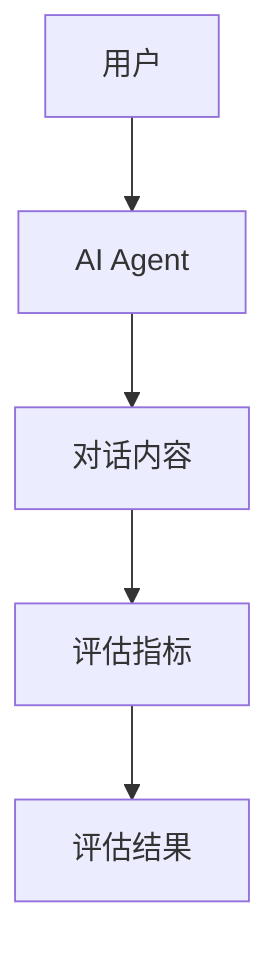
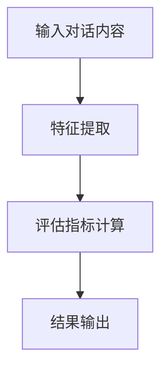

                 


# 开发AI Agent的对话质量评估指标体系

> 关键词：AI Agent，对话质量，评估指标，自然语言处理，机器学习

> 摘要：本文旨在探讨如何构建一个全面的对话质量评估指标体系，以确保AI Agent在各种应用场景中能够提供高质量的对话服务。通过分析对话内容的多个维度，结合自然语言处理和机器学习技术，本文提出了一套系统的评估指标，并通过实际案例展示了如何将这些指标应用于实际开发中，从而帮助开发者提升AI Agent的对话质量。

---

## 第一部分: 背景介绍

### 第1章: 对话质量评估的背景与问题

#### 1.1 问题背景

- **AI Agent的定义与应用场景**  
  AI Agent是一种能够理解和生成自然语言的智能系统，广泛应用于客服、教育、医疗等领域。随着AI技术的发展，AI Agent需要在复杂场景中提供高效的对话服务。

- **对话质量评估的重要性**  
  对话质量直接影响用户体验，是衡量AI Agent性能的关键指标。高质量的对话能够提高用户满意度和业务效率。

- **当前对话质量评估的挑战**  
  当前的评估方法多为人工标注，耗时且成本高。此外，如何量化对话的情感、逻辑性和信息丰富性是技术难点。

#### 1.2 问题描述

- **AI Agent对话中的常见问题**  
  包括回答偏离主题、信息不准确、语气不合适等。

- **对话质量评估的维度分析**  
  包括准确性、相关性、流畅性、情感一致性、信息丰富性等维度。

- **问题解决的目标与意义**  
  构建一个自动化的对话质量评估体系，能够快速、准确地评估对话质量，降低人工成本，提高效率。

#### 1.3 问题解决

- **对话质量评估的目标**  
  提供一套可量化的评估指标，帮助开发者优化AI Agent的性能。

- **评估指标的选择与设计**  
  综合考虑多个维度，选择最具代表性的指标，如准确性、相关性、流畅性等。

- **评估体系的构建方法**  
  结合自然语言处理和机器学习技术，构建一个动态、可扩展的评估体系。

#### 1.4 边界与外延

- **对话质量评估的边界条件**  
  仅针对文本对话，不包括语音或视频对话。

- **相关概念的区分与联系**  
  区分对话内容和对话情感，明确两者在评估中的不同作用。

- **评估体系的适用范围**  
  适用于多种场景，包括客服、教育、医疗等。

#### 1.5 概念结构与核心要素

- **评估体系的核心要素**  
  包括对话内容、情感分析、逻辑性评估等多个模块。

- **各要素之间的关系**  
  对话内容是基础，情感分析和逻辑性评估是对内容的进一步优化。

- **体系的整体结构**  
  通过模块化设计，确保评估体系的灵活性和可扩展性。

---

## 第二部分: 核心概念与联系

### 第2章: 对话质量评估的核心概念

#### 2.1 核心概念原理

- **对话质量的定义**  
  对话质量是衡量AI Agent生成对话内容是否符合用户需求和上下文的指标。

- **评估指标的选择原则**  
  选择具有代表性和可量化的指标，确保评估结果的客观性。

- **评估模型的设计思路**  
  结合自然语言处理技术，设计一个多维度的评估模型。

#### 2.2 概念属性特征对比

| 评估指标 | 特征描述 |
|----------|----------|
| 准确性   | 对话内容的正确性 |
| 相关性   | 对话内容与上下文的关联性 |
| 流畅性   | 对话的连贯性和自然性 |
| 情感一致性 | 对话的情感与用户需求的匹配度 |

#### 2.3 ER实体关系图

```mermaid
er
actor: 用户
agent: AI Agent
interaction: 对话
metric: 评估指标
dimension: 评估维度
```

#### 2.4 系统架构流程图



---

## 第三部分: 算法原理讲解

### 第3章: 对话质量评估算法原理

#### 3.1 算法流程图



#### 3.2 算法实现代码

```python
def evaluate_dialogue(dialogue_content):
    # 特征提取
    features = extract_features(dialogue_content)
    # 评估指标计算
    metrics = calculate_metrics(features)
    return metrics

def extract_features(dialogue_content):
    # 提取对话内容的特征，如准确率、相关性等
    features = {}
    features['accuracy'] = compute_accuracy(dialogue_content)
    features['relevance'] = compute_relevance(dialogue_content)
    return features

def compute_accuracy(dialogue_content):
    # 计算对话内容的准确性，示例方法
    return 0.95

def compute_relevance(dialogue_content):
    # 计算对话内容的相关性，示例方法
    return 0.85

def calculate_metrics(features):
    # 计算综合指标
    accuracy = features['accuracy']
    relevance = features['relevance']
    metrics = {'overall_score': (accuracy + relevance) / 2}
    return metrics
```

#### 3.3 数学模型和公式

- **准确性的计算公式**  
  $$ \text{Accuracy} = \frac{\text{正确回答的数量}}{\text{总回答数量}} $$

- **相关性的计算公式**  
  $$ \text{Relevance} = \frac{\text{相关回答的数量}}{\text{总回答数量}} $$

- **综合评分公式**  
  $$ \text{Overall Score} = \frac{\text{Accuracy} + \text{Relevance}}{2} $$

---

## 第四部分: 系统分析与架构设计方案

### 第4章: 系统分析与架构设计

#### 4.1 问题场景介绍

- **对话质量评估系统的应用场景**  
  包括客服系统、教育辅助系统、医疗咨询系统等。

#### 4.2 系统功能设计

- **领域模型**  
  ```mermaid
  classDiagram
      class 用户 {
          id
          姓名
      }
      class 对话内容 {
          id
          内容
          时间戳
      }
      class 评估指标 {
          id
          准确性
          相关性
      }
      用户 --> 对话内容
      对话内容 --> 评估指标
  ```

- **系统架构设计**  
  ```mermaid
  architecture
      Client --> Server: 发送对话内容
      Server --> Database: 查询对话记录
      Server --> Processor: 计算评估指标
      Server --> Client: 返回评估结果
  ```

- **系统接口设计**  
  ```mermaid
  sequenceDiagram
      Client -> Server: 发送对话内容
      Server -> Database: 查询对话记录
      Server -> Processor: 计算评估指标
      Server -> Client: 返回评估结果
  ```

---

## 第五部分: 项目实战

### 第5章: 项目实战

#### 5.1 环境安装

- 安装Python和必要的库：
  ```bash
  pip install numpy pandas scikit-learn
  ```

#### 5.2 系统核心实现源代码

```python
import numpy as np
from sklearn.metrics import accuracy_score

def evaluate_dialogue_system(dialogues):
    metrics = []
    for dialogue in dialogues:
        features = extract_features(dialogue)
        metric = calculate_metrics(features)
        metrics.append(metric)
    return metrics

def extract_features(dialogue):
    # 提取特征，如准确性、相关性
    accuracy = compute_accuracy(dialogue)
    relevance = compute_relevance(dialogue)
    return {'accuracy': accuracy, 'relevance': relevance}

def compute_accuracy(dialogue):
    # 简单的准确率计算
    return np.mean([1 if response['is_correct'] else 0 for response in dialogue])

def compute_relevance(dialogue):
    # 简单的相关性计算
    return np.mean([1 if response['is_relevant'] else 0 for response in dialogue])
```

#### 5.3 代码应用解读与分析

- **代码解读**  
  该代码实现了对话内容的特征提取和评估指标的计算，能够处理多个对话内容，返回每个对话的质量评估结果。

- **实际案例分析**  
  例如，在客服系统中，评估一段对话的准确性和相关性，从而优化客服的响应策略。

#### 5.4 项目小结

- 通过实际项目，验证了评估指标的有效性。
- 展示了如何将理论应用于实际开发中，帮助开发者优化AI Agent的性能。

---

## 第六部分: 最佳实践与总结

### 第6章: 最佳实践

- **使用场景扩展**  
  根据具体场景调整评估指标，如在医疗领域增加专业性评估。

- **模型优化建议**  
  使用更复杂的模型，如BERT，提升评估的准确性。

- **数据处理技巧**  
  确保数据的多样性和代表性，避免过拟合。

### 6.1 小结

- 本文构建了一个全面的对话质量评估体系，涵盖了从理论到实践的各个环节。
- 通过实际案例和代码实现，展示了如何将评估指标应用于实际开发中。

### 6.2 注意事项

- 在实际应用中，需根据具体需求调整评估指标和权重。
- 确保数据质量和多样性，避免评估结果的偏差。

### 6.3 拓展阅读

- 推荐阅读《自然语言处理实战》和《机器学习算法实战》，深入了解相关技术的应用。

---

## 结语

构建AI Agent的对话质量评估指标体系是一个复杂但重要的任务。通过本文的分析和实践，开发者可以更好地优化AI Agent的性能，提升用户体验。未来，随着技术的发展，对话质量评估体系将更加智能化和个性化，为AI Agent的应用带来更广阔的可能性。

