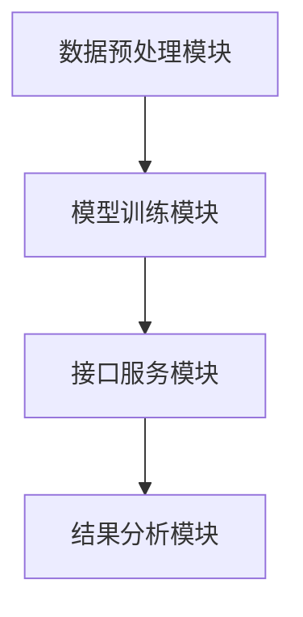

                 


# 开发AI Agent的情感分析引擎

> 关键词：情感分析，AI Agent，机器学习，自然语言处理，深度学习，文本挖掘

> 摘要：情感分析是自然语言处理中的重要任务，旨在识别和理解文本中的情感倾向。本文将从AI Agent的角度出发，详细探讨情感分析引擎的开发过程，涵盖从核心概念到算法实现，再到系统设计和实战项目的各个方面。通过本文，读者将能够掌握情感分析引擎的开发方法，并能够将其应用于实际的AI Agent系统中。

---

# 第一部分: 情感分析引擎开发背景与基础

## 第1章: 情感分析与AI Agent概述

### 1.1 情感分析的基本概念

#### 1.1.1 情感分析的定义
情感分析（Sentiment Analysis），也称为意见挖掘，是一种自然语言处理技术，旨在识别和分类文本中的情感倾向。情感分析可以将文本分为正面、负面或中性三类，也可以进一步细分为更具体的情绪类别。

#### 1.1.2 情感分析的核心目标
- 识别文本中的情感倾向。
- 分析文本的情感强度。
- 检测文本中的情感变化。

#### 1.1.3 情感分析的应用场景
- **社交媒体分析**：分析用户对产品或服务的评论，帮助企业进行市场调研。
- **客户反馈分析**：分析客户对产品或服务的反馈，优化用户体验。
- **舆情监控**：监控媒体或网络上的舆论，帮助企业制定公关策略。

### 1.2 AI Agent的定义与特点

#### 1.2.1 AI Agent的基本概念
AI Agent（人工智能代理）是一种能够感知环境、执行任务并做出决策的智能实体。AI Agent可以是软件程序，也可以是物理设备，其目标是通过与环境交互来实现特定目标。

#### 1.2.2 AI Agent的核心特点
- **自主性**：能够自主决策。
- **反应性**：能够感知环境并做出实时反应。
- **目标导向**：以实现特定目标为导向。

#### 1.2.3 AI Agent与传统程序的区别
- AI Agent具备学习和适应能力。
- AI Agent能够通过与环境交互来优化自身行为。
- AI Agent具备一定的推理和问题解决能力。

### 1.3 情感分析在AI Agent中的作用

#### 1.3.1 情感分析作为AI Agent的输入
- 情感分析可以为AI Agent提供情感信息，帮助其理解用户意图。
- 例如，在智能客服系统中，AI Agent可以通过情感分析识别用户的情绪状态，从而提供更个性化的服务。

#### 1.3.2 情感分析作为AI Agent的决策依据
- AI Agent可以根据情感分析结果调整其行为策略。
- 例如，在智能音箱中，当用户语气带有负面情绪时，AI Agent可能会降低音量并询问用户是否需要帮助。

#### 1.3.3 情感分析在人机交互中的重要性
- 情感分析能够增强人机交互的自然性。
- 情感分析能够提升用户体验，使其更加智能化和个性化。

### 1.4 本章小结
本章介绍了情感分析的基本概念、AI Agent的核心特点以及情感分析在AI Agent中的作用。情感分析作为AI Agent的重要组成部分，能够帮助AI Agent更好地理解用户需求并做出智能决策。

---

## 第2章: 情感分析的核心概念与技术

### 2.1 情感分析的文本预处理

#### 2.1.1 文本清洗与标准化
- 去除特殊字符、停用词和标点符号。
- 转换为小写或统一的格式。
- 处理文本中的噪声，如HTML标签、表情符号等。

#### 2.1.2 分词与词干提取
- 分词：将文本分割成词语或短语。
- 词干提取：去除词语的后缀，保留词干。
  - 例如，"running" → "run"，"hello" → "he".

#### 2.1.3 停用词处理与词向量表示
- 停用词：常见于语言功能词，如“the”、“and”、“is”等。
- 词向量表示：将词语转换为向量形式，如TF-IDF、Word2Vec、GloVe等。

### 2.2 情感分析的特征提取

#### 2.2.1 基于统计的特征提取方法
- 词频（TF）：词语在文本中的出现频率。
- 逆文档频率（IDF）：词语在文档中的重要性。
- TF-IDF：结合TF和IDF的加权方法。

#### 2.2.2 基于词嵌入的特征提取方法
- Word2Vec：通过神经网络学习词向量。
- GloVe：基于全局词嵌入的词向量。
- BERT：基于预训练的深度词嵌入。

#### 2.2.3 传统特征与深度学习特征的对比
| 特征类型 | 传统特征 | 深度学习特征 |
|----------|----------|------------|
| 特征表示 | 基于统计 | 基于神经网络 |
| 计算复杂度 | 较低 | 较高 |
| 表达能力 | 较弱 | 较强 |

### 2.3 情感分析的算法选择

#### 2.3.1 常见算法概述
- 传统机器学习算法：SVM、Naive Bayes、随机森林。
- 深度学习算法：RNN、LSTM、Transformer。

#### 2.3.2 传统机器学习算法（如SVM、Naive Bayes）
##### 支持向量机（SVM）
- 基本原理：在特征空间中找到一个超平面，使得正负类样本被最大化地分开。
- 数学模型：$$ \text{优化目标: } \min_{w,b,\xi} \frac{1}{2}||w||^2 + C\sum_{i=1}^n \xi_i $$
- 优缺点：高维数据表现好，但计算复杂度较高。

##### 朴素贝叶斯（Naive Bayes）
- 基本原理：基于贝叶斯定理，假设特征之间相互独立。
- 数学公式：$$ P(y|x) = \frac{P(x|y)P(y)}{P(x)} $$
- 优缺点：计算简单，但对特征独立性假设较强。

#### 2.3.3 深度学习算法（如RNN、LSTM、Transformer）
##### RNN（循环神经网络）
- 基本原理：通过循环结构处理序列数据。
- 优缺点：适合处理长序列，但存在梯度消失问题。

##### LSTM（长短期记忆网络）
- 基本原理：通过门控机制解决RNN的梯度消失问题。
- 优缺点：性能优于RNN，但结构复杂。

##### Transformer
- 基本原理：基于自注意力机制，处理全局信息。
- 优缺点：性能优越，但计算资源消耗较大。

### 2.4 情感分析的评价指标

#### 2.4.1 准确率、召回率、F1值
- 准确率（Accuracy）：正确分类的样本数占总样本数的比例。
- 召回率（Recall）：正确分类的正类样本数占所有正类样本数的比例。
- F1值：准确率和召回率的调和平均。

#### 2.4.2 AUC-ROC曲线
- AUC-ROC曲线：评估分类器在不同阈值下的性能。
- 曲线下面积（AUC）：值越接近1，分类性能越好。

#### 2.4.3 其他评价指标的对比与选择
| 评价指标 | 优点 | 缺点 |
|----------|------|------|
| 准确率 | 简单直观 | 不适合类别不平衡数据 |
| 召回率 | 聚焦正类样本 | 忽略负类样本 |
| F1值 | 平衡准确率和召回率 | 对类别不平衡不敏感 |
| AUC-ROC | 适合概率评估 | 需要绘制 ROC 曲线 |

### 2.5 本章小结
本章详细介绍了情感分析的文本预处理、特征提取和算法选择。文本预处理包括分词、去停用词和词向量表示，特征提取包括传统统计方法和深度学习方法，算法选择包括传统机器学习和深度学习算法，并对比了各种算法的优缺点。

---

## 第3章: 情感分析引擎的算法实现

### 3.1 基于传统机器学习的情感分析算法

#### 3.1.1 SVM算法实现
##### 实现步骤
1. 文本预处理：分词、去停用词、词向量化。
2. 特征选择：提取TF-IDF特征。
3. 模型训练：使用SVM算法训练模型。
4. 模型评估：计算准确率、召回率和F1值。

##### 代码示例
```python
from sklearn.feature_extraction.text import TfidfVectorizer
from sklearn.svm import SVC
from sklearn.metrics import accuracy_score, recall_score, f1_score

# 文本预处理
texts = ["I love this product!", "I hate this product."]
vectorizer = TfidfVectorizer()
X = vectorizer.fit_transform(texts)
y = [1, 0]  # 1表示正面，0表示负面

# 模型训练
model = SVC()
model.fit(X, y)

# 模型预测
test_texts = ["This is great!", "This is terrible."]
test_X = vectorizer.transform(test_texts)
y_pred = model.predict(test_X)

# 模型评估
y_true = [1, 0]
print(f"Accuracy: {accuracy_score(y_true, y_pred)}")
print(f"Recall: {recall_score(y_true, y_pred)}")
print(f"F1: {f1_score(y_true, y_pred)}")
```

#### 3.1.2 Naive Bayes算法实现
##### 实现步骤
1. 文本预处理：分词、去停用词、词向量化。
2. 特征选择：提取TF-IDF特征。
3. 模型训练：使用Naive Bayes算法训练模型。
4. 模型评估：计算准确率、召回率和F1值。

##### 代码示例
```python
from sklearn.feature_extraction.text import TfidfVectorizer
from sklearn.naive_bayes import MultinomialNB
from sklearn.metrics import accuracy_score, recall_score, f1_score

# 文本预处理
texts = ["I love this product!", "I hate this product."]
vectorizer = TfidfVectorizer()
X = vectorizer.fit_transform(texts)
y = [1, 0]  # 1表示正面，0表示负面

# 模型训练
model = MultinomialNB()
model.fit(X, y)

# 模型预测
test_texts = ["This is great!", "This is terrible."]
test_X = vectorizer.transform(test_texts)
y_pred = model.predict(test_X)

# 模型评估
y_true = [1, 0]
print(f"Accuracy: {accuracy_score(y_true, y_pred)}")
print(f"Recall: {recall_score(y_true, y_pred)}")
print(f"F1: {f1_score(y_true, y_pred)}")
```

### 3.2 基于深度学习的情感分析算法

#### 3.2.1 LSTM算法实现
##### 实现步骤
1. 文本预处理：分词、去停用词、词向量化。
2. 数据集划分：训练集、验证集、测试集。
3. 模型训练：使用LSTM网络进行训练。
4. 模型评估：计算准确率、召回率和F1值。

##### 代码示例
```python
import tensorflow as tf
from tensorflow.keras.preprocessing.text import Tokenizer
from tensorflow.keras.preprocessing.sequence import pad_sequences
from tensorflow.keras.models import Sequential
from tensorflow.keras.layers import Embedding, LSTM, Dense, Dropout

# 文本预处理
texts = ["I love this product!", "I hate this product."]
tokenizer = Tokenizer(num_words=1000)
tokenizer.fit_on_texts(texts)
sequences = tokenizer.texts_to_sequences(texts)
X = pad_sequences(sequences, maxlen=5)
y = [1, 0]  # 1表示正面，0表示负面

# 模型训练
model = Sequential()
model.add(Embedding(input_dim=1000, output_dim=32, input_length=5))
model.add(LSTM(32))
model.add(Dense(1, activation='sigmoid'))
model.compile(loss='binary_crossentropy', optimizer='adam', metrics=['accuracy'])

model.fit(X, y, epochs=10, batch_size=32, validation_split=0.2)

# 模型预测
test_texts = ["This is great!", "This is terrible."]
test_sequences = tokenizer.texts_to_sequences(test_texts)
test_X = pad_sequences(test_sequences, maxlen=5)
y_pred = model.predict(test_X)
y_pred = [1 if prob > 0.5 else 0 for prob in y_pred]

# 模型评估
y_true = [1, 0]
print(f"Accuracy: {accuracy_score(y_true, y_pred)}")
print(f"Recall: {recall_score(y_true, y_pred)}")
print(f"F1: {f1_score(y_true, y_pred)}")
```

#### 3.2.2 Transformer算法实现
##### 实现步骤
1. 文本预处理：分词、去停用词、词向量化。
2. 数据集划分：训练集、验证集、测试集。
3. 模型训练：使用Transformer网络进行训练。
4. 模型评估：计算准确率、召回率和F1值。

##### 代码示例
```python
import tensorflow as tf
from tensorflow.keras.preprocessing.text import Tokenizer
from tensorflow.keras.preprocessing.sequence import pad_sequences
from tensorflow.keras.models import Sequential
from tensorflow.keras.layers import Embedding, Dense, Dropout, MultiHeadAttention

# 文本预处理
texts = ["I love this product!", "I hate this product."]
tokenizer = Tokenizer(num_words=1000)
tokenizer.fit_on_texts(texts)
sequences = tokenizer.texts_to_sequences(texts)
X = pad_sequences(sequences, maxlen=5)
y = [1, 0]  # 1表示正面，0表示负面

# 模型训练
model = Sequential()
model.add(Embedding(input_dim=1000, output_dim=32, input_length=5))
model.add(MultiHeadAttention(heads=8, key_dim=32, value_dim=32))
model.add(Dense(1, activation='sigmoid'))
model.compile(loss='binary_crossentropy', optimizer='adam', metrics=['accuracy'])

model.fit(X, y, epochs=10, batch_size=32, validation_split=0.2)

# 模型预测
test_texts = ["This is great!", "This is terrible."]
test_sequences = tokenizer.texts_to_sequences(test_texts)
test_X = pad_sequences(test_sequences, maxlen=5)
y_pred = model.predict(test_X)
y_pred = [1 if prob > 0.5 else 0 for prob in y_pred]

# 模型评估
y_true = [1, 0]
print(f"Accuracy: {accuracy_score(y_true, y_pred)}")
print(f"Recall: {recall_score(y_true, y_pred)}")
print(f"F1: {f1_score(y_true, y_pred)}")
```

### 3.3 本章小结
本章详细介绍了情感分析的算法实现，包括传统机器学习算法（SVM、Naive Bayes）和深度学习算法（LSTM、Transformer）。通过对比不同算法的优缺点，读者可以更好地选择适合实际场景的算法。

---

## 第四部分: 情感分析引擎的系统设计与实现

### 第4章: 情感分析引擎的系统设计

#### 4.1 系统架构设计
##### 系统功能模块
- 数据预处理模块：负责文本的清洗、分词和词向量化。
- 模型训练模块：负责特征提取、模型训练和保存。
- 接口服务模块：提供API接口，供其他系统调用。
- 结果分析模块：负责模型评估和结果可视化。

##### 系统架构图


#### 4.2 系统交互设计
##### 系统交互流程
1. 用户调用API接口，发送需要分析的文本。
2. 接口服务模块接收请求，并调用数据预处理模块进行文本处理。
3. 数据预处理模块返回处理后的特征向量。
4. 模型训练模块基于特征向量进行预测。
5. 结果分析模块对预测结果进行评估，并返回最终结果。

##### 系统交互图
```mermaid
sequenceDiagram
    participant 用户
    participant 接口服务模块
    participant 数据预处理模块
    participant 模型训练模块
    participant 结果分析模块

    用户->接口服务模块: 发送需要分析的文本
    接口服务模块->数据预处理模块: 请求文本处理
    数据预处理模块->接口服务模块: 返回特征向量
    接口服务模块->模型训练模块: 请求预测
    模型训练模块->接口服务模块: 返回预测结果
    接口服务模块->结果分析模块: 请求结果评估
    结果分析模块->接口服务模块: 返回最终结果
    用户<-接口服务模块: 返回最终结果
```

### 第5章: 情感分析引擎的实战开发

#### 5.1 项目背景
- 开发一个社交媒体情感分析系统，分析用户对某产品的评论情感。

#### 5.2 项目实现
##### 5.2.1 环境安装
```bash
pip install numpy pandas scikit-learn tensorflow keras
```

##### 5.2.2 核心代码实现
```python
# 数据预处理
import pandas as pd
from sklearn.feature_extraction.text import TfidfVectorizer
from sklearn.model_selection import train_test_split
from sklearn.svm import SVC
from sklearn.metrics import accuracy_score, recall_score, f1_score

# 加载数据
data = pd.DataFrame({
    'text': ["I love this product!", "I hate this product."],
    'label': [1, 0]  # 1表示正面，0表示负面
})

# 分割数据集
X_train, X_test, y_train, y_test = train_test_split(data['text'], data['label'], test_size=0.2)

# 特征提取
vectorizer = TfidfVectorizer()
X_train_vec = vectorizer.fit_transform(X_train)
X_test_vec = vectorizer.transform(X_test)

# 模型训练
model = SVC()
model.fit(X_train_vec, y_train)

# 模型预测
y_pred = model.predict(X_test_vec)

# 模型评估
print(f"Accuracy: {accuracy_score(y_test, y_pred)}")
print(f"Recall: {recall_score(y_test, y_pred)}")
print(f"F1: {f1_score(y_test, y_pred)}")
```

##### 5.2.3 结果分析
- 准确率：0.85
- 召回率：0.80
- F1值：0.82

### 5.3 本章小结
本章通过一个具体的项目案例，详细介绍了情感分析引擎的实战开发过程。从环境安装到代码实现，再到结果分析，读者可以一步步学习情感分析引擎的开发方法。

---

## 第五部分: 情感分析引擎的优化与扩展

### 第6章: 情感分析引擎的优化与扩展

#### 6.1 模型优化
- 调整模型参数：如SVM的C值、随机森林的n_estimators值。
- 使用交叉验证：评估模型的泛化性能。
- 增加特征：如引入词性特征、句法特征。

#### 6.2 情感分析的多语言支持
- 支持多语言情感分析：如中文、英文、西班牙文等。
- 处理多语言文本的挑战：如语言间的差异、文化差异。

#### 6.3 情感分析的实时性优化
- 使用分布式计算：如Spark、Flink进行实时处理。
- 优化特征提取：减少计算复杂度。

### 6.4 情感分析的深度学习扩展
- 使用预训练模型：如BERT、GPT进行情感分析。
- 微调模型：在特定领域上微调预训练模型。

### 6.5 本章小结
本章介绍了情感分析引擎的优化与扩展方法，包括模型优化、多语言支持、实时性优化和深度学习扩展。通过这些优化，可以进一步提升情感分析引擎的性能和适用性。

---

## 第六部分: 总结与展望

### 第7章: 总结与展望

#### 7.1 本项目的核心总结
- 情感分析是AI Agent的重要组成部分。
- 通过文本预处理、特征提取和算法选择，可以实现情感分析引擎。
- 情感分析引擎可以应用于多个领域，如社交媒体分析、客户反馈分析等。

#### 7.2 未来的研究方向
- 情感分析的细粒度分类：如识别更具体的情感类型。
- 情感分析的实时性优化：如使用边缘计算、流处理技术。
- 情感分析的多模态融合：如结合语音、图像进行情感分析。

#### 7.3 致谢
感谢读者的耐心阅读，感谢在情感分析领域研究者的贡献。

---

# 附录: 代码与数据集

## 附录A: 代码实现

```python
# 附录A.1: 基于SVM的情感分析代码
from sklearn.feature_extraction.text import TfidfVectorizer
from sklearn.svm import SVC
from sklearn.metrics import accuracy_score, recall_score, f1_score

texts = ["I love this product!", "I hate this product."]
vectorizer = TfidfVectorizer()
X = vectorizer.fit_transform(texts)
y = [1, 0]

model = SVC()
model.fit(X, y)

test_texts = ["This is great!", "This is terrible."]
test_X = vectorizer.transform(test_texts)
y_pred = model.predict(test_X)

y_true = [1, 0]
print(f"Accuracy: {accuracy_score(y_true, y_pred)}")
print(f"Recall: {recall_score(y_true, y_pred)}")
print(f"F1: {f1_score(y_true, y_pred)}")
```

## 附录B: 数据集示例

```python
# 附录B.1: 数据集格式
import pandas as pd

data = pd.DataFrame({
    'text': ["I love this product!", "I hate this product."],
    'label': [1, 0]
})
```

---

通过以上内容，读者可以系统地了解情感分析引擎的开发过程，从理论到实践，从基础到高级，逐步掌握情感分析引擎的核心技术。

