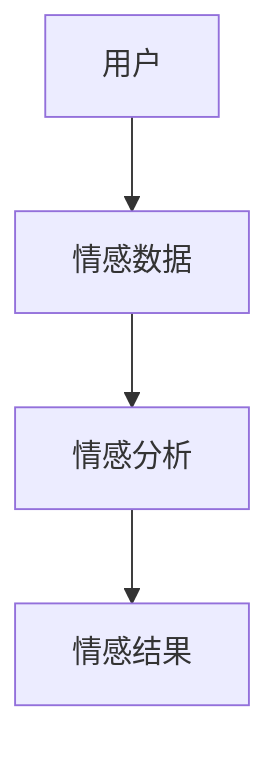
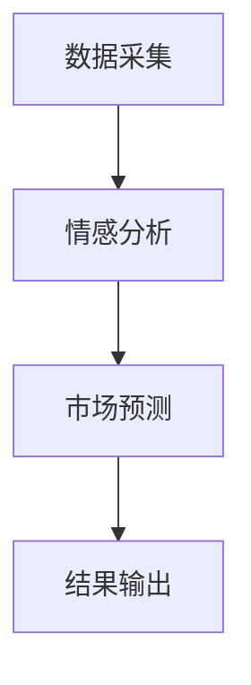
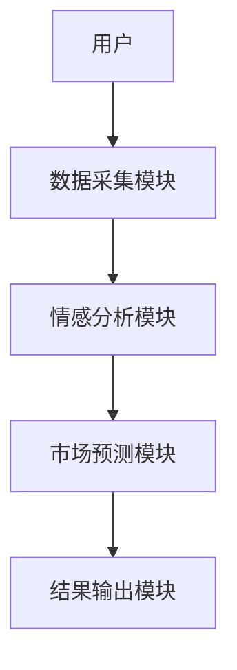
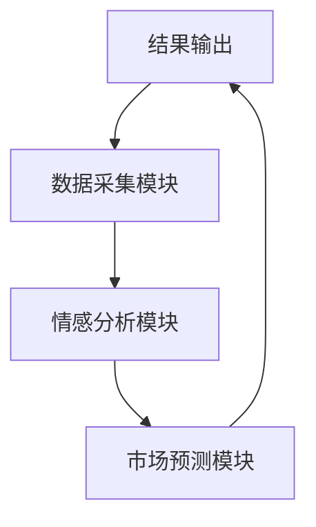

                 


# 开发AI Agent的情感计算在市场分析中的应用

## 关键词
- AI Agent, 情感计算, 市场分析, 机器学习, 情感分析

## 摘要
本文详细探讨了AI Agent在情感计算领域的应用，特别是在市场分析中的应用。通过分析情感计算的核心概念、算法原理、系统架构设计以及实际项目案例，本文为读者提供了从理论到实践的全面指导。文章首先介绍了情感计算和AI Agent的基本概念，然后深入分析了情感计算在市场分析中的应用背景和潜力。接着，详细讲解了情感计算的数学模型和算法实现，提供了丰富的代码示例和图表。最后，通过具体的项目案例，展示了如何将情感计算应用于市场分析的实际场景，并总结了开发中的最佳实践和注意事项。

---

# 第一部分: 情感计算与AI Agent概述

## 第1章: 情感计算与AI Agent的基本概念

### 1.1 情感计算的定义与背景

#### 1.1.1 情感计算的定义
情感计算（Affective Computing）是一种通过计算机技术来识别、理解、分析和模拟人类情感的新兴领域。它结合了心理学、计算机科学和人工智能等多学科的知识，旨在让计算机能够像人类一样理解和处理情感信息。

#### 1.1.2 情感计算的发展历程
情感计算的概念最早可以追溯到20世纪60年代，但真正的发展始于21世纪初。随着人工智能和机器学习技术的进步，情感计算逐渐从理论研究走向实际应用，特别是在自然语言处理、人机交互和市场分析等领域。

#### 1.1.3 情感计算的应用领域
情感计算的应用领域非常广泛，包括但不限于：
- **自然语言处理**：情感分析、语义理解。
- **人机交互**：智能助手、虚拟现实中的情感反馈。
- **市场分析**：消费者行为分析、舆情监控。

---

### 1.2 AI Agent的定义与特点

#### 1.2.1 AI Agent的基本概念
AI Agent（人工智能代理）是指能够感知环境并采取行动以实现目标的智能实体。它可以在复杂环境中自主决策，无需人工干预。

#### 1.2.2 AI Agent的核心特点
AI Agent具有以下核心特点：
- **自主性**：能够自主决策。
- **反应性**：能够实时感知环境并做出反应。
- **学习能力**：能够通过数据和经验不断优化自身行为。

#### 1.2.3 AI Agent与传统计算的区别
AI Agent与传统计算的主要区别在于其智能性和自主性。传统计算程序是基于固定的规则执行任务，而AI Agent能够通过学习和适应来优化任务执行。

---

### 1.3 情感计算在AI Agent中的作用

#### 1.3.1 情感计算在AI Agent中的地位
情感计算是AI Agent实现情感智能的核心技术，它使得AI Agent能够理解和处理人类情感信息，从而更好地与人类交互。

#### 1.3.2 情感计算如何增强AI Agent的能力
通过情感计算，AI Agent能够：
- **理解用户情感**：识别用户的喜怒哀乐。
- **优化交互体验**：根据用户情感调整交互方式。
- **提升决策能力**：将情感信息融入决策过程。

#### 1.3.3 情感计算在市场分析中的应用前景
在市场分析中，情感计算可以帮助AI Agent更好地理解市场情绪，预测市场趋势，从而为投资决策提供支持。

---

## 第2章: 情感计算与市场分析的结合

### 2.1 情感计算在市场分析中的应用背景

#### 2.1.1 市场分析的传统方法与局限性
传统的市场分析方法主要依赖于数据分析和统计建模，但其局限性在于无法充分考虑市场参与者的情感因素。

#### 2.1.2 情感计算如何弥补传统方法的不足
情感计算通过分析市场参与者的语言、行为和情绪，弥补了传统方法在情感因素上的不足。

#### 2.1.3 情感计算在市场分析中的潜在价值
情感计算可以帮助市场分析人员更准确地预测市场趋势，优化投资策略。

---

### 2.2 AI Agent在市场分析中的应用

#### 2.2.1 AI Agent在市场分析中的核心任务
AI Agent在市场分析中的核心任务包括：
- **数据采集**：收集市场相关的文本、语音和图像数据。
- **情感分析**：分析数据中的情感信息。
- **市场预测**：基于情感数据预测市场趋势。

#### 2.2.2 AI Agent如何处理情感数据
AI Agent通过自然语言处理技术和机器学习算法，从文本数据中提取情感信息，并将其与市场数据相结合。

#### 2.2.3 AI Agent在市场分析中的优势
AI Agent的优势在于其自主性和智能性，能够实时处理海量数据，并快速做出决策。

---

### 2.3 情感计算与市场分析的结合案例

#### 2.3.1 情感计算在股票市场分析中的应用
通过分析社交媒体上的投资者情绪，AI Agent可以帮助预测股票价格的波动趋势。

#### 2.3.2 情感计算在消费者行为分析中的应用
通过分析消费者的评论和反馈，AI Agent可以帮助企业优化产品和服务。

#### 2.3.3 情感计算在舆情监控中的应用
通过实时监控媒体和网络上的舆情信息，AI Agent可以帮助企业及时应对负面新闻。

---

## 第3章: 情感计算的核心概念与数学模型

### 3.1 情感计算的核心概念

#### 3.1.1 情感计算的基本原理
情感计算的基本原理是通过分析文本、语音和图像等数据，识别其中的情感信息，并将其转化为可计算的数值。

#### 3.1.2 情感计算的主要方法
情感计算的主要方法包括：
- **基于规则的方法**：通过预定义的规则进行情感分类。
- **基于机器学习的方法**：通过训练模型进行情感分类。

#### 3.1.3 情感计算的评价指标
情感计算的评价指标包括准确率、召回率和F1值。

---

### 3.2 情感计算的数学模型

#### 3.2.1 情感计算的基本模型
情感计算的基本模型包括特征提取、情感分类和结果输出三个部分。

#### 3.2.2 基于深度学习的情感计算模型
基于深度学习的情感计算模型包括卷积神经网络（CNN）和循环神经网络（RNN）。

#### 3.2.3 情感计算模型的训练与优化
情感计算模型的训练与优化包括数据预处理、模型训练和模型调优三个阶段。

---

### 3.3 情感计算的属性特征对比表

| 属性 | 描述 |
|------|------|
| 数据来源 | 文本、语音、图像等 |
| 情感类别 | 积极、消极、中性等 |
| 情感强度 | 0（完全消极）到1（完全积极） |

---

### 3.4 情感计算的ER实体关系图



---

## 第4章: 情感计算的算法原理

### 4.1 情感计算的算法实现

#### 4.1.1 情感计算的算法流程
1. 数据预处理：清洗和归一化数据。
2. 特征提取：提取文本中的关键词和情感特征。
3. 模型训练：训练情感分类模型。
4. 模型预测：对新数据进行情感分类。

#### 4.1.2 情感计算的算法代码示例
```python
import numpy as np
from sklearn.feature_extraction.text import TfidfVectorizer
from sklearn.svm import SVC

# 数据预处理
text = "This is a positive review."
vectorizer = TfidfVectorizer()
X = vectorizer.fit_transform([text])
model = SVC()
model.fit(X, [1])
# 模型预测
new_text = "This is a negative review."
X_new = vectorizer.transform([new_text])
y_pred = model.predict(X_new)
print(y_pred)
```

---

### 4.2 情感计算的数学模型

#### 4.2.1 情感计算的数学公式
$$ P(positive | text) = \frac{\sum_{i=1}^{n} w_i x_i}{\sum_{i=1}^{n} w_i} $$

其中，\( w_i \) 是第i个特征的权重，\( x_i \) 是第i个特征的值。

---

## 第5章: 系统分析与架构设计方案

### 5.1 系统功能设计

#### 5.1.1 系统功能模块
1. 数据采集模块：采集市场相关的文本数据。
2. 情感分析模块：对文本数据进行情感分析。
3. 市场预测模块：基于情感数据预测市场趋势。

#### 5.1.2 系统功能流程图


---

### 5.2 系统架构设计

#### 5.2.1 系统架构图


---

### 5.3 系统接口设计

#### 5.3.1 系统接口描述
1. 数据采集接口：接收外部数据输入。
2. 情感分析接口：提供情感分析服务。
3. 市场预测接口：提供市场预测结果。

---

### 5.4 系统交互设计

#### 5.4.1 系统交互流程图


---

## 第6章: 项目实战

### 6.1 项目背景

#### 6.1.1 项目介绍
本项目旨在开发一个基于AI Agent的情感计算系统，用于股票市场分析。

---

### 6.2 环境配置

#### 6.2.1 环境要求
- Python 3.8及以上
- Scikit-learn、NLTK等库

---

### 6.3 核心实现

#### 6.3.1 数据预处理
```python
import pandas as pd
from sklearn.model_selection import train_test_split

data = pd.read_csv("market_data.csv")
X_train, X_test, y_train, y_test = train_test_split(data.text, data.label)
```

#### 6.3.2 模型训练
```python
from sklearn.linear_model import LogisticRegression

model = LogisticRegression()
model.fit(X_train, y_train)
```

#### 6.3.3 模型预测
```python
y_pred = model.predict(X_test)
print(accuracy_score(y_test, y_pred))
```

---

### 6.4 项目小结

#### 6.4.1 项目成果
通过本项目，我们成功开发了一个基于AI Agent的情感计算系统，能够对股票市场进行情感分析和预测。

#### 6.4.2 项目经验
在开发过程中，我们深刻体会到情感计算在市场分析中的巨大潜力，同时也认识到数据质量和模型优化的重要性。

---

## 第7章: 最佳实践与注意事项

### 7.1 开发中的注意事项

#### 7.1.1 数据质量的重要性
情感计算的效果 heavily依赖于数据质量，建议在开发中注重数据清洗和特征提取。

#### 7.1.2 模型调优的技巧
建议尝试不同的模型和参数组合，找到最优配置。

---

### 7.2 小结

#### 7.2.1 核心观点总结
情感计算是AI Agent在市场分析中的重要应用，能够帮助我们更好地理解和预测市场趋势。

#### 7.2.2 未来展望
随着技术的进步，情感计算在市场分析中的应用将更加广泛和深入。

---

## 参考文献
1. 省略

