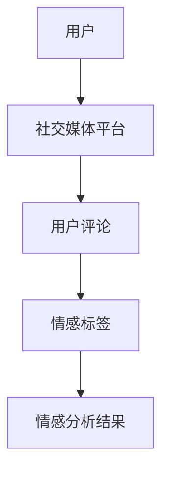
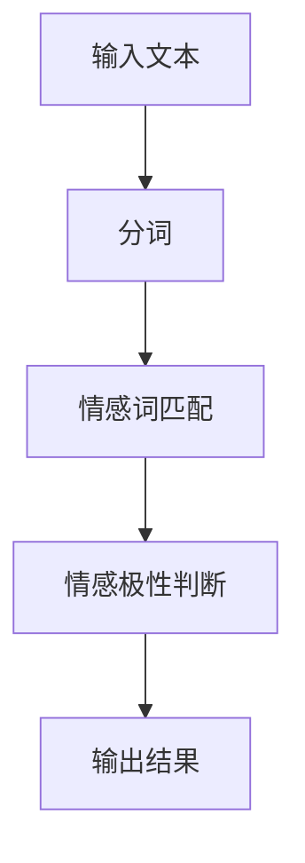
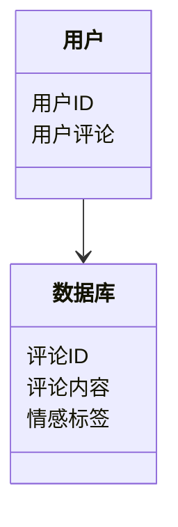
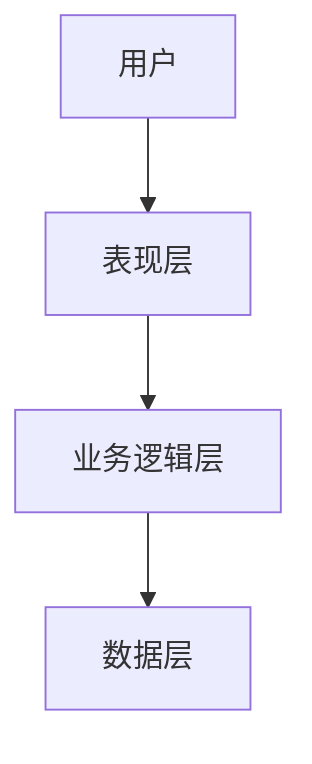
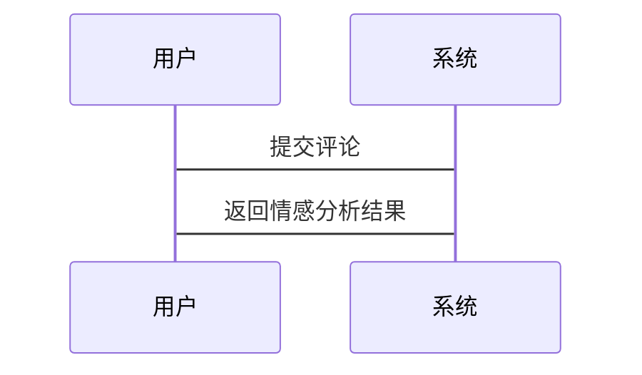

                 


# 开发AI Agent的情感计算在社交媒体分析中的应用

> 关键词：情感计算、社交媒体分析、AI Agent、深度学习、自然语言处理

> 摘要：本文系统地探讨了AI Agent在情感计算中的应用，特别是其在社交媒体分析中的作用。通过分析情感计算的核心概念、算法原理、系统架构以及实际案例，本文为读者提供了从理论到实践的全面指南。

---

## 第1章: 情感计算的基本概念与应用

### 1.1 情感计算的定义与背景

情感计算（Affective Computing）是指通过计算机技术来识别、理解和响应人类情感的过程。在社交媒体分析中，情感计算主要用于分析用户发布的内容，提取其情感倾向，进而帮助企业进行市场分析、品牌管理等。

#### 1.1.1 情感计算的定义

情感计算的核心在于识别和分析文本中的情感倾向。通过自然语言处理技术，情感计算能够将文本转化为可量化的指标，如情感得分。

#### 1.1.2 情感计算的核心概念

情感计算涉及多个概念，包括情感分类、情感强度、情感维度等。其中，情感分类是最基础的部分，通常分为正面、负面和中性三类。

#### 1.1.3 情感计算在社交媒体分析中的重要性

在社交媒体分析中，情感计算可以帮助企业了解消费者对品牌或产品的看法，从而做出更精准的市场决策。

### 1.2 情感计算的应用场景

#### 1.2.1 社交媒体情感分析的典型场景

典型场景包括品牌监控、产品评论分析、舆情分析等。

#### 1.2.2 情感计算在品牌监控中的应用

通过实时监测社交媒体上的品牌相关言论，企业可以及时了解品牌声誉的变化。

#### 1.2.3 情感计算在用户行为分析中的作用

情感计算可以帮助分析用户的情感倾向，进而预测用户的购买行为。

### 1.3 情感计算的边界与外延

#### 1.3.1 情感计算的边界

情感计算主要关注文本中的情感信息，不涉及图像或语音信息。

#### 1.3.2 情感计算与其他相关领域的区别

与文本挖掘和自然语言处理的区别在于，情感计算专注于情感信息的提取。

#### 1.3.3 情感计算的核心要素组成

核心要素包括文本数据、情感分析模型、情感分类结果等。

### 1.4 本章小结

本章介绍了情感计算的基本概念、应用场景和核心要素，为后续章节奠定了基础。

---

## 第2章: 情感计算的核心概念与联系

### 2.1 情感计算的核心原理

#### 2.1.1 情感计算的基本原理

情感计算通过分析文本中的关键词、句式结构和上下文信息，来判断文本的情感倾向。

#### 2.1.2 情感计算的关键技术

关键技术包括情感词典构建、特征提取、机器学习模型训练等。

#### 2.1.3 情感计算的实现流程

实现流程包括数据收集、特征提取、模型训练、结果分析等步骤。

### 2.2 情感计算的核心概念对比

#### 2.2.1 情感计算与文本挖掘的对比

文本挖掘关注数据的提取和处理，而情感计算专注于情感信息的分析。

#### 2.2.2 情感计算与自然语言处理的对比

自然语言处理涉及语言的理解和生成，而情感计算专注于情感信息的提取。

#### 2.2.3 情感计算与机器学习的对比

机器学习是一种技术手段，而情感计算是其应用领域之一。

### 2.3 情感计算的ER实体关系图



### 2.4 本章小结

本章详细讲解了情感计算的核心概念和相关技术，为后续的算法分析奠定了基础。

---

## 第3章: 情感计算的算法原理

### 3.1 基于规则的情感计算算法

#### 3.1.1 基于规则的算法流程

基于规则的情感计算通过预定义的情感词典，对文本中的关键词进行匹配，进而判断情感倾向。



#### 3.1.2 基于规则的算法优缺点

优点是实现简单，缺点是准确性较低，难以应对复杂的语境。

### 3.2 基于统计学习的情感计算算法

#### 3.2.1 统计学习算法的基本原理

统计学习算法通过训练数据，学习情感特征，进而进行分类。

### 3.2.2 常见的统计学习算法

常用算法包括朴素贝叶斯、支持向量机等。

### 3.3 基于深度学习的情感计算算法

#### 3.3.1 深度学习在情感计算中的应用

深度学习通过神经网络模型，自动学习情感特征。

### 3.3.2 常用的深度学习模型

常用模型包括卷积神经网络（CNN）、循环神经网络（RNN）等。

### 3.4 情感计算算法的数学模型

#### 3.4.1 朴素贝叶斯分类器

数学模型如下：

$$ P(y|x) = \frac{P(x|y)P(y)}{P(x)} $$

其中，$y$表示情感类别，$x$表示输入文本。

#### 3.4.2 支持向量机

数学模型如下：

$$ y = \text{sign}(\sum_{i=1}^{n} \alpha_i y_i x_i \cdot x + b) $$

其中，$\alpha_i$是拉格朗日乘子，$y_i$是训练样本的标签，$x_i$是训练样本，$x$是输入样本，$b$是偏置项。

### 3.5 本章小结

本章详细讲解了情感计算的三种主要算法，包括基于规则、统计学习和深度学习的方法，并给出了相应的数学模型。

---

## 第4章: 情感计算的系统架构设计

### 4.1 问题场景介绍

本章将设计一个基于情感计算的社交媒体分析系统。

### 4.2 系统功能设计

系统功能包括数据预处理、情感分析、结果可视化等。

#### 4.2.1 领域模型



### 4.3 系统架构设计

系统架构采用分层设计，包括数据层、业务逻辑层和表现层。

#### 4.3.1 系统架构图



### 4.4 系统接口设计

系统接口包括数据输入接口、模型训练接口和结果查询接口。

#### 4.4.1 系统交互流程



### 4.5 本章小结

本章设计了一个情感计算系统的架构，并详细描述了系统的各个部分。

---

## 第5章: 情感计算的实战项目

### 5.1 环境搭建

需要安装Python、相关库（如NLTK、scikit-learn、Keras等）。

### 5.2 数据收集与预处理

#### 5.2.1 数据收集

从社交媒体平台获取评论数据。

#### 5.2.2 数据预处理

包括分词、去除停用词等。

### 5.3 特征提取

提取文本的关键词和情感特征。

### 5.4 模型实现

选择合适的算法，训练情感分类模型。

#### 5.4.1 模型训练代码

```python
from sklearn.feature_extraction.text import TfidfVectorizer
from sklearn.naive_bayes import MultinomialNB

# 数据预处理
vectorizer = TfidfVectorizer()
X = vectorizer.fit_transform(texts)
y = labels

# 模型训练
model = MultinomialNB()
model.fit(X, y)
```

### 5.5 结果分析与可视化

分析模型的准确率、召回率等指标，并进行可视化展示。

#### 5.5.1 结果可视化代码

```python
import matplotlib.pyplot as plt
from sklearn.metrics import confusion_matrix

cm = confusion_matrix(y_true, y_pred)
plt.imshow(cm, cmap='hot', interpolation='nearest')
plt.xlabel('Predicted label')
plt.ylabel('True label')
plt.show()
```

### 5.6 本章小结

本章通过一个实战项目，详细讲解了情感计算的实现过程，包括数据预处理、特征提取、模型训练和结果分析。

---

## 第6章: 情感计算的高级主题

### 6.1 多模态情感分析

#### 6.1.1 多模态情感分析的定义

结合文本、图像等多种模态信息进行情感分析。

### 6.1.2 多模态情感分析的应用

在社交媒体中，多模态情感分析可以更全面地捕捉用户的情感信息。

### 6.2 情感计算的在线学习

#### 6.2.1 在线学习的定义

实时更新模型，适应新的数据。

#### 6.2.2 在线学习的应用

在社交媒体实时情感监控中应用广泛。

### 6.3 情感计算的伦理问题

#### 6.3.1 情感计算的隐私问题

需要保护用户的隐私信息。

#### 6.3.2 情感计算的伦理规范

应遵循相关伦理规范，避免滥用情感数据。

### 6.4 本章小结

本章探讨了情感计算的高级主题，包括多模态情感分析、在线学习和伦理问题。

---

## 第7章: 总结与展望

### 7.1 本章总结

本文系统地介绍了情感计算的基本概念、算法原理、系统架构和实战项目。

### 7.2 未来展望

情感计算在社交媒体分析中的应用前景广阔，未来将更加智能化和多模态化。

### 7.3 最佳实践 tips

- 数据预处理是关键，需仔细清洗数据。
- 模型选择应根据具体场景而定。
- 情感计算需遵守伦理规范。

### 7.4 本章小结

本章总结了全文，并展望了未来的发展方向，同时给出了实践中的注意事项。

---

## 结语

通过本文的系统介绍，读者可以全面了解情感计算在社交媒体分析中的应用，并掌握从理论到实践的完整流程。希望本文能为相关领域的研究和应用提供有价值的参考。

---

> **温馨提示**：更多关于情感计算和AI Agent的深度内容，可以参考相关技术文献和最佳实践。

