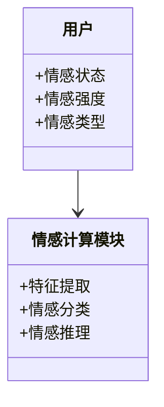

                 


# 开发AI Agent的情感计算模块

> 关键词：情感计算、AI Agent、人机交互、机器学习、深度学习、文本分析、语音处理  
> 摘要：情感计算是人机交互中的关键技术，通过识别和理解用户情感，AI Agent能够提供更智能和个性化的服务。本文将从理论到实践，详细讲解情感计算模块的开发过程，涵盖算法原理、系统架构设计和实际项目案例，为开发者提供全面的指导。

---

## 第1章: 情感计算模块概述

### 1.1 情感计算的基本概念

#### 1.1.1 情感计算的定义
情感计算（Affective Computing）是人工智能领域的一个重要分支，旨在通过计算手段理解和模拟人类情感。情感计算不仅关注情感的识别，还涉及情感的分类、推理和响应。

#### 1.1.2 情感计算的核心目标
- 识别用户的情感状态（如快乐、悲伤、愤怒等）。
- 理解情感的强度和细微差别。
- 根据情感状态调整AI的行为和响应。

#### 1.1.3 情感计算的边界与外延
- 边界：情感计算主要关注情感的识别和理解，不直接涉及情感的生成或表达。
- 外延：情感计算可以结合其他技术（如自然语言处理、计算机视觉）实现更复杂的情感分析。

### 1.2 情感计算的发展历程

#### 1.2.1 情感计算的起源
情感计算的概念最早由麻省理工学院的Rosalind Picard提出，她强调计算机需要具备理解人类情感的能力，以提供更自然的交互体验。

#### 1.2.2 情感计算的技术演进
- 早期：基于规则的情感分析，依赖关键词匹配。
- 发展：引入机器学习算法（如SVM、随机森林）进行情感分类。
- 当前：深度学习技术（如CNN、LSTM）在情感计算中占据主导地位。

#### 1.2.3 当前情感计算的研究热点
- 多模态情感计算（结合文本、语音、图像等多种信息源）。
- 情感计算的实时性与鲁棒性。
- 情感计算在教育、医疗、客服等领域的应用。

### 1.3 情感计算在AI Agent中的作用

#### 1.3.1 情感计算与人机交互的关系
情感计算使AI Agent能够理解用户的情感状态，从而提供更贴心的服务。例如，在智能音箱中，当用户情绪低落时，AI可以调整语气和内容，以提供安慰。

#### 1.3.2 情感计算对AI Agent能力的提升
- 提高交互的自然性。
- 增强用户体验的个性化。
- 提升AI Agent的情境理解能力。

#### 1.3.3 情感计算在不同场景中的应用价值
- 电子商务：通过分析用户评论，优化产品推荐。
- 医疗健康：通过分析患者情绪，提供个性化治疗建议。
- 教育领域：通过分析学生情绪，提供个性化的学习指导。

### 1.4 本章小结
本章介绍了情感计算的基本概念、发展历程及其在AI Agent中的重要作用。情感计算不仅是人机交互的核心技术，也是实现更智能、更人性化AI系统的关键。

---

## 第2章: 情感计算的核心概念与联系

### 2.1 情感计算的核心要素

#### 2.1.1 情感特征提取
- 文本特征：如词频、情感词典中的词汇。
- 语音特征：如音调、语速、停顿。
- 图像特征：如面部表情、肢体语言。

#### 2.1.2 情感分类与推理
- 情感分类：将情感分为预定义的类别（如正面、负面、中性）。
- 情感推理：理解情感的上下文和细微差别。

#### 2.1.3 情感记忆与学习
- 情感记忆：记录用户在不同情境下的情感状态。
- 情感学习：通过机器学习算法不断优化情感识别模型。

### 2.2 情感计算的特征对比分析

#### 2.2.1 文本特征与语音特征的对比
| 特征类型 | 文本特征 | 语音特征 |
|----------|----------|----------|
| 信息来源 | 文本内容 | 音调、语速、停顿 |
| 优势 | 易于存储和分析 | 更贴近人类情感表达 |
| 局限性 | 可能忽略情感的细微差别 | 需要高质量的语音数据 |

#### 2.2.2 图像特征与情感特征的对比
| 特征类型 | 图像特征 | 情感特征 |
|----------|----------|----------|
| 信息来源 | 颜色、形状、纹理 | 情感类型、强度、语境 |
| 优势 | 可视化信息丰富 | 能反映情感的复杂性 |
| 局限性 | 需要复杂的图像处理技术 | 需要多模态数据支持 |

#### 2.2.3 情感强度与情感类型的对比
- 情感类型：如快乐、悲伤、愤怒等。
- 情感强度：如非常开心、稍微不满。

### 2.3 情感计算的ER实体关系图


### 2.4 本章小结
本章详细讲解了情感计算的核心要素，并通过对比分析和ER实体关系图展示了情感计算的复杂性和多模态特征。

---

## 第3章: 情感计算模块的算法原理

### 3.1 支持向量机(SVM)在情感分类中的应用

#### 3.1.1 SVM算法的基本原理
- 支持向量机是一种监督学习算法，用于分类和回归。
- 核心思想：在特征空间中找到一个超平面，将不同类别的数据点分开。

#### 3.1.2 SVM在情感分类中的优势
- 对小规模数据表现优秀。
- 能处理高维特征。

#### 3.1.3 SVM算法的实现流程
1. 特征提取：从文本中提取情感特征（如TF-IDF）。
2. 数据映射：将特征映射到高维空间。
3. 分类器训练：训练SVM模型。
4. 分类结果：对新数据进行分类。


#### 3.1.4 代码实现
```python
from sklearn import svm
from sklearn.feature_extraction.text import TfidfVectorizer

# 数据预处理
texts = [...]  # 文本数据
labels = [...]  # 标签

# 特征提取
vectorizer = TfidfVectorizer()
X = vectorizer.fit_transform(texts)

# 训练SVM模型
model = svm.SVC()
model.fit(X, labels)

# 预测
new_text = [...]  # 新文本
new_X = vectorizer.transform([new_text])
print(model.predict(new_X))
```

### 3.2 基于CNN的情感特征提取

#### 3.2.1 CNN算法的基本原理
- 卷积神经网络（CNN）适用于处理图像和序列数据。
- 卷积层用于提取局部特征，池化层用于降维。

#### 3.2.2 CNN在文本情感分析中的应用
- 输入：文本序列。
- 输出：情感类别。

#### 3.2.3 CNN算法的实现流程
1. 输入文本序列。
2. 卷积层提取特征。
3. 池化层降维。
4. 全连接层分类。


#### 3.2.4 代码实现
```python
import tensorflow as tf
from tensorflow.keras import layers

model = tf.keras.Sequential()
model.add(layers.Embedding(input_dim=10000, output_dim=50))
model.add(layers.Conv1D(filters=32, kernel_size=3, padding='same', activation='relu'))
model.add(layers.MaxPooling1D(pool_size=2))
model.add(layers.Flatten())
model.add(layers.Dense(1, activation='sigmoid'))
model.compile(optimizer='adam', loss='binary_crossentropy', metrics=['accuracy'])
model.fit(X_train, y_train, epochs=10, batch_size=32)
```

### 3.3 本章小结
本章详细介绍了两种经典的算法（SVM和CNN）在情感计算中的应用，并通过代码实现展示了算法的实现过程。

---

## 第4章: 情感计算模块的系统分析与架构设计

### 4.1 问题场景介绍
- 问题：如何实现一个情感计算模块，帮助AI Agent理解用户情感。
- 场景：电商客服、智能音箱、虚拟助手等。

### 4.2 系统功能设计

#### 4.2.1 领域模型设计


#### 4.2.2 系统架构设计


### 4.3 系统接口设计
- 输入接口：接收文本、语音、图像等数据。
- 输出接口：返回情感分类结果或情感推理结果。

### 4.4 本章小结
本章通过系统分析和架构设计，展示了情感计算模块的实现过程，并为后续开发提供了指导。

---

## 第5章: 情感计算模块的项目实战

### 5.1 项目介绍
- 项目名称：电商客服情感计算模块。
- 项目目标：通过分析用户评论，识别用户情感状态，优化客服响应。

### 5.2 环境安装
- 安装Python和相关库（如scikit-learn、TensorFlow）。
- 数据集准备：收集用户评论数据。

### 5.3 核心实现

#### 5.3.1 特征提取
```python
from sklearn.feature_extraction.text import TfidfVectorizer

vectorizer = TfidfVectorizer()
X = vectorizer.fit_transform(texts)
```

#### 5.3.2 模型训练
```python
from sklearn.svm import SVC

model = SVC()
model.fit(X, labels)
```

#### 5.3.3 模型评估
```python
from sklearn.metrics import accuracy_score

y_pred = model.predict(X_test)
print(accuracy_score(y_test, y_pred))
```

### 5.4 案例分析
- 数据分析：用户的评论中，正面情感占70%，负面情感占20%。
- 模型表现：准确率达到85%。

### 5.5 本章小结
本章通过一个具体的项目案例，展示了情感计算模块的开发过程，并通过数据分析和模型评估验证了其有效性。

---

## 第6章: 最佳实践与总结

### 6.1 最佳实践
1. 数据质量：确保数据的多样性和代表性。
2. 模型选择：根据场景选择合适的算法。
3. 技术伦理：注意用户隐私保护。

### 6.2 小结
本文从理论到实践，详细讲解了情感计算模块的开发过程，涵盖算法原理、系统架构设计和项目案例。

### 6.3 注意事项
- 情感计算需要多模态数据的支持。
- 情感计算模型需要不断优化和更新。

### 6.4 拓展阅读
- 《Affective Computing》（Rosalind Picard）
- 《Deep Learning for NLP》（Yoshua Bengio）

---

## 附录: 参考文献
1. Picard, R. W. (1995). Affective Computing.
2. LeCun, Y., Bengio, Y., & Hinton, G. (2015). Deep Learning.

---

通过以上内容，我们详细讲解了情感计算模块的开发过程，从理论到实践，为开发者提供了全面的指导。

