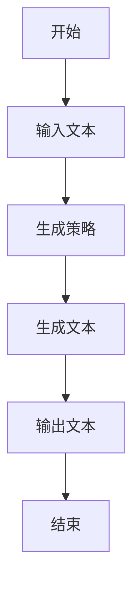
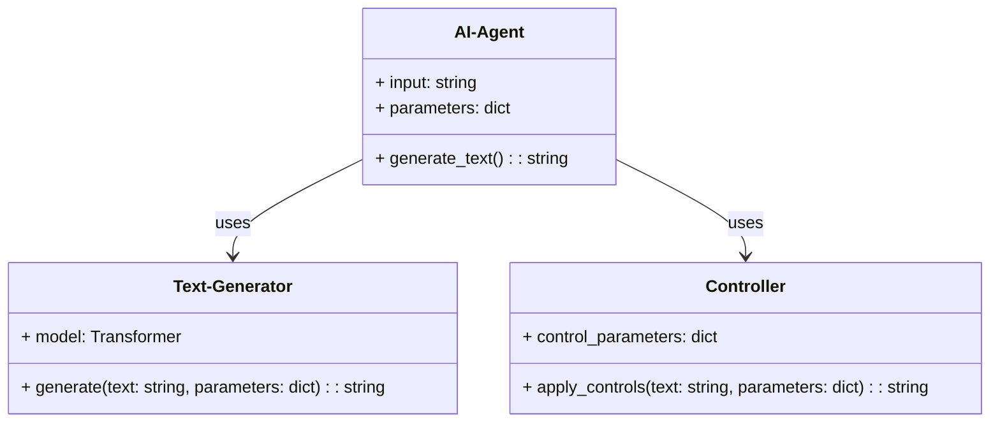
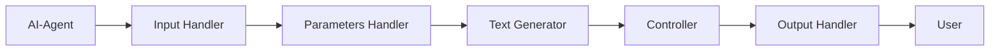
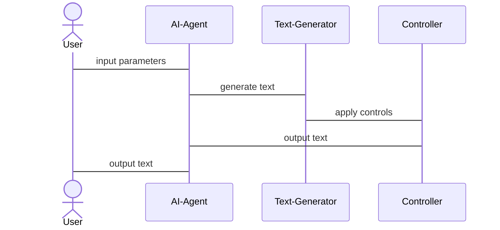

                 


# 开发AI Agent的文本生成控制能力

## 关键词：AI Agent, 文本生成, 控制能力, 算法原理, 系统架构, 项目实战

## 摘要：  
本文深入探讨了AI Agent在文本生成控制能力开发中的核心概念、算法原理、系统架构设计及实际项目实现。从背景介绍到核心概念，从算法实现到系统架构，从项目实战到最佳实践，全面解析了AI Agent文本生成控制能力的开发过程，为开发者提供了理论与实践相结合的指导。

---

# 第1章 AI Agent与文本生成控制能力概述

## 1.1 问题背景与问题描述

### 1.1.1 当前AI Agent的发展现状  
AI Agent（人工智能代理）是指能够感知环境并采取行动以实现目标的智能体。随着自然语言处理技术的快速发展，AI Agent在文本生成领域展现出巨大潜力，但其生成结果的可控性仍需进一步提升。

### 1.1.2 文本生成控制能力的重要性  
文本生成控制能力是指通过特定的输入参数或策略，对生成文本的内容、语气、风格等进行精准控制的能力。这种能力在实际应用中至关重要，例如在客服系统中生成礼貌且准确的回复，或在营销领域生成符合品牌调性的文案。

### 1.1.3 问题解决的必要性与目标  
当前AI Agent的文本生成能力往往缺乏足够的控制能力，生成结果可能偏离预期目标或不符合特定场景的需求。因此，开发具备强大文本生成控制能力的AI Agent是当前研究的热点和必要方向。

### 1.1.4 核心问题与边界  
- **核心问题**：如何实现对生成文本的多维度控制，例如内容准确性、语气一致性、风格多样性等。  
- **边界与外延**：本文主要关注文本生成的控制能力，不涉及AI Agent的其他功能，如决策能力或学习能力。

## 1.2 核心概念与边界

### 1.2.1 AI Agent的基本概念  
AI Agent是一种能够感知环境并采取行动以实现目标的智能体，通常具备以下特点：  
1. **自主性**：能够自主决策。  
2. **反应性**：能够实时感知并响应环境变化。  
3. **目标导向性**：具备明确的目标导向能力。  

### 1.2.2 文本生成控制能力的定义  
文本生成控制能力是指通过特定的输入参数或策略，对生成文本的内容、语气、风格等进行精准控制的能力。

### 1.2.3 问题的边界与外延  
- **边界**：本文主要关注AI Agent的文本生成控制能力，不涉及其他功能，如图像生成或语音识别。  
- **外延**：文本生成控制能力可以与其他技术结合，例如结合情感分析技术，进一步提升生成文本的情感一致性。

---

# 第2章 核心概念与联系

## 2.1 生成式AI Agent的基本原理

### 2.1.1 生成式AI的原理概述  
生成式AI（Generative AI）是一种能够生成新内容的AI技术，通常基于深度学习模型，如Transformer架构。生成式AI的核心在于其生成能力，能够根据输入生成符合上下文的文本。

### 2.1.2 AI Agent的生成机制  
AI Agent的生成机制包括以下步骤：  
1. **输入处理**：接收用户的输入或环境反馈。  
2. **生成策略**：根据输入生成生成策略或参数。  
3. **文本生成**：基于生成策略生成文本。  
4. **输出反馈**：将生成的文本输出并反馈给用户或系统。

### 2.1.3 文本生成控制能力的实现原理  
文本生成控制能力的实现依赖于以下几个关键因素：  
1. **生成模型**：如GPT、BERT等。  
2. **控制参数**：如温度（temperature）、重复惩罚（repetition penalty）等。  
3. **后处理策略**：如关键词过滤、句式调整等。

## 2.2 核心概念的属性特征对比

### 2.2.1 核心概念的属性对比  
下表展示了生成式AI Agent与传统AI Agent在文本生成控制能力方面的属性对比：

| **属性**          | **生成式AI Agent**       | **传统AI Agent**         |
|--------------------|--------------------------|--------------------------|
| 生成能力          | 强，支持自由生成文本     | 弱，通常依赖预设规则     |
| 控制能力          | 强，支持多维度控制       | 弱，控制能力有限         |
| 应用场景          | 聊天机器人、内容生成     | 任务执行、数据处理       |
| 模型复杂度        | 高，通常基于深度学习模型 | 较低，基于规则引擎或简单模型 |

### 2.2.2 ER实体关系图架构  
以下是生成式AI Agent的核心概念实体关系图：

```mermaid
er
actor(AI Agent) -|> action:生成文本
actor -|> parameter:控制参数
action --> text_output:生成文本
parameter --> action
```

---

# 第3章 算法原理与数学模型

## 3.1 文本生成算法的原理

### 3.1.1 Transformer架构的原理  
Transformer是一种基于注意力机制的深度学习模型，由编码器和解码器组成。编码器负责将输入文本转换为向量表示，解码器负责根据编码器的输出生成目标文本。

### 3.1.2 注意力机制的作用  
注意力机制通过计算输入序列中每个位置的重要性权重，帮助模型关注关键信息，从而生成更准确的文本。

### 3.1.3 梯度下降法的优化  
梯度下降法是一种常用的优化算法，用于最小化模型的损失函数，从而提升生成文本的质量。

## 3.2 数学模型与公式

### 3.2.1 Transformer的数学模型  
Transformer的编码器由多层自注意力机制和前馈网络组成，其数学表达式如下：

$$  
\text{Self-Attention}(Q, K, V) = \text{softmax}\left(\frac{QK^T}{\sqrt{d_k}}\right)V  
$$

其中，$Q$、$K$、$V$分别为查询（Query）、键（Key）、值（Value）向量，$d_k$为向量的维度。

### 3.2.2 注意力机制的公式推导  
注意力机制的核心公式如下：

$$  
\text{Attention}(Q, K, V) = \sum_{i=1}^{n} \alpha_i V_i  
$$

其中，$\alpha_i$为第$i$个位置的注意力权重，$V_i$为第$i$个位置的值向量。

### 3.2.3 梯度下降法的数学表达  
梯度下降法的优化目标是最小化损失函数$L$，其更新公式为：

$$  
\theta_{t+1} = \theta_t - \eta \frac{\partial L}{\partial \theta_t}  
$$

其中，$\theta$为模型参数，$\eta$为学习率。

## 3.3 算法流程图

### 3.3.1 文本生成算法的流程图  
以下是文本生成算法的流程图：



---

# 第4章 系统分析与架构设计

## 4.1 问题场景介绍

### 4.1.1 项目介绍  
本项目旨在开发一个具备强大文本生成控制能力的AI Agent，能够根据输入参数生成符合预期的文本。

### 4.1.2 系统功能设计  
系统功能包括：  
1. **输入处理**：接收用户的输入参数。  
2. **生成策略生成**：根据输入参数生成生成策略。  
3. **文本生成**：基于生成策略生成文本。  
4. **输出反馈**：将生成的文本输出并反馈给用户。

## 4.2 系统架构设计

### 4.2.1 领域模型设计  
以下是领域模型的类图：



### 4.2.2 系统架构设计  
以下是系统的架构图：



### 4.2.3 系统接口设计  
系统接口包括：  
1. `generate_text(text: str, parameters: dict) -> str`  
2. `apply_controls(text: str, parameters: dict) -> str`

### 4.2.4 系统交互流程图  
以下是系统的交互流程图：



---

# 第5章 项目实战

## 5.1 环境安装

### 5.1.1 安装Python环境  
建议使用Python 3.8及以上版本。

### 5.1.2 安装依赖库  
安装以下依赖库：

```bash
pip install transformers torch
```

## 5.2 系统核心实现

### 5.2.1 AI-Agent实现  
以下是AI-Agent的核心实现代码：

```python
class AI-Agent:
    def __init__(self):
        self.model = AutoModelForCausalLM.from_pretrained("gpt2")
        self.tokenizer = AutoTokenizer.from_pretrained("gpt2")

    def generate_text(self, input_text, parameters):
        inputs = self.tokenizer(input_text, return_tensors="pt")
        outputs = self.model.generate(
            inputs.input_ids,
            max_length=50,
            temperature=parameters.get("temperature", 1.0),
            repetition_penalty=parameters.get("repetition_penalty", 1.0)
        )
        return self.tokenizer.decode(outputs[0], skip_special_tokens=True)
```

### 5.2.2 文本生成器实现  
以下是文本生成器的实现代码：

```python
class TextGenerator:
    def __init__(self, model, tokenizer):
        self.model = model
        self.tokenizer = tokenizer

    def generate(self, text, parameters):
        inputs = self.tokenizer(text, return_tensors="pt")
        outputs = self.model.generate(
            inputs.input_ids,
            max_length=50,
            temperature=parameters.get("temperature", 1.0),
            repetition_penalty=parameters.get("repetition_penalty", 1.0)
        )
        return self.tokenizer.decode(outputs[0], skip_special_tokens=True)
```

### 5.2.3 控制器实现  
以下是控制器的实现代码：

```python
class Controller:
    def __init__(self):
        pass

    def apply_controls(self, text, parameters):
        # 示例：关键词过滤
        filtered_text = text
        for keyword, replacement in parameters.get("keyword_replacements", {}).items():
            filtered_text = filtered_text.replace(keyword, replacement)
        return filtered_text
```

## 5.3 代码应用解读与分析

### 5.3.1 AI-Agent类解读  
AI-Agent类负责接收输入参数并调用文本生成器生成文本。

### 5.3.2 TextGenerator类解读  
TextGenerator类基于预训练模型生成文本，支持温度和重复惩罚参数的控制。

### 5.3.3 Controller类解读  
Controller类负责对生成的文本进行后处理，例如关键词替换。

## 5.4 实际案例分析

### 5.4.1 案例描述  
假设我们希望生成一段符合品牌调性的营销文案，输入参数如下：

```python
input_text = "Our new product launch"
parameters = {
    "temperature": 0.7,
    "repetition_penalty": 1.2,
    "keyword_replacements": {
        "new": "revolutionary",
        "product": "solution"
    }
}
```

### 5.4.2 实现过程  
1. AI-Agent接收输入参数。  
2. TextGenerator根据参数生成文本。  
3. Controller对生成的文本进行关键词替换。  

### 5.4.3 生成结果  
生成的文案如下：

```
Our revolutionary solution launch
```

---

# 第6章 最佳实践与总结

## 6.1 最佳实践 tips

### 6.1.1 参数调优技巧  
- 温度参数：值越大，生成文本的多样性越高，但准确性可能下降。  
- 重复惩罚参数：值越大，生成文本的重复性越低。  

### 6.1.2 模型选择建议  
- 对于生成任务，建议选择GPT系列模型。  
- 对于需要多语言支持的任务，建议选择多语言模型，如Marian。  

## 6.2 小结  
本文从AI Agent的文本生成控制能力的背景介绍到核心概念，从算法原理到系统架构，从项目实战到最佳实践，全面解析了AI Agent文本生成控制能力的开发过程。

## 6.3 注意事项  
- 在实际应用中，需注意生成文本的合法性和合规性。  
- 对于高风险场景，建议结合人工审核机制。  

## 6.4 拓展阅读  
- 《Attention Is All You Need》（维基百科）  
- 《Generating Long Sequences with Transformer》（arXiv论文）  

---

# 结语

开发AI Agent的文本生成控制能力是一项复杂的系统工程，涉及多方面的知识和技能。通过本文的系统讲解，读者可以全面掌握AI Agent文本生成控制能力的核心概念、算法原理、系统架构及实际项目实现。希望本文能为开发者提供有价值的参考和启发，推动AI Agent技术的发展与应用。

