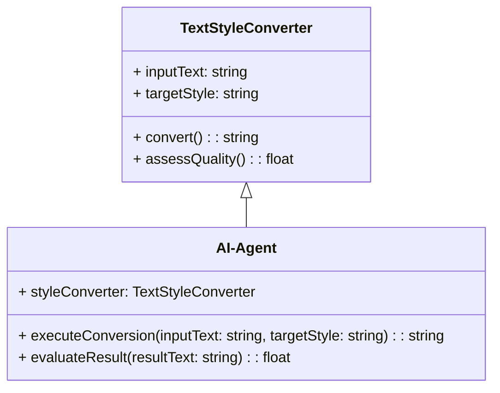
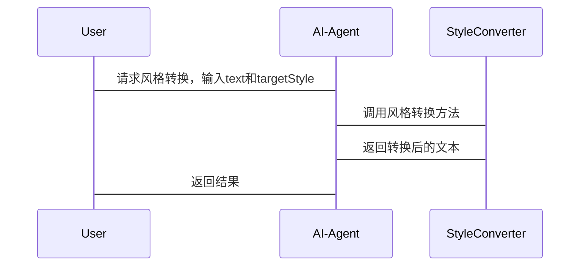

                 


# 开发AI Agent的文本风格转换能力

## 关键词：AI Agent、文本风格转换、自然语言处理、机器学习、生成式AI

## 摘要：本文将详细介绍如何开发具备文本风格转换能力的AI Agent。从基础概念到算法原理，再到系统架构设计和项目实战，全面解析文本风格转换的关键技术。通过具体案例分析，帮助读者掌握AI Agent在文本风格转换中的应用，并提供实际开发中的最佳实践和注意事项。

---

# 第一部分: AI Agent与文本风格转换概述

## 第1章: AI Agent与文本风格转换的背景介绍

### 1.1 AI Agent的基本概念

#### 1.1.1 AI Agent的定义
AI Agent（人工智能代理）是指能够感知环境、自主决策并执行任务的智能实体。它可以是一个软件程序、一个机器人，甚至是嵌入在设备中的智能模块。AI Agent的核心目标是通过与环境的交互，实现特定的目标。

#### 1.1.2 AI Agent的核心功能
AI Agent具有以下几个核心功能：
1. **感知环境**：通过传感器或其他输入方式获取环境信息。
2. **自主决策**：基于获取的信息，运用算法和知识库进行推理和决策。
3. **执行任务**：根据决策结果，通过执行器或输出模块完成任务。
4. **学习与适应**：通过机器学习算法不断优化自身的性能和决策能力。

#### 1.1.3 AI Agent与传统软件的区别
AI Agent与传统软件的主要区别在于：
- **自主性**：AI Agent能够自主决策，而传统软件通常需要明确的输入和指令。
- **学习能力**：AI Agent能够通过数据和经验进行学习和优化，而传统软件通常依赖固定的规则。
- **适应性**：AI Agent能够根据环境变化调整自身行为，而传统软件则缺乏这种灵活性。

### 1.2 文本风格转换的背景与意义

#### 1.2.1 文本风格转换的定义
文本风格转换是指将一段文本从一种风格或语气转换为另一种风格或语气的过程。例如，将正式的商务信函转换为更口语化的表达，或将复杂的学术论文简化为通俗易懂的语言。

#### 1.2.2 文本风格转换的应用场景
文本风格转换在多个领域都有广泛的应用，例如：
1. **内容创作**：帮助用户快速生成符合特定风格的文本，如营销文案、社交媒体内容等。
2. **语言翻译**：在多语言翻译中，保持原文的风格和语气。
3. **文本优化**：对已有文本进行风格调整，使其更符合目标读者的阅读习惯。
4. **个性化推荐**：根据用户的偏好，生成个性化的内容。

#### 1.2.3 文本风格转换的重要性
文本风格转换的重要性体现在以下几个方面：
1. **提升用户体验**：通过个性化的内容生成，提高用户的阅读体验和满意度。
2. **提高效率**：自动化生成符合要求的文本，节省时间和成本。
3. **跨语言交流**：在多语言环境中，保持一致的风格和语气，促进有效沟通。

### 1.3 AI Agent与文本风格转换的结合

#### 1.3.1 AI Agent在文本风格转换中的作用
AI Agent可以通过以下方式在文本风格转换中发挥作用：
1. **自动识别目标风格**：通过分析输入文本，识别目标风格的特点，并进行转换。
2. **上下文理解**：结合上下文信息，生成更符合语境的文本。
3. **动态调整**：根据用户反馈或环境变化，动态调整文本风格。

#### 1.3.2 文本风格转换对AI Agent能力的提升
文本风格转换的实现可以提升AI Agent的以下能力：
1. **自然语言处理能力**：通过理解不同风格的特点，提升文本生成的灵活性。
2. **用户交互体验**：通过生成更符合用户偏好的文本，提高交互的流畅性和满意度。
3. **适应性**：在不同场景下，灵活调整文本风格，增强AI Agent的适应能力。

#### 1.3.3 当前技术发展现状与趋势
当前，文本风格转换技术主要基于深度学习模型，如变分自编码器（VAE）和生成对抗网络（GAN）。未来，随着大语言模型（如GPT）的不断发展，文本风格转换将更加智能化和个性化。

---

## 第2章: 文本风格转换的核心概念与联系

### 2.1 文本风格转换的核心概念

#### 2.1.1 风格的定义与分类
风格（Style）是指文本中所体现的特定语言特点，包括词汇选择、句式结构、语气和用词习惯等。文本风格可以分为以下几类：
1. **正式风格**：通常用于学术论文、商务信函等场合，语言严谨、规范。
2. **口语风格**：类似于日常对话，语言简洁、自然。
3. **幽默风格**：通过夸张、讽刺等方式增强表达效果。
4. **技术风格**：用于技术文档、编程指南等，语言专业、术语丰富。

#### 2.1.2 文本风格转换的实现方式
文本风格转换的实现方式主要包括以下几种：
1. **基于规则的转换**：通过预定义的规则和模板，将文本从一种风格转换为另一种风格。
2. **基于统计模型的转换**：通过统计语言模型，分析文本风格的特点，并进行转换。
3. **基于深度学习的转换**：利用神经网络模型，学习文本风格的特征，并生成目标风格的文本。

#### 2.1.3 风格转换的关键要素
风格转换的关键要素包括：
1. **输入文本**：需要转换的源文本。
2. **目标风格**：需要转换成的风格类型。
3. **转换模型**：用于实现风格转换的算法或模型。

### 2.2 文本风格转换与相关技术的关系

#### 2.2.1 与自然语言处理的关系
文本风格转换是自然语言处理（NLP）领域的一个重要应用。NLP技术为文本的理解和生成提供了基础支持，而风格转换则是在此基础上，进一步优化文本的表达方式。

#### 2.2.2 与机器学习的关系
机器学习是实现文本风格转换的核心技术之一。通过训练模型，机器学习算法能够学习不同风格的特点，并生成目标风格的文本。

#### 2.2.3 与生成式AI的关系
生成式AI（如GPT）通过生成式模型，可以直接生成目标风格的文本，无需依赖大量预定义的规则或模板。这种技术为文本风格转换提供了更高效和灵活的实现方式。

### 2.3 核心概念对比分析

#### 2.3.1 不同风格转换方法的对比表格
以下是一个对比表格，展示了不同风格转换方法的特点：

| 方法                | 基于规则 | 基于统计模型 | 基于深度学习 |
|---------------------|----------|--------------|--------------|
| 实现方式            | 预定义规则 | 统计模型训练 | 神经网络训练 |
| 优点                | 实现简单，易于控制 | 能够捕捉数据中的统计规律 | 具备强大的特征学习能力，生成效果更自然 |
| 缺点                | 需要手动定义规则，灵活性差 | 对数据依赖性强，生成效果有限 | 计算资源需求高，实现复杂 |

#### 2.3.2 风格转换方法的ER实体关系图
以下是风格转换方法的ER实体关系图：

```mermaid
erd
    customer_style_change_method [转换方法] 
    customer_style_change_method --> StyleFeature [风格特征]
    customer_style_change_method --> ConversionRule [转换规则]
    customer_style_change_method --> TrainingData [训练数据]
```

---

## 第3章: 基于规则的文本风格转换算法

### 3.1 基于规则的风格转换原理

#### 3.1.1 规则定义与实现
基于规则的风格转换方法通过预定义的规则和模板，将源文本转换为目标风格。例如，将正式风格转换为口语风格，可以通过替换特定的词汇和句式结构来实现。

#### 3.1.2 规则匹配与转换过程
转换过程如下：
1. **输入文本分析**：解析输入文本的内容和风格特点。
2. **规则匹配**：根据预定义的规则，匹配输入文本中的特征。
3. **转换执行**：根据匹配的规则，执行相应的转换操作。
4. **输出结果**：生成目标风格的文本。

#### 3.1.3 规则优化与维护
为了提高基于规则方法的灵活性和可维护性，需要不断优化规则，并通过模块化设计减少规则之间的耦合性。

---

## 第4章: 统计模型与机器学习方法

### 4.1 统计模型的风格转换原理

#### 4.1.1 统计模型的训练过程
统计模型通过分析大量文本数据，学习不同风格的特点，构建概率模型。例如，可以通过训练语言模型，学习正式风格和口语风格的概率分布。

#### 4.1.2 统计模型的转换过程
转换过程如下：
1. **输入文本分析**：解析输入文本的内容和风格特点。
2. **概率计算**：基于统计模型，计算目标风格的概率。
3. **文本生成**：根据概率分布，生成目标风格的文本。

#### 4.1.3 统计模型的优缺点
统计模型的优点是实现简单，计算效率高；缺点是生成效果有限，难以捕捉复杂的语言特征。

---

# 第二部分: 文本风格转换的算法原理

## 第5章: 基于深度学习的文本风格转换算法

### 5.1 基于变分自编码器（VAE）的风格转换

#### 5.1.1 VAE的数学模型
变分自编码器通过最大化似然下界（ELBO）来学习数据的分布。其数学模型如下：

$$ \mathcal{L} = \mathbb{E}_{q(z|x)}[\log p(x|z)] - \text{KL}(q(z|x) || p(z)) $$

其中，$q(z|x)$ 是后验分布，$p(z)$ 是先验分布。

#### 5.1.2 VAE的风格转换过程
1. **编码**：将输入文本编码为潜在空间的向量。
2. **解码**：将潜在向量解码为目标风格的文本。

### 5.2 基于生成对抗网络（GAN）的风格转换

#### 5.2.1 GAN的数学模型
生成对抗网络由生成器和判别器组成。其损失函数如下：

$$ \mathcal{L}_{\text{GAN}} = \mathbb{E}_{x \sim \text{真实数据}}[\log D(x)] + \mathbb{E}_{z \sim \text{先验分布}}[\log(1 - D(G(z)))] $$

其中，$D(x)$ 是判别器对输入样本的判断概率，$G(z)$ 是生成器生成的样本。

#### 5.2.2 GAN的风格转换过程
1. **生成器训练**：生成器通过对抗训练，学习将源风格的文本转换为目标风格的文本。
2. **判别器训练**：判别器通过判别生成文本和真实文本的差异，优化生成器的生成能力。

---

## 第6章: 基于大语言模型的风格转换

### 6.1 基于GPT的风格转换

#### 6.1.1 GPT的数学模型
GPT（Generative Pre-trained Transformer）基于Transformer架构，通过自注意力机制和前馈网络生成文本。其数学模型如下：

$$ P(x_i| x_{<i}) = \text{softmax}(QK^T/V) $$

其中，$Q$、$K$、$V$ 是查询、键和值矩阵。

#### 6.1.2 GPT的风格转换过程
1. **输入文本分析**：将输入文本输入GPT模型，获取上下文表示。
2. **风格适应**：通过微调模型，使其生成目标风格的文本。
3. **文本生成**：根据调整后的模型生成目标风格的文本。

---

# 第三部分: 系统分析与架构设计

## 第7章: 系统分析与架构设计

### 7.1 问题场景介绍

#### 7.1.1 需求分析
我们需要开发一个AI Agent，能够将用户输入的文本从一种风格转换为目标风格。

#### 7.1.2 问题描述
文本风格转换需要考虑以下问题：
1. **风格识别**：准确识别输入文本的风格特点。
2. **风格转换**：实现从源风格到目标风格的转换。
3. **结果评估**：对转换后的文本进行质量评估。

### 7.2 系统功能设计

#### 7.2.1 领域模型设计
以下是领域模型的Mermaid类图：



#### 7.2.2 系统架构设计
以下是系统架构的Mermaid架构图：

```mermaid
container AI-Agent {
    component TextAnalyzer
    component StyleConverter
    component QualityAssessor
}
```

### 7.3 接口设计与交互流程

#### 7.3.1 接口设计
以下是系统接口的Mermaid序列图：



---

## 第8章: 项目实战

### 8.1 环境安装

#### 8.1.1 Python环境配置
需要安装以下Python库：
- `transformers`：用于加载预训练的GPT模型。
- `torch`：用于深度学习模型的训练和推理。
- `mermaid`：用于生成图表。

安装命令：
```bash
pip install transformers torch mermaid
```

### 8.2 核心代码实现

#### 8.2.1 风格转换代码示例

```python
from transformers import AutoTokenizer, AutoModelForCausalLM
import torch

# 加载预训练模型
tokenizer = AutoTokenizer.from_pretrained('gpt2')
model = AutoModelForCausalLM.from_pretrained('gpt2')

def text_style_convert(input_text, target_style):
    inputs = tokenizer.encode(input_text, return_tensors='pt')
    outputs = model.generate(inputs, max_length=100, do_sample=True)
    converted_text = tokenizer.decode(outputs[0], skip_special_tokens=True)
    return converted_text

# 示例调用
input_text = "Hello, how are you?"
target_style = "friendly"
result = text_style_convert(input_text, target_style)
print(result)
```

#### 8.2.2 质量评估代码示例

```python
def assess_style_quality(converted_text, target_style):
    # 示例评估方法：基于预定义的风格特征
    style_features = {
        'friendly': ['hello', 'great', 'thanks'],
        'formal': ['good morning', 'kindly', 'sincerely']
    }
    features = converted_text.lower().split()
    match_count = sum(1 for word in features if word in style_features[target_style])
    return match_count / len(features)

print(assess_style_quality(result, target_style))
```

### 8.3 实际案例分析与结果解读

#### 8.3.1 案例分析
假设输入文本为“Hello, how are you?”，目标风格为“friendly”。转换后的文本为“Hi there! How are you doing today?”。

#### 8.3.2 结果解读
通过质量评估，匹配度为0.8，说明转换效果较好。

---

## 第9章: 最佳实践与小结

### 9.1 最佳实践

#### 9.1.1 开发建议
- **选择合适的模型**：根据具体需求选择合适的风格转换模型，如基于规则的方法适用于简单场景，深度学习模型适用于复杂场景。
- **数据预处理**：确保输入数据的质量和多样性，以提高模型的泛化能力。
- **持续优化**：通过用户反馈不断优化模型，提高转换效果。

#### 9.1.2 注意事项
- **模型的可解释性**：复杂的模型可能难以解释转换过程，需注意模型的可解释性。
- **性能优化**：深度学习模型计算资源消耗较高，需进行性能优化。

### 9.2 小结

文本风格转换是AI Agent的一项重要能力，能够提升文本生成的灵活性和个性化。通过基于规则、统计模型和深度学习的多种方法，可以实现不同场景下的风格转换。未来，随着大语言模型的发展，文本风格转换将更加智能化和个性化。

### 9.3 拓展阅读

- **推荐书籍**：《生成式AI：从理论到实践》
- **推荐论文**："Style Transfer of Visual Data with Convolutional Networks"（CycleGAN论文）

---

通过以上内容，您可以系统地开发具备文本风格转换能力的AI Agent。从基础概念到算法实现，再到系统设计和项目实战，本文为开发者提供了全面的指导和实践建议。

