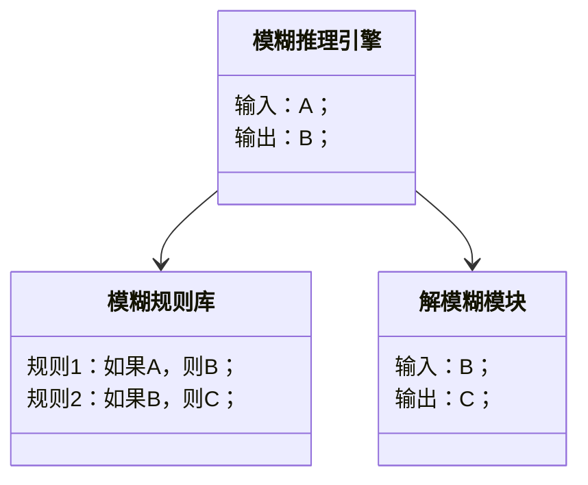

                 


# 开发AI Agent的模糊逻辑推理能力

> 关键词：模糊逻辑，AI Agent，模糊推理，数学模型，算法，系统架构

> 摘要：  
模糊逻辑是一种处理不确定性问题的数学工具，它能够帮助AI Agent在处理复杂、不明确或模糊信息时做出更合理的决策。本文从模糊逻辑的基本概念出发，深入探讨其在AI Agent中的应用，结合算法原理、数学模型和系统架构设计，详细讲解如何开发具备模糊逻辑推理能力的AI Agent。通过实际案例分析和项目实战，为读者提供从理论到实践的全面指导。

---

# 第1章: 模糊逻辑与AI Agent概述

## 1.1 模糊逻辑的基本概念

### 1.1.1 模糊逻辑的定义  
模糊逻辑是一种用于处理模糊性和不确定性问题的数学框架，它允许命题的真值在0到1之间连续变化，而不是传统的二值逻辑（真或假）。  

### 1.1.2 模糊逻辑的特点  
- **连续性**：命题的真值可以是介于0和1之间的任何数。  
- **模糊性**：允许对模糊概念（如“很高”、“很便宜”）进行量化。  
- **可调性**：可以根据具体问题调整模糊推理的参数。  

### 1.1.3 模糊逻辑与传统逻辑的区别  
| 特性 | 传统逻辑 | 模糊逻辑 |
|------|----------|----------|
| 真值范围 | 0或1 | 0到1之间的实数 |
| 处理方式 | 确定性 | 模糊性 |
| 应用场景 | 二值判断 | 处理模糊信息 |

## 1.2 AI Agent的基本概念

### 1.2.1 AI Agent的定义  
AI Agent（智能体）是一种能够感知环境、自主决策并执行任务的智能系统。  

### 1.2.2 AI Agent的核心功能  
- 感知环境：通过传感器或数据输入获取信息。  
- 处理信息：利用算法对信息进行分析和推理。  
- 决策与行动：基于推理结果采取相应的行动。  

### 1.2.3 AI Agent的应用场景  
- 自动化系统：如自动驾驶、智能家居。  
- 机器人控制：如工业机器人、服务机器人。  
- 联网设备：如智能音箱、智能摄像头。  

## 1.3 模糊逻辑与AI Agent的结合

### 1.3.1 模糊逻辑在AI Agent中的作用  
模糊逻辑可以帮助AI Agent在处理模糊、不明确或不完整信息时做出更合理的决策。  

### 1.3.2 AI Agent中模糊逻辑的应用场景  
- 自然语言处理：处理模糊语言（如“很高”、“很便宜”）。  
- 智能推荐：根据用户偏好推荐产品或内容。  
- 复杂决策：在多因素影响下做出最优决策。  

### 1.3.3 模糊逻辑推理能力的核心要素  
| 要素 | 描述 |
|------|------|
| 模糊规则库 | 包含专家知识的规则集合。 |
| 模糊推理引擎 | 执行推理过程的算法。 |
| 解模糊过程 | 将模糊结果转化为具体行动。 |

---

# 第2章: 模糊逻辑推理的核心原理

## 2.1 模糊逻辑的基本原理

### 2.1.1 模糊集合的定义  
模糊集合是一种元素属于集合的程度可以用介于0和1之间的值表示的数学结构。  

### 2.1.2 模糊关系的定义  
模糊关系是两个模糊集合之间的一种关联，可以用模糊矩阵表示。  

### 2.1.3 模糊逻辑运算的定义  
- **模糊交集**：$A \cap B = \min(A, B)$  
- **模糊并集**：$A \cup B = \max(A, B)$  
- **模糊补集**：$\lnot A = 1 - A$  

## 2.2 模糊逻辑推理算法

### 2.2.1 模糊规则库的构建  
模糊规则库是基于专家知识构建的规则集合，通常表示为“如果-那么”形式。  

**示例：**  
- 如果温度是高，那么加热功率是大。  
- 如果温度是中等，那么加热功率是中等。  

### 2.2.2 模糊推理引擎的实现  
模糊推理引擎是根据模糊规则库和输入信息进行推理的算法。  

### 2.2.3 解模糊过程的实现  
解模糊过程是将模糊结果转化为具体行动的过程，通常使用重心法或面积法。  

## 2.3 模糊逻辑推理的数学模型

### 2.3.1 模糊关系的数学表达  
模糊关系可以用模糊矩阵表示，例如：  
$$ R = \begin{bmatrix} 0.2 & 0.5 & 0.8 \\ 0.3 & 0.6 & 0.9 \\ 0.4 & 0.7 & 1.0 \end{bmatrix} $$  

### 2.3.2 模糊推理的合成规则  
模糊推理的合成规则通常使用模糊逻辑运算，例如：  
$$ Y = (A \cap B) \rightarrow C $$  

### 2.3.3 解模糊的数学模型  
解模糊过程通常使用重心法：  
$$ y = \frac{\sum (u_i \cdot x_i)}{\sum u_i} $$  

---

# 第3章: AI Agent的模糊逻辑推理模型设计

## 3.1 模糊逻辑推理模型

### 3.1.1 模糊逻辑推理模型的需求分析  
- 处理模糊信息。  
- 支持模糊规则推理。  
- 实现解模糊过程。  

### 3.1.2 模糊逻辑推理模型的系统设计  
**领域模型（Mermaid 类图）：**  


### 3.1.3 模糊逻辑推理模型的实现  
**Python 实现示例：**  
```python
def fuzzy_reasoning(input_value):
    # 定义模糊规则
    rules = {
        '规则1': {'条件': 'A', '结论': 'B'},
        '规则2': {'条件': 'B', '结论': 'C'}
    }
    # 执行模糊推理
    for rule in rules.values():
        if rule['条件'] == input_value:
            return rule['结论']
    return None
```

---

# 第4章: 模糊逻辑推理在AI Agent中的系统架构设计

## 4.1 模糊逻辑推理系统的架构设计

### 4.1.1 系统功能模块划分  
- 模糊规则库：存储模糊规则。  
- 模糊推理引擎：执行推理过程。  
- 解模糊模块：将模糊结果转化为具体行动。  

### 4.1.2 系统架构设计（Mermaid 架构图）  


### 4.1.3 接口设计  
- 输入接口：接收模糊输入。  
- 输出接口：输出推理结果。  

---

# 第5章: 模糊逻辑推理在AI Agent中的项目实战

## 5.1 项目背景与目标

### 5.1.1 项目背景  
开发一个基于模糊逻辑推理的AI Agent，用于智能家电的温度控制。  

### 5.1.2 项目目标  
实现基于模糊逻辑的温度调节功能。  

## 5.2 核心代码实现

### 5.2.1 模糊规则库实现  
```python
class FuzzyRuleBase:
    def __init__(self):
        self.rules = [
            {'条件': '低温', '结论': '增加加热功率'},
            {'条件': '高温', '结论': '降低加热功率'}
        ]
```

### 5.2.2 模糊推理引擎实现  
```python
class FuzzyReasoningEngine:
    def __init__(self, rule_base):
        self.rule_base = rule_base

    def reason(self, input_value):
        for rule in self.rule_base.rules:
            if rule['条件'] == input_value:
                return rule['结论']
        return None
```

### 5.2.3 解模糊模块实现  
```python
class Defuzzifier:
    def __init__(self):
        pass

    def defuzzify(self, fuzzy_values):
        return sum(fuzzy_values[i] * i for i in range(len(fuzzy_values))) / sum(fuzzy_values)
```

## 5.3 项目小结

### 5.3.1 项目实现的关键点  
- 模糊规则库的构建。  
- 模糊推理引擎的实现。  
- 解模糊模块的设计。  

### 5.3.2 项目经验总结  
模糊逻辑推理在处理模糊信息时表现出色，但在处理复杂问题时需要更多的规则和优化。

---

# 第6章: 模糊逻辑推理在AI Agent中的最佳实践

## 6.1 小结

### 6.1.1 核心概念回顾  
- 模糊逻辑的基本原理。  
- AI Agent的模糊推理能力。  

### 6.1.2 关键算法总结  
- 模糊规则库的构建。  
- 模糊推理引擎的实现。  
- 解模糊过程的设计。  

## 6.2 注意事项

### 6.2.1 模糊规则的设计  
模糊规则需要基于专家知识，确保逻辑的合理性和准确性。  

### 6.2.2 解模糊方法的选择  
不同的解模糊方法适用于不同的场景，需要根据具体问题选择合适的方法。  

## 6.3 拓展阅读

### 6.3.1 推荐书籍  
- 《模糊逻辑与模糊集》  
- 《人工智能：一种现代方法》  

### 6.3.2 推荐论文  
- Zadeh, L. A. (1965). Fuzzy sets.  

---

# 总结

通过本文的详细讲解，我们了解了模糊逻辑在AI Agent中的重要性，掌握了模糊逻辑推理的核心原理和算法，学习了系统架构设计和项目实战的具体实现。希望读者能够通过本文，掌握开发具备模糊逻辑推理能力的AI Agent的关键技术。

