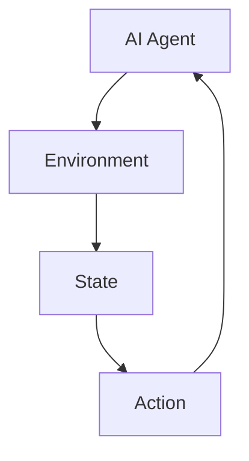
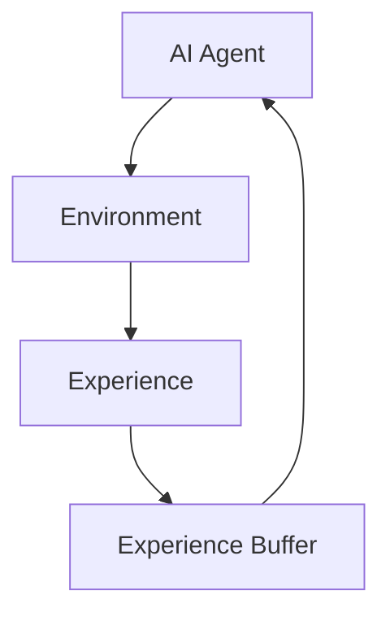
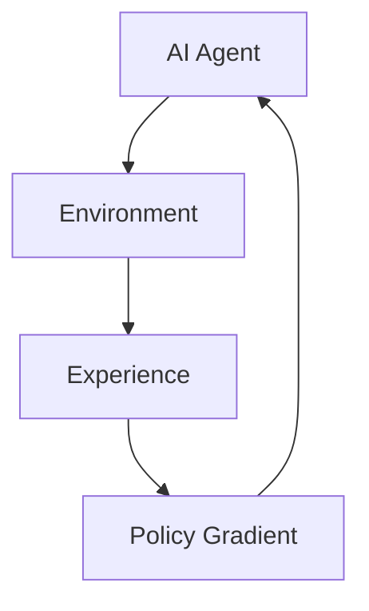
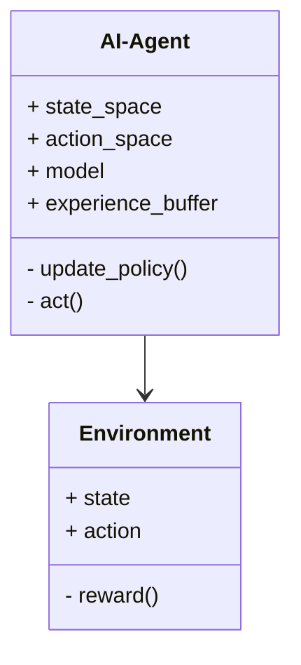
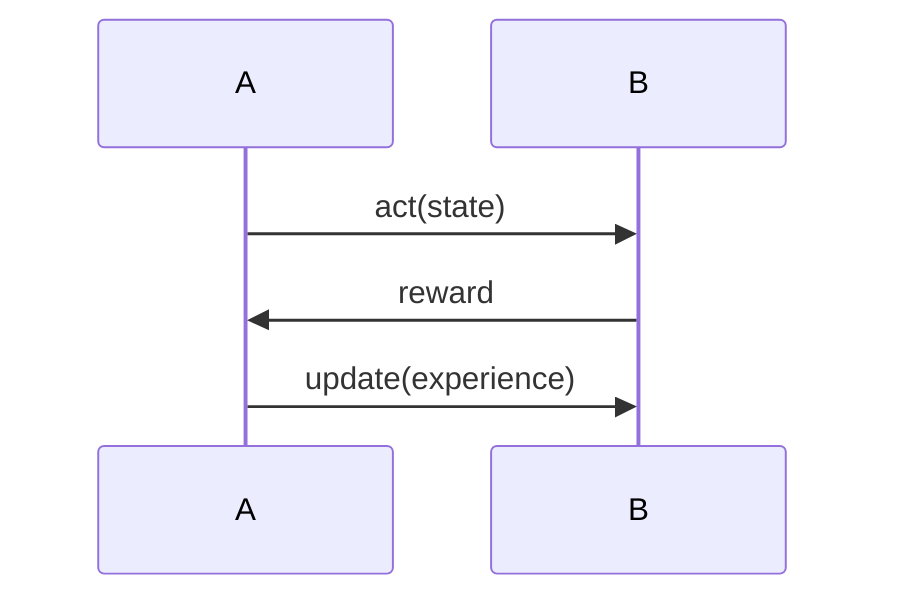

                 


# 开发AI Agent的自学习能力：持续学习机制

> 关键词：AI Agent, 自学习能力, 持续学习机制, 经验重放, 策略梯度方法, 系统架构设计, 项目实战

> 摘要：本文深入探讨了AI Agent的自学习能力，重点分析了持续学习机制的核心概念、算法原理、系统架构设计及实际应用。通过经验重放和策略梯度方法的详细讲解，结合项目实战案例，为读者提供了从理论到实践的全面指导。

---

# 第1章: AI Agent自学习能力的背景与概念

## 1.1 问题背景与问题描述

### 1.1.1 传统AI的局限性
传统的AI系统（如基于规则的专家系统）在特定任务上表现出色，但缺乏灵活性和适应性。当环境或任务发生变化时，这些系统通常需要人工干预来调整规则，这限制了它们的广泛应用。

### 1.1.2 自学习能力的提出
自学习能力（Self-Learning Ability）是指AI Agent能够在不依赖外部干预的情况下，通过与环境交互或处理新数据来改进自身性能的能力。这一能力使得AI系统能够适应动态变化的环境，适用于自动驾驶、智能助手、推荐系统等复杂场景。

### 1.1.3 持续学习机制的定义
持续学习机制（Continuous Learning Mechanism）是自学习能力的核心实现方式，它允许AI Agent在在线环境下逐步学习和优化，而不是仅依赖于离线训练数据。通过持续学习，AI Agent能够实时适应新任务和新数据。

## 1.2 问题解决与边界外延

### 1.2.1 自学习能力的实现方式
自学习能力的实现方式包括：
1. **经验重放（Experience Replay）**：通过回放历史经验来改进决策。
2. **策略梯度方法（Policy Gradient Methods）**：通过优化策略来提高性能。
3. **模型压缩与知识蒸馏（Model Compression and Knowledge Distillation）**：通过压缩和迁移学习来提升效率。

### 1.2.2 持续学习机制的应用场景
持续学习机制适用于以下场景：
1. **动态环境**：环境或任务规则随时间变化。
2. **实时反馈**：需要实时调整策略以应对反馈。
3. **多任务学习**：同时处理多个任务并动态切换。

### 1.2.3 自学习能力的边界与外延
自学习能力的边界包括：
1. **数据依赖性**：依赖于高质量的数据输入。
2. **计算资源限制**：需要足够的计算能力支持在线学习。
3. **任务复杂度**：适用于任务复杂度适中的场景。

## 1.3 核心概念与结构组成

### 1.3.1 自学习能力的核心要素
自学习能力的核心要素包括：
1. **知识表示**：如何表示和存储知识。
2. **学习机制**：如何更新和优化模型。
3. **反馈机制**：如何利用反馈改进决策。

### 1.3.2 持续学习机制的组成结构
持续学习机制的组成结构包括：
1. **感知模块**：负责感知环境并收集数据。
2. **学习模块**：负责处理数据并更新模型。
3. **决策模块**：基于更新后的模型做出决策。

### 1.3.3 自学习能力与持续学习的关系
自学习能力是持续学习机制的基础，而持续学习机制是自学习能力的实现方式。两者共同构成了AI Agent的自适应能力。

---

# 第2章: 自学习机制的核心原理

## 2.1 自学习机制的原理分析

### 2.1.1 知识表示与更新机制
知识表示通常采用状态空间和动作空间的形式。状态空间表示环境的状态，动作空间表示可能的行动。更新机制通过经验重放或策略梯度方法优化模型参数。

### 2.1.2 状态空间与动作空间
状态空间（State Space）是环境所有可能状态的集合，动作空间（Action Space）是AI Agent在每个状态下可执行的动作的集合。

### 2.1.3 奖励函数与目标函数
奖励函数（Reward Function）定义了AI Agent在特定状态下采取某个动作后的奖励值，目标函数（Objective Function）是优化模型的指标。

## 2.2 核心概念对比与特征分析

### 2.2.1 自学习机制与其他学习机制的对比
| 对比维度       | 监督学习      | � � � � � � � 强化学习  | 自学习机制    |
|----------------|---------------|-------------------|---------------|
| 数据来源       | 标签数据       | 环境反馈           | 实时数据       |
| 学习目标       | 分类/回归      | 最大化累积奖励      | 动态优化       |
| 适应性         | 低             | 中                 | 高             |

### 2.2.2 自学习机制的ER实体关系图


---

# 第3章: 经验重放算法

## 3.1 经验重放算法的原理

### 3.1.1 经验重放的基本概念
经验重放（Experience Replay）是一种通过存储和重放历史经验来改进决策的算法。它通过多样化的经验样本优化模型的泛化能力。

### 3.1.2 经验重放的实现流程
1. **收集经验**：AI Agent在环境中执行动作并记录经验。
2. **存储经验**：将经验存储在经验回放缓冲区。
3. **重放经验**：随机抽取经验样本进行训练。

### 3.1.3 经验重放的数学模型
经验重放的数学模型可以表示为：
$$ Q(s, a) = r + \gamma \max_{a'} Q(s', a') $$
其中，$Q(s, a)$ 是状态-动作值函数，$r$ 是奖励，$\gamma$ 是折扣因子，$a'$ 是下一动作。

## 3.2 经验重放的Python实现

### 3.2.1 环境安装与配置
```bash
pip install gym numpy
```

### 3.2.2 核心代码实现
```python
import gym
import numpy as np

class ExperienceReplayBuffer:
    def __init__(self, size):
        self.size = size
        self.buffer = []

    def add(self, experience):
        self.buffer.append(experience)
        if len(self.buffer) > self.size:
            self.buffer.pop(0)

    def sample(self, batch_size):
        return np.random.choice(self.buffer, batch_size)
```

### 3.2.3 代码功能解读
上述代码定义了一个经验回放缓冲区，用于存储和抽取经验样本。`add` 方法将新经验添加到缓冲区，`sample` 方法随机抽取指定数量的经验样本。

## 3.3 经验重放的Mermaid流程图



---

# 第4章: 策略梯度方法

## 4.1 策略梯度方法的原理

### 4.1.1 策略梯度的基本概念
策略梯度方法（Policy Gradient Methods）通过直接优化策略函数来最大化累积奖励。策略函数定义了在每个状态下选择动作的概率分布。

### 4.1.2 策略梯度的实现流程
1. **定义策略函数**：$ \pi_\theta(a|s) $，其中$\theta$是参数。
2. **计算梯度**：通过梯度上升法优化$\theta$。
3. **更新策略**：基于梯度更新策略函数。

### 4.1.3 策略梯度的数学模型
策略梯度的数学模型可以表示为：
$$ \nabla_\theta J(\theta) = \mathbb{E}_{s,a}[ \nabla_\theta \log \pi_\theta(a|s) Q(s,a) ] $$
其中，$J(\theta)$ 是目标函数，$Q(s,a)$ 是价值函数。

## 4.2 策略梯度的Python实现

### 4.2.1 环境安装与配置
```bash
pip install gym tensorflow
```

### 4.2.2 核心代码实现
```python
import gym
import tensorflow as tf

class PolicyGradientAgent:
    def __init__(self, state_space, action_space):
        self.state_space = state_space
        self.action_space = action_space
        self.model = self.build_model()

    def build_model(self):
        model = tf.keras.Sequential([
            tf.keras.layers.Dense(32, activation='relu'),
            tf.keras.layers.Dense(self.action_space, activation='softmax')
        ])
        return model

    def act(self, state):
        state = tf.convert_to_tensor(state)
        probs = self.model(state)
        action = np.random.choice(self.action_space, p=tf.nn.softmax(probs).numpy()[0])
        return action

    def update(self, experience):
        state, action, reward = experience
        with tf.GradientTape() as tape:
            probs = self.model(tf.convert_to_tensor(state))
            loss = -tf.reduce_sum(tf.nn.sparse_softmax_cross_entropy_with_logits(labels=action, logits=probs))
        grads = tape.gradient(loss, self.model.trainable_variables)
        self.model.optimizer.apply_gradients(zip(grads, self.model.trainable_variables))
```

### 4.2.3 代码功能解读
上述代码定义了一个基于策略梯度的AI Agent，通过构建策略网络来选择动作，并通过梯度更新优化策略。

## 4.3 策略梯度的Mermaid流程图



---

# 第5章: 系统分析与架构设计

## 5.1 问题场景介绍

### 5.1.1 应用场景
本文以一个智能助手为例，展示如何通过自学习机制实现持续优化。

## 5.2 系统功能设计

### 5.2.1 领域模型设计


## 5.3 系统架构设计

### 5.3.1 系统架构图


### 5.3.2 接口设计
AI Agent与环境之间的交互接口包括：
1. `act(state)`：根据当前状态选择动作。
2. `update(experience)`：根据经验更新策略。

### 5.3.3 交互流程


---

# 第6章: 项目实战

## 6.1 环境安装与配置

### 6.1.1 安装依赖
```bash
pip install gym numpy tensorflow
```

## 6.2 系统核心实现

### 6.2.1 经验重放实现
```python
class ExperienceReplayBuffer:
    def __init__(self, size):
        self.size = size
        self.buffer = []

    def add(self, experience):
        self.buffer.append(experience)
        if len(self.buffer) > self.size:
            self.buffer.pop(0)

    def sample(self, batch_size):
        return np.random.choice(self.buffer, batch_size)
```

### 6.2.2 策略梯度实现
```python
class PolicyGradientAgent:
    def __init__(self, state_space, action_space):
        self.state_space = state_space
        self.action_space = action_space
        self.model = self.build_model()

    def build_model(self):
        model = tf.keras.Sequential([
            tf.keras.layers.Dense(32, activation='relu'),
            tf.keras.layers.Dense(self.action_space, activation='softmax')
        ])
        return model

    def act(self, state):
        state = tf.convert_to_tensor(state)
        probs = self.model(state)
        action = np.random.choice(self.action_space, p=tf.nn.softmax(probs).numpy()[0])
        return action

    def update(self, experience):
        state, action, reward = experience
        with tf.GradientTape() as tape:
            probs = self.model(tf.convert_to_tensor(state))
            loss = -tf.reduce_sum(tf.nn.sparse_softmax_cross_entropy_with_logits(labels=action, logits=probs))
        grads = tape.gradient(loss, self.model.trainable_variables)
        self.model.optimizer.apply_gradients(zip(grads, self.model.trainable_variables))
```

## 6.3 代码应用解读

### 6.3.1 经验重放的应用
经验重放缓冲区通过存储和重放经验样本，帮助AI Agent更好地泛化和学习。

### 6.3.2 策略梯度的应用
策略梯度方法通过优化策略函数，直接改进AI Agent的决策能力。

## 6.4 实际案例分析

### 6.4.1 案例背景
以一个简单的迷宫导航问题为例，展示如何通过自学习机制实现路径优化。

### 6.4.2 案例分析
AI Agent通过经验重放和策略梯度方法，在迷宫中不断优化路径，最终找到最短路径。

## 6.5 项目小结

### 6.5.1 核心代码实现
展示了经验重放和策略梯度方法的核心代码实现。

### 6.5.2 实际案例分析
通过实际案例分析，验证了自学习机制的有效性。

---

# 第7章: 最佳实践

## 7.1 小结

### 7.1.1 核心概念回顾
自学习能力的核心是通过持续学习机制实现动态优化。

### 7.1.2 关键技术总结
本文重点介绍了经验重放和策略梯度方法。

## 7.2 注意事项

### 7.2.1 数据质量
确保数据的多样性和代表性。

### 7.2.2 计算资源
保证足够的计算能力支持在线学习。

### 7.2.3 任务复杂度
适用于任务复杂度适中的场景。

## 7.3 拓展阅读

### 7.3.1 相关论文
推荐阅读以下论文：
1.《Playing atari with deep reinforcement learning》
2.《Mastering the game of go with deep neural networks and tree search》

### 7.3.2 技术博客
推荐阅读以下技术博客：
1.《Understanding Experience Replay》
2.《A Tutorial on Policy Gradient Methods》

---

# 第8章: 总结与展望

## 8.1 总结
本文详细探讨了AI Agent的自学习能力，重点分析了持续学习机制的核心概念、算法原理、系统架构设计及实际应用。通过经验重放和策略梯度方法的详细讲解，结合项目实战案例，为读者提供了从理论到实践的全面指导。

## 8.2 展望
未来的研究方向包括：
1. **多任务学习**：探索如何在多个任务之间动态切换。
2. **模型压缩**：研究如何在资源受限的环境下优化性能。
3. **强化学习与生成模型的结合**：探索新的学习范式。

---

# 结语

开发AI Agent的自学习能力是一个复杂而有趣的领域，需要结合算法创新、系统设计和实际应用。通过持续学习机制，AI Agent能够不断优化自身性能，适应动态变化的环境。希望本文能够为读者提供有价值的参考和启发。

