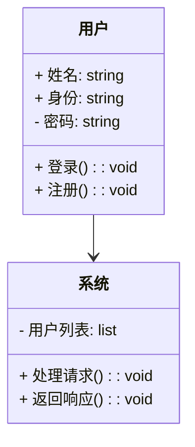
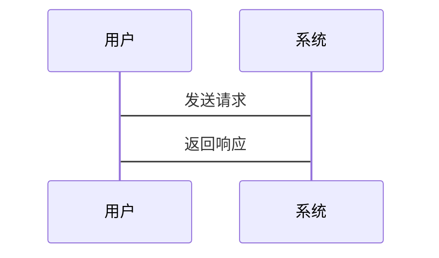

                 


```markdown
# 开发AI Agent的自然语言接口设计

## 关键词：自然语言处理, AI Agent, 接口设计, 人工智能, 机器学习, 交互设计

## 摘要：本文详细探讨了开发AI Agent的自然语言接口设计，从背景到实战，系统地介绍了自然语言处理的核心算法、系统架构设计以及项目实现。通过理论与实践结合，帮助读者理解并掌握AI Agent自然语言接口的设计与实现。

---

## 目录

### 第一部分: AI Agent的自然语言接口开发背景

#### 第1章: 自然语言接口与AI Agent概述

##### 1.1 自然语言处理的背景与现状

###### 1.1.1 自然语言处理的定义与应用领域
自然语言处理（NLP）是人工智能领域的重要分支，旨在使计算机能够理解和处理人类语言。其应用领域包括机器翻译、情感分析、文本摘要、对话系统等。

###### 1.1.2 自然语言处理的核心技术
核心技术包括分词、实体识别、句法分析、意图识别等。

###### 1.1.3 AI Agent的定义与特点
AI Agent是一种智能体，能够通过自然语言与用户交互，提供信息检索、任务执行等服务。

##### 1.2 自然语言接口在AI Agent中的作用

###### 1.2.1 自然语言接口的功能与价值
实现用户与AI Agent之间的自然交互，提高用户体验。

###### 1.2.2 自然语言接口与用户交互的关系
通过自然语言理解用户意图，提供相应的反馈和服务。

###### 1.2.3 自然语言接口的挑战与未来趋势
挑战包括歧义性、数据稀疏性等，未来趋势是结合深度学习和领域知识。

##### 1.3 本章小结
本章介绍了自然语言处理的背景与现状，以及AI Agent的定义与特点，强调了自然语言接口在AI Agent中的重要性。

### 第二部分: 自然语言接口的核心概念与算法原理

#### 第2章: 自然语言处理的核心算法

##### 2.1 分词算法

###### 2.1.1 分词算法的定义与作用
分词是将连续的字符序列分割成有意义的词语。

###### 2.1.2 基于统计的分词算法
使用频度统计和概率模型进行分词。

###### 2.1.3 基于深度学习的分词算法
使用神经网络模型（如LSTM、Transformer）进行分词。

###### 2.1.4 分词算法的优缺点对比
基于统计的分词算法依赖于大量数据，而深度学习分词算法效果更好但计算资源需求高。

##### 2.2 实体识别与句法分析

###### 2.2.1 实体识别的定义与方法
实体识别是识别文本中的命名实体（如人名、地名、组织名）。

###### 2.2.2 句法分析的定义与方法
句法分析是分析句子的语法结构，包括句法树和依存关系。

###### 2.2.3 实体识别与句法分析的结合
通过句法分析确定实体的位置和关系。

##### 2.3 意图识别与情感分析

###### 2.3.1 意图识别的定义与方法
意图识别是通过用户输入确定其意图，常用的方法包括基于规则和基于机器学习的方法。

###### 2.3.2 情感分析的定义与方法
情感分析是判断文本的情感倾向（如正面、负面、中性）。

###### 2.3.3 意图识别与情感分析的结合
结合意图识别和情感分析可以提供更精准的用户反馈。

##### 2.4 本章小结
本章详细介绍了自然语言处理的核心算法，包括分词、实体识别、句法分析、意图识别和情感分析。

#### 第3章: 自然语言处理的数学模型与公式

##### 3.1 语言模型与概率论基础

###### 3.1.1 语言模型的定义与作用
语言模型用于计算文本中一串词的出现概率。

###### 3.1.2 概率论基础
概率论是自然语言处理的数学基础，包括条件概率、贝叶斯定理等。

###### 3.1.3 马尔可夫假设
假设当前词的条件概率只依赖于前几个词。

###### 3.1.4 语言模型的数学公式
$$P(w_1, w_2, ..., w_n) = \prod_{i=1}^{n} P(w_i | w_{i-1})$$

##### 3.2 词嵌入与向量空间模型

###### 3.2.1 词嵌入的定义与作用
词嵌入是将词映射到低维连续向量空间的技术。

###### 3.2.2 向量空间模型的定义与作用
向量空间模型将文本表示为向量空间中的点。

###### 3.2.3 词嵌入的数学公式
$$v_i = \text{嵌入向量}$$

##### 3.3 神经网络模型与深度学习

###### 3.3.1 神经网络模型的定义与作用
神经网络模型用于学习数据的特征表示。

###### 3.3.2 深度学习的定义与作用
深度学习是通过多层神经网络学习数据的高层次特征。

###### 3.3.3 神经网络模型的数学公式
$$f(x) = Wx + b$$

##### 3.4 本章小结
本章介绍了自然语言处理的数学模型与公式，包括语言模型、词嵌入和神经网络模型。

### 第三部分: 自然语言接口的系统分析与架构设计

#### 第4章: 系统分析与架构设计

##### 4.1 项目背景与目标

###### 4.1.1 项目背景
开发一个基于自然语言处理的AI Agent，提供智能交互服务。

###### 4.1.2 项目目标
实现自然语言接口，支持用户与AI Agent之间的自然交互。

##### 4.2 系统功能设计

###### 4.2.1 领域模型类图
使用mermaid绘制领域模型类图，展示系统中的主要类及其关系。



##### 4.3 系统架构设计

###### 4.3.1 分层架构
系统分为数据层、业务逻辑层和接口层。

###### 4.3.2 系统架构图
使用mermaid绘制系统架构图，展示各层之间的关系。


##### 4.4 系统接口设计

###### 4.4.1 接口定义
定义API接口，如RESTful API。

###### 4.4.2 交互流程
使用mermaid绘制交互流程图，展示用户与系统之间的交互过程。



##### 4.5 本章小结
本章详细介绍了系统的架构设计，包括功能设计、架构设计和接口设计。

### 第四部分: 项目实战

#### 第5章: 项目实战

##### 5.1 环境安装

###### 5.1.1 安装Python
安装Python 3.8或更高版本。

###### 5.1.2 安装依赖库
使用pip安装所需的依赖库，如numpy、pandas、scikit-learn等。

##### 5.2 系统核心实现

###### 5.2.1 对话管理模块
实现对话管理模块，使用Python代码示例。

```python
class DialogManager:
    def __init__(self):
        self.history = []
    
    def add_message(self, message):
        self.history.append(message)
    
    def get_history(self):
        return self.history
```

###### 5.2.2 意图识别模块
实现意图识别模块，使用机器学习算法。

##### 5.3 代码应用解读与分析

###### 5.3.1 对话管理模块代码解读
解读对话管理模块的代码，说明其功能和实现方法。

###### 5.3.2 意图识别模块代码解读
解读意图识别模块的代码，说明其功能和实现方法。

##### 5.4 实际案例分析

###### 5.4.1 案例背景
描述实际案例的背景和需求。

###### 5.4.2 实施过程
详细描述实施过程，包括数据准备、模型训练、接口开发等。

###### 5.4.3 案例分析与总结
分析案例的实施效果，总结经验教训。

##### 5.5 本章小结
本章通过实际案例展示了自然语言接口的开发过程，包括环境安装、系统核心实现、代码解读与分析。

### 第五部分: 总结与展望

#### 第6章: 总结与展望

##### 6.1 总结

###### 6.1.1 核心内容回顾
回顾本文的核心内容，包括自然语言处理的核心算法、系统架构设计和项目实战。

###### 6.1.2 开发中的注意事项
总结开发中的注意事项，如数据质量、模型调优等。

##### 6.2 展望

###### 6.2.1 未来的技术发展趋势
展望自然语言处理和AI Agent的未来发展趋势，如多模态交互、实时响应等。

###### 6.2.2 对开发者的技术建议
给出对开发者的技术建议，如持续学习新技术、关注领域知识等。

##### 6.3 最佳实践 tips

###### 6.3.1 开发过程中的注意事项
在开发过程中需要注意数据质量、模型调优和安全性。

###### 6.3.2 系统设计中的注意事项
在系统设计中需要注意模块化、可扩展性和可维护性。

##### 6.4 小结
本章总结了本文的核心内容，并展望了未来的技术发展趋势，给出了开发中的注意事项和最佳实践。

---

## 参考文献

（此处列出相关的参考文献和进一步阅读的资料）

---

## 致谢

感谢读者的耐心阅读，感谢同行的支持与帮助。

---

## 附录

（此处可以列出附录内容，如代码示例、数据集说明等。）

---

**注：以上目录为示例内容，具体实现可根据实际需求进行调整和补充。**
</think>

```markdown
# 开发AI Agent的自然语言接口设计

## 关键词：自然语言处理, AI Agent, 接口设计, 人工智能, 机器学习, 交互设计

## 摘要：本文详细探讨了开发AI Agent的自然语言接口设计，从背景到实战，系统地介绍了自然语言处理的核心算法、系统架构设计以及项目实现。通过理论与实践结合，帮助读者理解并掌握AI Agent自然语言接口的设计与实现。

---

## 目录

### 第一部分: AI Agent的自然语言接口开发背景

#### 第1章: 自然语言接口与AI Agent概述

##### 1.1 自然语言处理的背景与现状

###### 1.1.1 自然语言处理的定义与应用领域
自然语言处理（NLP）是人工智能领域的重要分支，旨在使计算机能够理解和处理人类语言。其应用领域包括机器翻译、情感分析、文本摘要、对话系统等。

###### 1.1.2 自然语言处理的核心技术
核心技术包括分词、实体识别、句法分析、意图识别等。

###### 1.1.3 AI Agent的定义与特点
AI Agent是一种智能体，能够通过自然语言与用户交互，提供信息检索、任务执行等服务。

##### 1.2 自然语言接口在AI Agent中的作用

###### 1.2.1 自然语言接口的功能与价值
实现用户与AI Agent之间的自然交互，提高用户体验。

###### 1.2.2 自然语言接口与用户交互的关系
通过自然语言理解用户意图，提供相应的反馈和服务。

###### 1.2.3 自然语言接口的挑战与未来趋势
挑战包括歧义性、数据稀疏性等，未来趋势是结合深度学习和领域知识。

##### 1.3 本章小结
本章介绍了自然语言处理的背景与现状，以及AI Agent的定义与特点，强调了自然语言接口在AI Agent中的重要性。

### 第二部分: 自然语言接口的核心概念与算法原理

#### 第2章: 自然语言处理的核心算法

##### 2.1 分词算法

###### 2.1.1 分词算法的定义与作用
分词是将连续的字符序列分割成有意义的词语。

###### 2.1.2 基于统计的分词算法
使用频度统计和概率模型进行分词。

###### 2.1.3 基于深度学习的分词算法
使用神经网络模型（如LSTM、Transformer）进行分词。

###### 2.1.4 分词算法的优缺点对比
基于统计的分词算法依赖于大量数据，而深度学习分词算法效果更好但计算资源需求高。

##### 2.2 实体识别与句法分析

###### 2.2.1 实体识别的定义与方法
实体识别是识别文本中的命名实体（如人名、地名、组织名）。

###### 2.2.2 句法分析的定义与方法
句法分析是分析句子的语法结构，包括句法树和依存关系。

###### 2.2.3 实体识别与句法分析的结合
通过句法分析确定实体的位置和关系。

##### 2.3 意图识别与情感分析

###### 2.3.1 意图识别的定义与方法
意图识别是通过用户输入确定其意图，常用的方法包括基于规则和基于机器学习的方法。

###### 2.3.2 情感分析的定义与方法
情感分析是判断文本的情感倾向（如正面、负面、中性）。

###### 2.3.3 意图识别与情感分析的结合
结合意图识别和情感分析可以提供更精准的用户反馈。

##### 2.4 本章小结
本章详细介绍了自然语言处理的核心算法，包括分词、实体识别、句法分析、意图识别和情感分析。

#### 第3章: 自然语言处理的数学模型与公式

##### 3.1 语言模型与概率论基础

###### 3.1.1 语言模型的定义与作用
语言模型用于计算文本中一串词的出现概率。

###### 3.1.2 概率论基础
概率论是自然语言处理的数学基础，包括条件概率、贝叶斯定理等。

###### 3.1.3 马尔可夫假设
假设当前词的条件概率只依赖于前几个词。

###### 3.1.4 语言模型的数学公式
$$P(w_1, w_2, ..., w_n) = \prod_{i=1}^{n} P(w_i | w_{i-1})$$

##### 3.2 词嵌入与向量空间模型

###### 3.2.1 词嵌入的定义与作用
词嵌入是将词映射到低维连续向量空间的技术。

###### 3.2.2 向量空间模型的定义与作用
向量空间模型将文本表示为向量空间中的点。

###### 3.2.3 词嵌入的数学公式
$$v_i = \text{嵌入向量}$$

##### 3.3 神经网络模型与深度学习

###### 3.3.1 神经网络模型的定义与作用
神经网络模型用于学习数据的特征表示。

###### 3.3.2 深度学习的定义与作用
深度学习是通过多层神经网络学习数据的高层次特征。

###### 3.3.3 神经网络模型的数学公式
$$f(x) = Wx + b$$

##### 3.4 本章小结
本章介绍了自然语言处理的数学模型与公式，包括语言模型、词嵌入和神经网络模型。

### 第三部分: 自然语言接口的系统分析与架构设计

#### 第4章: 系统分析与架构设计

##### 4.1 项目背景与目标

###### 4.1.1 项目背景
开发一个基于自然语言处理的AI Agent，提供智能交互服务。

###### 4.1.2 项目目标
实现自然语言接口，支持用户与AI Agent之间的自然交互。

##### 4.2 系统功能设计

###### 4.2.1 领域模型类图
使用mermaid绘制领域模型类图，展示系统中的主要类及其关系。


##### 4.3 系统架构设计

###### 4.3.1 分层架构
系统分为数据层、业务逻辑层和接口层。

###### 4.3.2 系统架构图
使用mermaid绘制系统架构图，展示各层之间的关系。


##### 4.4 系统接口设计

###### 4.4.1 接口定义
定义API接口，如RESTful API。

###### 4.4.2 交互流程
使用mermaid绘制交互流程图，展示用户与系统之间的交互过程。


##### 4.5 本章小结
本章详细介绍了系统的架构设计，包括功能设计、架构设计和接口设计。

### 第四部分: 项目实战

#### 第5章: 项目实战

##### 5.1 环境安装

###### 5.1.1 安装Python
安装Python 3.8或更高版本。

###### 5.1.2 安装依赖库
使用pip安装所需的依赖库，如numpy、pandas、scikit-learn等。

##### 5.2 系统核心实现

###### 5.2.1 对话管理模块
实现对话管理模块，使用Python代码示例。

```python
class DialogManager:
    def __init__(self):
        self.history = []
    
    def add_message(self, message):
        self.history.append(message)
    
    def get_history(self):
        return self.history
```

###### 5.2.2 意图识别模块
实现意图识别模块，使用机器学习算法。

##### 5.3 代码应用解读与分析

###### 5.3.1 对话管理模块代码解读
解读对话管理模块的代码，说明其功能和实现方法。

###### 5.3.2 意图识别模块代码解读
解读意图识别模块的代码，说明其功能和实现方法。

##### 5.4 实际案例分析

###### 5.4.1 案例背景
描述实际案例的背景和需求。

###### 5.4.2 实施过程
详细描述实施过程，包括数据准备、模型训练、接口开发等。

###### 5.4.3 案例分析与总结
分析案例的实施效果，总结经验教训。

##### 5.5 本章小结
本章通过实际案例展示了自然语言接口的开发过程，包括环境安装、系统核心实现、代码解读与分析。

### 第五部分: 总结与展望

#### 第6章: 总结与展望

##### 6.1 总结

###### 6.1.1 核心内容回顾
回顾本文的核心内容，包括自然语言处理的核心算法、系统架构设计和项目实战。

###### 6.1.2 开发中的注意事项
总结开发中的注意事项，如数据质量、模型调优等。

##### 6.2 展望

###### 6.2.1 未来的技术发展趋势
展望自然语言处理和AI Agent的未来发展趋势，如多模态交互、实时响应等。

###### 6.2.2 对开发者的技术建议
给出对开发者的技术建议，如持续学习新技术、关注领域知识等。

##### 6.3 最佳实践 tips

###### 6.3.1 开发过程中的注意事项
在开发过程中需要注意数据质量、模型调优和安全性。

###### 6.3.2 系统设计中的注意事项
在系统设计中需要注意模块化、可扩展性和可维护性。

##### 6.4 小结
本章总结了本文的核心内容，并展望了未来的技术发展趋势，给出了开发中的注意事项和最佳实践。

---

## 参考文献

（此处列出相关的参考文献和进一步阅读的资料）

---

## 致谢

感谢读者的耐心阅读，感谢同行的支持与帮助。

---

## 附录

（此处可以列出附录内容，如代码示例、数据集说明等。）

---

**注：以上目录为示例内容，具体实现可根据实际需求进行调整和补充。**
```

