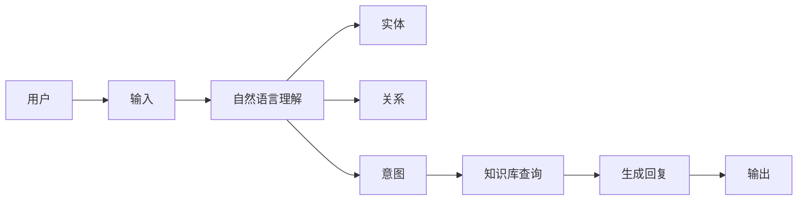
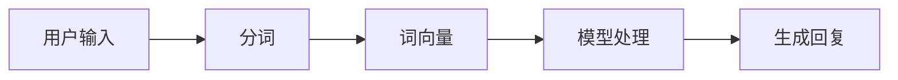
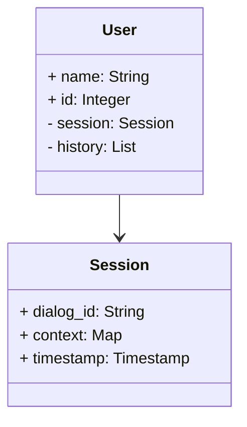
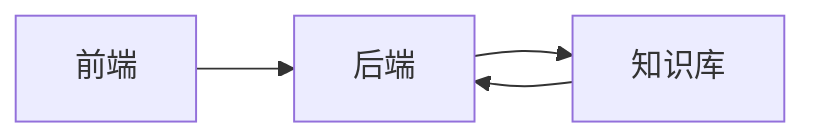

                 


# 开发AI Agent的自然语言接口设计原则

> 关键词：AI Agent，自然语言接口，信息抽取，语义理解，对话生成

> 摘要：本文详细探讨了开发AI Agent的自然语言接口设计原则，从核心概念到算法原理，从系统架构到项目实战，全面解析了自然语言接口在AI Agent中的设计与实现。本文旨在帮助读者理解自然语言接口的核心原理，掌握其设计方法，并能够实际应用于AI Agent的开发中。

---

# 第一部分: AI Agent与自然语言接口的背景与基础

## 第1章: AI Agent与自然语言处理概述

### 1.1 AI Agent的基本概念

#### 1.1.1 AI Agent的定义与分类
AI Agent（人工智能代理）是指能够感知环境、自主决策并执行任务的智能体。它可以分为**简单反射型Agent**、**基于模型的反射型Agent**、**目标驱动型Agent**和**效用驱动型Agent**四类。

#### 1.1.2 自然语言处理在AI Agent中的作用
自然语言处理（NLP）是AI Agent与人类用户交互的核心技术。通过NLP，AI Agent能够理解用户的输入并生成自然语言的输出，从而实现人机交互。

#### 1.1.3 AI Agent与传统程序的区别
AI Agent具有自主性、反应性、目标导向性和社会性四大特征，与传统程序的最大区别在于其能够动态感知环境并自主决策。

---

### 1.2 自然语言接口的发展历程

#### 1.2.1 自然语言处理的演进
自然语言处理经历了从基于规则的系统到基于统计模型，再到基于深度学习的预训练模型的演进过程。

#### 1.2.2 AI Agent中自然语言接口的演进
早期的自然语言接口简单单一，随着技术的进步，逐渐发展为支持多轮对话、具备上下文理解和复杂语义分析的智能接口。

#### 1.2.3 当前技术现状与趋势
当前，基于大语言模型（LLM）的自然语言接口成为主流，未来的发展趋势是更加智能化、个性化和场景化。

---

### 1.3 本书的核心问题与目标

#### 1.3.1 问题背景与问题描述
AI Agent的自然语言接口设计是一个复杂的系统工程，涉及信息抽取、语义理解、对话生成等多个技术领域。

#### 1.3.2 问题解决的思路与方法
通过模块化设计、跨领域协作和持续优化，构建一个高效、准确、自然的自然语言接口。

#### 1.3.3 本书的目标与范围界定
本书旨在系统性地介绍AI Agent自然语言接口的设计原则，涵盖从核心概念到算法实现的完整流程。

---

### 1.4 本章小结
本章通过介绍AI Agent和自然语言处理的基本概念，梳理了自然语言接口的发展历程，并明确了本书的核心问题与目标。

---

# 第二部分: 自然语言接口的核心概念与原理

## 第2章: 自然语言接口的核心概念

### 2.1 自然语言接口的基本原理

#### 2.1.1 信息抽取与理解
信息抽取是从用户输入中提取关键信息（如实体、关系、意图等），信息理解则是将这些信息转化为系统可理解的形式。

#### 2.1.2 语义分析与推理
语义分析旨在理解用户输入的深层含义，推理则是基于已有知识进行逻辑推理。

#### 2.1.3 对话生成与反馈
对话生成是将系统处理后的信息转化为自然语言输出，反馈机制则用于优化对话流程。

---

### 2.2 自然语言接口的关键技术

#### 2.2.1 语言模型
语言模型用于预测下一个词，是自然语言处理的核心技术之一。

#### 2.2.2 对话系统
对话系统基于语言模型构建人机对话系统，支持多轮对话和上下文理解。

#### 2.2.3 知识图谱
知识图谱为自然语言理解提供知识支持，帮助系统更好地理解用户意图。

---

### 2.3 核心概念对比分析

#### 2.3.1 信息抽取与语义理解的对比
| 特性 | 信息抽取 | 语义理解 |
|------|----------|----------|
| 目的 | 提取关键信息 | 理解深层含义 |
| 方法 | 基于规则/统计 | 基于深度学习 |
| 输出 | 实体、关系 | 概念、意图 |

#### 2.3.2 对话生成与反馈机制的对比
| 特性 | 对话生成 | 反馈机制 |
|------|----------|----------|
| 目的 | 生成自然语言回复 | 根据用户反馈优化对话 |
| 方法 | 基于生成模型 | 基于强化学习 |
| 输出 | 文本 | 反馈信号 |

#### 2.3.3 语言模型与知识图谱的结合
语言模型提供语言生成能力，知识图谱提供知识支持，二者结合可以提升对话系统的准确性和智能化水平。

---

### 2.4 实体关系图（ER图）



---

### 2.5 本章小结
本章通过对比分析和实体关系图，详细阐述了自然语言接口的核心概念及其相互关系。

---

# 第三部分: 自然语言接口的算法原理

## 第3章: 自然语言接口的算法原理

### 3.1 信息抽取算法

#### 3.1.1 基于规则的抽取算法
基于规则的抽取算法通过预定义的规则从文本中提取特定信息，例如使用正则表达式提取日期。

#### 3.1.2 基于统计的抽取算法
基于统计的抽取算法利用概率统计方法，例如使用CRF（条件随机场）进行命名实体识别。

#### 3.1.3 基于深度学习的抽取算法
基于深度学习的抽取算法使用神经网络模型，例如使用BERT进行实体识别。

---

### 3.2 语义理解算法

#### 3.2.1 基于词袋模型的语义理解
词袋模型将文本表示为词的集合，不考虑词序。

#### 3.2.2 基于序列模型的语义理解
序列模型（如LSTM）可以捕捉文本的序列信息，用于文本生成和语义理解。

#### 3.2.3 基于预训练模型的语义理解
预训练模型（如BERT、GPT）通过大规模数据预训练，具有强大的语义理解能力。

---

### 3.3 对话生成算法

#### 3.3.1 基于马尔可夫链的对话生成
马尔可夫链用于生成下一个词的概率分布。

#### 3.3.2 基于生成对抗网络的对话生成
生成对抗网络（GAN）通过生成器和判别器的对抗训练生成高质量的对话。

#### 3.3.3 基于预训练模型的对话生成
预训练模型通过微调（Fine-tuning）生成自然流畅的对话。

---

### 3.4 算法流程图



---

### 3.5 数学模型与公式

#### 3.5.1 词向量表示
词向量表示为：
$$
\text{word\_embedding} = W_{word} \cdot w
$$

其中，\( w \) 是词的索引，\( W_{word} \) 是词向量矩阵。

#### 3.5.2 语言模型的概率公式
语言模型的概率公式为：
$$
P(w_1, w_2, ..., w_n) = \prod_{i=1}^{n} P(w_i | w_{1}, ..., w_{i-1})
$$

---

## 第4章: 系统架构与实现

### 4.1 问题场景介绍
以智能客服对话系统为例，介绍自然语言接口在实际系统中的应用。

### 4.2 系统功能设计

#### 4.2.1 领域模型设计
领域模型用于描述系统的功能模块及其交互关系。



#### 4.2.2 系统架构设计
系统架构设计包括前端、后端和知识库三个部分。



---

### 4.3 项目实战

#### 4.3.1 环境安装
安装Python、TensorFlow、Keras等开发环境。

#### 4.3.2 核心代码实现
实现一个简单的对话生成模型。

```python
import tensorflow as tf
from tensorflow.keras import layers

model = tf.keras.Sequential([
    layers.Embedding(input_dim=10000, output_dim=16),
    layers.LSTM(64),
    layers.Dense(1000, activation='softmax')
])

model.compile(optimizer='adam', loss='sparse_categorical_crossentropy', metrics=['accuracy'])
```

---

### 4.4 总结与注意事项
在实际开发中，需要注意模型的可解释性、系统的鲁棒性以及用户隐私保护等问题。

---

## 第5章: 最佳实践与未来展望

### 5.1 最佳实践 tips
- 模块化设计，便于维护和扩展。
- 数据清洗与标注，确保数据质量。
- 持续优化，提升用户体验。

### 5.2 小结
总结全文的核心内容，强调自然语言接口在AI Agent中的重要性。

### 5.3 注意事项
- 确保系统的安全性和隐私性。
- 避免过度承诺，明确系统的局限性。

### 5.4 拓展阅读
推荐相关领域的书籍和论文，供读者深入学习。

---

## 附录: 术语表
列出全文中出现的专业术语及其简要解释。

---

通过以上目录大纲，我们可以系统性地学习和理解AI Agent自然语言接口的设计原则，并能够实际应用于相关开发工作中。

