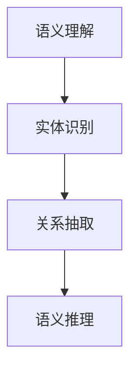
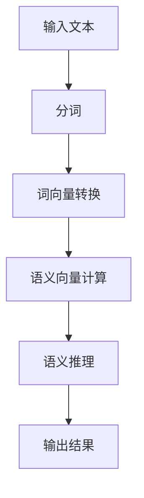
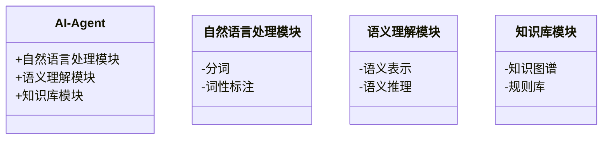
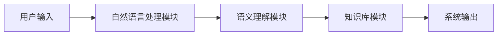

                 


# 开发AI Agent的语义理解深度：从字面到隐含

## 关键词：AI Agent、语义理解、自然语言处理、深度学习、知识图谱

## 摘要：  
本文深入探讨了AI Agent语义理解的核心概念、算法原理和系统架构，从基础理论到实际应用，全面解析了从字面意思到隐含语义的多层次理解。结合具体案例，分析了语义理解在AI Agent开发中的应用价值和技术挑战，为开发者提供了实用的开发指南和最佳实践。

---

# 第1章: AI Agent与语义理解概述

## 1.1 AI Agent的基本概念
### 1.1.1 AI Agent的定义与分类
AI Agent（智能体）是指能够感知环境、自主决策并执行任务的智能系统。根据功能和应用场景，AI Agent可以分为简单反射型、基于模型的反应型、目标驱动型和实用驱动型等类型。

### 1.1.2 语义理解在AI Agent中的作用
语义理解（Semantic Understanding）是AI Agent的核心能力之一，负责将自然语言输入转化为系统可理解的语义表示，从而实现人与机器的有效交互。

### 1.1.3 从字面到隐含语义的演进
语义理解不仅仅是对文本表面意思的解析，更需要理解上下文、常识知识和隐含意图，从而实现从字面到隐含的多层次语义理解。

## 1.2 语义理解的核心问题
### 1.2.1 语义理解的定义与特点
语义理解是通过自然语言处理技术，将文本转化为语义表示的过程。其特点包括语境依赖性、模糊性和多模态性。

### 1.2.2 语义理解的层次划分
语义理解可以分为词义理解、句法理解、语义推理和语用理解四个层次。

### 1.2.3 语义理解的边界与外延
语义理解的边界在于语言的模糊性和歧义性，而其外延则涉及知识图谱、逻辑推理和情感分析等多个领域。

## 1.3 语义理解的背景与现状
### 1.3.1 自然语言处理的演变
从传统的基于规则的方法到现代的深度学习技术，自然语言处理技术经历了从简单到复杂的演进。

### 1.3.2 当前语义理解技术的挑战
语义理解仍然面临语境依赖性、知识表示和推理能力等方面的挑战。

### 1.3.3 未来语义理解的发展趋势
随着AI技术的进步，语义理解将更加智能化、个性化和实时化。

## 1.4 本章小结
本章从AI Agent和语义理解的基本概念出发，探讨了语义理解的核心问题、层次划分以及当前的技术挑战和未来发展趋势。

---

# 第2章: 语义理解的核心概念与联系

## 2.1 核心概念原理
### 2.1.1 语义理解的三要素模型
语义理解的三要素包括语义表示、语义关联和语义推理。

### 2.1.2 语义向量空间的构建
通过词嵌入和句向量技术，构建语义向量空间，实现对文本的语义表示。

### 2.1.3 语义关系的图谱化表示
利用知识图谱技术，将语义关系以图谱形式表示，便于语义推理和关联分析。

## 2.2 核心概念对比表
| 对比维度       | 传统NLP方法          | 深度学习方法          |
|----------------|----------------------|----------------------|
| 技术基础       | 基于规则和统计        | 基于深度神经网络      |
| 处理能力       | 适用于简单任务        | 适用于复杂语义理解    |
| 语义深度       | 有限                  | 更强                  |

## 2.3 ER实体关系图


## 2.4 本章小结
本章从语义理解的核心概念出发，分析了其原理、层次结构以及与其他技术的联系，为后续章节的深入分析奠定了基础。

---

# 第3章: 语义理解的算法原理

## 3.1 语义理解的算法概述
### 3.1.1 基于统计的语义理解算法
传统基于统计的算法如TF-IDF，通过词频和逆文档频率来表示文本语义。

### 3.1.2 基于深度学习的语义理解算法
深度学习算法如BERT和GPT，通过预训练和微调实现强大的语义理解能力。

### 3.1.3 基于知识图谱的语义理解算法
结合知识图谱的语义理解算法，通过图结构和规则推理实现语义关联。

## 3.2 语义理解的算法流程


## 3.3 算法数学模型
### 3.3.1 词嵌入模型
$$\text{Word2Vec} = \{w_1, w_2, ..., w_n\}$$

### 3.3.2 语义向量空间模型
$$\text{余弦相似度} = \frac{\vec{A} \cdot \vec{B}}{|\vec{A}| |\vec{B}|}$$

## 3.4 算法实现与案例
### 3.4.1 基于Word2Vec的语义理解实现
```python
from gensim.models import Word2Vec

sentences = ["This is a test sentence"]
model = Word2Vec(sentences, vector_size=100, window=5, min_count=1, workers=4)
```

### 3.4.2 基于BERT的语义理解实现
```python
from transformers import BertTokenizer, BertModel

tokenizer = BertTokenizer.from_pretrained('bert-base-uncased')
model = BertModel.from_pretrained('bert-base-uncased')

inputs = tokenizer("This is a test sentence", return_tensors="pt")
outputs = model(**inputs)
```

### 3.4.3 语义理解算法的性能优化
通过模型调参、数据增强和并行计算等方法优化语义理解算法的性能。

## 3.5 本章小结
本章详细介绍了语义理解的算法原理，包括传统方法和深度学习方法，并通过具体案例展示了算法实现和优化技巧。

---

# 第4章: 语义理解的系统分析与架构设计

## 4.1 系统分析
### 4.1.1 问题场景介绍
AI Agent需要处理多样化的语义理解任务，包括对话理解、信息检索和意图识别等。

### 4.1.2 项目介绍
以一个智能客服系统为例，分析语义理解在其中的应用场景和需求。

## 4.2 系统功能设计
### 4.2.1 领域模型设计


### 4.2.2 系统架构设计


### 4.2.3 系统接口设计
API接口设计，包括输入接口（NLP模块）和输出接口（推理模块）。

### 4.2.4 系统交互设计
```mermaid
sequenceDiagram
    User ->+> NLP模块: 提供文本输入
    NLP模块 ->+> 语义理解模块: 返回语义表示
    语义理解模块 ->+> 知识库模块: 查询关联信息
    知识库模块 ->+> 语义理解模块: 返回结果
    语义理解模块 ->+> User: 输出结果
```

## 4.3 本章小结
本章通过系统分析和架构设计，展示了AI Agent语义理解系统的整体结构和各模块之间的交互关系。

---

# 第5章: 语义理解的项目实战

## 5.1 项目环境安装
安装必要的Python库，如TensorFlow、PyTorch、Nltk和Transformers。

## 5.2 系统核心实现
### 5.2.1 环境安装
```bash
pip install tensorflow transformers numpy
```

### 5.2.2 核心代码实现
```python
from transformers import pipeline

nlp = pipeline("text-classification", model="bert-base-uncased")
result = nlp("This is a test sentence")
print(result)
```

## 5.3 代码应用解读与分析
详细解读代码实现，分析每一步的功能和作用。

## 5.4 实际案例分析
以智能客服系统为例，分析语义理解在实际案例中的应用和效果。

## 5.5 项目总结与优化
总结项目实现的经验和教训，并提出优化建议。

## 5.6 本章小结
本章通过项目实战，展示了语义理解技术的实现过程和应用效果，为读者提供了实践参考。

---

# 第6章: 语义理解的优化与扩展

## 6.1 优化策略
### 6.1.1 模型优化
通过模型压缩、知识蒸馏和模型融合等技术优化语义理解模型的性能。

### 6.1.2 数据优化
通过数据增强、主动学习和在线学习等方法优化语义理解的数据质量。

### 6.1.3 算法优化
通过优化算法结构、改进训练目标和引入强化学习等方法提升语义理解的准确率。

## 6.2 拓展应用
### 6.2.1 多模态语义理解
结合视觉、听觉等多模态信息，提升语义理解的全面性和准确性。

### 6.2.2 个性化语义理解
根据用户的个性化需求，定制化的语义理解模型。

## 6.3 最佳实践 tips
### 6.3.1 开发建议
建议在开发过程中注重模型的可解释性和可扩展性。

### 6.3.2 问题排查
常见问题包括语义漂移、数据稀疏性和模型过拟合，需通过数据增强和模型调优解决。

## 6.4 本章小结
本章总结了语义理解的优化策略和拓展应用，为读者提供了实际开发中的经验和建议。

---

# 第7章: 总结与展望

## 7.1 总结
本文从AI Agent的语义理解基础出发，详细探讨了其核心概念、算法原理、系统架构和实际应用，为读者提供了全面的技术指南。

## 7.2 未来展望
随着AI技术的进步，语义理解将更加智能化、个性化和实时化，为AI Agent的发展提供更强大的支持。

## 7.3 致谢
感谢读者的支持和关注，希望本文能为AI Agent的开发带来启发和帮助。

---

# 附录

## 附录A: 语义理解工具与资源

### A.1 常用工具
- NLTK
- SpaCy
- Transformers

### A.2 数据集
- CoNLL
- SQuAD
- GLUE

## 附录B: 语义理解算法实现代码示例

```python
from transformers import BertForQuestionAnswering

model = BertForQuestionAnswering.from_pretrained('bert-large-uncased-whole-word-masking')
inputs = tokenizer("What is the capital of France?", return_tensors="pt")
outputs = model(**inputs)
```

---

# END

