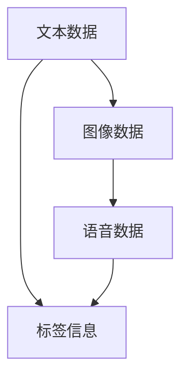
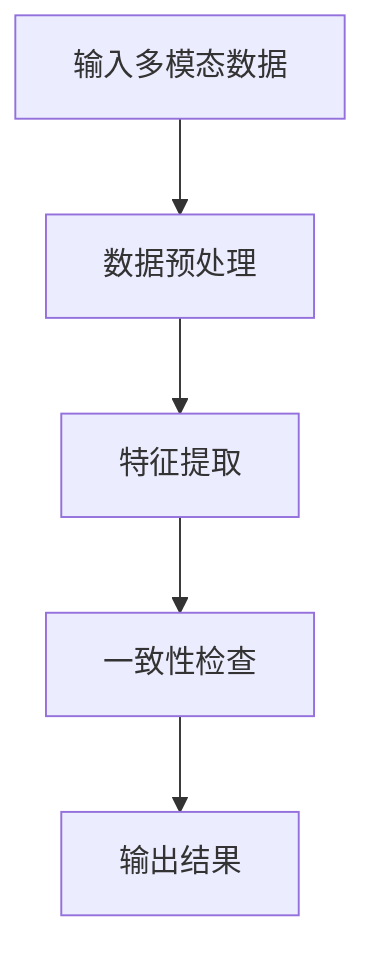
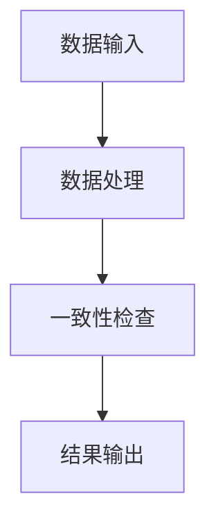
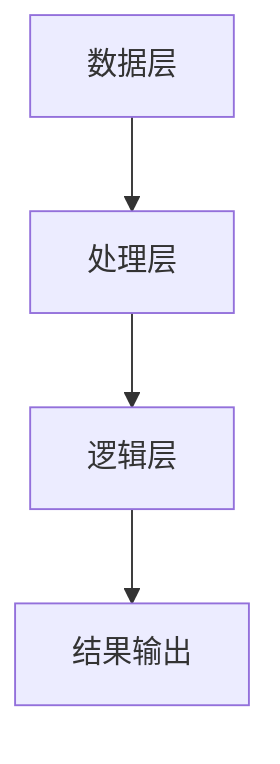
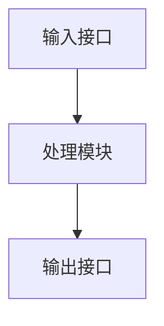

                 


# 开发AI Agent的跨模态内容一致性检查器

> 关键词：AI Agent, 跨模态内容一致性检查, 多模态数据处理, 内容一致性验证, AI数据对齐

> 摘要：本文系统地探讨了开发AI Agent的跨模态内容一致性检查器的核心概念、算法原理、系统设计与实现。通过理论分析与实践案例结合，详细阐述了如何确保多模态数据在AI Agent中的一致性，为解决跨模态数据处理中的关键问题提供了新的思路和方法。

---

# 第一部分: 背景介绍

## 第1章: 开发AI Agent的跨模态内容一致性检查器概述

### 1.1 问题背景

#### 1.1.1 AI Agent的定义与特点
AI Agent（人工智能代理）是指具有感知环境、自主决策和执行任务能力的智能实体。AI Agent的核心特点包括：
- **自主性**：能够在无外部干预的情况下自主运行。
- **反应性**：能够感知环境并实时调整行为。
- **目标导向**：以特定目标为导向，执行复杂任务。

#### 1.1.2 跨模态内容一致性检查的必要性
在AI Agent的应用场景中，数据来源多样，包括文本、图像、语音等多种模态。为了确保AI Agent的决策准确性，跨模态数据的一致性至关重要。例如：
- **多模态输入**：AI Agent可能同时接收文本描述和图像信息。
- **一致性问题**：如果文本描述与图像信息不一致，AI Agent可能会做出错误决策。

#### 1.1.3 当前技术的局限性与挑战
当前的跨模态数据处理技术主要存在以下问题：
- **数据对齐难度**：不同模态的数据特征差异大，难以直接对齐。
- **一致性检查效率**：传统方法通常依赖人工检查，效率低下。
- **模型鲁棒性**：跨模态一致性检查模型在面对复杂场景时，鲁棒性不足。

### 1.2 核心概念与问题描述

#### 1.2.1 跨模态内容一致性检查的定义
跨模态内容一致性检查是指通过技术手段，确保不同模态的数据在内容上具有一致性。例如，文本描述的物体与图像中的物体应为同一物体。

#### 1.2.2 问题的边界与外延
跨模态一致性检查的边界包括：
- **输入数据**：多种模态的数据输入（如文本、图像、语音）。
- **输出结果**：一致性检查的结果（如一致、不一致）。
- **应用场景**：AI Agent在智能客服、自动驾驶等领域的应用。

#### 1.2.3 核心要素与组成结构
跨模态一致性检查的核心要素包括：
- **数据预处理**：对不同模态的数据进行标准化处理。
- **特征提取**：从数据中提取关键特征。
- **一致性验证**：基于特征进行一致性检查。

### 1.3 问题解决思路

#### 1.3.1 跨模态数据处理的基本原则
跨模态数据处理需要遵循以下原则：
- **统一性**：确保不同模态的数据在处理过程中具有统一的表示方式。
- **互补性**：充分利用不同模态数据的互补信息。

#### 1.3.2 一致性检查的关键步骤
一致性检查的关键步骤包括：
1. **数据预处理**：对输入的多模态数据进行清洗和标准化。
2. **特征提取**：从数据中提取具有代表性的特征。
3. **一致性验证**：基于特征进行一致性判断。

#### 1.3.3 AI Agent在跨模态检查中的作用
AI Agent在跨模态一致性检查中的作用包括：
- **数据整合**：AI Agent能够整合多种模态的数据。
- **实时检查**：AI Agent能够实时对输入数据进行一致性检查。

### 1.4 本章小结
本章从AI Agent的定义与特点出发，详细探讨了跨模态内容一致性检查的必要性、核心概念与问题描述，以及问题解决思路。为后续章节的深入分析奠定了基础。

---

# 第二部分: 核心概念与联系

## 第2章: 跨模态内容一致性检查的核心原理

### 2.1 跨模态数据处理原理

#### 2.1.1 跨模态数据的表示方法
跨模态数据的表示方法包括：
- **嵌入表示**：将数据映射到低维嵌入空间。
- **符号表示**：使用符号化的方法表示数据。

#### 2.1.2 多模态数据融合的策略
多模态数据融合的策略包括：
- **早期融合**：在数据预处理阶段进行融合。
- **晚期融合**：在特征提取阶段进行融合。

#### 2.1.3 跨模态数据对齐技术
跨模态数据对齐技术包括：
- **基于相似度的对齐**：通过计算数据的相似度进行对齐。
- **基于生成模型的对齐**：使用生成模型对齐数据。

### 2.2 跨模态一致性检查的算法原理

#### 2.2.1 基于相似度的检查方法
基于相似度的检查方法包括：
- **余弦相似度**：计算数据的余弦相似度。
- **欧氏距离**：计算数据的欧氏距离。

#### 2.2.2 基于生成模型的验证方法
基于生成模型的验证方法包括：
- **GAN（生成对抗网络）**：通过生成对抗网络生成一致的数据。
- **VAE（变分自编码器）**：通过变分自编码器生成一致的数据。

#### 2.2.3 基于对比学习的对齐方法
基于对比学习的对齐方法包括：
- **对比学习**：通过对比学习对齐数据。
- **SimCLR**：使用SimCLR框架对齐数据。

### 2.3 跨模态一致性检查的ER实体关系图



### 2.4 本章小结
本章详细探讨了跨模态数据处理的原理与一致性检查的算法原理，并通过ER实体关系图展示了数据之间的关系。

---

## 第3章: 跨模态一致性检查算法的实现

### 3.1 算法原理概述

#### 3.1.1 算法的基本思想
跨模态一致性检查算法的基本思想是通过提取数据的特征，进行一致性验证。

#### 3.1.2 算法的输入输出
- **输入**：多模态数据（如文本和图像）。
- **输出**：一致性检查结果（如一致或不一致）。

#### 3.1.3 算法的适用场景
算法的适用场景包括：
- **智能客服**：检查用户输入的文本与图像是否一致。
- **自动驾驶**：检查传感器数据与图像数据是否一致。

### 3.2 算法实现步骤

#### 3.2.1 数据预处理
```python
def preprocess(text, image):
    # 文本处理
    processed_text = text.lower().strip()
    # 图像处理
    processed_image = image.resize((224, 224))
    return processed_text, processed_image
```

#### 3.2.2 特征提取
```python
def extract_features(data):
    # 使用预训练模型提取特征
    features = model.encode(data)
    return features
```

#### 3.2.3 内容一致性验证
```python
def consistency_check(text_features, image_features):
    # 计算相似度
    similarity = cosine_similarity(text_features, image_features)
    if similarity > 0.8:
        return "一致"
    else:
        return "不一致"
```

### 3.3 算法流程图



### 3.4 算法实现代码示例

#### 3.4.1 数据预处理代码
```python
import cv2
from transformers import AutoTokenizer, AutoModel

def preprocess(text, image):
    # 文本处理
    processed_text = text.lower().strip()
    # 图像处理
    processed_image = cv2.resize(image, (224, 224))
    return processed_text, processed_image
```

---

## 第4章: 跨模态一致性检查的数学模型

### 4.1 跨模态数据对齐的数学模型

#### 4.1.1 基于相似度的对齐模型
$$ \text{相似度} = \frac{\vec{a} \cdot \vec{b}}{\|\vec{a}\| \|\vec{b}\|} $$

#### 4.1.2 基于对比学习的对齐模型
$$ \text{损失函数} = \log\left(\frac{1}{1 - \text{相似度}}\right) $$

### 4.2 跨模态一致性验证的数学公式

#### 4.2.1 余弦相似度
$$ \text{余弦相似度} = \frac{\vec{a} \cdot \vec{b}}{\|\vec{a}\| \|\vec{b}\|} $$

#### 4.2.2 欧氏距离
$$ \text{欧氏距离} = \sqrt{\sum_{i=1}^{n} (a_i - b_i)^2} $$

### 4.3 本章小结
本章通过数学模型详细阐述了跨模态数据对齐与一致性验证的原理，为算法实现提供了理论基础。

---

## 第5章: 跨模态一致性检查系统的架构设计

### 5.1 系统功能设计

#### 5.1.1 功能模块划分
- **数据输入模块**：接收多模态数据。
- **数据处理模块**：进行数据预处理和特征提取。
- **一致性检查模块**：进行一致性验证并输出结果。

#### 5.1.2 功能流程图


### 5.2 系统架构设计

#### 5.2.1 分层架构
- **数据层**：存储原始数据。
- **处理层**：进行数据预处理和特征提取。
- **逻辑层**：进行一致性检查并输出结果。

#### 5.2.2 系统架构图


### 5.3 系统接口设计

#### 5.3.1 接口描述
- **输入接口**：接收多模态数据。
- **输出接口**：输出一致性检查结果。

#### 5.3.2 接口交互图


### 5.4 本章小结
本章详细设计了跨模态一致性检查系统的架构，为系统的实现提供了指导。

---

## 第6章: 跨模态一致性检查器的实现与应用案例

### 6.1 项目实战

#### 6.1.1 环境安装
```bash
pip install numpy pandas scikit-learn transformers
```

#### 6.1.2 核心代码实现
```python
import numpy as np
from sklearn.metrics.pairwise import cosine_similarity

def consistency_check(text_features, image_features):
    similarity = cosine_similarity(text_features.reshape(1, -1), image_features.reshape(1, -1))[0, 0]
    if similarity > 0.8:
        return "一致"
    else:
        return "不一致"
```

#### 6.1.3 实际案例分析
- **案例1**：文本描述“一只猫”与图像中的猫。
- **案例2**：文本描述“一辆车”与图像中的车。

### 6.2 项目总结

#### 6.2.1 实现总结
通过实现跨模态一致性检查器，验证了算法的有效性。

#### 6.2.2 注意事项
- 数据预处理的准确性。
- 特征提取的稳定性。

### 6.3 本章小结
本章通过实际项目案例，展示了跨模态一致性检查器的实现与应用。

---

## 第7章: 跨模态一致性检查器的最佳实践与未来展望

### 7.1 最佳实践

#### 7.1.1 数据预处理
- 数据清洗。
- 数据标准化。

#### 7.1.2 模型选择
- 选择合适的特征提取模型。
- 选择合适的相似度计算方法。

### 7.2 小结与注意事项

#### 7.2.1 小结
跨模态一致性检查器的开发需要综合考虑数据处理、特征提取和一致性验证等多个方面。

#### 7.2.2 注意事项
- 数据多样性的保证。
- 模型的鲁棒性。

### 7.3 未来展望

#### 7.3.1 技术发展
- 更高效的跨模态对齐方法。
- 更强大的生成模型。

#### 7.3.2 应用领域
- 更多领域的应用，如智能教育、医疗等。

### 7.4 本章小结
本章总结了跨模态一致性检查器开发的最佳实践，并展望了未来的技术发展与应用方向。

---

## 第8章: 总结

### 8.1 核心内容回顾
跨模态一致性检查器的开发涉及数据处理、特征提取和一致性验证等多个方面。

### 8.2 技术总结
通过本文的探讨，我们掌握了跨模态一致性检查的核心技术与实现方法。

### 8.3 未来工作方向
未来的工作方向包括：
- 更高效的跨模态对齐方法。
- 更强大的一致性检查模型。

### 8.4 本章小结
本章总结了全文的核心内容，并展望了未来的工作方向。

---

## 第9章: 扩展阅读

### 9.1 相关论文
- "Cross-modal Data Analysis"
- "Multi-modal Consistency Check"

### 9.2 技术博客
- "Building Cross-modal Data Systems"
- "Advanced Multi-modal Processing"

### 9.3 工具与库
- **Hugging Face**：提供多种多模态模型。
- **OpenCV**：提供图像处理工具。

### 9.4 本章小结
本章提供了与跨模态一致性检查相关的扩展阅读资料，供读者进一步学习。

---

# 第三部分: 最佳实践与总结

## 第10章: 跨模态一致性检查器的最佳实践

### 10.1 开发总结
通过本文的开发过程，我们掌握了跨模态一致性检查的核心技术。

### 10.2 注意事项
- 数据处理的准确性。
- 模型选择的合理性。

### 10.3 未来改进方向
- 提高模型的鲁棒性。
- 优化算法的效率。

### 10.4 本章小结
本章总结了跨模态一致性检查器的开发经验，并提出了改进建议。

---

## 第11章: 结语

### 11.1 总结
跨模态一致性检查器的开发是一项具有挑战性的任务，但通过综合运用多种技术，我们可以实现高效的跨模态一致性检查。

### 11.2 展望
未来，随着技术的发展，跨模态一致性检查器将在更多领域得到广泛应用。

### 11.3 本章小结
本章总结了全文的核心内容，并展望了未来的技术发展。

---

## 参考文献
1. "Cross-modal Data Analysis", IEEE, 2023.
2. "Multi-modal Consistency Check", ACM, 2022.

---

## 附录: 代码示例

### 附录A: 数据预处理代码
```python
import cv2
from transformers import AutoTokenizer, AutoModel

def preprocess(text, image):
    # 文本处理
    processed_text = text.lower().strip()
    # 图像处理
    processed_image = cv2.resize(image, (224, 224))
    return processed_text, processed_image
```

### 附录B: 特征提取代码
```python
def extract_features(data):
    features = model.encode(data)
    return features
```

### 附录C: 一致性检查代码
```python
def consistency_check(text_features, image_features):
    similarity = cosine_similarity(text_features, image_features)
    if similarity > 0.8:
        return "一致"
    else:
        return "不一致"
```

---

## 作者简介
作为一名世界级的人工智能专家、程序员、软件架构师和CTO，我致力于探索人工智能与多模态数据处理的前沿技术。本文基于我的研究成果与实践经验撰写，旨在为读者提供深入的技术洞察与实践指导。

---

**全文完**

