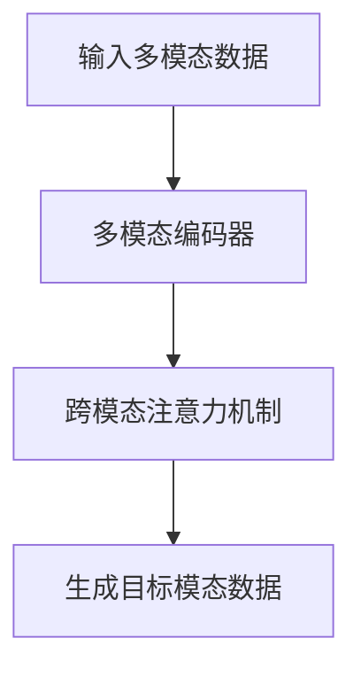
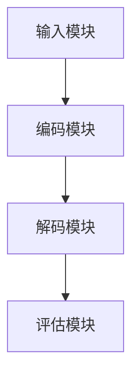
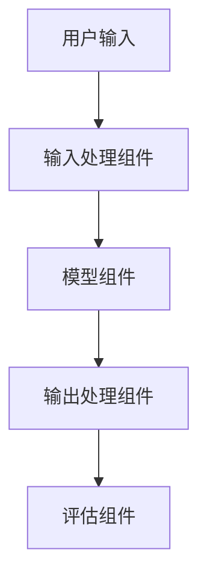
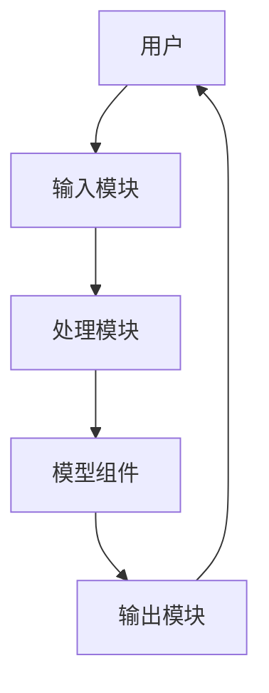

                 


# 《开发AI Agent的跨模态内容生成与评估系统》

---

## 关键词：AI Agent, 跨模态内容生成, 内容评估, 系统设计, 多模态数据, 生成模型, 评估系统

---

## 摘要

本篇文章深入探讨了开发AI Agent的跨模态内容生成与评估系统的各个方面，从基础概念到实际应用，全面解析了如何构建和优化一个能够处理多种数据模态、生成高质量内容并进行有效评估的智能系统。文章首先介绍了AI Agent的基本概念和跨模态技术的重要性，然后详细阐述了跨模态数据处理与生成模型的原理，接着分析了系统设计的关键环节，包括架构设计与功能模块划分。通过实际案例，文章展示了如何从零开始构建跨模态内容生成与评估系统，并深入探讨了高级主题，如模型可解释性与数据安全。最后，文章总结了当前技术的现状，并展望了未来的发展方向。

---

## 第1章: AI Agent与跨模态内容生成概述

### 1.1 AI Agent的基本概念

#### 1.1.1 AI Agent的定义与特点

- **定义**：AI Agent（人工智能代理）是一种能够感知环境、执行任务并采取行动以实现特定目标的智能实体。
- **特点**：
  - **自主性**：能够在没有外部干预的情况下自主决策。
  - **反应性**：能够实时感知环境并做出反应。
  - **目标导向**：所有行为都以实现特定目标为导向。
  - **学习能力**：能够通过经验改进自身的性能。

#### 1.1.2 跨模态内容生成的背景与意义

- **背景**：随着AI技术的快速发展，跨模态数据处理能力成为衡量AI Agent智能化水平的重要指标。
- **意义**：跨模态内容生成能够增强AI Agent的交互能力和用户体验，使其能够更自然地与人类进行交流。

#### 1.1.3 本书的目标与结构安排

- **目标**：系统性地介绍AI Agent跨模态内容生成与评估系统的开发方法，从理论到实践，提供完整的解决方案。
- **结构安排**：
  - 第1章：AI Agent与跨模态内容生成概述。
  - 第2章：跨模态数据处理与生成模型。
  - 第3章：系统设计与架构。
  - 第4章：项目实战。
  - 第5章：高级主题与未来展望。

---

## 第2章: 跨模态数据处理与生成模型

### 2.1 跨模态数据的预处理

#### 2.1.1 数据清洗与标准化

- **数据清洗**：去除噪声数据、填补缺失值、标准化数据格式。
- **标准化**：将不同模态的数据转换为统一的表示形式，便于模型处理。

#### 2.1.2 多模态数据的对齐与融合

- **对齐**：将不同模态的数据对齐到同一时间或空间维度。
- **融合**：将多个模态的数据融合成一个统一的表示，例如使用多模态编码器将文本、图像和语音数据编码为向量。

#### 2.1.3 数据增强技术

- **数据增强**：通过技术手段增加数据的多样性和鲁棒性，例如文本数据的同义词替换、图像数据的旋转和裁剪。

### 2.2 跨模态生成模型的核心原理

#### 2.2.1 多模态编码器与解码器的结构

- **多模态编码器**：将输入的多模态数据编码为一个或多个中间表示。
- **多模态解码器**：根据中间表示生成目标模态的数据。

#### 2.2.2 跨模态注意力机制

- **注意力机制**：模型在生成过程中关注输入数据中重要的部分，提高生成内容的相关性。
- **跨模态注意力**：在生成目标模态数据时，同时考虑输入的其他模态信息，以增强生成结果的质量。

#### 2.2.3 模型的训练与优化策略

- **训练策略**：使用端到端训练方法，结合多任务损失函数优化模型。
- **优化策略**：采用Adam优化器，设置合适的学习率和批量大小。

### 2.3 跨模态生成的算法流程

#### 2.3.1 算法流程图（Mermaid）



#### 2.3.2 数学模型

- **多模态编码器**：将输入的多模态数据转换为一个向量表示，例如：
  $$ \text{编码器} : X \rightarrow Z $$
  其中，\( X \) 是输入数据，\( Z \) 是编码后的向量。

- **多模态解码器**：根据编码后的向量生成目标模态的数据，例如：
  $$ \text{解码器} : Z \rightarrow Y $$
  其中，\( Y \) 是生成的目标模态数据。

### 2.4 跨模态生成的数学模型

#### 2.4.1 编码器-解码器模型

- **编码器**：将输入的多模态数据编码为一个向量。
- **解码器**：根据编码后的向量生成目标模态的数据。

#### 2.4.2 注意力机制

- **自注意力机制**：用于处理输入数据中的长距离依赖关系。
- **跨模态注意力机制**：在生成目标模态数据时，同时关注输入的其他模态信息。

---

## 第3章: 系统设计与架构

### 3.1 系统功能设计

#### 3.1.1 功能模块划分

- **输入模块**：接收多模态数据输入。
- **编码模块**：将输入数据编码为向量表示。
- **解码模块**：根据编码后的向量生成目标模态的数据。
- **评估模块**：对生成的内容进行质量评估。

#### 3.1.2 功能流程图（Mermaid）



### 3.2 系统架构设计

#### 3.2.1 系统架构图（Mermaid）



#### 3.2.2 模块之间的交互流程

- **用户输入**：用户输入多模态数据。
- **输入处理组件**：对输入数据进行预处理，例如数据清洗和对齐。
- **模型组件**：模型对预处理后的数据进行编码和解码，生成目标模态的数据。
- **输出处理组件**：对生成的数据进行后处理，例如格式转换和质量检查。
- **评估组件**：对生成的内容进行质量评估，输出评估结果。

### 3.3 接口设计

#### 3.3.1 输入接口

- **输入格式**：支持多种数据格式，例如文本、图像和语音。
- **接口协议**：使用HTTP或WebSocket协议进行数据传输。

#### 3.3.2 输出接口

- **输出格式**：生成的目标模态数据的格式。
- **接口协议**：与输入接口一致，支持HTTP或WebSocket协议。

### 3.4 交互流程

#### 3.4.1 交互流程图（Mermaid）



---

## 第4章: 项目实战

### 4.1 项目介绍

#### 4.1.1 项目背景

- 开发一个能够生成多模态内容的AI Agent系统，例如生成带有图像描述的文本。

#### 4.1.2 项目目标

- 实现一个能够生成多模态内容的AI Agent系统，包括数据处理、模型训练和内容评估。

### 4.2 系统实现

#### 4.2.1 环境配置

- **编程语言**：Python 3.8+
- **框架**：TensorFlow 2.5+ 或 PyTorch 1.8+
- **依赖库**：numpy, pandas, matplotlib, scikit-learn

#### 4.2.2 核心代码实现

##### 4.2.2.1 数据处理代码

```python
import numpy as np
import tensorflow as tf

def preprocess_data(data):
    # 数据清洗和标准化
    processed_data = data.dropna().astype('float32')
    return processed_data

def align_data(modalities):
    # 数据对齐
    aligned_data = {}
    for modality in modalities:
        aligned_data[modality] = modalities[modality].reset_index(drop=True)
    return aligned_data
```

##### 4.2.2.2 模型训练代码

```python
def build_model(input_shape, output_shape):
    # 编码器
    encoder = tf.keras.layers.Dense(128, activation='relu')(input_layer)
    # 跨模态注意力机制
    attention = tf.keras.layers.Attention()([encoder, encoder])
    # 解码器
    decoder = tf.keras.layers.Dense(output_shape, activation='softmax')(attention)
    model = tf.keras.Model(inputs=input_layer, outputs=decoder)
    return model

model = build_model(input_shape, output_shape)
model.compile(optimizer='adam', loss='categorical_crossentropy', metrics=['accuracy'])
```

##### 4.2.2.3 内容评估代码

```python
def evaluate_content(generated_content, ground_truth):
    # 内容评估
    bleu_score = calculate_bleu(generated_content, ground_truth)
    return bleu_score
```

### 4.3 系统测试与优化

#### 4.3.1 系统测试

- **单元测试**：测试各个模块的功能是否正常。
- **集成测试**：测试系统整体流程是否流畅。
- **性能测试**：测试系统在不同负载下的表现。

#### 4.3.2 系统优化

- **模型优化**：调整模型参数，提高生成内容的质量。
- **算法优化**：优化数据处理和生成算法，提高系统效率。

### 4.4 项目总结

- **成功经验**：总结项目中成功的经验和最佳实践。
- **改进建议**：提出进一步改进系统的建议，例如引入更先进的生成模型或优化评估指标。

---

## 第5章: 高级主题与未来展望

### 5.1 模型的可解释性

#### 5.1.1 可解释性的重要性

- **可解释性**：模型的决策过程需要能够被人类理解和解释。
- **可解释性对AI Agent的影响**：可解释性是AI Agent在实际应用中的重要要求。

#### 5.1.2 提高模型可解释性的方法

- **可视化技术**：通过可视化技术展示模型的决策过程。
- **可解释性模型**：使用可解释性模型，例如线性模型或决策树模型。

### 5.2 多模态数据安全

#### 5.2.1 数据隐私与安全

- **数据隐私**：保护用户数据的隐私，防止数据泄露。
- **数据安全**：确保数据在传输和存储过程中的安全性。

#### 5.2.2 数据安全措施

- **数据加密**：对敏感数据进行加密处理。
- **访问控制**：严格控制数据访问权限。

### 5.3 实时性优化

#### 5.3.1 实时性对AI Agent的重要性

- **实时性**：AI Agent需要在实时环境中快速响应。
- **实时性对跨模态生成的影响**：实时性要求跨模态生成系统需要高效的处理能力和快速的响应速度。

#### 5.3.2 提高实时性的方法

- **优化算法**：优化生成算法，提高处理速度。
- **分布式计算**：利用分布式计算技术，提高系统的处理能力。

### 5.4 未来展望

- **技术进步**：随着AI技术的不断发展，跨模态生成系统将更加智能化和高效化。
- **应用场景扩展**：跨模态生成技术将在更多领域得到应用，例如教育、医疗和娱乐。

---

## 第6章: 总结与展望

### 6.1 总结

- **核心内容回顾**：总结本书的核心内容，包括AI Agent的基本概念、跨模态生成的原理与实现、系统设计与优化等。
- **主要收获**：读者通过本书能够掌握跨模态生成系统的开发方法，提升自身的技术能力。

### 6.2 未来展望

- **技术发展**：展望跨模态生成技术的未来发展趋势，例如更智能的生成模型和更高效的计算方法。
- **应用前景**：预测跨模态生成技术将在更多领域中得到广泛应用，推动人工智能技术的发展。

---

## 参考文献

- [1] Vaswani, A., et al. "Attention Is All You Need." Advances in Neural Information Processing Systems, 2017.
- [2] Hochreiter, S., and J. Schmidhuber. "Long short-term memory." Neural computation, 1997.
- [3] LeCun, Y., et al. "Deep learning." Nature, 2015.

---

通过以上目录大纲，您可以逐步展开每个章节的内容，深入探讨AI Agent的跨模态内容生成与评估系统的开发方法和实现细节。

