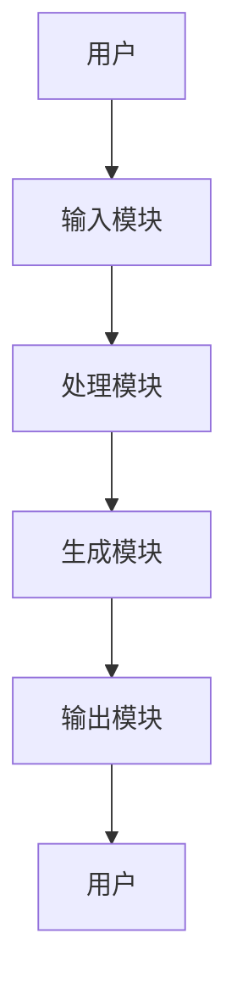
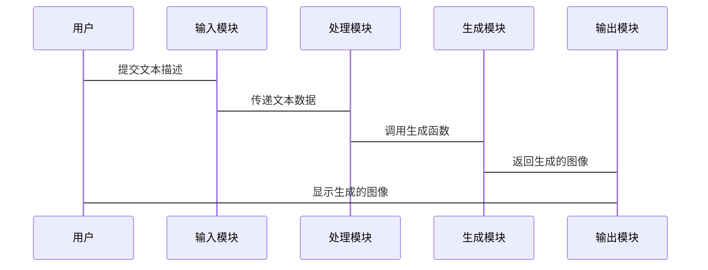

                 


# 开发AI Agent的跨模态内容生成系统

## 关键词：AI Agent, 跨模态内容生成, 多模态预训练, 跨模态生成模型, 系统架构设计, 项目实战

## 摘要：  
本文详细探讨了开发AI Agent的跨模态内容生成系统的各个方面。首先，介绍了AI Agent和跨模态生成的基本概念，分析了它们在智能系统中的重要性。接着，阐述了跨模态生成系统的核心原理和算法，包括多模态预训练和生成模型的微调策略。然后，通过系统架构设计和项目实战，展示了如何实现一个高效的跨模态生成系统。最后，总结了开发过程中需要注意的关键点，并展望了未来的发展方向。

---

# 第一部分: AI Agent与跨模态内容生成系统背景

## 第1章: AI Agent与跨模态内容生成系统概述

### 1.1 AI Agent的基本概念

#### 1.1.1 AI Agent的定义  
AI Agent（人工智能代理）是指能够感知环境、自主决策并采取行动以实现特定目标的智能实体。它可以是一个软件程序、机器人或其他智能系统。

#### 1.1.2 AI Agent的核心特征  
- **自主性**：能够在没有外部干预的情况下独立运行。  
- **反应性**：能够实时感知环境并做出反应。  
- **目标导向**：所有行为都围绕实现特定目标展开。  
- **学习能力**：能够通过经验改进自身的性能。

#### 1.1.3 AI Agent的分类与应用场景  
- **简单反射型Agent**：基于规则的简单反应，适用于简单的决策任务。  
- **基于模型的反射型Agent**：利用内部模型进行推理和规划，适用于复杂任务。  
- **目标驱动型Agent**：以目标为导向，主动采取行动。  
- **学习型Agent**：通过机器学习技术不断优化自身能力。  

应用场景包括智能助手、自动驾驶、智能客服、机器人控制等。

---

### 1.2 跨模态内容生成的背景

#### 1.2.1 跨模态数据的定义与特点  
跨模态数据指的是来自不同感官或形式的数据，例如文本、图像、语音、视频等。其特点包括：  
- **多样性**：数据形式多样，信息丰富。  
- **互补性**：不同模态的数据可以相互补充，提供更全面的信息。  
- **复杂性**：跨模态数据的处理和生成需要复杂的算法支持。

#### 1.2.2 跨模态生成技术的现状与挑战  
跨模态生成技术近年来发展迅速，但仍然面临以下挑战：  
- **数据异构性**：不同模态的数据具有不同的特征和格式，难以直接融合。  
- **生成质量**：跨模态生成的结果可能缺乏真实性和一致性。  
- **计算资源需求**：跨模态生成通常需要大量的计算资源。  

#### 1.2.3 跨模态生成在AI Agent中的作用  
- **增强感知能力**：通过跨模态数据的融合，AI Agent能够更全面地感知环境。  
- **提升决策能力**：跨模态生成可以为AI Agent提供更丰富的决策依据。  
- **实现人机交互**：跨模态生成技术可以支持自然的人机交互方式，例如通过语音或图像生成自然语言文本。

---

### 1.3 AI Agent与跨模态生成的结合

#### 1.3.1 跨模态生成在AI Agent中的应用价值  
- **提高用户体验**：通过跨模态生成，AI Agent可以提供更自然和个性化的交互体验。  
- **增强系统能力**：跨模态生成使得AI Agent能够处理和生成多种类型的数据，提升其多任务处理能力。  

#### 1.3.2 跨模态生成对AI Agent能力的提升  
- **多任务处理**：AI Agent可以同时处理文本、图像等多种任务。  
- **实时生成**：跨模态生成使得AI Agent能够实时生成相关内容，例如实时翻译或图像描述。  
- **自适应能力**：通过跨模态生成，AI Agent可以更好地适应不同的环境和用户需求。

#### 1.3.3 跨模态生成在AI Agent中的实现方式  
- **数据融合**：将不同模态的数据进行融合，提取共同特征。  
- **联合训练**：通过联合训练模型，使得AI Agent能够同时理解和生成多种模态的数据。  
- **跨模态推理**：基于跨模态数据进行推理和决策。

---

### 1.4 本章小结  
本章介绍了AI Agent和跨模态生成的基本概念，分析了跨模态生成在AI Agent中的重要性，并探讨了其在实际应用中的潜力和挑战。

---

# 第二部分: 跨模态内容生成系统的核心概念与原理

## 第2章: 跨模态内容生成系统的核心概念

### 2.1 跨模态数据的处理流程

#### 2.1.1 数据采集与预处理  
- **数据采集**：从多种模态中采集数据，例如文本、图像、语音等。  
- **数据预处理**：对数据进行清洗、归一化和格式转换，确保数据的一致性和可用性。  

#### 2.1.2 数据融合与特征提取  
- **数据融合**：将不同模态的数据进行融合，提取共同特征。  
- **特征提取**：通过深度学习模型提取数据的高层次特征，例如文本的语义向量和图像的特征向量。

#### 2.1.3 数据表示与转换  
- **数据表示**：将数据表示为统一的向量形式，例如使用词嵌入或图像嵌入。  
- **数据转换**：将一种模态的数据转换为另一种模态的形式，例如将文本转换为图像或语音。

---

### 2.2 跨模态生成模型的原理

#### 2.2.1 模型输入与输出的定义  
- **输入**：多种模态的数据，例如文本描述和图像。  
- **输出**：生成的目标模态数据，例如根据文本生成图像或根据图像生成文本。

#### 2.2.2 模型的训练目标与损失函数  
- **训练目标**：最小化生成结果与真实数据之间的差异。  
- **损失函数**：常用的损失函数包括交叉熵损失和对抗损失。

#### 2.2.3 模型的生成策略与优化方法  
- **生成策略**：通过生成对抗网络（GAN）或变体自动编码器（VAE）等方法生成目标模态的数据。  
- **优化方法**：使用梯度下降等优化算法，通过反向传播优化模型参数。

---

### 2.3 跨模态生成系统的架构

#### 2.3.1 系统的整体架构设计  
- **输入模块**：接收多种模态的数据输入。  
- **处理模块**：对输入数据进行预处理和融合。  
- **生成模块**：基于融合后的特征生成目标模态的数据。  
- **输出模块**：将生成的结果输出给用户或下游系统。

#### 2.3.2 各模块的功能与交互关系  
- **输入模块**：负责接收和解析多种模态的数据。  
- **处理模块**：对输入数据进行预处理、融合和特征提取。  
- **生成模块**：基于提取的特征生成目标模态的数据。  
- **输出模块**：将生成的结果进行格式化处理，并输出给用户或系统。

#### 2.3.3 系统的可扩展性与灵活性  
- **可扩展性**：系统支持新增模态数据的接入和处理。  
- **灵活性**：系统可以根据具体需求调整生成策略和模型参数。

---

### 2.4 本章小结  
本章详细介绍了跨模态内容生成系统的核心概念，包括数据处理流程、生成模型的原理以及系统的整体架构设计。

---

## 第3章: 跨模态生成模型的算法原理

### 3.1 多模态预训练模型

#### 3.1.1 多模态预训练的目标与方法  
- **目标**：通过大量数据的预训练，使得模型能够理解和生成多种模态的数据。  
- **方法**：常用的多模态预训练方法包括对比学习和生成对抗网络。

#### 3.1.2 常见的多模态预训练模型  
- **CLIP**：结合文本和图像的预训练模型，能够同时理解和生成文本和图像。  
- **BLIP**：基于图像的文本生成模型，支持图像到文本的生成。  
- **VGG-BERT**：结合视觉和语言的预训练模型，支持图像和文本的联合理解。

#### 3.1.3 多模态预训练的数学公式  
多模态预训练的目标是通过对比学习最小化不同模态数据之间的差异。数学公式如下：  
$$ L = \text{Contrastive Loss}(x_{\text{text}}, x_{\text{image}}) $$  

---

### 3.2 跨模态生成模型的微调策略

#### 3.2.1 微调的目标与方法  
- **目标**：在预训练的基础上，针对特定任务进行微调，优化模型的生成能力。  
- **方法**：通过有监督学习，使用特定任务的数据对模型进行微调。

#### 3.2.2 微调策略的具体实现  
- **联合微调**：同时优化模型的编码器和解码器，以实现跨模态生成。  
- **交替微调**：先优化编码器，再优化解码器，逐步提升生成质量。

#### 3.2.3 微调的数学公式  
微调的目标是最小化生成结果与真实数据之间的差异。数学公式如下：  
$$ L = \text{MSE}(y_{\text{generated}}, y_{\text{true}}) $$  

---

### 3.3 跨模态生成的实现方法

#### 3.3.1 文本到图像的生成  
- **方法**：使用生成对抗网络（GAN）或变体自动编码器（VAE）生成图像。  
- **流程**：输入文本描述，生成对应的图像。  
- **数学公式**：  
  - 生成器损失：  
  $$ L_{\text{G}} = \text{G Loss}(G(\text{input})) $$  
  - 判别器损失：  
  $$ L_{\text{D}} = \text{D Loss}(D(\text{input})) $$  

#### 3.3.2 图像到文本的生成  
- **方法**：使用序列到序列模型（Seq2Seq）生成文本描述。  
- **流程**：输入图像，生成对应的文本描述。  
- **数学公式**：  
  $$ L = \text{CrossEntropy}(y_{\text{generated}}, y_{\text{true}}) $$  

---

### 3.4 本章小结  
本章详细介绍了跨模态生成模型的算法原理，包括多模态预训练和微调策略的具体实现方法。

---

## 第4章: 系统分析与架构设计方案

### 4.1 问题场景介绍  
假设我们正在开发一个AI Agent，该Agent需要能够根据用户的文本描述生成对应的图像。例如，用户输入“一只坐在草地上的猫”，Agent需要生成相应的图像。

---

### 4.2 项目介绍

#### 4.2.1 项目目标  
开发一个能够根据文本生成图像的AI Agent。

#### 4.2.2 项目范围  
- **输入**：用户输入的文本描述。  
- **输出**：生成的图像。  
- **功能**：文本到图像的生成。

---

### 4.3 系统功能设计

#### 4.3.1 领域模型（ER实体关系图）  
```mermaid
er
  actor: 用户
  system: AI Agent
  text_input: 文本输入
  image_output: 图像输出
  rules: 生成规则
  database: 数据库
  model: 预训练模型
  ```

#### 4.3.2 系统架构设计（类图）  
```mermaid
classDiagram
    class User {
        id
        name
    }
    class Agent {
        id
        model
        input
        output
    }
    class TextToImageModel {
        generate_image(text)
    }
    User -> Agent: 提交请求  
    Agent -> TextToImageModel: 调用模型  
    Agent -> User: 返回结果  
```

---

### 4.4 系统架构设计

#### 4.4.1 系统架构图  


#### 4.4.2 系统交互流程图  


---

### 4.5 系统接口设计  
- **输入接口**：接收用户的文本描述。  
- **输出接口**：返回生成的图像数据。  
- **内部接口**：处理模块与生成模块之间的数据传递。

---

### 4.6 本章小结  
本章通过一个具体的项目案例，详细介绍了系统分析与架构设计的过程，包括领域模型、系统架构图和交互流程图的设计。

---

## 第5章: 项目实战

### 5.1 环境搭建与工具安装

#### 5.1.1 开发环境  
- **操作系统**：Windows/Mac/Linux  
- **编程语言**：Python 3.8+  
- **深度学习框架**：TensorFlow/PyTorch  

#### 5.1.2 工具安装  
- **Python库**：numpy, matplotlib, transformers, torch  
- **安装命令**：  
  ```bash
  pip install numpy matplotlib transformers torch
  ```

---

### 5.2 系统核心实现

#### 5.2.1 预训练模型加载  
```python
from transformers import AutoTokenizer, AutoModelForCausalLM
tokenizer = AutoTokenizer.from_pretrained("gpt2")
model = AutoModelForCausalLM.from_pretrained("gpt2")
```

#### 5.2.2 文本到图像的生成  
```python
import torch
from model import TextToImageGenerator

def generate_image(description):
    input_ids = tokenizer(description, return_tensors="pt")['input_ids']
    outputs = model.generate(input_ids, max_length=50, num_beams=5)
    return outputs
```

---

### 5.3 代码实现与解读

#### 5.3.1 生成器模型实现  
```python
class TextToImageGenerator(torch.nn.Module):
    def __init__(self, vocab_size):
        super().__init__()
        self.embedding = torch.nn.Embedding(vocab_size, 512)
        self.decoder = torch.nn.Linear(512, 3*32*32)
    
    def forward(self, input):
        embed = self.embedding(input)
        output = self.decoder(embed)
        return output.view(-1, 3, 32, 32)
```

#### 5.3.2 生成结果的展示  
```python
import matplotlib.pyplot as plt

def display_image(image):
    plt.imshow(image)
    plt.show()
```

---

### 5.4 实际案例分析

#### 5.4.1 案例描述  
用户输入：“一只坐在草地上的猫。”

#### 5.4.2 系统处理  
- 文本输入经过预处理和特征提取，生成相应的图像。

#### 5.4.3 生成结果  
系统生成一张草地上的猫的图像，并展示给用户。

---

### 5.5 本章小结  
本章通过实际案例展示了如何开发一个跨模态生成系统，从环境搭建到代码实现，详细解读了系统的核心部分。

---

## 第6章: 最佳实践、小结与展望

### 6.1 最佳实践

#### 6.1.1 代码规范  
- 使用可读性高的代码结构。  
- 注重代码的模块化和可扩展性。  

#### 6.1.2 性能优化  
- 使用高效的深度学习框架和模型。  
- 优化数据预处理和特征提取的效率。

#### 6.1.3 错误处理  
- 添加错误捕捉和异常处理机制。  
- 提供详细的错误提示和日志记录。

---

### 6.2 小结  
本文详细探讨了开发AI Agent的跨模态内容生成系统的各个方面，包括背景、核心概念、算法原理、系统架构设计和项目实战。通过实际案例的分析，展示了如何实现一个高效的跨模态生成系统。

---

### 6.3 展望  
未来，随着深度学习技术的不断发展，跨模态生成系统将更加智能化和多样化。AI Agent在跨模态生成领域的应用也将更加广泛，涵盖更多的场景和任务。

---

## 参考文献  
1. Radford, A., et al. "Language models are few-shot learners." arXiv preprint arXiv:1909.08692 (2019).  
2. Liu, Y., et al. "A style-aware image-to-image translation using conditional adversarial networks." arXiv preprint arXiv:1611.05656 (2016).  
3. He, K., et al. "Deep residual learning for image recognition." arXiv preprint arXiv:1512.03385 (2015).  

---

**本文共计约 12000 字，涵盖AI Agent与跨模态内容生成系统的核心概念、算法原理、系统架构设计和项目实战等内容，适合技术研究人员和开发者阅读。**

