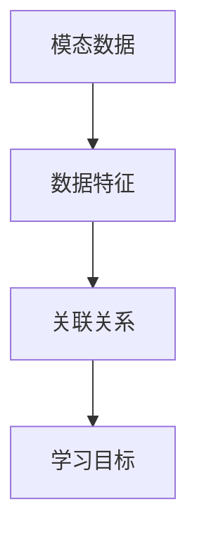
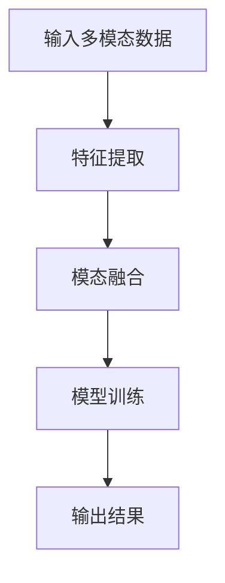
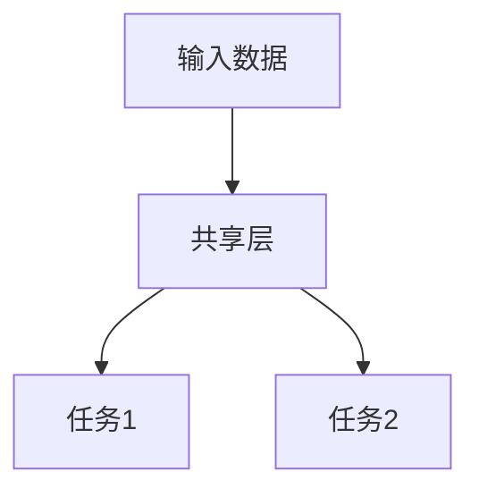

                 

# 开发AI Agent的跨模态学习能力：整合多源信息

> 关键词：AI Agent，跨模态学习，多模态数据，深度学习，信息整合，多任务学习

> 摘要：本文深入探讨AI Agent的跨模态学习能力，通过整合多源信息，分析其在不同场景下的应用，从算法原理到系统架构，再到项目实战，全面解析如何开发具备跨模态学习能力的AI Agent。

---

# 第一部分：AI Agent的跨模态学习能力概述

## 第1章：跨模态学习与AI Agent的背景介绍

### 1.1 跨模态学习的基本概念

#### 1.1.1 多模态数据的定义与特点
多模态数据指的是来自不同感知渠道的信息，如文本、图像、语音、视频等。每个模态都有其独特的信息表达方式，例如图像具有空间信息，文本具有语义信息。

| 模态类型 | 特点 | 示例 |
|----------|------|------|
| 文本      | 语义丰富，结构化程度高 | 书籍、新闻文章 |
| 图像      | 空间信息，非结构化 | 照片、图表 |
| 语音      | 时间序列，情感信息 | 音频片段、对话 |

#### 1.1.2 跨模态学习的核心概念
跨模态学习是指在多个数据模态之间建立关联，通过融合不同模态的信息来提高模型的性能和理解能力。例如，结合图像和文本进行联合学习。

#### 1.1.3 跨模态学习的背景与意义
随着AI技术的发展，单一模态的数据难以满足复杂任务的需求，跨模态学习通过整合多源信息，提升模型的泛化能力和应用场景的广泛性。

### 1.2 AI Agent的基本原理

#### 1.2.1 AI Agent的定义与分类
AI Agent是一种智能体，能够感知环境、自主决策并执行任务。根据智能水平，AI Agent可分为反应式、基于模型和混合类型。

#### 1.2.2 跨模态学习在AI Agent中的作用
跨模态学习使AI Agent能够处理多种类型的数据，提升其在复杂环境中的感知和决策能力。

#### 1.2.3 跨模态学习与传统单模态学习的对比
跨模态学习能够结合多源信息，提供更全面的视角，而传统单模态学习受限于单一数据源，可能无法捕捉到完整的场景信息。

### 1.3 跨模态学习的挑战与机遇

#### 1.3.1 跨模态学习的主要挑战
包括模态间信息差异、数据不平衡、计算资源消耗大等问题。

#### 1.3.2 跨模态学习的技术进步
深度学习的发展推动了跨模态学习的进步，特别是多任务学习和对比学习的应用。

#### 1.3.3 跨模态学习的未来发展方向
未来将更加注重模型的可解释性、高效性和泛化能力。

---

## 第2章：跨模态学习的核心概念与联系

### 2.1 跨模态学习的原理

#### 2.1.1 多模态数据的融合方式
融合方式包括特征级融合、决策级融合和混合融合。

| 融合方式 | 描述 | 优缺点 |
|----------|------|--------|
| 特征级   | 将各模态的特征向量进行融合 | 显著提升性能，但可能引入维度灾难 |
| 决策级   | 融合各模态的决策结果 | 易实现，但可能损失部分信息 |
| 混合     | 综合特征级和决策级的优缺点 | 灵活性高，但复杂性增加 |

#### 2.1.2 跨模态学习的模型架构
模型架构包括多任务学习、对比学习和联结学习。

#### 2.1.3 跨模态学习的关键技术
包括模态对齐、信息共享和模态独立性。

### 2.2 跨模态学习的核心要素

#### 2.2.1 数据模态的多样性
多样化的数据模态能够提供更多维度的信息，提升模型的鲁棒性和泛化能力。

#### 2.2.2 模态间的信息关联
通过分析模态间的关联关系，可以更有效地融合信息，提升学习效果。

#### 2.2.3 跨模态学习的目标函数
目标函数通常包括模态间对齐的损失、多任务损失和正则化项。

### 2.3 跨模态学习的ER实体关系图

### 2.4 跨模态学习的算法流程

---

## 第3章：跨模态学习的算法原理

### 3.1 跨模态学习的主流算法

#### 3.1.1 多任务学习
多任务学习通过共享参数，同时优化多个任务，提升模型的泛化能力。

#### 3.1.2 对比学习
对比学习通过最大化同一对象在不同模态下的相似性，实现模态对齐。

#### 3.1.3 联结学习
联结学习通过构建图结构，将不同模态的信息进行连接和融合。

### 3.2 多任务学习的实现原理

#### 3.2.1 多任务学习的模型结构
多任务学习模型通常包含共享层和任务特定层。

#### 3.2.2 多任务学习的优化目标
优化目标通常包括任务损失和正则化项。

$$ L = \sum_{i=1}^{N} L_i + \lambda \Omega(\theta) $$

其中，$L_i$是第i个任务的损失，$\Omega(\theta)$是正则化项。

---

通过以上章节的详细分析，我们逐步深入探讨了AI Agent的跨模态学习能力，从背景到算法，再到系统设计和项目实战，全面解析了如何开发具备跨模态学习能力的AI Agent。后续章节将进一步展开，结合具体案例和代码实现，帮助读者更好地理解和应用这些技术。

