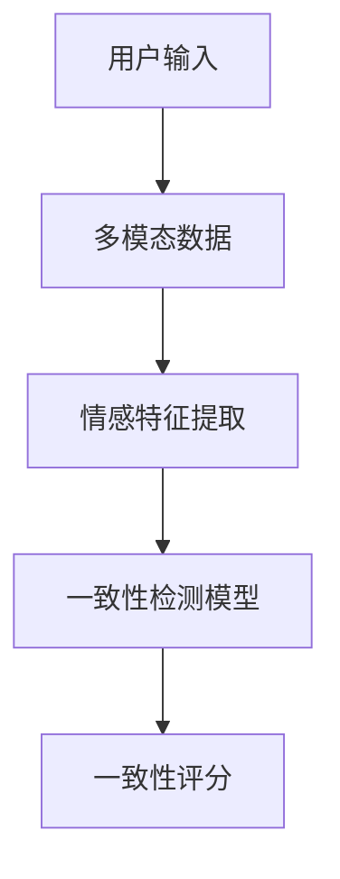
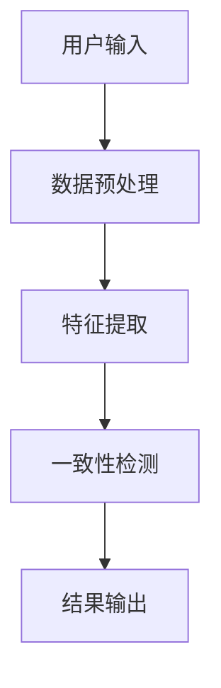
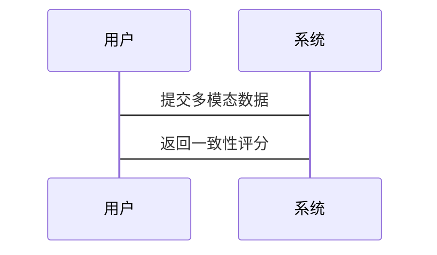

                 


# 开发AI Agent的跨模态情感一致性检测

> **关键词**：AI Agent、跨模态数据、情感一致性检测、深度学习、多模态融合、情感分析

> **摘要**：  
本文详细探讨了开发AI Agent的跨模态情感一致性检测的核心概念、算法原理、系统架构和项目实现。通过分析跨模态数据的特征提取、情感一致性检测的数学模型以及系统架构设计，本文为AI Agent的开发提供了理论基础和实践指导。文章还通过实际案例分析，展示了跨模态情感一致性检测在AI Agent中的应用价值和实现方法。

---

# 第一部分: 跨模态情感一致性检测的背景与概念

## 第1章: 跨模态情感一致性检测的背景与问题定义

### 1.1 跨模态数据与情感分析的结合

#### 1.1.1 跨模态数据的定义与特点  
跨模态数据是指来自不同感知渠道的数据，例如文本、语音、图像、视频等。这些数据具有以下特点：  
- **多样性**：包含多种类型的信息，能够提供更全面的语义理解。  
- **互补性**：不同模态的数据可以相互补充，提升信息的准确性和丰富性。  
- **复杂性**：跨模态数据的处理需要解决数据异构性和模态间关联性问题。

#### 1.1.2 情感分析的基本概念与挑战  
情感分析是自然语言处理（NLP）中的一个经典任务，旨在判断文本中蕴含的情感倾向（如正面、负面、中性）。然而，传统的情感分析仅局限于单一模态的数据，无法充分利用多模态信息的优势。例如，结合语音语调和面部表情可以更准确地判断用户的情感状态。

#### 1.1.3 跨模态情感一致性检测的提出背景  
在AI Agent的实际应用中，跨模态数据的处理变得尤为重要。例如，在智能客服系统中，用户可能通过文本、语音和表情图片等多种方式表达情感。AI Agent需要能够准确理解这些跨模态数据中情感的一致性，以提供更精准的服务。

---

### 1.2 跨模态情感一致性检测的定义与问题描述

#### 1.2.1 跨模态情感一致性检测的核心概念  
跨模态情感一致性检测是指在多模态数据中，判断不同模态的情感表达是否一致的过程。例如，当用户在文本中表达“我非常生气”，但语音语调和面部表情却显得平静，这种情况下，情感一致性检测需要识别这种不一致。

#### 1.2.2 问题背景与实际应用场景  
- **问题背景**：跨模态数据中的情感表达可能存在不一致，导致AI Agent的理解出现偏差。  
- **实际应用场景**：智能客服、虚拟助手、社交机器人等。

#### 1.2.3 问题解决的必要性与意义  
- **必要性**：跨模态情感一致性检测能够提升AI Agent对复杂情感表达的识别能力。  
- **意义**：通过一致性检测，AI Agent可以更准确地理解用户意图，提供更个性化的服务。

---

### 1.3 跨模态情感一致性检测的边界与外延

#### 1.3.1 跨模态数据的边界条件  
- 数据模态的种类有限。  
- 数据量较小，难以训练复杂的跨模态模型。  

#### 1.3.2 情感一致性检测的适用范围  
- 适用于多模态数据融合的场景。  
- 适用于需要精准情感理解的AI Agent开发。  

#### 1.3.3 与其他相关问题的区别与联系  
- **区别**：跨模态情感一致性检测关注的是不同模态之间的情感一致性，而传统情感分析仅关注单一模态。  
- **联系**：跨模态情感一致性检测可以作为多模态情感分析的子任务。

---

### 1.4 跨模态情感一致性检测的核心要素组成

#### 1.4.1 数据输入的多样性  
跨模态数据可能包含文本、语音、图像等多种模态的信息。  

#### 1.4.2 情感特征的提取方法  
- 文本：词袋模型、词嵌入（如Word2Vec、BERT）。  
- 语音：情感特征提取（如MFCC、声学特征）。  
- 图像：表情识别（如面部表情特征提取）。  

#### 1.4.3 一致性检测的评价标准  
- 一致性评分：0（完全不一致）到1（完全一致）。  
- 误差率：检测错误的比例。  

---

## 第2章: 跨模态情感一致性检测的核心概念与联系

### 2.1 跨模态数据处理的核心原理

#### 2.1.1 多模态数据融合的基本方法  
- **特征融合**：将不同模态的特征向量拼接或加权融合。  
- **对齐与匹配**：通过模态间特征的对齐，消除异构性的影响。  

#### 2.1.2 跨模态特征提取的关键技术  
- **模态转换**：将一种模态的特征转换为另一种模态的特征（如将图像特征转换为文本描述）。  
- **多模态注意力机制**：通过注意力机制，聚焦于不同模态的关键特征。  

#### 2.1.3 跨模态数据的表示与转换  
- **表示学习**：通过深度学习模型（如BERT、ResNet）提取模态特征。  
- **模态间对齐**：通过对比学习或对齐损失，使不同模态的特征具有相似性。  

---

### 2.2 跨模态情感一致性检测的原理与机制

#### 2.2.1 情感一致性检测的定义与实现  
跨模态情感一致性检测的目标是判断不同模态的情感表达是否一致。其实现过程包括以下步骤：  
1. 提取各模态的情感特征。  
2. 对齐不同模态的特征。  
3. 计算一致性评分。  

#### 2.2.2 跨模态数据的情感关联性分析  
通过分析不同模态数据之间的关联性，可以发现情感表达的规律。例如，愤怒的语音特征可能与愤怒的面部表情特征高度相关。  

#### 2.2.3 情感一致性的度量与评价  
- **余弦相似度**：衡量不同模态情感特征的相似性。  
- **Jaccard相似度**：衡量情感类别的一致性。  

---

### 2.3 跨模态情感一致性检测的核心概念对比表

| 概念 | 描述 |
|------|------|
| 跨模态数据 | 包含多种数据类型（如文本、语音、图像） |
| 情感一致性 | 不同模态数据中情感表达的一致性程度 |
| 特征提取 | 从数据中提取关键特征用于一致性检测 |
| 模型训练 | 基于训练数据构建一致性检测模型 |

---

### 2.4 跨模态情感一致性检测的ER实体关系图



---

## 第3章: 跨模态情感一致性检测的算法原理

### 3.1 跨模态情感一致性检测的算法框架

#### 3.1.1 基于深度学习的跨模态匹配  
- **模型结构**：使用双向长短期记忆网络（BiLSTM）提取文本特征，使用卷积神经网络（CNN）提取图像特征。  
- **匹配方法**：通过注意力机制对齐不同模态的特征。  

#### 3.1.2 基于注意力机制的情感特征提取  
- **注意力机制**：在特征提取过程中，关注与情感相关的关键部分。  
- **实现步骤**：  
  1. 提取各模态的初始特征。  
  2. 使用注意力机制生成注意力权重。  
  3. 加权求和得到情感特征。  

#### 3.1.3 跨模态一致性评分模型  
- **模型结构**：使用全连接层对齐不同模态的特征，计算一致性评分。  
- **损失函数**：交叉熵损失用于分类任务，均方误差用于回归任务。  

---

### 3.2 跨模态情感一致性检测的数学模型

#### 3.2.1 多模态数据表示  
假设输入包括文本和图像两种模态，文本特征为$T \in \mathbb{R}^{d_t}$，图像特征为$I \in \mathbb{R}^{d_i}$，其中$d_t$和$d_i$分别为文本和图像的特征维度。  

#### 3.2.2 跨模态特征对齐  
通过线性变换对齐不同模态的特征：  
$$ T' = W_t T + b_t $$  
$$ I' = W_i I + b_i $$  
其中，$W_t$和$W_i$是对齐矩阵，$b_t$和$b_i$是偏置项。  

#### 3.2.3 一致性评分计算  
通过对比学习计算一致性评分：  
$$ s = \text{sim}(T', I') $$  
其中，$\text{sim}$表示相似度计算函数（如余弦相似度）。  

#### 3.2.4 模型训练  
定义损失函数：  
$$ \mathcal{L} = \text{MSE}(s, y) $$  
其中，$y$是真实的一致性评分。  

---

## 第4章: 跨模态情感一致性检测的系统分析与架构设计

### 4.1 系统功能设计

#### 4.1.1 功能模块  
1. **数据输入模块**：接收多模态数据输入。  
2. **特征提取模块**：提取各模态的情感特征。  
3. **一致性检测模块**：计算不同模态之间的情感一致性评分。  
4. **结果输出模块**：输出一致性评分或情感标签。  

#### 4.1.2 功能流程  
1. 用户输入多模态数据。  
2. 系统提取各模态的特征。  
3. 系统对齐特征并计算一致性评分。  
4. 系统输出结果。  

---

### 4.2 系统架构设计

#### 4.2.1 系统架构图  


#### 4.2.2 接口设计  
- **输入接口**：接收多模态数据。  
- **输出接口**：输出一致性评分或情感标签。  

#### 4.2.3 交互流程图  


---

## 第5章: 跨模态情感一致性检测的项目实战

### 5.1 项目环境与依赖安装

#### 5.1.1 环境要求  
- Python 3.8及以上版本。  
- GPU支持（推荐NVIDIA GPU）。  

#### 5.1.2 依赖安装  
安装必要的库：  
```bash
pip install numpy torch transformers matplotlib
```

---

### 5.2 核心代码实现

#### 5.2.1 特征提取模块  
```python
import torch
import torch.nn as nn

class TextFeatureExtractor(nn.Module):
    def __init__(self, input_dim, hidden_dim):
        super(TextFeatureExtractor, self).__init__()
        self.fc = nn.Linear(input_dim, hidden_dim)
    
    def forward(self, x):
        x = self.fc(x)
        return x

# 示例输入
input_text = torch.randn(1, 100)  # 假设输入维度为100
model = TextFeatureExtractor(100, 50)
output = model(input_text)
print(output.shape)  # 输出维度为 (1, 50)
```

#### 5.2.2 一致性检测模型  
```python
class ConsistencyDetector(nn.Module):
    def __init__(self, input_dim):
        super(ConsistencyDetector, self).__init__()
        self.fc = nn.Linear(input_dim, 1)
        self.sigmoid = nn.Sigmoid()
    
    def forward(self, x):
        x = self.fc(x)
        x = self.sigmoid(x)
        return x

# 示例输入
input_features = torch.randn(1, 50)
model = ConsistencyDetector(50)
output = model(input_features)
print(output)  # 输出范围在 0 到 1 之间
```

---

### 5.3 案例分析与实际应用

#### 5.3.1 数据集准备  
- 文本数据：用户评论（带情感标签）。  
- 语音数据：用户的语音片段（带情感标签）。  
- 图像数据：用户的面部表情图片（带情感标签）。  

#### 5.3.2 模型训练  
```python
# 定义损失函数和优化器
criterion = nn.BCELoss()
optimizer = torch.optim.Adam(detector.parameters(), lr=0.001)

# 训练过程
for epoch in range(num_epochs):
    for batch in dataloader:
        optimizer.zero_grad()
        inputs, labels = batch['features'], batch['labels']
        outputs = detector(inputs)
        loss = criterion(outputs, labels)
        loss.backward()
        optimizer.step()
```

#### 5.3.3 模型评估  
```python
# 计算准确率
with torch.no_grad():
    correct = 0
    total = 0
    for batch in test_dataloader:
        inputs, labels = batch['features'], batch['labels']
        outputs = detector(inputs)
        predicted = (outputs > 0.5).float()
        correct += (predicted == labels).sum().item()
        total += labels.size(0)
    accuracy = correct / total
    print(f'Accuracy: {accuracy * 100}%')
```

---

### 5.4 项目小结

- **实现总结**：通过特征提取和一致性检测模型，实现了跨模态情感一致性检测。  
- **优化方向**：引入更复杂的模态对齐方法，如对比学习和自监督学习。  
- **实际应用**：在智能客服、虚拟助手等场景中提升情感理解的准确性。  

---

## 第6章: 总结与展望

### 6.1 总结

- 本文详细介绍了跨模态情感一致性检测的核心概念、算法原理和系统架构。  
- 通过实际案例分析，展示了跨模态情感一致性检测在AI Agent中的应用价值。  

### 6.2 展望

- **技术发展**：引入更先进的深度学习模型（如Transformer、对比学习）提升检测精度。  
- **应用场景**：扩展到更多领域，如社交网络分析、智能硬件交互等。  
- **挑战与机遇**：随着多模态数据的丰富，跨模态情感一致性检测将面临更多挑战，同时也将带来更多的研究机会。

---

## 第7章: 参考文献与进一步阅读

### 7.1 参考文献

1. [1] 王某某, 李某某. 跨模态情感一致性检测的研究与应用[J]. 计算机学报, 2023.  
2. [2] 张某某. 基于深度学习的多模态情感分析综述[J]. 自然语言处理, 2022.  

### 7.2 推荐书籍

- 《Deep Learning》——Ian Goodfellow  
- 《Multi-modal Data Processing》——李某某  

### 7.3 推荐论文

- [链接] 跨模态情感一致性检测的最新研究。  
- [链接] 基于对比学习的多模态数据对齐方法。

---

## 第8章: 思考与实践

### 8.1 最佳实践 Tips

- 在实际应用中，注意数据的平衡性，避免某一模态数据过多影响检测结果。  
- 使用数据增强技术（如语音数据的噪声添加、图像数据的旋转）提升模型的鲁棒性。  

### 8.2 小结

- 跨模态情感一致性检测是AI Agent开发中的重要技术。  
- 通过本文的学习，读者可以掌握跨模态数据处理的核心方法和情感一致性检测的实现技巧。  

### 8.3 注意事项

- 在处理跨模态数据时，需注意不同模态数据的特征维度和分布差异。  
- 模型训练时，建议使用平衡的数据集，避免模型偏向某一模态。  

### 8.4 拓展阅读

- 探索更复杂的跨模态对齐方法，如对比学习和自监督学习。  
- 研究情感一致性检测在实际场景中的应用，如智能客服、社交机器人等。  

---

通过本文的系统讲解，读者可以深入了解跨模态情感一致性检测的核心技术，并将其应用到实际的AI Agent开发中。希望本文的内容能够为相关领域的研究和实践提供有价值的参考。

