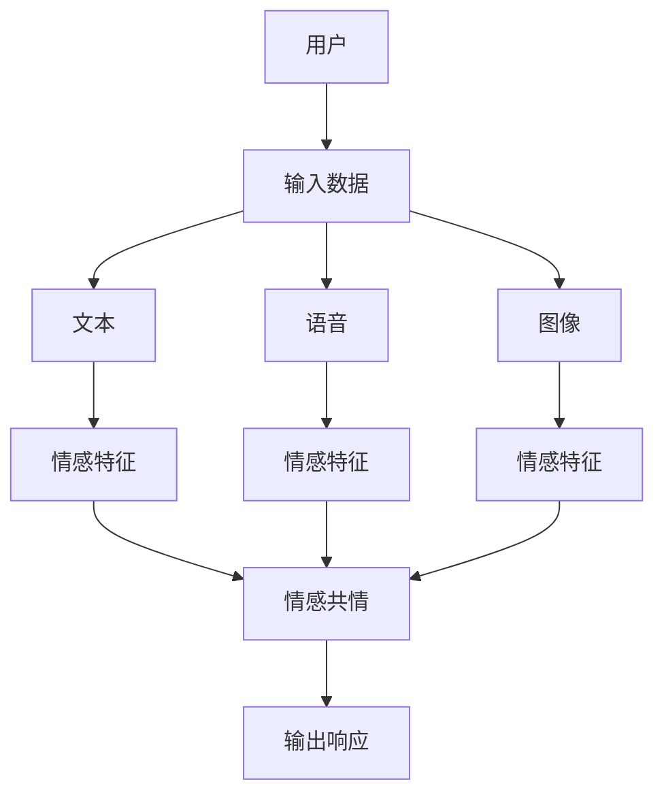
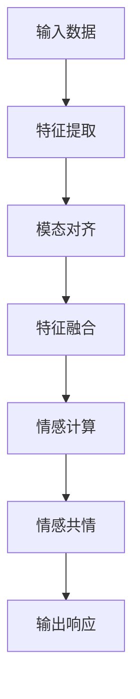
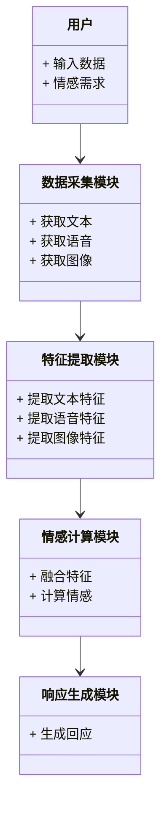
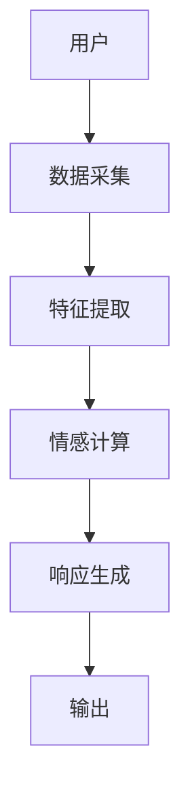
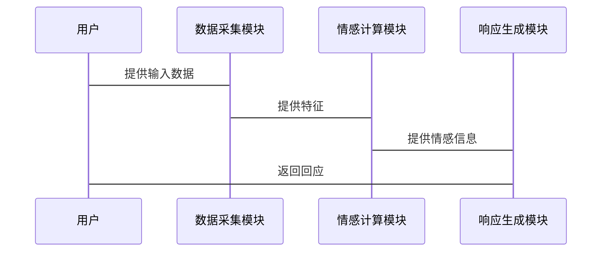

                 


---

# 开发AI Agent的跨模态情感共情能力

> 关键词：AI Agent、跨模态情感共情、情感计算、自然语言处理、计算机视觉、语音处理

> 摘要：  
在人机交互和AI Agent开发中，跨模态情感共情能力是实现更自然、更智能交互的关键。本文从背景、核心概念、算法原理到系统设计和项目实战，全面解析如何开发具备跨模态情感共情能力的AI Agent。通过分析多模态数据的融合、情感计算的实现以及系统架构的设计，为开发者提供理论支持和实践指导。

---

## 第一章：背景介绍

### 1.1 问题背景
AI Agent需要在多种模态（如文本、语音、图像）中理解用户情感，并做出适当的回应。跨模态情感共情能力是实现这一目标的核心技术。

#### 1.1.1 情感计算与人机交互的发展
情感计算是AI Agent的重要组成部分，它帮助机器理解用户的情感状态。随着技术进步，跨模态数据的处理能力提升，使得情感计算更加精准。

#### 1.1.2 跨模态数据处理的挑战
不同模态的数据特征差异大，如何有效融合这些数据是关键挑战。例如，文本的情感分析与语音的情感识别需要协调一致。

#### 1.1.3 情感共情能力的重要性
情感共情能力使AI Agent能够理解用户的情感需求，提供更个性化的服务，提升用户体验。

### 1.2 问题描述
AI Agent需要处理多种模态数据，准确识别情感，并在多场景中应用。

#### 1.2.1 AI Agent在情感共情中的角色
AI Agent作为中介，连接不同模态的数据，分析情感，生成响应。

#### 1.2.2 跨模态数据的整合与处理
整合文本、语音、图像数据，提取情感特征，实现跨模态融合。

#### 1.2.3 情感共情能力的核心问题
准确识别情感，理解情感背后的需求，并生成合适的回应。

### 1.3 问题解决
通过多模态数据融合和情感计算模型，实现情感共情能力。

#### 1.3.1 跨模态情感共情的实现方法
使用深度学习模型，如Transformer，处理多模态数据。

#### 1.3.2 多模态数据融合的技术路径
采用模态对齐、特征融合等方法，整合不同模态的数据。

#### 1.3.3 情感共情能力的评估标准
通过准确率、F1分数等指标评估情感识别的准确性。

### 1.4 边界与外延
明确情感共情能力的边界，避免混淆相关概念。

#### 1.4.1 跨模态情感共情的边界
专注于情感识别，不涉及意图识别等其他任务。

#### 1.4.2 相关领域的区别与联系
情感共情与情感识别、意图识别的区别与联系。

#### 1.4.3 情感共情能力的未来发展
随着技术进步，情感共情能力将更加智能化、个性化。

### 1.5 概念结构与核心要素
明确核心概念和要素，构建清晰的概念体系。

#### 1.5.1 跨模态数据处理的核心要素
数据采集、特征提取、模态融合。

#### 1.5.2 情感共情能力的组成
情感识别、情感理解、情感回应。

#### 1.5.3 核心概念之间的关系
模态数据与情感特征的关系，情感特征与情感共情的关系。

---

## 第二章：核心概念与联系

### 2.1 核心概念原理
详细解释跨模态情感共情的核心原理。

#### 2.1.1 跨模态数据的特征提取
从文本、语音、图像中提取情感特征，如文本的情感词汇、语音的声调变化、图像的表情特征。

#### 2.1.2 情感计算的基本原理
通过特征提取、模型训练，计算情感值。

#### 2.1.3 情感共情能力的实现机制
整合多模态情感特征，生成情感共情的响应。

### 2.2 概念属性特征对比
使用表格对比不同模态的特征。

| 模态类型 | 特征维度 | 情感表达方式 | 示例 |
|----------|-----------|---------------|------|
| 文本      | 词汇、句式 | 情感词汇、语气 | "我很难过" |
| 语音      | 音调、语速 | 声音高低、停顿 | 低沉语调 |
| 图像      | 面部表情 | 嘴角下垂、眼神 | 面部表情 |

### 2.3 ER实体关系图架构
使用Mermaid绘制实体关系图。



---

## 第三章：算法原理

### 3.1 算法选择与原理
选择合适的算法，如多模态Transformer模型。

#### 3.1.1 多模态Transformer模型
使用Transformer处理文本、语音、图像特征，通过注意力机制融合特征。

#### 3.1.2 情感计算模型
训练模型，识别情感类别，计算情感强度。

### 3.2 算法实现步骤
详细步骤如下：

1. 数据预处理：提取各模态的情感特征。
2. 特征融合：使用模态对齐技术，将特征向量合并。
3. 模型训练：使用多任务学习，同时优化各模态的情感识别。
4. 情感共情推理：根据融合后的特征，生成情感共情的响应。

### 3.3 算法数学模型
定义数学公式，如情感评分函数。

$$ \text{score}(x) = \alpha \cdot \text{text\_score}(x) + \beta \cdot \text{audio\_score}(x) + \gamma \cdot \text{image\_score}(x) $$

其中，$\alpha, \beta, \gamma$为权重系数。

### 3.4 算法流程图
使用Mermaid绘制算法流程图。



### 3.5 代码实现
使用Python实现情感计算模型。

```python
import torch
import torch.nn as nn

class MultiModalTransformer(nn.Module):
    def __init__(self, input_size, hidden_size):
        super().__init__()
        self.text_encoder = nn.Linear(input_size, hidden_size)
        self.audio_encoder = nn.Linear(input_size, hidden_size)
        self.image_encoder = nn.Linear(input_size, hidden_size)
        self.attention = nn.MultiheadAttention(hidden_size, 1)
        self.emotion_classifier = nn.Linear(hidden_size, 2)  # 情感分类为正面/负面

    def forward(self, textFeat, audioFeat, imageFeat):
        textEncoded = self.text_encoder(textFeat)
        audioEncoded = self.audio_encoder(audioFeat)
        imageEncoded = self.image_encoder(imageFeat)
        # 模态对齐
        alignedFeatures = (textEncoded + audioEncoded + imageFeat) / 3
        # 特征融合
        fusedFeat, _ = self.attention(alignedFeatures.unsqueeze(0), alignedFeatures.unsqueeze(0))
        emotionScore = self.emotion_classifier(fusedFeat)
        return emotionScore
```

---

## 第四章：系统分析与架构设计

### 4.1 问题场景介绍
AI Agent需要处理多模态输入，提供情感共情的回应。

### 4.2 系统功能设计
设计系统功能模块，如数据采集、特征提取、情感计算、响应生成。

#### 4.2.1 系统功能模块
- 数据采集模块：获取文本、语音、图像数据。
- 特征提取模块：提取各模态的情感特征。
- 情感计算模块：融合特征，计算情感。
- 响应生成模块：生成情感共情的回应。

#### 4.2.2 领域模型类图
使用Mermaid绘制类图。



### 4.3 系统架构设计
设计系统架构，展示各模块的交互关系。

#### 4.3.1 系统架构图
使用Mermaid绘制架构图。



### 4.4 接口与交互设计
定义系统接口，展示交互流程。

#### 4.4.1 系统接口设计
- 输入接口：接收多模态数据。
- 输出接口：返回情感共情的回应。

#### 4.4.2 交互序列图
使用Mermaid绘制交互序列图。



---

## 第五章：项目实战

### 5.1 环境安装
安装必要的库，如PyTorch、transformers。

```bash
pip install torch transformers
```

### 5.2 核心实现
实现情感计算模型，并进行训练和测试。

### 5.3 代码实现
实现AI Agent的跨模态情感共情能力。

```python
class AIAgent:
    def __init__(self):
        self.model = MultiModalTransformer(100, 50)

    def process_input(self, text, audio, image):
        # 假设text、audio、image都是预处理后的特征向量
        with torch.no_grad():
            emotion_score = self.model(text, audio, image)
            return emotion_score
```

### 5.4 实际案例分析
分析一个实际案例，如用户输入“我很难过”，系统识别出情感并生成回应。

### 5.5 代码应用解读
解释代码实现，分析其优缺点。

### 5.6 项目小结
总结项目实现的关键点和经验教训。

---

## 第六章：总结与展望

### 6.1 核心内容总结
回顾文章的核心内容，强调跨模态情感共情能力的重要性。

### 6.2 未来展望
展望技术的发展，如更复杂的模型、更广泛的应用场景。

### 6.3 最佳实践
给出开发建议，如数据质量的重要性、模型优化的方向。

---

## 第七章：参考文献与进一步阅读

### 7.1 参考文献
列出相关文献和资料。

### 7.2 拓展阅读
推荐相关领域的书籍和论文。

---

## 第八章：附录

### 8.1 术语表
解释文章中的关键术语。

### 8.2 模型参数配置
提供模型训练的参数配置示例。

### 8.3 代码片段
提供完整的代码实现示例。

---

# 本文结束

