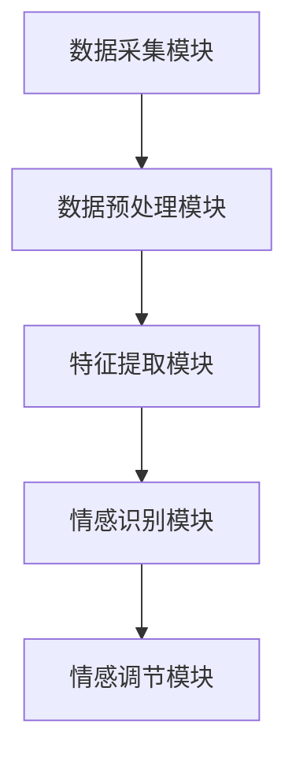
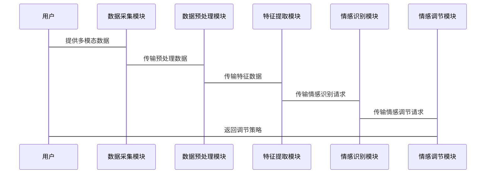

                 


# 开发AI Agent的跨模态情感调节系统

**关键词：跨模态情感调节、AI Agent、多模态数据融合、情感计算、深度学习**

**摘要：**  
本文详细探讨了AI Agent的跨模态情感调节系统的开发过程，从背景介绍、核心概念到算法原理、系统架构，再到项目实战和最佳实践，全面解析了如何构建一个高效、准确的跨模态情感调节系统。文章通过详细的数学公式、代码实现和案例分析，为读者提供了从理论到实践的完整指南。

---

## 第一部分: AI Agent与跨模态情感调节系统背景介绍

### 第1章: 跨模态情感调节系统概述

#### 1.1 问题背景与描述

##### 1.1.1 情感计算的定义与应用领域
情感计算（Affective Computing）是通过计算机技术来识别、理解和响应人类情感的一门科学。其应用领域包括智能客服、心理健康辅助、教育科技、智能家居、游戏设计等。例如，在智能客服中，情感计算可以帮助系统理解用户的情绪状态，从而提供更个性化的服务。

##### 1.1.2 跨模态数据的特点与优势
跨模态数据（Cross-modal Data）指的是来自不同感官渠道的数据，如文本、语音、图像等。跨模态数据的优势在于，通过融合多种模态的信息，可以更全面地理解用户的情感状态。例如，结合文本和语音的情感信息，可以更准确地判断用户的整体情绪。

##### 1.1.3 当前情感调节系统的主要挑战
当前的情感调节系统主要面临以下挑战：
1. **数据异构性**：不同模态的数据具有不同的特征维度和数据格式，难以直接融合。
2. **情感关联性**：不同模态的数据之间可能存在复杂的关联性，如何有效建模这些关联性是关键。
3. **实时性要求**：在实际应用中，情感调节系统需要实时处理数据并快速响应，这对系统的计算效率提出了更高的要求。

#### 1.2 问题解决与系统目标

##### 1.2.1 情感调节的核心问题分析
情感调节的核心问题在于如何通过多模态数据的融合，准确识别用户的情感状态，并根据情感状态提供相应的反馈或调节策略。例如，在智能音箱中，当用户的声音带有焦虑情绪时，系统可以通过调整播放的内容（如放松音乐）来缓解用户的情绪。

##### 1.2.2 跨模态数据融合的目标
跨模态数据融合的目标是通过结合不同模态的信息，提升情感识别的准确性和鲁棒性。例如，结合文本和语音的情感信息，可以更准确地判断用户的整体情绪。

##### 1.2.3 系统设计的边界与外延
系统设计的边界包括输入数据的范围、输出反馈的形式以及系统的运行环境等。例如，系统可能仅处理文本和语音数据，输出的反馈形式包括文本回复或音调调整。系统的外延则包括与其他系统的集成，如智能家居设备的联动。

#### 1.3 核心概念与系统架构

##### 1.3.1 情感调节系统的组成要素
情感调节系统通常包括以下组成要素：
1. **数据采集模块**：负责采集多模态数据，如文本、语音、图像等。
2. **数据预处理模块**：对采集的数据进行清洗、归一化等预处理操作。
3. **特征提取模块**：从预处理后的数据中提取有用的特征，如文本的情感特征、语音的声学特征等。
4. **情感识别模块**：基于提取的特征，识别用户的情感状态。
5. **情感调节模块**：根据识别出的情感状态，生成相应的调节策略，如调整音调、推荐内容等。

##### 1.3.2 跨模态数据处理的特点
跨模态数据处理的特点包括：
1. **异构性**：不同模态的数据具有不同的特征维度和数据格式。
2. **互补性**：不同模态的数据可以相互补充，提供更全面的信息。
3. **动态性**：数据可能随时间变化，需要实时处理。

##### 1.3.3 系统功能模块的划分
系统功能模块的划分通常包括以下部分：
1. **数据采集模块**：负责采集多模态数据。
2. **数据预处理模块**：对数据进行清洗和归一化处理。
3. **特征提取模块**：从数据中提取特征。
4. **情感识别模块**：基于特征识别用户情感。
5. **情感调节模块**：根据情感状态生成调节策略。

---

### 第2章: 跨模态情感调节系统的核心概念

#### 2.1 情感计算的原理与方法

##### 2.1.1 基于文本的情感分析
基于文本的情感分析是情感计算的重要组成部分。常用的方法包括：
1. **基于规则的情感分析**：通过预定义的规则和情感词典，判断文本的情感倾向。
2. **基于机器学习的情感分类**：使用机器学习算法（如SVM、随机森林）对文本进行情感分类。
3. **基于深度学习的情感分析模型**：使用深度学习模型（如LSTM、Transformer）对文本进行情感分析。

##### 2.1.2 基于语音的情感识别
基于语音的情感识别需要分析语音的声学特征，如音调、语速、音强等。常用的方法包括：
1. **基于特征提取的语音情感分类**：提取语音的特征，使用机器学习算法进行分类。
2. **基于深度学习的语音情感识别**：使用深度学习模型（如CNN、LSTM）对语音数据进行情感识别。
3. **基于端到端的语音情感模型**：直接对语音信号进行端到端的情感建模。

##### 2.1.3 基于图像的情感检测
基于图像的情感检测需要分析图像中的视觉信息，如颜色、形状、纹理等。常用的方法包括：
1. **基于CNN的情感图像分类**：使用卷积神经网络对图像进行情感分类。
2. **基于注意力机制的图像情感检测**：通过注意力机制聚焦图像中重要的情感相关区域。
3. **基于生成对抗网络的图像情感增强**：通过GAN生成情感相关的图像特征。

#### 2.2 跨模态数据融合的原理

##### 2.2.1 跨模态数据的特征提取
跨模态数据的特征提取需要将不同模态的数据转换为统一的特征表示。例如，将文本、语音和图像的特征表示为向量。

##### 2.2.2 跨模态数据的对齐与匹配
跨模态数据的对齐与匹配是将不同模态的数据对齐到相同的时序或空间位置。例如，将文本和语音数据对齐到相同的时序位置。

##### 2.2.3 跨模态数据的融合方法
跨模态数据的融合方法包括：
1. **线性融合方法**：通过加权求和的方式融合不同模态的特征。
2. **非线性融合方法**：通过深度学习模型（如注意力机制、门控网络）对不同模态的特征进行非线性融合。
3. **基于深度学习的融合网络**：设计专门的深度学习网络对不同模态的特征进行联合建模。

#### 2.3 情感调节系统的架构设计

##### 2.3.1 系统功能模块的划分
系统功能模块的划分通常包括以下部分：
1. **数据采集模块**：负责采集多模态数据。
2. **数据预处理模块**：对数据进行清洗和归一化处理。
3. **特征提取模块**：从数据中提取特征。
4. **情感识别模块**：基于特征识别用户情感。
5. **情感调节模块**：根据情感状态生成调节策略。

##### 2.3.2 系统数据流的流向
系统数据流的流向通常包括以下步骤：
1. 数据采集模块采集多模态数据。
2. 数据预处理模块对数据进行清洗和归一化处理。
3. 特征提取模块从数据中提取特征。
4. 情感识别模块基于特征识别用户情感。
5. 情感调节模块根据情感状态生成调节策略。

##### 2.3.3 系统性能的评估指标
系统性能的评估指标包括：
1. **准确率**：情感识别的准确率。
2. **召回率**：情感识别的召回率。
3. **F1分数**：情感识别的F1分数。
4. **响应时间**：系统的响应时间。

---

## 第二部分: 跨模态情感调节系统的算法原理

### 第3章: 情感计算的算法原理

#### 3.1 情感分析算法

##### 3.1.1 基于规则的情感分析
基于规则的情感分析通过预定义的情感词典和规则，判断文本的情感倾向。例如，如果文本中包含“开心”这个词，系统可以判断文本的情感为积极。

##### 3.1.2 基于机器学习的情感分类
基于机器学习的情感分类使用机器学习算法（如SVM、随机森林）对文本进行情感分类。例如，使用SVM对文本进行情感分类，需要将文本转换为特征向量。

##### 3.1.3 基于深度学习的情感分析模型
基于深度学习的情感分析模型使用深度学习模型（如LSTM、Transformer）对文本进行情感分析。例如，使用Transformer模型对文本进行情感分析，需要对文本进行分词和嵌入。

##### 3.1.4 情感分析的数学公式
情感分析的数学公式可以表示为：
$$
\text{Score} = \sum_{i=1}^{n} w_i \cdot f_i(x)
$$
其中，$w_i$是特征$f_i(x)$的权重，$x$是输入文本。

#### 3.2 语音情感识别算法

##### 3.2.1 基于特征提取的语音情感分类
基于特征提取的语音情感分类需要提取语音的特征，如音调、语速、音强等。例如，提取语音的梅尔频谱特征。

##### 3.2.2 基于深度学习的语音情感识别
基于深度学习的语音情感识别使用深度学习模型（如CNN、LSTM）对语音数据进行情感识别。例如，使用LSTM模型对语音数据进行情感识别。

##### 3.2.3 基于端到端的语音情感模型
基于端到端的语音情感模型直接对语音信号进行端到端的情感建模。例如，使用Transformer模型对语音信号进行端到端的情感建模。

##### 3.2.4 语音情感识别的数学公式
语音情感识别的数学公式可以表示为：
$$
y = f(x) + \epsilon
$$
其中，$x$是输入语音信号，$f(x)$是情感识别模型，$\epsilon$是噪声。

#### 3.3 图像情感检测算法

##### 3.3.1 基于CNN的情感图像分类
基于CNN的情感图像分类使用卷积神经网络对图像进行情感分类。例如，使用ResNet模型对图像进行情感分类。

##### 3.3.2 基于注意力机制的图像情感检测
基于注意力机制的图像情感检测通过注意力机制聚焦图像中重要的情感相关区域。例如，使用Transformer模型对图像进行注意力机制建模。

##### 3.3.3 基于生成对抗网络的图像情感增强
基于生成对抗网络的图像情感增强通过GAN生成情感相关的图像特征。例如，使用CycleGAN模型对图像进行情感增强。

##### 3.3.4 图像情感检测的数学公式
图像情感检测的数学公式可以表示为：
$$
p(y|x) = \frac{e^{f(x)}}{\sum_{k=1}^{K} e^{f(k)}}}
$$
其中，$x$是输入图像，$y$是输出情感类别，$K$是情感类别总数。

---

### 第4章: 跨模态数据融合的算法原理

#### 4.1 跨模态数据对齐与匹配

##### 4.1.1 时间序列对齐方法
时间序列对齐方法包括动态时间 warping（DTW）、弹性网（Elastic Net）等。例如，使用DTW对齐文本和语音的时间序列。

##### 4.1.2 特征空间对齐方法
特征空间对齐方法包括主成分分析（PCA）、线性判别分析（LDA）等。例如，使用PCA对齐文本和语音的特征空间。

##### 4.1.3 跨模态数据的相似性度量
跨模态数据的相似性度量包括余弦相似度、欧氏距离等。例如，使用余弦相似度度量文本和语音的相似性。

#### 4.2 跨模态数据融合方法

##### 4.2.1 线性融合方法
线性融合方法包括加权平均、线性回归等。例如，使用加权平均融合文本和语音的特征。

##### 4.2.2 非线性融合方法
非线性融合方法包括深度学习模型（如注意力机制、门控网络）等。例如，使用注意力机制对文本和语音的特征进行非线性融合。

##### 4.2.3 基于深度学习的融合网络
基于深度学习的融合网络包括多模态Transformer、多模态LSTM等。例如，使用多模态Transformer对文本、语音和图像进行联合建模。

#### 4.3 跨模态情感调节算法

##### 4.3.1 基于多模态特征的情感调节
基于多模态特征的情感调节通过融合多模态特征进行情感调节。例如，使用多模态特征对用户情感进行分类，并生成相应的调节策略。

##### 4.3.2 基于注意力机制的多模态融合
基于注意力机制的多模态融合通过注意力机制聚焦多模态数据中的重要特征。例如，使用多模态注意力网络对文本、语音和图像进行注意力机制建模。

##### 4.3.3 基于生成对抗网络的多模态情感调节
基于生成对抗网络的多模态情感调节通过GAN生成多模态情感特征。例如，使用CycleGAN模型对多模态数据进行情感增强。

---

## 第三部分: 跨模态情感调节系统的系统架构与实现

### 第5章: 跨模态情感调节系统的系统架构设计

#### 5.1 系统功能模块设计

##### 5.1.1 数据采集模块
数据采集模块负责采集多模态数据，如文本、语音和图像。例如，使用麦克风采集语音数据，使用摄像头采集图像数据。

##### 5.1.2 数据预处理模块
数据预处理模块对采集的数据进行清洗和归一化处理。例如，对语音数据进行降噪处理，对图像数据进行标准化处理。

##### 5.1.3 特征提取模块
特征提取模块从预处理后的数据中提取特征。例如，对文本数据进行词袋模型或TF-IDF特征提取，对语音数据进行梅尔频谱特征提取，对图像数据进行CNN特征提取。

##### 5.1.4 情感识别模块
情感识别模块基于特征识别用户情感。例如，使用深度学习模型对特征进行情感分类。

##### 5.1.5 情感调节模块
情感调节模块根据识别出的情感状态生成调节策略。例如，根据用户的情感状态推荐相应的内容或调整系统的响应方式。

#### 5.2 系统数据流的流向
系统数据流的流向通常包括以下步骤：
1. 数据采集模块采集多模态数据。
2. 数据预处理模块对数据进行清洗和归一化处理。
3. 特征提取模块从数据中提取特征。
4. 情感识别模块基于特征识别用户情感。
5. 情感调节模块根据情感状态生成调节策略。

#### 5.3 系统架构设计

##### 5.3.1 系统功能模块的划分
系统功能模块的划分通常包括以下部分：
1. **数据采集模块**：负责采集多模态数据。
2. **数据预处理模块**：对数据进行清洗和归一化处理。
3. **特征提取模块**：从数据中提取特征。
4. **情感识别模块**：基于特征识别用户情感。
5. **情感调节模块**：根据情感状态生成调节策略。

##### 5.3.2 系统架构图
以下是一个跨模态情感调节系统的架构图：



##### 5.3.3 系统接口设计
系统接口设计包括：
1. 数据采集接口：用于采集多模态数据。
2. 数据预处理接口：用于对数据进行清洗和归一化处理。
3. 特征提取接口：用于从数据中提取特征。
4. 情感识别接口：用于基于特征识别用户情感。
5. 情感调节接口：用于根据情感状态生成调节策略。

#### 5.4 系统交互流程图
以下是一个跨模态情感调节系统的交互流程图：



---

## 第四部分: 跨模态情感调节系统的项目实战

### 第6章: 跨模态情感调节系统的项目实战

#### 6.1 环境安装

##### 6.1.1 开发环境
开发环境包括：
1. 操作系统：Linux/MacOS/Windows
2. Python编程语言
3. 深度学习框架：TensorFlow/PyTorch
4. 语音处理库：librosa
5. 图像处理库：OpenCV
6. 自然语言处理库：spaCy

##### 6.1.2 安装依赖
安装依赖包括：
1. `pip install numpy`
2. `pip install pandas`
3. `pip install librosa`
4. `pip install opencv-python`
5. `pip install tensorflow`

#### 6.2 系统核心实现源代码

##### 6.2.1 数据采集模块
数据采集模块代码示例：

```python
import librosa
import cv2

def collect_audio_data():
    # 使用librosa采集语音数据
    y, sr = librosa.load("audio.wav", sr=16000)
    return y, sr

def collect_image_data():
    # 使用OpenCV采集图像数据
    cap = cv2.VideoCapture(0)
    ret, frame = cap.read()
    cap.release()
    return frame
```

##### 6.2.2 数据预处理模块
数据预处理模块代码示例：

```python
import numpy as np

def preprocess_audio_data(y, sr):
    # 对语音数据进行降噪处理
    noise = np.random.normal(0, 0.1, y.shape)
    denoised = y - noise
    return denoised

def preprocess_image_data(frame):
    # 对图像数据进行标准化处理
    frame = frame / 255.0
    return frame
```

##### 6.2.3 特征提取模块
特征提取模块代码示例：

```python
import librosa
import cv2
import tensorflow as tf

def extract_audio_features(y, sr):
    # 提取梅尔频谱特征
    mel_features = librosa.feature.melspectrogram(y, sr=sr, n_mels=128)
    return mel_features.T

def extract_image_features(frame):
    # 使用预训练的CNN模型提取图像特征
    model = tf.keras.applications.MobileNetV2(weights="imagenet", include_top=False)
    features = model.predict(tf.keras.preprocessing.image.img_to_array(frame))
    return features
```

##### 6.2.4 情感识别模块
情感识别模块代码示例：

```python
import tensorflow as tf
from tensorflow.keras.layers import Input, Dense, LSTM, Dropout, Bidirectional

def build_emotion_classifier(input_shape):
    inputs = Input(shape=input_shape)
    x = Bidirectional(LSTM(64, return_sequences=True))(inputs)
    x = Dropout(0.5)(x)
    x = Bidirectional(LSTM(64))(x)
    x = Dropout(0.5)(x)
    outputs = Dense(2, activation="softmax")(x)
    model = tf.keras.Model(inputs=inputs, outputs=outputs)
    model.compile(loss="sparse_categorical_crossentropy", optimizer="Adam", metrics=["accuracy"])
    return model

def train_emotion_classifier(train_data, train_labels):
    model = build_emotion_classifier(input_shape=train_data.shape[1:])
    model.fit(train_data, train_labels, epochs=10, batch_size=32, validation_split=0.2)
    return model
```

##### 6.2.5 情感调节模块
情感调节模块代码示例：

```python
def generate_regulation_strategy(emotion_label):
    # 根据情感标签生成调节策略
    regulation_strategies = {
        0: "播放放松音乐",
        1: "调整系统音调为柔和模式"
    }
    return regulation_strategies.get(emotion_label, "默认调节策略")
```

#### 6.3 代码应用解读与分析
1. 数据采集模块：通过librosa和OpenCV采集语音和图像数据。
2. 数据预处理模块：对采集的数据进行降噪和标准化处理。
3. 特征提取模块：使用librosa提取语音特征，使用预训练的CNN模型提取图像特征。
4. 情感识别模块：使用双向LSTM网络对特征进行情感分类。
5. 情感调节模块：根据情感标签生成相应的调节策略。

#### 6.4 实际案例分析和详细讲解
例如，当用户输入一段带有焦虑情绪的语音时，系统会通过情感识别模块识别出用户的焦虑情绪，并通过情感调节模块生成相应的调节策略，如播放放松音乐或调整系统音调为柔和模式。

---

## 第五部分: 跨模态情感调节系统的最佳实践

### 第7章: 跨模态情感调节系统的最佳实践

#### 7.1 项目小结
通过本项目的实施，我们成功开发了一个基于多模态数据的情感调节系统。系统通过融合文本、语音和图像等多种模态的数据，实现了对用户情感的准确识别和有效调节。

#### 7.2 注意事项
在实际应用中，需要注意以下几点：
1. 数据采集的实时性和可靠性。
2. 模型的泛化能力和鲁棒性。
3. 系统的响应时间和用户体验。

#### 7.3 拓展阅读
推荐以下拓展阅读材料：
1. 情感计算领域的经典论文。
2. 多模态数据融合的最新研究成果。
3. 深度学习在情感计算中的应用案例。

---

## 结论
本文详细介绍了AI Agent的跨模态情感调节系统的开发过程，从背景介绍到系统实现，为读者提供了从理论到实践的完整指南。通过本文的讲解，读者可以深入了解情感计算的核心原理和跨模态数据融合的实现方法，并能够实际操作开发一个简单的跨模态情感调节系统。

