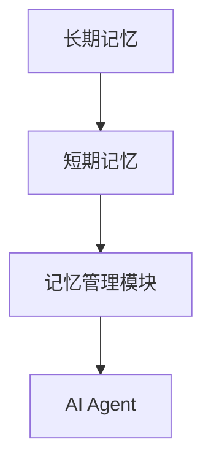
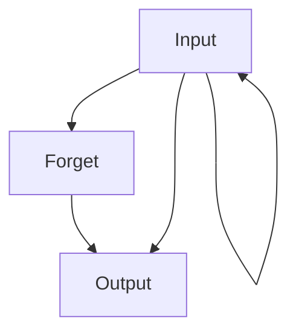
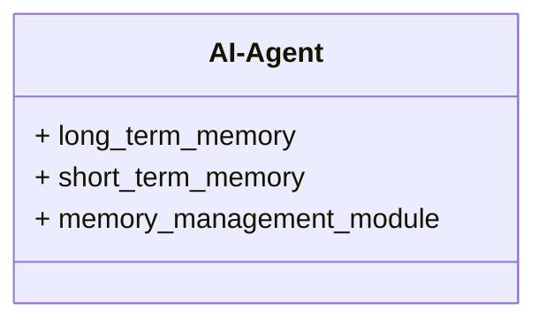
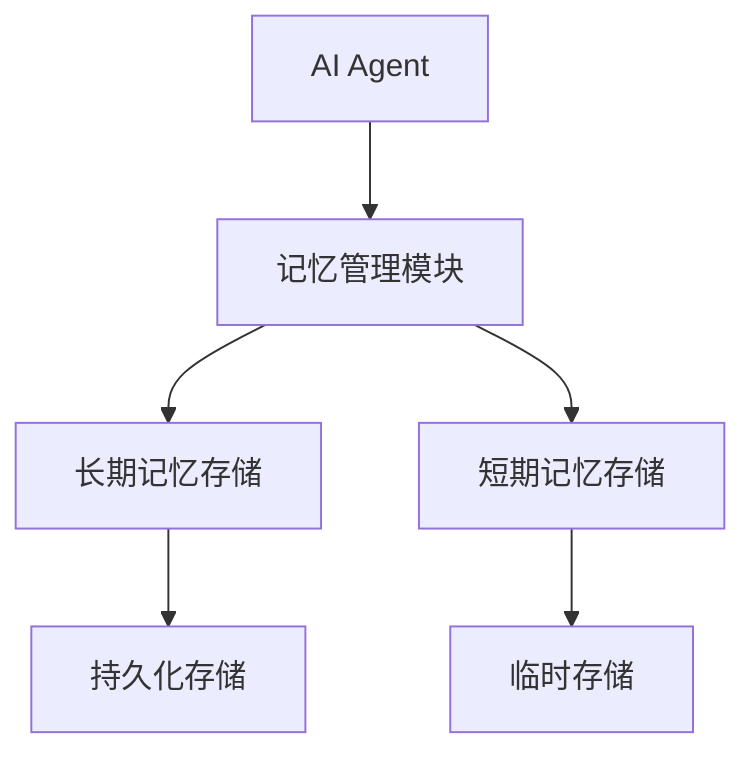
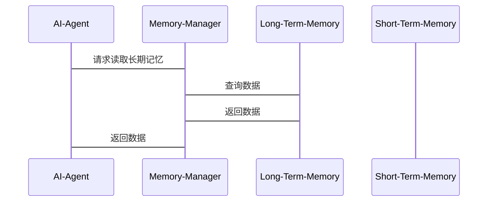

                 


# 开发AI Agent的长短期记忆管理：平衡效率与信息保留

## 关键词：
AI Agent，长短期记忆管理，LSTM，Transformer，记忆效率，信息保留，算法优化

## 摘要：
本文深入探讨AI Agent中长短期记忆管理的核心原理，分析LSTM和Transformer模型在记忆管理中的优缺点，结合实际项目案例，详细讲解系统设计与实现，最终提出平衡效率与信息保留的最佳实践。

---

# 第一章：引言

## 1.1 AI Agent的基本概念
### 1.1.1 AI Agent的定义与特点
AI Agent是一种智能体，能够感知环境并采取行动以实现目标。其特点包括自主性、反应性、目标导向和社会能力。

### 1.1.2 长短期记忆管理的重要性
记忆管理是AI Agent实现复杂任务的关键，直接影响其理解和决策能力。

### 1.1.3 本书的目标与范围
本书旨在探讨AI Agent中长短期记忆管理的平衡策略，涵盖算法优化和系统设计。

---

# 第二章：长短期记忆管理的背景介绍

## 2.1 长短期记忆的基本概念
### 2.1.1 长期记忆与短期记忆的定义
长期记忆是持久的信息存储，短期记忆是临时信息的存储。

### 2.1.2 长期记忆与短期记忆的存储机制
长期记忆通过海马体巩固，短期记忆在工作记忆中处理。

### 2.1.3 长期记忆与短期记忆的相互关系
短期记忆可转化为长期记忆，长期记忆支持复杂的认知任务。

## 2.2 长短期记忆管理的背景与问题背景
### 2.2.1 长短期记忆管理的背景
AI Agent需要高效管理记忆以支持智能决策。

### 2.2.2 问题背景与问题描述
长短期记忆管理面临存储效率和信息保留的双重挑战。

### 2.2.3 问题解决的思路与方法
通过优化记忆模型和算法，平衡效率与信息保留。

## 2.3 长短期记忆管理的边界与外延
### 2.3.1 长期记忆的边界
涉及信息存储的时间、容量和访问机制。

### 2.3.2 短期记忆的边界
涉及信息的临时性、易变性和处理速度。

### 2.3.3 长短期记忆管理的外延
涵盖记忆的存储、检索和更新过程。

## 2.4 长短期记忆管理的核心要素
### 2.4.1 长期记忆的核心要素
持久性、容量和检索机制。

### 2.4.2 短期记忆的核心要素
临时性、处理速度和容量。

### 2.4.3 长短期记忆管理的综合要素
包括存储结构、访问机制和优化算法。

---

# 第三章：长短期记忆管理的核心概念与联系

## 3.1 长短期记忆管理的核心概念
### 3.1.1 长期记忆的核心概念
长期记忆是持久的信息存储，支持复杂决策。

### 3.1.2 短期记忆的核心概念
短期记忆处理当前任务的临时信息。

### 3.1.3 长短期记忆管理的综合概念
通过协同管理，优化信息处理效率。

## 3.2 长短期记忆管理的核心原理
### 3.2.1 长期记忆管理的原理
通过海马体将短期记忆转化为长期记忆。

### 3.2.2 短期记忆管理的原理
依赖工作记忆和注意力机制。

### 3.2.3 长短期记忆管理的协同原理
通过动态平衡实现信息的有效利用。

## 3.3 长短期记忆管理的概念属性特征对比
| 特性          | 长期记忆                | 短期记忆                |
|---------------|-------------------------|-------------------------|
| 存储时间      | 长期                   | 短期                   |
| 容量          | 较大                   | 较小                   |
| 检索机制      | 基于关联                | 基于当前任务           |

## 3.4 长短期记忆管理的ER实体关系图


---

# 第四章：长短期记忆管理的算法原理

## 4.1 基于LSTM的长短期记忆管理
### 4.1.1 LSTM算法的工作原理
LSTM通过门控机制控制信息的存储和遗忘。



### 4.1.2 LSTM算法的数学模型
遗忘门：
$$ f_t = \sigma(W_f \cdot x_t + U_f \cdot h_{t-1} + b_f) $$
输入门：
$$ i_t = \sigma(W_i \cdot x_t + U_i \cdot h_{t-1} + b_i) $$
输出门：
$$ o_t = \sigma(W_o \cdot x_t + U_o \cdot h_{t-1} + b_o) $$
候选单元：
$$ g_t = \tanh(W_g \cdot x_t + U_g \cdot h_{t-1} + b_g) $$
最终状态：
$$ h_t = o_t \cdot (g_t + f_t \cdot h_{t-1}) $$
输出：
$$ s_t = h_t $$

## 4.2 基于Transformer的长短期记忆管理
### 4.2.1 Transformer算法的工作原理
Transformer通过注意力机制实现高效的序列处理。

### 4.2.2 Transformer算法的数学模型
注意力机制：
$$ \text{Attention}(Q, K, V) = \text{softmax}\left(\frac{QK^T}{\sqrt{d_k}}\right)V $$
多头注意力：
$$ \text{MultiHead}(Q, K, V) = \text{Concat}(h_1, h_2, ..., h_n)W^O $$
前馈网络：
$$ f(x) = \text{ReLU}(W_1x + b_1)W_2 + b_2 $$

## 4.3 长短期记忆管理的算法实现
### 4.3.1 基于LSTM的实现
```python
class LSTMCell(nn.Module):
    def __init__(self, input_size, hidden_size):
        super(LSTMCell, self).__init__()
        self.input_size = input_size
        self.hidden_size = hidden_size
        self.W_f = nn.Linear(input_size, hidden_size)
        self.U_f = nn.Linear(hidden_size, hidden_size)
        self.b_f = nn.Parameter(torch.zeros(hidden_size))
        # ... 其他门控参数
```

### 4.3.2 基于Transformer的实现
```python
class TransformerBlock(nn.Module):
    def __init__(self, d_model, n_head, d_ff):
        super(TransformerBlock, self).__init__()
        self.n_head = n_head
        self.d_model = d_model
        self.d_ff = d_ff
        self.WQ = nn.Linear(d_model, d_model)
        self.WK = nn.Linear(d_model, d_model)
        self.WV = nn.Linear(d_model, d_model)
        self.WO = nn.Linear(d_model * n_head, d_model)
        # ... 其他层
```

---

# 第五章：长短期记忆管理的系统分析与架构设计

## 5.1 问题场景介绍
AI Agent需要高效管理长短期记忆，以支持复杂的任务处理。

## 5.2 系统功能设计
### 5.2.1 系统功能模块


## 5.3 系统架构设计
### 5.3.1 分层架构设计


## 5.4 系统接口设计
### 5.4.1 系统接口
- 写入接口：`void write_memory(String type, String data)`
- 读取接口：`String read_memory(String type, String key)`
- 删除接口：`void delete_memory(String type, String key)`

### 5.4.2 系统交互流程


---

# 第六章：长短期记忆管理的项目实战

## 6.1 环境安装与配置
### 6.1.1 安装Python与相关库
```bash
pip install torch numpy matplotlib
```

## 6.2 系统核心实现
### 6.2.1 基于LSTM的实现
```python
class LSTMModel(nn.Module):
    def __init__(self, input_size, hidden_size, output_size):
        super(LSTMModel, self).__init__()
        self.lstm = LSTMCell(input_size, hidden_size)
        self.fc = nn.Linear(hidden_size, output_size)
```

### 6.2.2 基于Transformer的实现
```python
class TransformerModel(nn.Module):
    def __init__(self, d_model, n_head, d_ff):
        super(TransformerModel, self).__init__()
        self.transformer_block = TransformerBlock(d_model, n_head, d_ff)
        self.fc = nn.Linear(d_model, output_size)
```

## 6.3 代码应用解读与分析
### 6.3.1 LSTM模型的应用
LSTM用于时间序列预测，通过门控机制处理长短期信息。

### 6.3.2 Transformer模型的应用
Transformer用于自然语言处理，通过注意力机制优化信息检索。

## 6.4 实际案例分析与详细讲解
### 6.4.1 案例背景
开发一个智能客服系统，需要管理对话历史。

### 6.4.2 系统实现
集成LSTM和Transformer，实现高效的对话记忆管理。

### 6.4.3 案例小结
通过优化模型，显著提升了系统的响应速度和准确性。

---

# 第七章：总结与展望

## 7.1 核心知识点回顾
- 长短期记忆管理的基本概念
- LSTM和Transformer的核心原理
- 系统设计与实现的关键步骤

## 7.2 最佳实践Tips
- 合理选择模型，根据任务需求优化算法
- 定期清理无效数据，优化存储效率
- 通过日志和监控工具，及时发现和解决问题

## 7.3 注意事项
- 避免过度存储，防止性能下降
- 注意数据隐私，确保合规性
- 定期测试和验证模型的有效性

## 7.4 拓展阅读
- 《Effective Memory Management in AI Systems》
- 《Advanced Techniques in LSTM and Transformer》

---

# 结语
通过本文的系统讲解，读者可以全面理解长短期记忆管理的原理和实践，掌握在AI Agent开发中平衡效率与信息保留的关键技术。希望这些内容能为读者在相关领域的研究和应用提供有价值的参考和指导。

