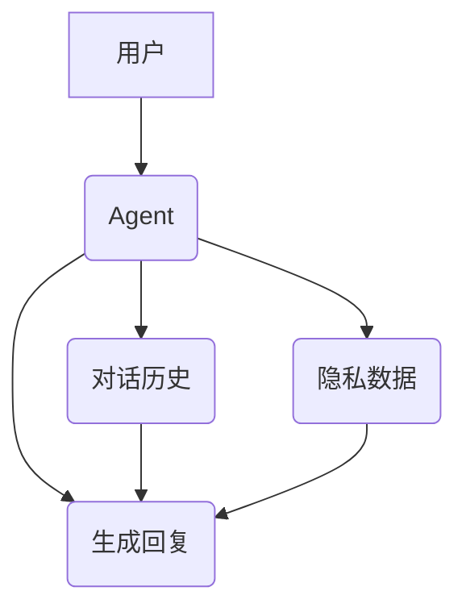
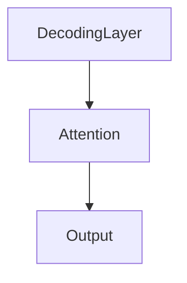
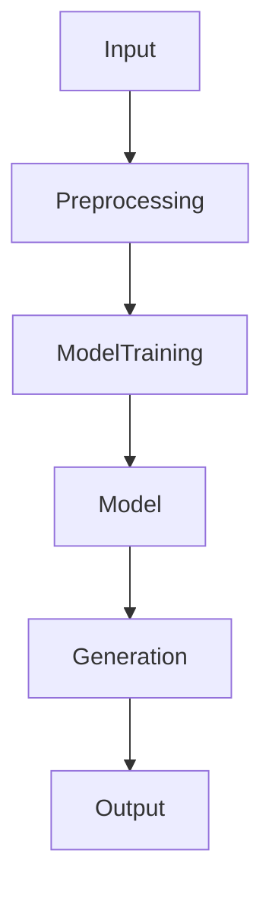
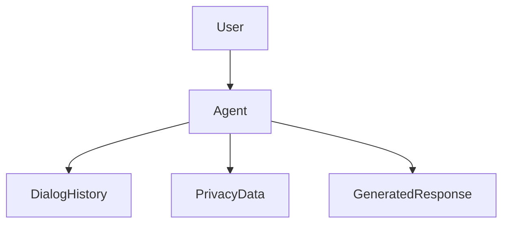
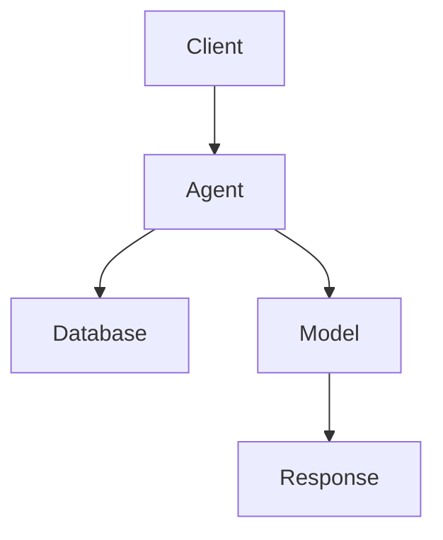
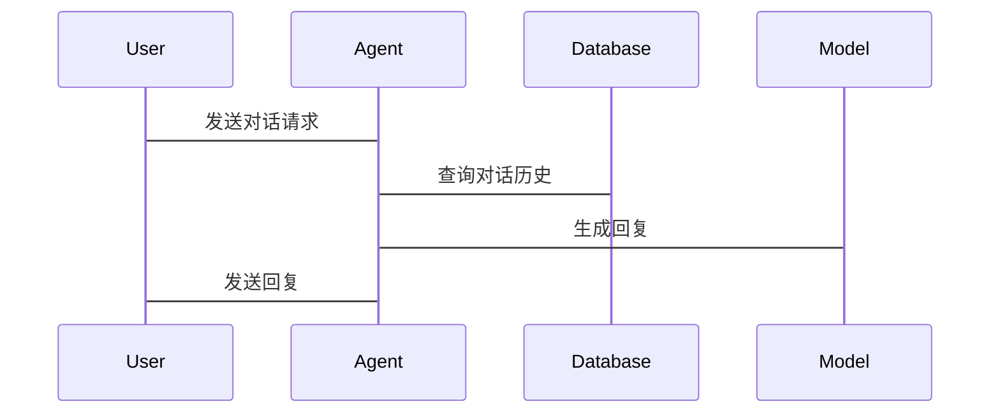

                 


# 开发AI Agent的隐私保护对话生成技术

## 关键词：AI Agent, 隐私保护, 对话生成, 差分隐私, Transformer模型, 同态加密

## 摘要：  
本文深入探讨了AI Agent在对话生成中的隐私保护技术。通过分析对话生成技术的发展，结合隐私保护的核心概念，详细讲解了如何在AI Agent中实现隐私保护的对话生成。文章从算法原理到系统架构，再到项目实战，全面剖析了隐私保护对话生成技术的实现细节，并给出了实际案例和最佳实践。

---

# 第一部分: AI Agent与隐私保护对话生成技术的背景介绍

## 第1章: 问题背景与核心概念

### 1.1 问题背景

#### 1.1.1 AI Agent的定义与特点
AI Agent（人工智能代理）是指能够感知环境、自主决策并执行任务的智能体。它具有以下特点：
- **自主性**：能够在没有外部干预的情况下执行任务。
- **反应性**：能够实时感知环境并做出反应。
- **目标导向性**：以目标为导向，优化决策过程。

#### 1.1.2 对话生成技术的发展历程
对话生成技术经历了以下阶段：
1. **基于规则的系统**：依赖预定义的规则生成回复。
2. **统计机器学习模型**：利用概率模型（如n-gram）生成回复。
3. **深度学习模型**：基于神经网络（如RNN、Transformer）生成更自然的对话。

#### 1.1.3 隐私保护的重要性与挑战
随着AI Agent的广泛应用，隐私保护成为一个重要问题。用户数据在对话生成过程中可能被滥用，导致隐私泄露。主要挑战包括：
- **数据泄露风险**：用户输入的数据可能被模型学习并泄露。
- **模型滥用**：恶意用户可能利用模型生成不当内容。
- **法律合规性**：需要符合GDPR等隐私保护法规。

### 1.2 问题描述

#### 1.2.1 AI Agent对话生成中的隐私泄露风险
- **数据泄露**：模型训练数据可能包含敏感信息。
- **推理泄露**：模型在生成回复时可能泄露用户的隐私信息。
- **滥用风险**：恶意用户可能利用模型生成有害内容。

#### 1.2.2 用户隐私保护的需求与痛点
- **用户需求**：用户希望与AI Agent对话时，其隐私得到保护。
- **技术痛点**：现有对话生成技术在隐私保护方面存在不足。
- **场景需求**：在医疗、金融等敏感领域，隐私保护尤为重要。

#### 1.2.3 当前技术的局限性与改进方向
- **技术局限性**：现有模型通常忽略隐私保护，可能导致数据泄露。
- **改进方向**：通过技术手段（如数据匿名化、差分隐私）保护隐私。

### 1.3 问题解决与技术边界

#### 1.3.1 隐私保护对话生成的目标与范围
- **目标**：在生成对话时不泄露用户隐私信息。
- **范围**：包括数据预处理、模型训练和推理过程中的隐私保护。

#### 1.3.2 技术边界与实现条件
- **技术边界**：仅关注对话生成过程中的隐私保护，不涉及数据存储和传输。
- **实现条件**：需要结合隐私保护技术和对话生成模型。

#### 1.3.3 核心概念的结构化分析
- **核心概念**：隐私保护、对话生成、AI Agent。
- **结构化分析**：通过技术手段将隐私保护与对话生成结合。

## 第2章: 核心概念与联系

### 2.1 核心概念原理

#### 2.1.1 隐私保护技术的分类与特征
- **数据匿名化**：通过去除或脱敏敏感信息保护隐私。
- **同态加密**：在加密状态下进行数据处理。
- **差分隐私**：通过添加噪声保护数据隐私。

#### 2.1.2 对话生成技术的原理与流程
- **输入**：用户输入的对话历史。
- **处理**：模型根据历史生成回复。
- **输出**：生成的回复。

#### 2.1.3 AI Agent的多模态交互能力
- **多模态交互**：支持文本、语音、图像等多种交互方式。
- **隐私保护**：在多模态交互中保护用户隐私。

### 2.2 核心概念对比分析

#### 2.2.1 隐私保护技术的对比表格
| 技术名称       | 描述                                                                 | 优缺点                     |
|----------------|----------------------------------------------------------------------|---------------------------|
| 数据匿名化     | 去除或脱敏敏感信息                                                     | 易实现，但可能无法完全保护隐私 |
| 同态加密       | 在加密状态下进行数据处理                                             | 安全性高，但计算效率低       |
| 差分隐私       | 通过添加噪声保护数据隐私                                             | 数据可用性降低，但保护效果好 |

#### 2.2.2 对话生成模型的对比分析
| 模型名称       | 描述                                                                 | 优缺点                     |
|----------------|----------------------------------------------------------------------|---------------------------|
| RNN            | 基于循环神经网络的对话生成模型                                         | 训练效率低，难以并行化       |
| Transformer     | 基于Transformer模型的对话生成模型                                       | 并行化能力强，生成速度快     |

#### 2.2.3 AI Agent与传统对话系统的区别
- **AI Agent**：
  - 具有自主性和目标导向性。
  - 支持多模态交互。
- **传统对话系统**：
  - 基于规则或概率模型。
  - 仅支持单模态交互。

### 2.3 ER实体关系图



---

# 第二部分: 隐私保护对话生成技术的算法原理

## 第3章: 对话生成算法原理

### 3.1 基于Transformer的对话生成模型

#### 3.1.1 Transformer模型的工作原理
- **编码器**：将输入序列转换为上下文向量。
- **解码器**：根据编码器输出生成回复。
- **注意力机制**：通过自注意力机制捕捉输入中的长距离依赖关系。

#### 3.1.2 解码器的注意力机制


#### 3.1.3 对话生成的训练流程
1. **输入预处理**：对输入对话历史进行分词和编码。
2. **模型训练**：使用训练数据训练Transformer模型。
3. **生成推理**：根据输入生成回复。

### 3.2 隐私保护技术的融合

#### 3.2.1 数据匿名化处理
- **脱敏处理**：去除或替换敏感信息。
- **数据清洗**：删除无关信息。

#### 3.2.2 同态加密的实现
- **加密数据**：对输入数据进行加密。
- **加密计算**：在加密状态下进行数据处理。
- **解密结果**：将加密结果解密。

#### 3.2.3 差分隐私的应用
- **添加噪声**：在模型输出中添加噪声以保护隐私。
- **调整隐私预算**：通过调整隐私预算控制噪声的大小。

### 3.3 算法流程图



### 3.4 核心算法实现代码

```python
def preprocess(data):
    # 数据预处理
    return processed_data

def train_model(train_data, model):
    # 训练模型
    return trained_model

def generate_response(input, model):
    # 生成回复
    return response
```

---

## 第4章: 隐私保护技术的数学模型

### 4.1 基于差分隐私的数学模型

#### 4.1.1 差分隐私的定义
- **定义**：对于任意两个相邻数据集，模型在两个数据集上的输出结果的差异不超过一定范围。
- **公式**：$$ P[\mathcal{M}(D) = y] \leq P[\mathcal{M}(D') = y] + \epsilon $$

#### 4.1.2 差分隐私的应用
- **模型训练**：在模型训练中添加噪声。
- **模型推理**：在模型推理中添加噪声。

### 4.2 基于同态加密的数学模型

#### 4.2.1 同态加密的定义
- **定义**：允许在加密数据上进行计算，最终结果与明文计算结果相同。
- **公式**：$$ \mathcal{E}(x + y) = \mathcal{E}(x) + \mathcal{E}(y) $$

#### 4.2.2 同态加密的应用
- **数据处理**：对输入数据进行加密。
- **数据计算**：在加密状态下进行数据计算。
- **结果解密**：将加密结果解密。

---

# 第三部分: 系统分析与架构设计方案

## 第5章: 系统分析与架构设计

### 5.1 系统分析

#### 5.1.1 问题场景介绍
- **场景描述**：AI Agent与用户进行对话交互。
- **关键问题**：保护用户隐私。

#### 5.1.2 项目介绍
- **项目名称**：隐私保护对话生成系统。
- **项目目标**：保护用户隐私，生成自然对话。

### 5.2 系统功能设计

#### 5.2.1 领域模型


#### 5.2.2 系统架构设计


#### 5.2.3 系统接口设计
- **输入接口**：接收用户输入。
- **输出接口**：生成回复。
- **数据接口**：处理数据。

#### 5.2.4 系统交互流程图


---

## 第6章: 项目实战

### 6.1 环境安装

#### 6.1.1 Python环境安装
```bash
python --version
pip install transformers
```

#### 6.1.2 模型安装
```bash
git clone https://github.com/huggingface/transformers.git
cd transformers && pip install .
```

### 6.2 系统核心实现源代码

#### 6.2.1 数据预处理代码
```python
def preprocess(data):
    # 数据预处理
    return processed_data
```

#### 6.2.2 模型训练代码
```python
def train_model(train_data, model):
    # 训练模型
    return trained_model
```

#### 6.2.3 模型推理代码
```python
def generate_response(input, model):
    # 生成回复
    return response
```

### 6.3 代码应用解读与分析

#### 6.3.1 数据预处理解读
- **输入**：原始数据。
- **输出**：处理后的数据。

#### 6.3.2 模型训练解读
- **输入**：训练数据和模型。
- **输出**：训练好的模型。

#### 6.3.3 模型推理解读
- **输入**：用户输入和模型。
- **输出**：生成的回复。

### 6.4 实际案例分析和详细讲解剖析

#### 6.4.1 案例背景
- **案例描述**：保护用户隐私的对话生成系统。

#### 6.4.2 案例分析
- **数据预处理**：对输入数据进行脱敏处理。
- **模型训练**：使用脱敏数据训练模型。
- **模型推理**：生成回复时保护用户隐私。

---

## 第7章: 最佳实践

### 7.1 小结
- **核心内容总结**：隐私保护对话生成技术的重要性。
- **关键点回顾**：数据预处理、模型训练和推理中的隐私保护。

### 7.2 注意事项
- **数据隐私**：确保数据预处理和模型训练中的隐私保护。
- **模型安全**：防止模型被滥用。

### 7.3 拓展阅读
- **推荐书籍**：《隐私保护技术与应用》。
- **推荐论文**：《Differential Privacy: A Survey of the State-of-the-Art》。

---

通过以上步骤，我们可以实现一个基于Transformer的隐私保护对话生成系统，确保用户隐私的同时生成自然的对话。

