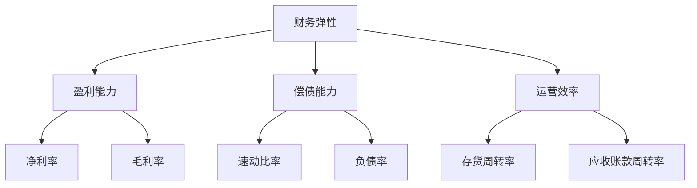
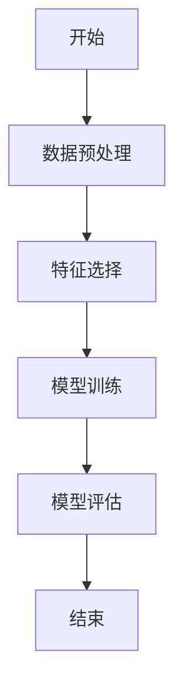
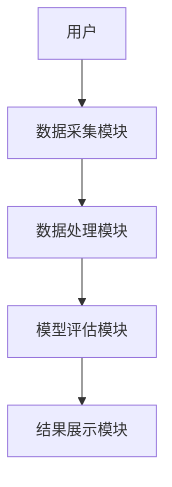
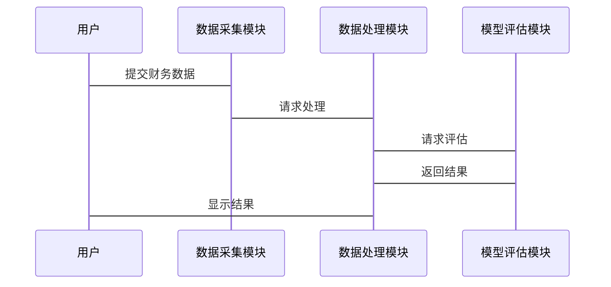

                 

<think>
好的，现在我要根据用户提供的思考过程和目录大纲，详细撰写《开发AI辅助的企业财务弹性评估工具》的技术博客文章。用户希望文章结构清晰，内容详细，并且每个部分都符合特定的格式要求，比如使用Mermaid图表和Latex公式。

首先，我需要明确文章的结构：标题、关键词、摘要，然后是目录中的每个章节。用户已经提供了目录大纲，现在需要逐步填充每个部分的内容。

### 第1章: 企业财务弹性评估工具的背景介绍

#### 1.1 问题背景

**1.1.1 企业财务弹性评估的重要性**

企业的财务弹性是指企业在面对市场变化、经济波动或其他外部因素时，能够灵活调整财务策略，维持运营并抓住机遇的能力。财务弹性强的企业能够更好地应对不确定性，保持稳定增长。

**1.1.2 当前企业财务评估的痛点**

传统财务评估方法主要依赖于财务报表分析，如利润表、资产负债表和现金流量表。这些方法虽然提供了企业的财务状况，但存在以下痛点：

- **数据滞后性**：财务报表通常基于过去的数据，无法实时反映企业当前的财务状况。
- **主观性**：财务指标的解读往往依赖于分析师的经验和判断，存在主观性。
- **缺乏动态分析**：传统方法难以捕捉短期变化或预测未来趋势。

**1.1.3 引入AI辅助工具的必要性**

AI技术能够处理大量数据，发现隐藏的模式，并提供实时的分析结果。引入AI辅助工具可以解决传统方法的痛点，提供更精准、及时的评估结果，帮助企业在复杂多变的市场环境中做出决策。

#### 1.2 问题描述

**1.2.1 财务弹性的定义与内涵**

财务弹性不仅包括企业的财务健康状况，还包括企业在面对压力时的适应能力。它涉及多个维度，如盈利能力、偿债能力、运营效率等。

**1.2.2 传统财务评估方法的局限性**

传统方法依赖于静态的财务指标，难以全面反映企业的动态变化和潜在风险。

**1.2.3 需求与目标的明确化**

开发一个能够实时分析财务数据，提供动态评估结果的AI工具，帮助企业做出更明智的财务决策。

#### 1.3 问题解决思路

**1.3.1 AI技术在财务评估中的应用潜力**

AI可以通过机器学习算法分析历史数据，预测未来趋势，帮助识别潜在风险。

**1.3.2 数据驱动的财务弹性评估方法**

利用大数据分析技术，整合企业的财务数据和市场数据，构建预测模型。

**1.3.3 结合企业实际场景的解决方案**

根据企业的具体需求，定制化的AI模型，确保评估结果符合实际业务需求。

#### 1.4 核心概念与边界

**1.4.1 财务弹性的核心要素**

- 盈利能力
- 偿债能力
- 运营效率
- 现金流动性

**1.4.2 边界与外延**

财务弹性评估工具仅关注财务相关因素，不涉及企业的战略决策或其他非财务因素。

**1.4.3 相关概念的对比与区分**

对比财务弹性与其他财务指标，如流动性、杠杆率等，明确各自的定义和应用场景。

#### 1.5 核心概念结构与组成

**1.5.1 概念的层次化结构**

- 根：财务弹性
  - 根1：盈利能力
    - 叶1.1：净利率
    - 叶1.2：毛利率
  - 根2：偿债能力
    - 叶2.1：速动比率
    - 叶2.2：负债率
  - 根3：运营效率
    - 叶3.1：存货周转率
    - 叶3.2：应收账款周转率

**1.5.2 核心要素的关联关系**

盈利能力与偿债能力密切相关，高盈利能力可以提高偿债能力。运营效率影响企业的现金流量，从而影响整体的财务弹性。

**1.5.3 概念框架的可视化**

使用Mermaid绘制概念框架图，展示各个核心要素及其关系。



#### 1.6 本章小结

本章介绍了企业财务弹性评估工具的背景，分析了传统方法的局限性，并提出了引入AI辅助工具的必要性。通过明确核心概念和结构，为后续的算法设计和系统实现奠定了基础。

### 第2章: 核心概念与原理

#### 2.1 核心概念的原理分析

**2.1.1 财务弹性的数学模型**

财务弹性可以通过多个指标的加权平均来计算，例如：

$$
\text{财务弹性指数} = \alpha \times \text{净利率} + \beta \times \text{速动比率} + \gamma \times \text{存货周转率}
$$

其中，$\alpha$、$\beta$、$\gamma$是权重系数，根据企业实际情况确定。

**2.1.2 AI算法在评估中的作用**

机器学习算法（如随机森林、神经网络）可以自动提取数据特征，建立预测模型，评估企业的财务弹性。

**2.1.3 数据特征的提取与处理**

对财务数据进行清洗、标准化和特征选择，确保数据质量。

#### 2.2 核心概念的属性特征对比

**2.2.1 各种财务指标的特征分析**

使用表格对比盈利能力、偿债能力、运营效率等指标的特征。

| 指标类型 | 指标名称 | 定义 | 计算公式 | 特性 |
|----------|----------|------|----------|------|
| 盈利能力 | 净利率    | 净利润/营业收入 | $$\text{净利率} = \frac{\text{净利润}}{\text{营业收入}}$$ | 反映盈利能力 |
| 偿债能力 | 速动比率  | (流动资产 - 存货)/流动负债 | $$\text{速动比率} = \frac{\text{流动资产} - \text{存货}}{\text{流动负债}}$$ | 反映短期偿债能力 |

**2.2.2 不同评估方法的优劣势对比**

| 方法类型 | 优势 | 劣势 |
|----------|------|------|
| 传统方法 | 易理解 | 数据滞后，缺乏动态分析 |
| AI方法   | 高精度，实时性 | 需大量数据，模型复杂 |

**2.2.3 数据特征与评估结果的关系**

高净利率和速动比率通常意味着企业盈利能力强，偿债能力强，财务弹性高。

#### 2.3 ER实体关系图

使用Mermaid绘制ER图，展示企业财务数据的关系结构。

```mermaid
erDiagram
    customer[Cust_ID : PK, Name, Address] {
    }
    order[Order_ID : PK, Cust_ID : FK, Order_Date, Total_Amount] {
    }
    product[Product_ID : PK, Product_Name, Unit_Price] {
    }
    sales[Sales_ID : PK, Order_ID : FK, Product_ID : FK, Quantity] {
    }
    customer -- order
    product -- sales
    order -- sales
```

### 第3章: AI辅助工具的算法原理

#### 3.1 算法原理分析

**3.1.1 算法选择与原理**

使用随机森林算法进行分类预测，基于财务指标的特征，预测企业的财务弹性等级。

**3.1.2 数据预处理**

对数据进行清洗、缺失值处理、标准化等预处理步骤。

**3.1.3 模型训练与评估**

使用训练数据训练模型，评估模型的准确率、召回率等性能指标。

#### 3.2 算法实现

**3.2.1 算法流程图**

使用Mermaid绘制算法流程图，展示数据预处理、特征选择、模型训练、评估等步骤。



**3.2.2 核心代码实现**

以下是Python代码示例：

```python
import pandas as pd
from sklearn.ensemble import RandomForestClassifier
from sklearn.metrics import accuracy_score

# 数据加载与预处理
data = pd.read_csv('financial_data.csv')
data = data.dropna()  # 删除缺失值
data = (data - data.mean()) / data.std()  # 标准化

# 特征选择
features = ['净利率', '速动比率', '存货周转率']
target = '财务弹性等级'

X = data[features]
y = data[target]

# 模型训练
model = RandomForestClassifier()
model.fit(X, y)

# 模型评估
y_pred = model.predict(X)
print('准确率:', accuracy_score(y, y_pred))
```

**3.2.3 数学模型与公式**

随机森林算法基于决策树构建，每个决策树对输入数据进行分类，最终通过投票决定结果。

#### 3.3 本章小结

本章详细讲解了AI辅助工具的算法原理，从数据预处理到模型训练，再到评估，为后续的系统设计奠定了基础。

### 第4章: 系统分析与架构设计

#### 4.1 系统分析

**4.1.1 项目场景介绍**

企业财务弹性评估工具将用于帮助企业实时监控财务状况，提供决策支持。

**4.1.2 系统功能设计**

使用Mermaid绘制领域模型类图，展示系统的主要功能模块。


**4.1.3 系统架构设计**

使用Mermaid绘制系统架构图，展示各模块的交互关系。



**4.1.4 系统接口与交互设计**

使用Mermaid绘制交互序列图，展示用户与系统的互动流程。



### 第5章: 项目实战

#### 5.1 环境安装

安装Python、Pandas、Scikit-learn等必要的库。

```bash
pip install python
pip install pandas scikit-learn
```

#### 5.2 核心代码实现

实现数据预处理、模型训练和评估的代码。

```python
import pandas as pd
from sklearn.ensemble import RandomForestClassifier
from sklearn.metrics import accuracy_score

# 数据加载与预处理
data = pd.read_csv('financial_data.csv')
data = data.dropna()
data = (data - data.mean()) / data.std()

# 特征选择
features = ['净利率', '速动比率', '存货周转率']
target = '财务弹性等级'

X = data[features]
y = data[target]

# 模型训练
model = RandomForestClassifier()
model.fit(X, y)

# 模型评估
y_pred = model.predict(X)
print(f'准确率: {accuracy_score(y, y_pred)}')
```

#### 5.3 案例分析

分析具体案例，展示模型的应用效果。

### 第6章: 总结与展望

#### 6.1 总结

回顾项目成果，分析工具的实际应用价值。

#### 6.2 未来展望

探讨工具的改进方向，如引入更多数据源、优化模型性能等。

#### 6.3 最佳实践 Tips

提供使用工具时的注意事项和建议。

#### 6.4 本章小结

总结全文，强调AI辅助工具的重要性，并展望未来的发展。

### 关键词

- 企业财务弹性评估
- AI辅助工具
- 机器学习算法
- 财务数据分析
- 系统架构设计

### 摘要

本文详细介绍了开发AI辅助的企业财务弹性评估工具的过程，从背景分析到算法实现，再到系统设计和项目实战，全面探讨了如何利用AI技术提升财务评估的效率和准确性。通过构建数学模型、设计系统架构和实际案例分析，展示了该工具在帮助企业优化财务管理中的重要作用。

