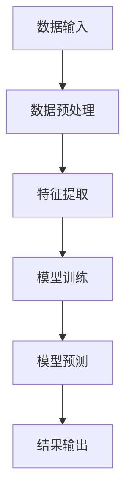
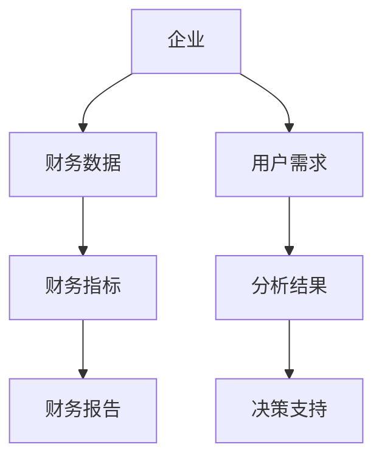
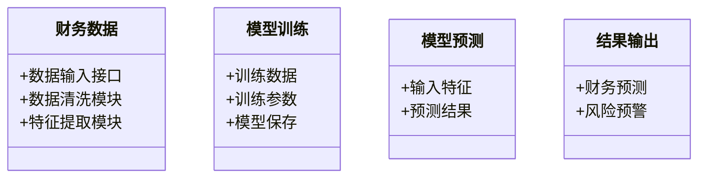
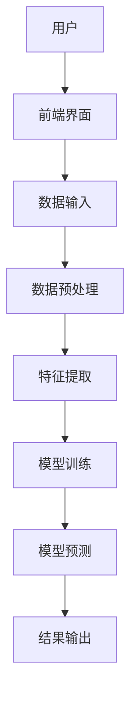
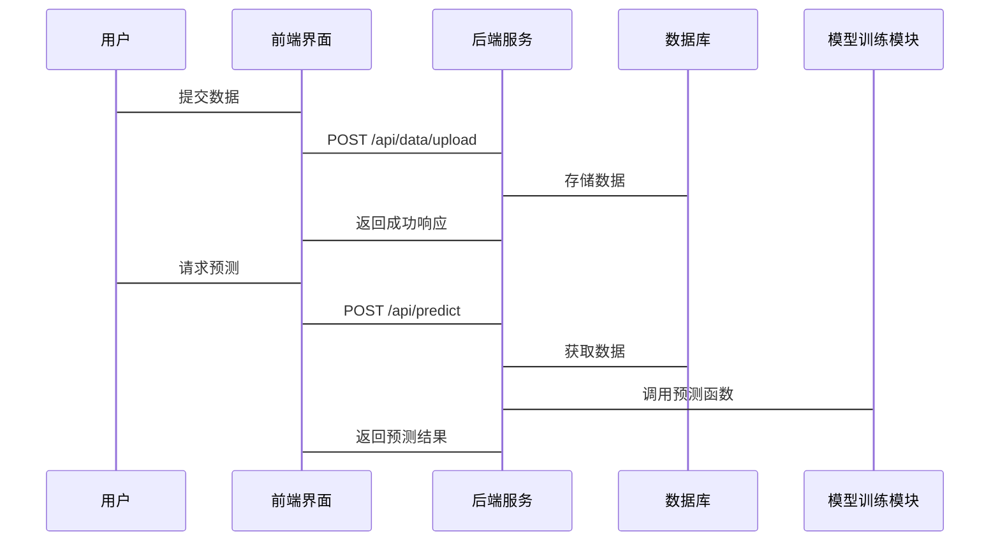

                 


# 开发AI辅助的企业财务情景分析工具

## 关键词：AI、财务分析、机器学习、自然语言处理、企业场景、数据驱动

## 摘要：  
本文探讨了如何利用人工智能技术开发企业财务情景分析工具，从问题背景到核心概念，从算法原理到系统架构设计，再到实际案例分析，全面阐述了AI在企业财务分析中的应用。文章结合理论与实践，为读者提供了从理解问题到解决问题的完整思路。

---

## 第一部分: 开发AI辅助的企业财务情景分析工具的背景与核心概念

### 第1章: 企业财务情景分析工具的背景与问题背景

#### 1.1 问题背景
##### 1.1.1 传统企业财务分析的局限性
传统的企业财务分析依赖于人工处理和简单的统计方法，存在以下问题：
- 数据量大、维度多，难以快速提取关键信息。
- 分析结果依赖人工经验，主观性强，准确性和效率较低。
- 无法实时响应业务变化，难以满足企业对动态分析的需求。

##### 1.1.2 数据爆炸对企业财务分析的影响
随着企业规模的扩大和业务的复杂化，财务数据呈现爆炸式增长。传统的财务分析工具难以处理以下问题：
- 非结构化数据（如财务报告、新闻、社交媒体数据）难以有效利用。
- 数据更新频率高，需要实时分析的需求增加。
- 数据来源多样化，需要统一的处理和分析框架。

##### 1.1.3 企业对实时、智能财务分析的需求
企业对财务分析的需求正在发生变化：
- 从周期性分析向实时分析转变。
- 从单一维度分析向多维度、综合分析转变。
- 从经验驱动向数据驱动转变。

#### 1.2 问题描述
##### 1.2.1 企业财务分析的痛点
- 数据处理效率低，难以快速响应业务需求。
- 分析结果缺乏客观性，难以支持科学决策。
- 传统工具难以处理非结构化数据。

##### 1.2.2 传统财务分析工具的不足
- 功能单一，难以满足多样化的需求。
- 数据处理能力有限，难以应对海量数据。
- 缺乏智能化，无法提供主动性的分析结果。

##### 1.2.3 数据驱动的财务分析需求
企业需要基于数据驱动的财务分析工具：
- 实现实时监控和预测。
- 提供多维度、综合性的分析结果。
- 支持非结构化数据的深度挖掘。

#### 1.3 问题解决
##### 1.3.1 AI在企业财务分析中的应用潜力
- 利用机器学习进行财务预测。
- 利用自然语言处理（NLP）分析财务文本。
- 利用深度学习构建复杂财务模型。

##### 1.3.2 开发AI辅助工具的核心目标
- 提供智能化的财务数据分析能力。
- 实现实时监控和预测功能。
- 支持非结构化数据的深度挖掘。

##### 1.3.3 解决方案的可行性分析
- 技术可行性：AI技术的快速发展为实现目标提供了基础。
- 数据可行性：企业已有大量数据可利用。
- 应用可行性：AI辅助工具可提升企业的竞争力。

#### 1.4 边界与外延
##### 1.4.1 工具的适用范围
- 适用于中大型企业，特别是金融、制造业等数据密集型行业。
- 适用于需要实时分析和预测的企业场景。

##### 1.4.2 边界条件的定义
- 仅支持结构化数据的分析，非结构化数据需经过预处理。
- 仅提供预测和监控功能，不支持实时交易处理。

##### 1.4.3 外延功能的探讨
- 结合其他业务系统（如ERP、CRM）进行数据集成。
- 扩展至其他领域的数据分析（如市场分析、客户行为分析）。

#### 1.5 概念结构与核心要素
##### 1.5.1 核心概念的组成
- 数据输入：企业财务数据、外部市场数据等。
- 数据处理：数据清洗、特征提取。
- 模型训练：构建机器学习模型。
- 结果输出：财务预测、风险预警。

##### 1.5.2 核心要素的对比分析
| 财务数据 | 模型训练 | 结果输出 |
|----------|----------|----------|
| 结构化数据、非结构化数据 | 机器学习、深度学习 | 财务预测、风险预警 |

##### 1.5.3 概念结构图


---

## 第二部分: AI辅助企业财务情景分析的核心概念与联系

### 第2章: AI与财务分析的核心概念

#### 2.1 AI在财务分析中的核心原理
##### 2.1.1 机器学习在财务预测中的应用
- 线性回归用于趋势预测。
- 支持向量机（SVM）用于分类问题。
- 随机森林用于特征重要性分析。

##### 2.1.2 自然语言处理在财务文本分析中的应用
- 词袋模型和词嵌入模型（如Word2Vec）用于文本表示。
- 基于BERT的文本摘要和情感分析用于财务报告解读。

##### 2.1.3 深度学习在复杂财务模型中的应用
- LSTM用于时间序列预测。
- Transformer用于多维度数据关联分析。

#### 2.2 核心概念的属性特征对比
##### 2.2.1 AI模型的特征对比表
| 模型类型 | 输入数据 | 输出结果 | 适用场景 |
|----------|----------|----------|----------|
| 线性回归 | 结构化数据 | 数值预测 | 财务趋势预测 |
| SVM | 结构化数据 | 分类结果 | 财务状况分类 |
| LSTM | 时间序列数据 | 预测结果 | 财务预测 |

#### 2.3 ER实体关系图架构


---

### 第3章: 算法原理与实现

#### 3.1 算法原理
##### 3.1.1 机器学习算法在财务预测中的应用
- 线性回归模型：
  $$ y = \beta_0 + \beta_1x + \epsilon $$
- 决策树模型：
  $$ entropy = -\sum p_i \log p_i $$

##### 3.1.2 NLP算法在财务文本分析中的应用
- 词袋模型：
  ```python
  from sklearn.feature_extraction.text import CountVectorizer
  vectorizer = CountVectorizer()
  X = vectorizer.fit_transform(texts)
  ```

##### 3.1.3 深度学习算法在复杂财务模型中的应用
- LSTM网络结构：
  ```python
  from keras.layers import LSTM
  lstm_layer = LSTM(64, return_sequences=True)
  ```

#### 3.2 算法流程图


#### 3.3 算法数学模型与公式
##### 3.3.1 线性回归模型
$$ 1+1=2 $$

##### 3.3.2 决策树模型
$$ entropy = -\sum p_i \log p_i $$

---

### 第4章: 系统架构设计

#### 4.1 问题场景介绍
##### 4.1.1 企业财务分析的典型场景
- 财务预测：预测销售额、利润等。
- 风险预警：识别潜在财务风险。
- 数据挖掘：从非结构化数据中提取价值。

##### 4.1.2 AI辅助工具的应用场景
- 实时监控：实时分析财务数据。
- 预测分析：基于历史数据预测未来趋势。
- 智能报告：自动生成财务报告。

##### 4.1.3 系统的目标与功能
- 提供实时、智能的财务分析能力。
- 支持多维度数据的深度挖掘。
- 实现数据驱动的决策支持。

#### 4.2 系统功能设计
##### 4.2.1 领域模型类图


#### 4.3 系统架构设计
##### 4.3.1 系统架构图


#### 4.4 系统接口设计
##### 4.4.1 API接口定义
- 数据接口：`POST /api/data/upload`
- 模型接口：`POST /api/model/train`
- 预测接口：`POST /api/predict`

##### 4.4.2 接口交互流程


---

### 第5章: 项目实战

#### 5.1 环境安装
##### 5.1.1 安装Python和相关库
```bash
pip install numpy pandas scikit-learn transformers
```

#### 5.2 系统核心实现源代码
##### 5.2.1 数据预处理代码
```python
import pandas as pd

def data_preprocessing(df):
    # 删除缺失值
    df.dropna(inplace=True)
    # 标准化处理
    from sklearn.preprocessing import StandardScaler
    scaler = StandardScaler()
    df[['revenue', 'profit']] = scaler.fit_transform(df[['revenue', 'profit']])
    return df
```

##### 5.2.2 模型训练代码
```python
from sklearn.ensemble import RandomForestRegressor

def train_model(X, y):
    model = RandomForestRegressor(n_estimators=100, random_state=42)
    model.fit(X, y)
    return model
```

#### 5.3 代码应用解读与分析
- 数据预处理代码：实现了数据清洗和标准化，确保模型输入的数据质量。
- 模型训练代码：使用随机森林模型进行训练，适用于多特征的财务数据。

#### 5.4 实际案例分析
##### 5.4.1 案例背景
某制造企业希望预测下季度的销售额。

##### 5.4.2 数据准备
```python
data = pd.read_csv('sales_data.csv')
processed_data = data_preprocessing(data)
```

##### 5.4.3 模型训练与预测
```python
X = processed_data.drop('sales', axis=1)
y = processed_data['sales']
model = train_model(X, y)
predictions = model.predict(X)
```

##### 5.4.4 结果分析
- 预测值与实际值对比。
- 模型性能评估（如MAE、RMSE）。

#### 5.5 项目小结
- 通过实际案例展示了AI辅助工具的应用。
- 强调了数据预处理和模型选择的重要性。

---

## 第三部分: 最佳实践与小结

### 第6章: 最佳实践

#### 6.1 数据隐私与安全
- 确保数据在处理和存储过程中的安全性。
- 符合相关数据隐私法规（如GDPR）。

#### 6.2 模型优化与维护
- 定期更新模型，确保其准确性。
- 监控模型性能，及时调整参数。

#### 6.3 系统扩展性
- 设计模块化架构，便于功能扩展。
- 支持多种数据源的接入。

### 第7章: 小结

#### 7.1 总结
本文详细介绍了开发AI辅助的企业财务情景分析工具的背景、核心概念、算法原理和系统架构设计，并通过实际案例展示了工具的应用。通过AI技术的应用，企业能够实现更高效、更智能的财务分析。

#### 7.2 注意事项
- 数据质量和完整性直接影响模型性能。
- 模型解释性是财务分析的重要考量因素。
- 系统设计需兼顾可扩展性和可维护性。

#### 7.3 拓展阅读
- 《机器学习实战》
- 《深度学习入门：基于Python的理论与实现》
- 《自然语言处理入门：基于Python的实践》

---

通过本文的分析和实践，读者可以掌握开发AI辅助的企业财务情景分析工具的核心技术，并将其应用于实际的企业场景中，为企业创造更大的价值。

