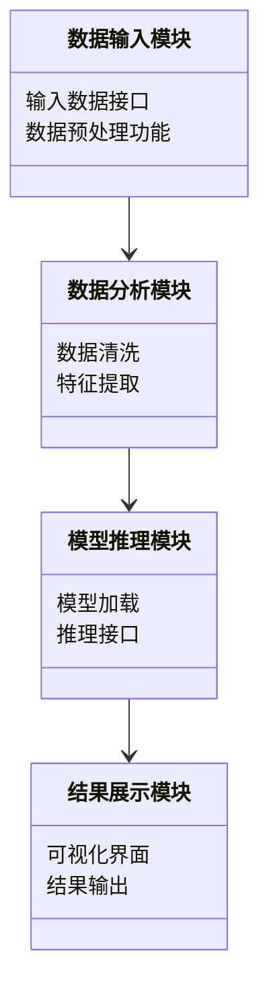

                 


# 开发AI辅助的企业财务战略规划工具

> 关键词：AI辅助，财务战略规划，企业财务，AI大模型，财务数据分析，战略规划生成

> 摘要：本文详细探讨了开发AI辅助的企业财务战略规划工具的背景、核心概念、算法原理、系统架构以及实际应用。通过分析财务数据分析与建模、战略规划生成与优化、风险评估与预测等关键环节，结合AI大模型的技术特点，提出了基于Transformer的模型结构和优化方法，并通过实际案例展示了工具的实现过程与应用场景。本文还提供了系统架构设计、接口设计和交互流程的具体方案，为读者提供了从理论到实践的全面指导。

---

## 第1章: 问题背景与目标

### 1.1 企业财务战略规划的现状与挑战

企业财务战略规划是企业经营的核心之一，其目的是通过合理分配和管理财务资源，实现企业长期发展的目标。然而，传统的财务规划方法存在以下问题：

- **数据复杂性与不完整性**：财务数据通常涉及大量历史数据、市场数据和预测数据，数据量大且复杂，难以快速处理和分析。
- **动态性与不确定性**：市场环境不断变化，企业财务目标需要根据外部环境和内部条件动态调整，传统的静态规划方法难以应对这种不确定性。
- **人工依赖性**：传统财务规划依赖于经验丰富的财务人员，存在主观性较强、效率较低的问题。

AI技术的出现为企业财务战略规划提供了新的可能性。通过AI技术，企业可以更高效地处理复杂数据，快速生成多种规划方案，并进行优化和预测。

### 1.2 问题描述与目标设定

本项目的目标是开发一个基于AI大模型的企业财务战略规划工具，该工具能够根据企业的财务数据和市场环境，自动生成财务规划方案，并提供优化建议和风险预测。

#### 1.2.1 核心目标
- 提供基于AI的财务数据分析与建模功能。
- 自动生成财务战略规划方案，并进行优化。
- 提供风险评估与预测功能。

#### 1.2.2 边界与外延
- **功能边界**：工具仅提供财务战略规划的辅助功能，不涉及企业的日常财务操作。
- **区别于现有系统**：与传统的财务管理系统不同，本工具更注重战略规划的生成与优化。
- **扩展应用**：未来可以将工具扩展到其他领域，如供应链管理、市场营销等。

### 1.3 解决方案与技术路线

为了实现目标，我们将采用以下技术路线：

1. **数据收集与预处理**：收集企业的财务数据、市场数据等，并进行清洗和预处理。
2. **模型训练与优化**：基于AI大模型（如Transformer）进行模型训练，并对模型进行优化。
3. **系统架构设计**：设计系统的功能模块、接口和交互流程。
4. **工具开发与测试**：开发工具并进行功能测试和性能优化。

---

## 第2章: AI大模型的基本原理

### 2.1 AI大模型的定义与特点

AI大模型是指基于深度学习技术构建的大型人工神经网络模型，具有以下特点：

- **大规模参数**：通常包含 billions 级别的参数，能够处理复杂的语言和数据模式。
- **自适应能力**：通过自注意力机制，能够根据上下文动态调整模型输出。
- **多任务能力**：同一模型可以用于多种任务，如文本生成、数据分析等。

### 2.2 大模型的训练与推理

#### 2.2.1 模型结构
- **Transformer模型**：基于自注意力机制，能够捕捉数据之间的长距离依赖关系。
- **多层感知机**：用于对数据进行非线性变换和特征提取。

#### 2.2.2 训练流程
- 数据预处理：对财务数据进行清洗、归一化处理。
- 模型训练：使用Adam优化器和交叉熵损失函数进行训练。
- 模型调优：通过调整学习率、批量大小等参数优化模型性能。

---

## 第3章: AI辅助财务规划的算法实现

### 3.1 模型结构与训练流程

#### 3.1.1 模型结构


#### 3.1.2 损失函数与优化方法
- **损失函数**：交叉熵损失函数。
  $$ L = -\frac{1}{N}\sum_{i=1}^{N} \sum_{j=1}^{M} y_{ij}\log p(y_{ij}|x_i) $$
- **优化方法**：Adam优化器。
  $$ \theta_{t+1} = \theta_t - \eta \frac{\rho_1}{\rho_2 + (1-\rho_2)^k} \nabla L $$

#### 3.1.3 模型训练流程
```python
import torch
import torch.nn as nn
import torch.optim as optim

class TransformerModel(nn.Module):
    def __init__(self):
        super(TransformerModel, self).__init__()
        self.encoder = nn.TransformerEncoder(...)
        self.decoder = nn.TransformerDecoder(...)

model = TransformerModel()
optimizer = optim.Adam(model.parameters(), lr=0.001)
criterion = nn.CrossEntropyLoss()

for epoch in range(num_epochs):
    for inputs, targets in dataloader:
        outputs = model(inputs)
        loss = criterion(outputs, targets)
        optimizer.zero_grad()
        loss.backward()
        optimizer.step()
```

---

## 第4章: 系统架构与设计

### 4.1 系统功能设计

#### 4.1.1 功能模块


### 4.2 系统架构设计

#### 4.2.1 系统架构


---

## 第5章: 项目实战

### 5.1 环境安装

```bash
pip install torch transformers mermaid4jupyter
```

### 5.2 核心代码实现

```python
import torch
from transformers import Transformer

class FinancialPlanner:
    def __init__(self):
        self.model = Transformer(...)
    
    def analyze_data(self, data):
        # 数据分析与预处理
        pass
    
    def generate_plan(self, data):
        # 生成财务规划
        pass
    
    def optimize_plan(self, plan):
        # 优化规划方案
        pass
```

### 5.3 案例分析

假设我们有一个企业的财务数据，包括收入、支出、利润等。我们可以通过以下步骤生成财务规划：

1. **数据输入**：将企业的财务数据输入工具。
2. **数据分析**：工具对数据进行清洗和预处理。
3. **模型推理**：模型根据数据生成财务规划方案。
4. **结果展示**：工具将规划方案以可视化形式展示给用户。

---

## 第6章: 最佳实践与总结

### 6.1 小结

本文详细探讨了开发AI辅助的企业财务战略规划工具的背景、核心概念、算法原理、系统架构以及实际应用。通过分析财务数据分析与建模、战略规划生成与优化、风险评估与预测等关键环节，结合AI大模型的技术特点，提出了基于Transformer的模型结构和优化方法，并通过实际案例展示了工具的实现过程与应用场景。

### 6.2 注意事项

- 在开发过程中，需要注意模型的训练数据质量，确保数据的准确性和代表性。
- 模型的推理速度和结果的准确性之间需要进行权衡。
- 在实际应用中，需要考虑企业的具体需求，对工具进行定制化开发。

### 6.3 拓展阅读

- "Attention Is All You Need"（维基百科）
- "Transformers for NLP"（Hugging Face官方文档）
- "Deep Learning for Financial Markets"（书籍推荐）

---

以上是《开发AI辅助的企业财务战略规划工具》的技术博客文章大纲，涵盖了从背景到实践的各个方面，结合了理论与实际案例，为读者提供了全面的指导。

