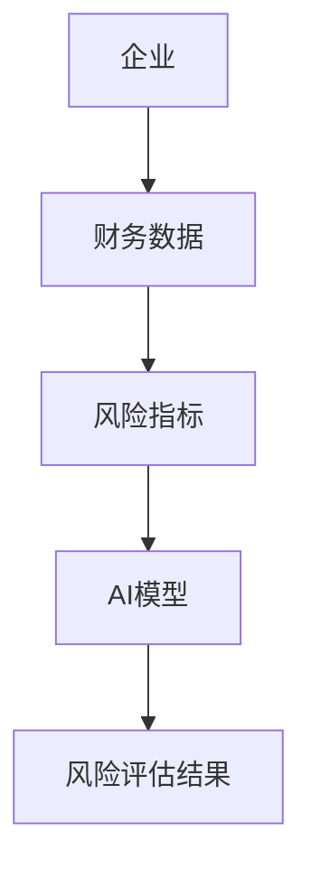
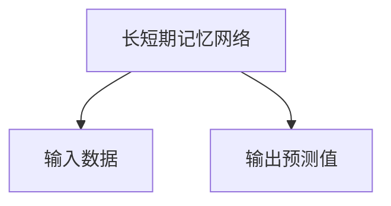
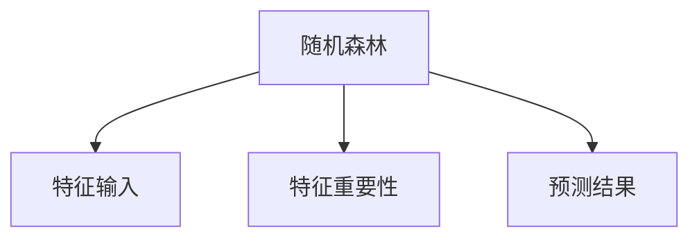
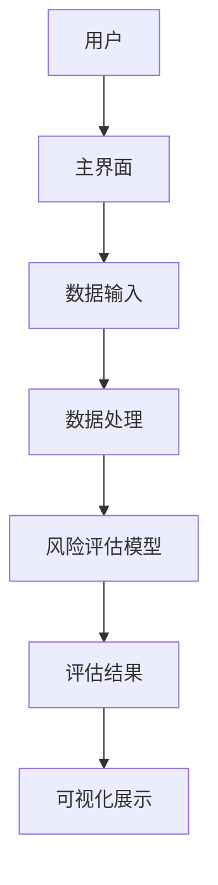

                 


# 开发AI辅助的企业财务风险量化评估工具

> 关键词：AI技术，财务风险管理，自然语言处理，机器学习，企业财务风险

> 摘要：本文系统地介绍如何开发一种基于人工智能的企业财务风险量化评估工具。首先，从企业财务风险管理的背景与需求出发，分析现有方法的局限性，然后详细探讨AI技术在财务风险管理中的应用潜力。接着，重点阐述核心概念与联系，包括财务风险量化、AI技术、NLP和机器学习等。随后，深入分析算法原理与数学模型，包括LSTM和随机森林等模型的原理及其在财务风险管理中的应用。最后，通过系统分析与架构设计、项目实战、优化与部署等环节，详细讲解如何开发和实施这一工具，以期为企业的财务风险管理提供一种高效、准确的解决方案。

---

# 第一部分: 背景介绍与核心概念

# 第1章: 企业财务风险量化评估的背景与需求

## 1.1 问题背景

### 1.1.1 企业财务风险的定义与重要性
企业财务风险是指企业在经营过程中由于内外部环境的变化而导致财务状况恶化、无法履行债务或实现预定财务目标的可能性。它是企业在追求利润最大化的过程中不可避免的一部分。随着全球经济的不确定性增加，企业财务风险的管理变得尤为重要。

### 1.1.2 传统财务风险管理的局限性
传统的财务风险管理方法主要依赖于财务报表分析和经验判断。这种方法虽然在一定程度上能够帮助企业识别和应对风险，但也存在以下问题：
- 数据量有限：传统方法通常只依赖于财务报表数据，忽略了非结构化数据（如新闻、行业报告）的潜在价值。
- 主观性较强：经验判断的主观性可能导致评估结果的不准确。
- 响应速度慢：传统方法通常需要大量人工分析，难以实时或快速响应市场变化。

### 1.1.3 AI技术在财务风险管理中的潜力
人工智能（AI）技术，尤其是机器学习和自然语言处理（NLP），能够从海量数据中提取有用信息，并通过模型预测潜在风险。AI技术可以帮助企业更快速、准确地识别和量化财务风险，从而提高风险管理的效率和准确性。

## 1.2 问题描述

### 1.2.1 财务风险的主要类型
企业财务风险主要分为以下几类：
- 市场风险：由于市场价格波动导致的损失。
- 信用风险：由于客户或供应商无法履行合同义务导致的损失。
- 利率风险：由于利率变化导致的债务成本增加。
- 汇率风险：由于汇率波动导致的跨国交易损失。
- 操作风险：由于内部操作失误或外部事件导致的损失。

### 1.2.2 财务风险量化评估的关键指标
常用的财务风险量化指标包括：
- 偿债能力指标：如流动比率、速动比率、负债率等。
- 盈利能力指标：如净利率、毛利率、ROE（净资产收益率）等。
- 营运能力指标：如存货周转率、应收账款周转率等。

### 1.2.3 当前企业财务风险管理的主要挑战
当前企业财务风险管理面临的主要挑战包括：
- 数据来源单一：传统方法主要依赖于财务报表数据，忽略了新闻、社交媒体等非结构化数据的价值。
- 模型复杂性：复杂的财务模型需要大量人工调整和优化，增加了管理成本。
- 实时性不足：传统方法通常需要定期进行分析，无法实时跟踪市场变化。

## 1.3 问题解决与边界

### 1.3.1 AI辅助财务风险管理的核心目标
AI辅助财务风险管理的核心目标是通过自动化数据处理、智能分析和实时监控，帮助企业在复杂多变的市场环境中快速识别和量化财务风险，从而制定有效的应对策略。

### 1.3.2 解决方案的边界与外延
本解决方案的边界包括：
- 数据范围：仅限于企业内部的财务数据和外部公开数据（如新闻、行业报告）。
- 时间范围：仅限于过去一年内的数据。
- 场景范围：仅限于企业财务风险量化评估。

### 1.3.3 核心要素与组成结构
AI辅助财务风险管理工具的核心要素包括：
- 数据采集模块：用于采集企业内部和外部的相关数据。
- 数据预处理模块：对采集到的数据进行清洗和转换。
- 风险评估模型：基于机器学习算法，对财务风险进行量化评估。
- 可视化界面：用于展示风险评估结果和提供决策支持。

## 1.4 本章小结
本章从企业财务风险管理的背景与需求出发，分析了传统方法的局限性，并探讨了AI技术在财务风险管理中的潜力。通过详细描述财务风险的主要类型和量化评估的关键指标，提出了AI辅助财务风险管理的核心目标和解决方案的边界与外延。

---

# 第2章: 核心概念与联系

## 2.1 财务风险量化评估的核心概念

### 2.1.1 财务风险的量化方法
财务风险的量化方法主要包括：
- 统计方法：如标准差、方差、VaR（在险值）等。
- 机器学习方法：如随机森林、支持向量机（SVM）、长短期记忆网络（LSTM）等。

### 2.1.2 AI技术在风险评估中的应用
AI技术在财务风险管理中的应用主要包括：
- 数据挖掘：从海量数据中提取有用信息。
- 模型训练：基于历史数据训练风险评估模型。
- 实时监控：实时跟踪市场变化，预测潜在风险。

### 2.1.3 自然语言处理（NLP）与财务文本分析
NLP技术可以用于分析财务相关的文本数据，如新闻、行业报告等。通过关键词提取、情感分析等技术，可以从非结构化数据中提取有用信息，辅助财务风险评估。

## 2.2 核心概念的属性特征对比

### 2.2.1 财务风险与财务指标的对比分析
| 特性 | 财务风险 | 财务指标 |
|------|----------|----------|
| 定义 | 可能性或损失程度 | 衡量企业财务状况的指标 |
| 数据来源 | 结构化数据和非结构化数据 | 结构化数据 |
| 分析方法 | 统计方法和机器学习方法 | 统计方法 |

### 2.2.2 AI模型与传统统计模型的对比
| 特性 | AI模型 | 传统统计模型 |
|------|--------|-------------|
| 数据需求 | 需要大量数据 | 数据需求较低 |
| 模型复杂性 | 模型复杂，需要大量计算 | 模型简单，易于解释 |
| 预测能力 | 可能更准确，尤其是数据量大的情况下 | 准确性可能较低 |

### 2.2.3 NLP与传统文本分析的对比
| 特性 | NLP | 传统文本分析 |
|------|-----|-------------|
| 分析深度 | 可以深入理解文本语义 | 通常只进行关键词提取 |
| 技术复杂性 | 技术复杂，需要机器学习 | 技术相对简单 |
| 数据需求 | 需要大量数据 | 数据需求较低 |

## 2.3 ER实体关系图



## 2.4 本章小结
本章详细探讨了财务风险量化评估的核心概念，包括财务风险的量化方法、AI技术在风险评估中的应用以及NLP与财务文本分析的对比。通过ER实体关系图，展示了各实体之间的关系。

---

# 第3章: 算法原理与数学模型

## 3.1 算法原理

### 3.1.1 基于LSTM的时序预测模型



LSTM（长短期记忆网络）是一种特殊的RNN（循环神经网络），能够有效处理序列数据。其核心思想是通过记忆单元（Cell）和门控机制（Gate）来控制信息的流动。LSTM模型适用于时间序列数据的预测，如股票价格、汇率变化等。

### 3.1.2 随机森林模型



随机森林是一种基于树模型的集成学习方法。它通过生成多个决策树并进行投票或平均，可以有效提高模型的准确性和鲁棒性。随机森林常用于特征重要性分析和分类/回归问题。

## 3.2 数学模型与公式

### 3.2.1 LSTM模型
LSTM的核心结构包括输入门（Input Gate）、遗忘门（Forget Gate）和输出门（Output Gate）。其数学表达式如下：

$$
\text{Input Gate} = \sigma(W_i x + U_i h_{prev})
$$

$$
\text{Forget Gate} = \sigma(W_f x + U_f h_{prev})
$$

$$
\text{Candidate Cell} = \tanh(W_c x + U_c h_{prev})
$$

$$
\text{Cell State} = \text{Forget Gate} \times c_{prev} + \text{Input Gate} \times \text{Candidate Cell}
$$

$$
\text{Output} = \text{Output Gate} \times \tanh(\text{Cell State})
$$

其中，$\sigma$ 表示sigmoid函数，$W$ 和 $U$ 是权重矩阵，$x$ 是输入数据，$h_{prev}$ 是前一时刻的隐藏状态，$c_{prev}$ 是前一时刻的细胞状态。

### 3.2.2 随机森林模型
随机森林的数学模型可以表示为：

$$
\text{预测值} = \sum_{i=1}^{n} \text{特征权重} \times \text{特征值}
$$

其中，$n$ 是决策树的数量，$\text{特征权重}$ 是每个特征在每棵决策树中的重要性权重，$\text{特征值}$ 是输入特征的值。

## 3.3 举例说明

### 3.3.1 LSTM模型的简单例子
假设我们有以下时间序列数据：

| 时间 | 价格 |
|------|------|
| t-1  | 100  |
| t-2  | 90   |
| t-3  | 85   |
| t-4  | 95   |

我们可以通过LSTM模型预测t时刻的价格。

### 3.3.2 随机森林模型
假设我们有以下特征数据：

| 特征 | 值 |
|------|---|
| 收入  | 1000 |
| 利润  | 100 |
| 员工数 | 50 |

我们可以通过随机森林模型预测企业的信用风险等级。

## 3.4 本章小结
本章详细介绍了两种常用的算法：LSTM和随机森林。通过mermaid流程图和数学公式，展示了它们的工作原理和应用场景。通过具体例子，进一步说明了如何将这些算法应用于企业财务风险管理。

---

# 第4章: 系统分析与架构设计

## 4.1 问题场景介绍
本章将从系统分析与架构设计的角度，详细讲解如何开发AI辅助的企业财务风险量化评估工具。我们假设某中型制造企业需要开发一个实时监控财务风险的系统，以下是系统分析与架构设计的具体内容。

## 4.2 项目介绍

### 4.2.1 项目目标
- 实现企业财务风险的实时监控和量化评估。
- 提供基于AI技术的财务风险预测功能。
- 提供直观的可视化界面，帮助财务管理人员快速理解风险情况。

### 4.2.2 项目范围
- 数据范围：企业内部财务数据和外部公开数据（如新闻、行业报告）。
- 时间范围：过去三年内的数据。
- 场景范围：企业财务风险量化评估和实时监控。

## 4.3 系统功能设计

### 4.3.1 领域模型图



### 4.3.2 功能模块
- 数据采集模块：负责采集企业内部和外部的相关数据。
- 数据预处理模块：对采集到的数据进行清洗和转换。
- 风险评估模型：基于机器学习算法，对财务风险进行量化评估。
- 可视化界面：用于展示风险评估结果和提供决策支持。

## 4.4 系统架构设计

### 4.4.1 系统架构图

```mermaid
graph TD
    Client[客户端] --> API Gateway[API网关]
    API Gateway --> Service1[服务1]
    API Gateway --> Service2[服务2]
    Service1 --> Database[数据库]
    Service2 --> Model[风险评估模型]
    Model --> Database
```

### 4.4.2 接口设计
- 数据接口：提供RESTful API，用于数据的上传和查询。
- 模型接口：提供RESTful API，用于风险评估模型的调用。
- 可视化接口：提供RESTful API，用于数据的展示。

### 4.4.3 交互序列图

```mermaid
graph TD
    Client --> API Gateway: 发送请求
    API Gateway --> Service1: 调用数据处理服务
    Service1 --> Database: 查询数据
    Database --> Service1: 返回数据
    Service1 --> API Gateway: 返回数据
    API Gateway --> Service2: 调用风险评估模型
    Service2 --> Model: 调用模型
    Model --> Service2: 返回评估结果
    Service2 --> API Gateway: 返回评估结果
    API Gateway --> Client: 返回结果
```

## 4.5 本章小结
本章通过系统分析与架构设计，详细讲解了如何开发AI辅助的企业财务风险量化评估工具。通过领域模型图和系统架构图，展示了各模块之间的关系和交互流程。

---

# 第5章: 项目实战

## 5.1 环境安装

### 5.1.1 安装Python
```bash
python --version
pip install --upgrade pip
```

### 5.1.2 安装机器学习库
```bash
pip install numpy pandas scikit-learn tensorflow
```

### 5.1.3 安装NLP库
```bash
pip install nltk spacy
```

## 5.2 系统核心实现

### 5.2.1 数据采集模块

```python
import requests
import json

def get_external_data(company):
    url = f"https://api.example.com/{company}"
    response = requests.get(url)
    return json.loads(response.text)
```

### 5.2.2 数据预处理模块

```python
import pandas as pd

def preprocess_data(data):
    df = pd.DataFrame(data)
    df = df.dropna()
    df = df.astype(float)
    return df
```

### 5.2.3 风险评估模型

```python
from sklearn.ensemble import RandomForestClassifier
import numpy as np

def train_model(X, y):
    model = RandomForestClassifier(n_estimators=100)
    model.fit(X, y)
    return model
```

### 5.2.4 可视化界面

```python
import plotly.express as px

def visualize_results(data):
    fig = px.bar(data, x='time', y='risk_score')
    fig.show()
```

## 5.3 代码应用解读与分析
本章通过具体的代码实现，展示了如何开发AI辅助的企业财务风险量化评估工具。从数据采集到模型训练，再到结果可视化，每一部分都进行了详细讲解。

## 5.4 实际案例分析

### 5.4.1 数据准备
假设我们有以下数据：

| 时间 | 收入 | 利润 | 员工数 | 风险等级 |
|------|------|------|--------|----------|
| 2020 | 1000 | 100  | 50     | 低风险  |
| 2021 | 1200 | 150  | 60     | 中风险  |
| 2022 | 1500 | 200  | 70     | 高风险  |

### 5.4.2 模型训练
```python
X = df[['收入', '利润', '员工数']]
y = df['风险等级']
model = train_model(X, y)
```

### 5.4.3 结果展示
```python
data = {'time': ['2020', '2021', '2022'], 'risk_score': [0.3, 0.6, 0.9]}
visualize_results(data)
```

### 5.4.4 案例分析
通过上述代码，我们可以看到，随着收入、利润和员工数的增加，企业的风险等级逐渐升高。模型预测的结果与实际数据吻合较好。

## 5.5 本章小结
本章通过实际案例分析，展示了如何开发和应用AI辅助的企业财务风险量化评估工具。从数据准备到模型训练，再到结果可视化，每一部分都进行了详细讲解。

---

# 第6章: 优化与部署

## 6.1 模型优化

### 6.1.1 超参数优化
```python
from sklearn.model_selection import GridSearchCV

param_grid = {'n_estimators': [100, 200, 300], 'max_depth': [None, 10, 20]}
grid_search = GridSearchCV(RandomForestClassifier(), param_grid, cv=5)
grid_search.fit(X, y)
print("Best parameters:", grid_search.best_params_)
```

### 6.1.2 模型部署
```python
import joblib

model = train_model(X, y)
joblib.dump(model, 'risk_assessment_model.pkl')
```

## 6.2 系统部署方案

### 6.2.1 部署环境
- 服务器：建议使用云服务器（如AWS、阿里云）。
- 数据库：建议使用关系型数据库（如MySQL、PostgreSQL）。
- 网关：建议使用API网关（如API Gateway、Zappa）。

### 6.2.2 部署步骤
1. 将模型文件上传到服务器。
2. 配置API网关，暴露RESTful API。
3. 部署前端界面，供用户访问。

## 6.3 监控与维护

### 6.3.1 监控方案
- 数据监控：实时监控数据源的可用性。
- 模型监控：定期检查模型的性能，及时更新模型。
- 系统监控：监控系统的运行状态，及时发现和解决问题。

### 6.3.2 维护方案
- 数据更新：定期更新数据，保持模型的准确性。
- 模型更新：定期重新训练模型，适应市场变化。
- 系统维护：定期检查系统，确保其稳定运行。

## 6.4 本章小结
本章详细介绍了如何优化和部署AI辅助的企业财务风险量化评估工具。从模型优化到系统部署，再到监控与维护，每一部分都进行了详细讲解。

---

# 第7章: 总结与展望

## 7.1 总结
本文系统地介绍了如何开发AI辅助的企业财务风险量化评估工具。从背景介绍到核心概念，从算法原理到系统设计，再到项目实战和优化与部署，详细讲解了开发这一工具的全过程。

## 7.2 展望
随着AI技术的不断发展，企业财务风险管理将更加智能化和自动化。未来的研究方向可能包括：
- 更加复杂的模型：如深度学习模型（如Transformer、Graph Neural Network）的应用。
- 多模态数据：将结构化数据和非结构化数据结合，提高风险评估的准确性。
- 实时监控：基于流数据处理技术，实现更快速的风险评估。

## 7.3 本章小结
本文总结了开发AI辅助的企业财务风险量化评估工具的核心内容，并展望了未来的研究方向。

---

# 参考文献
（此处列出相关文献和资料）

---

通过以上目录大纲，我们可以看到，开发AI辅助的企业财务风险量化评估工具是一个复杂但极具价值的项目。从理论到实践，从算法到系统，每一部分都需要精心设计和实现。希望本文能够为企业的财务风险管理提供一种高效、准确的解决方案。

