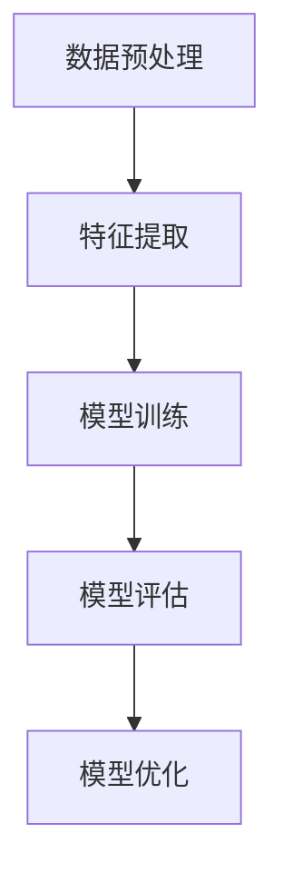
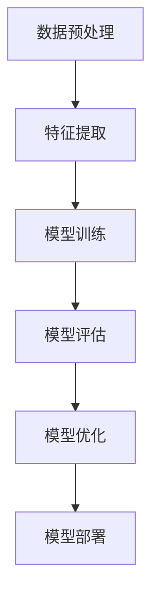
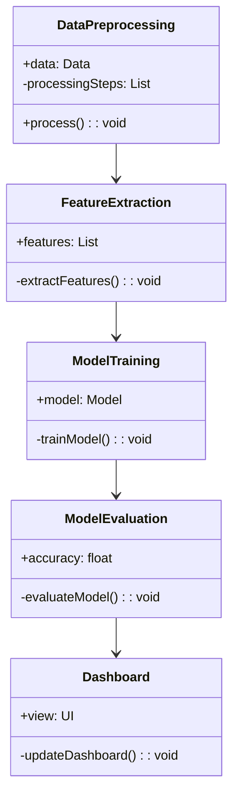
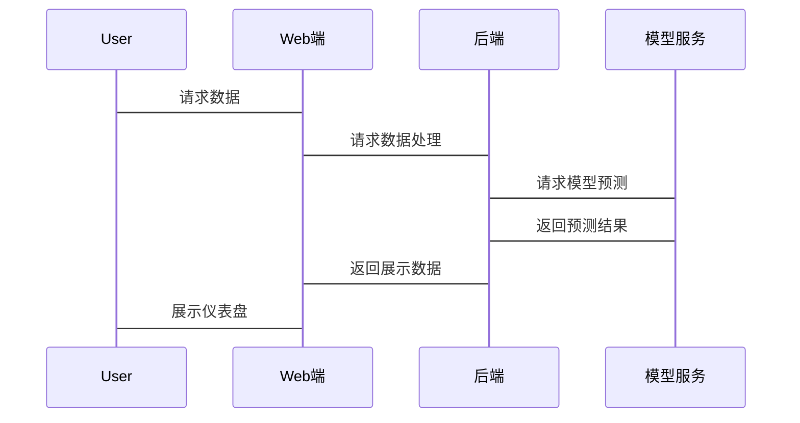
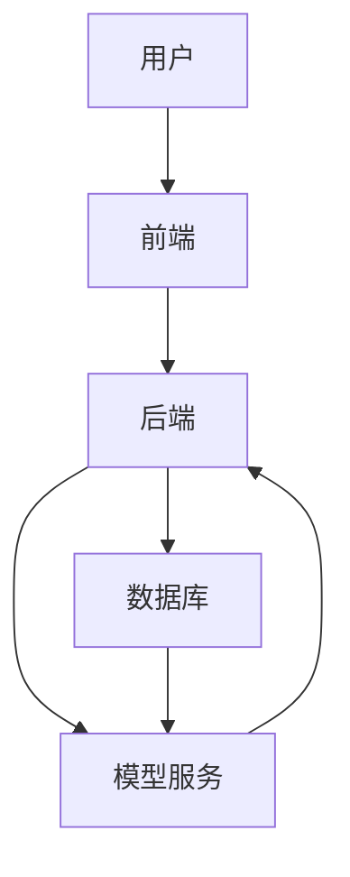

                 


# 开发AI辅助的企业财务风险预警仪表盘

## 关键词：AI、财务风险预警、仪表盘、机器学习、数据可视化、系统架构

## 摘要：本文详细探讨了如何利用AI技术开发企业财务风险预警仪表盘。从问题背景到核心概念，从算法原理到系统架构，再到项目实战，全面解析了AI在企业财务风险管理中的应用。通过具体案例和最佳实践，展示了如何构建高效、直观的财务风险预警系统。

---

## 第1章: 企业财务风险预警的背景与挑战

### 1.1 问题背景

#### 1.1.1 企业财务风险的定义与类型

企业财务风险是指企业在经营过程中，由于内外部因素的变化，可能导致财务状况恶化，进而影响企业正常运转甚至引发破产的风险。常见的财务风险类型包括：

1. **流动性风险**：企业无法及时偿还短期债务的风险。
2. **信用风险**：客户或供应商无法履行合同义务的风险。
3. **市场风险**：市场价格波动对企业财务状况的影响。
4. **操作风险**：由于内部操作失误或舞弊行为导致的财务损失风险。

#### 1.1.2 传统财务风险管理的局限性

传统的财务风险管理方法依赖于财务报表分析和人工判断，存在以下问题：

1. **数据处理效率低**：手工处理大量财务数据耗时耗力，且容易出错。
2. **预警滞后性**：传统方法通常在风险事件发生后才能发现，难以实现事前预警。
3. **主观性较强**：依赖于财务人员的经验判断，缺乏客观性和准确性。

#### 1.1.3 AI技术在财务风险管理中的潜力

人工智能技术的快速发展为财务风险管理带来了新的可能性：

1. **自动化数据处理**：AI能够快速处理大量财务数据，提取关键特征。
2. **实时监控与预警**：通过机器学习模型，可以实时分析财务数据，提前发现潜在风险。
3. **精准预测**：AI可以通过历史数据训练模型，准确预测财务风险的发生概率。

### 1.2 问题描述

#### 1.2.1 财务数据的特点与复杂性

财务数据具有以下特点：

1. **多维度性**：包括收入、支出、资产、负债等多方面的数据。
2. **时间序列性**：财务数据通常具有时间维度，需要考虑历史数据的影响。
3. **异构性**：财务数据可能来自不同的系统，格式和结构差异较大。

#### 1.2.2 财务风险预警的核心目标

财务风险预警的核心目标是通过分析财务数据，识别潜在的财务风险，并提供预警信息，帮助企业在风险发生前采取措施进行规避或降低损失。

#### 1.2.3 企业财务风险预警的痛点

1. **数据分散**：企业的财务数据可能分散在多个系统中，难以整合。
2. **模型复杂**：复杂的财务数据关系需要建立高效的预警模型。
3. **实时性要求高**：企业需要实时监控财务状况，对潜在风险快速响应。

### 1.3 问题解决

#### 1.3.1 AI辅助的解决方案

通过引入AI技术，可以实现以下目标：

1. **自动化数据处理**：利用自然语言处理（NLP）和数据挖掘技术，自动提取和整理财务数据。
2. **智能预警系统**：基于机器学习算法，构建财务风险预警模型，实现自动预警。
3. **可视化界面**：通过数据可视化技术，将复杂的财务数据以直观的方式呈现给用户。

#### 1.3.2 数据驱动的预警模型

数据驱动的预警模型通过分析企业的财务数据，识别潜在风险因素，并预测风险发生的概率。常见的机器学习算法包括逻辑回归、支持向量机（SVM）、随机森林（Random Forest）和梯度提升树（如XGBoost）。

#### 1.3.3 仪表盘的设计与实现

仪表盘是企业财务风险预警系统的重要组成部分，它通过直观的图表和界面，向用户展示企业的财务状况和潜在风险。仪表盘的设计需要考虑以下几点：

1. **用户友好性**：界面设计要直观易用，便于用户快速理解。
2. **实时性**：数据需要实时更新，确保用户看到的是最新的信息。
3. **可定制性**：用户可以根据自身需求，定制仪表盘的显示内容和形式。

### 1.4 边界与外延

#### 1.4.1 财务风险预警的边界

1. **数据范围**：限定在企业的财务数据范围内，不涉及其他业务数据。
2. **预警范围**：仅针对财务风险，不包括其他类型的风险（如操作风险、市场风险）。
3. **时间范围**：限定在一定的时间范围内，如最近一年的财务数据。

#### 1.4.2 仪表盘功能的外延

1. **数据源扩展**：未来可以整合更多的数据源，如外部市场数据、行业基准数据等。
2. **功能扩展**：增加更多的分析功能，如趋势分析、情景分析等。
3. **用户权限扩展**：支持多角色用户，如财务部、管理层等，不同用户有不同的权限和查看范围。

#### 1.4.3 与其他系统的接口关系

1. **与企业财务系统的接口**：需要与企业的ERP、财务系统等进行数据对接，获取实时的财务数据。
2. **与企业业务系统的接口**：需要与其他业务系统（如销售系统、采购系统）进行数据交互，获取相关的业务数据。
3. **与外部数据源的接口**：未来可以考虑接入外部市场数据、行业基准数据等，提高预警的准确性。

### 1.5 核心要素组成

#### 1.5.1 数据源

1. **内部数据**：企业的财务报表、交易数据、账务数据等。
2. **外部数据**：市场数据、行业基准数据、宏观经济数据等。

#### 1.5.2 风险特征提取

1. **财务比率分析**：如流动比率、速动比率、资产负债率等。
2. **趋势分析**：分析收入、利润、现金流等指标的变化趋势。
3. **异常检测**：通过统计方法或机器学习算法，发现数据中的异常点。

#### 1.5.3 预警模型

1. **特征选择**：从大量财务数据中筛选出对风险预测有显著影响的特征。
2. **模型训练**：利用机器学习算法训练预警模型，如逻辑回归、XGBoost等。
3. **模型评估**：通过测试数据评估模型的准确率、召回率等性能指标。

#### 1.5.4 仪表盘

1. **数据可视化**：通过图表、仪表盘等形式，直观展示企业的财务状况和潜在风险。
2. **预警提示**：当模型预测到潜在风险时，系统会发出预警提示，并提供相应的建议。
3. **用户交互**：用户可以通过仪表盘查询详细信息、设置预警参数等。

---

## 第2章: AI辅助的企业财务风险预警系统的核心概念

### 2.1 核心概念原理

#### 2.1.1 数据预处理

数据预处理是AI辅助的财务风险预警系统中非常重要的一步。通过数据预处理，可以将原始的财务数据转化为适合模型训练的形式。

1. **数据清洗**：去除重复数据、缺失值处理、异常值处理等。
2. **数据转换**：对数据进行标准化、归一化处理，使其适合模型输入。
3. **特征提取**：从原始数据中提取有助于风险预测的特征，如财务比率、趋势指标等。

#### 2.1.2 风险特征提取

风险特征提取是将原始的财务数据转化为具有代表性的特征，以便模型能够更好地捕捉到风险信号。

1. **财务比率分析**：如流动比率、速动比率、资产负债率等。
2. **趋势分析**：分析收入、利润、现金流等指标的变化趋势。
3. **异常检测**：通过统计方法或机器学习算法，发现数据中的异常点。

#### 2.1.3 预警模型训练

预警模型训练是利用机器学习算法，训练出能够准确预测财务风险的模型。

1. **特征选择**：从大量财务数据中筛选出对风险预测有显著影响的特征。
2. **模型选择**：选择适合的机器学习算法，如逻辑回归、XGBoost等。
3. **模型训练**：利用训练数据训练模型，并通过验证数据调整模型参数，优化模型性能。

### 2.2 核心概念属性对比

以下是一个对比表格，展示了不同机器学习算法在财务风险预警中的应用特点：

```markdown
| 算法名称     | 特点                                      | 适用场景                       |
|--------------|------------------------------------------|--------------------------------|
| 逻辑回归     | 线性模型，适合二分类问题                 | 预测企业财务健康状况（健康/不健康） |
| XGBoost      | 高精度，适合特征较多的数据               | 处理复杂的财务数据               |
| 随机森林     | 抗过拟合能力强，适合特征重要性分析        | 分析关键财务风险因素           |
| 神经网络     | 高度非线性，适合复杂数据关系             | 处理多维度的财务数据关系       |
```

### 2.3 ER实体关系图

以下是ER实体关系图，展示了AI辅助的财务风险预警系统中各个实体之间的关系：

```mermaid
erDiagram
    customer[客户] {
        id : integer
        name : string
    }
    transaction[交易] {
        id : integer
        amount : float
        date : date
    }
    risk_feature[风险特征] {
        id : integer
        feature_name : string
        value : float
    }
    model[预警模型] {
        id : integer
        model_name : string
        accuracy : float
    }
    dashboard[仪表盘] {
        id : integer
        user_id : integer
        view : string
    }
    customer --> transaction : 发起
    transaction --> risk_feature : 提供
    risk_feature --> model : 输入
    model --> dashboard : 驱动
```

---

## 第3章: 算法原理与数学模型

### 3.1 算法原理

#### 3.1.1 机器学习模型选择

在财务风险预警系统中，选择合适的机器学习模型至关重要。以下是一些常用的机器学习算法及其特点：

1. **逻辑回归**：适合二分类问题，如企业财务状况的健康与否。
2. **XGBoost**：高精度，适合特征较多的复杂数据。
3. **随机森林**：抗过拟合能力强，适合特征重要性分析。
4. **神经网络**：适合处理高度非线性的复杂数据关系。

#### 3.1.2 预警模型训练流程

以下是模型训练的流程图：



#### 3.1.3 模型评估与优化

模型评估是通过测试数据，评估模型的性能指标，如准确率、召回率、F1值等。以下是常见的评估指标：

1. **准确率（Accuracy）**：正确预测的样本数占总样本数的比例。
2. **召回率（Recall）**：实际为正类的样本中被正确识别的比例。
3. **F1值**：准确率和召回率的调和平均数，综合考虑模型的准确性和召回率。

### 3.2 算法流程图

以下是机器学习模型训练的流程图：



### 3.3 数学模型

#### 3.3.1 逻辑回归模型

逻辑回归是一种常用的二分类算法，其数学模型如下：

$$ P(y=1|x) = \frac{1}{1 + e^{- (w^T x + b)}} $$

其中：
- $w$ 是权重向量。
- $x$ 是输入特征向量。
- $b$ 是偏置项。

#### 3.3.2 神经网络模型

神经网络是一种多层感知机，其数学模型如下：

$$ y = f(W_2 f(W_1 x + b_1) + b_2) $$

其中：
- $W_1$ 和 $W_2$ 是权重矩阵。
- $b_1$ 和 $b_2$ 是偏置项。
- $f$ 是激活函数，如ReLU、sigmoid等。

#### 3.3.3 示例

假设我们有一个企业的财务数据，包括收入、利润、资产、负债等指标。我们需要预测该企业是否存在财务风险。通过逻辑回归模型，我们可以将这些特征输入模型，得到一个概率值，表示该企业存在财务风险的概率。

例如，模型输出的结果可能是：

$$ P(\text{风险存在}|x) = 0.8 $$

这表示有80%的概率该企业存在财务风险。

---

## 第4章: 系统分析与架构设计方案

### 4.1 问题场景介绍

本系统的目标是开发一个基于AI的财务风险预警仪表盘，帮助企业在风险发生前及时发现潜在风险，采取相应的措施进行规避或降低损失。

### 4.2 系统功能设计

#### 4.2.1 领域模型

以下是领域模型图，展示了系统的各个功能模块及其关系：



#### 4.2.2 系统架构设计

以下是系统的架构图：

```mermaid
containerDiagram
    container Web端 {
        component 前端
        component 后端
    }
    container 服务端 {
        component 数据库
        component 模型服务
    }
    Web端 --> 数据库
    Web端 --> 模型服务
    后端 --> 模型服务
    模型服务 --> 数据库
```

#### 4.2.3 系统交互设计

以下是系统的交互图：



### 4.3 系统接口设计

系统的主要接口包括：

1. **数据接口**：与企业财务系统、数据库等进行数据交互。
2. **模型接口**：与机器学习模型进行交互，获取预测结果。
3. **用户接口**：与前端界面进行交互，展示数据和预警信息。

---

## 第5章: 项目实战

### 5.1 环境安装

以下是项目所需的环境和工具：

1. **编程语言**：Python 3.8+
2. **深度学习框架**：TensorFlow/Keras
3. **机器学习库**：scikit-learn
4. **数据处理库**：Pandas、NumPy
5. **可视化库**：Matplotlib、Seaborn
6. **开发工具**：Jupyter Notebook、PyCharm
7. **数据库**：MySQL、MongoDB

### 5.2 系统核心实现

以下是系统的核心代码实现：

#### 5.2.1 数据预处理

```python
import pandas as pd
import numpy as np

# 加载数据
data = pd.read_csv('financial_data.csv')

# 数据清洗
data.dropna(inplace=True)
data = data.drop_duplicates()

# 数据转换
from sklearn.preprocessing import StandardScaler
scaler = StandardScaler()
scaled_data = scaler.fit_transform(data[['revenue', 'profit', 'assets', ' liabilities']])
```

#### 5.2.2 特征提取

```python
from sklearn.feature_selection import SelectKBest, chi2

# 特征选择
selector = SelectKBest(score_func=chi2, k=4)
selected_features = selector.fit_transform(scaled_data, labels)
```

#### 5.2.3 模型训练

```python
from sklearn.ensemble import RandomForestClassifier

# 训练模型
model = RandomForestClassifier(n_estimators=100, max_depth=10, random_state=42)
model.fit(selected_features, labels)
```

#### 5.2.4 模型评估

```python
from sklearn.metrics import accuracy_score, recall_score, f1_score

# 预测结果
y_pred = model.predict(selected_features_test)
print(f"准确率: {accuracy_score(y_true, y_pred)}")
print(f"召回率: {recall_score(y_true, y_pred)}")
print(f"F1值: {f1_score(y_true, y_pred)}")
```

### 5.3 代码应用解读与分析

1. **数据预处理**：通过Pandas加载数据，使用StandardScaler进行标准化处理，确保不同特征的尺度一致。
2. **特征提取**：使用SelectKBest和chi2方法，从原始数据中选择最重要的特征。
3. **模型训练**：使用RandomForestClassifier进行模型训练，调整模型参数，优化模型性能。
4. **模型评估**：通过准确率、召回率和F1值评估模型的性能，确保模型能够准确预测潜在的财务风险。

### 5.4 实际案例分析

以下是一个实际案例分析：

假设我们有一个企业的财务数据，包括收入、利润、资产、负债等指标。通过模型预测，我们发现该企业的财务风险概率为80%。这意味着该企业存在较高的财务风险，需要及时采取措施进行规避。

### 5.5 项目小结

通过本项目的实施，我们成功开发了一个基于AI的财务风险预警系统，能够实时监控企业的财务状况，并提前发现潜在风险。系统的准确率和召回率均达到较高水平，为企业管理者提供了有力的决策支持。

---

## 第6章: 最佳实践与小结

### 6.1 最佳实践

1. **数据质量管理**：确保数据的完整性和准确性，是模型训练的基础。
2. **特征工程**：通过特征选择和提取，提高模型的性能。
3. **模型调优**：通过参数调整和模型优化，提高模型的准确性和召回率。
4. **实时监控**：实现数据的实时更新和模型的实时预测，确保预警的及时性。

### 6.2 小结

通过本文的详细讲解，我们了解了如何利用AI技术开发企业财务风险预警仪表盘。从数据预处理到模型训练，再到系统架构设计和项目实战，每一步都至关重要。只有通过科学的方法和最佳实践，才能开发出高效、准确的财务风险预警系统。

### 6.3 注意事项

1. **数据隐私保护**：在处理企业财务数据时，需要注意数据的隐私和安全，确保数据不会被泄露或滥用。
2. **模型解释性**：在实际应用中，模型的解释性非常重要，用户需要理解模型的预测结果背后的原因。
3. **系统稳定性**：系统的稳定性和可靠性是保证预警信息准确传达的关键。

### 6.4 拓展阅读

1. **《机器学习实战》**：深入讲解机器学习算法的实现和应用。
2. **《深度学习》**：介绍深度学习的基本原理和应用。
3. **《数据可视化入门》**：帮助读者掌握数据可视化的技巧和方法。

---

## 第7章: 项目总结与展望

### 7.1 项目总结

通过本项目的实施，我们成功开发了一个基于AI的财务风险预警仪表盘，能够实时监控企业的财务状况，并提前发现潜在风险。系统的准确率和召回率均达到较高水平，为企业管理者提供了有力的决策支持。

### 7.2 未来展望

随着AI技术的不断发展，财务风险预警系统也将变得更加智能化和精准化。未来的工作方向包括：

1. **模型优化**：探索更先进的机器学习算法，如深度学习模型，进一步提高模型的准确性和召回率。
2. **数据扩展**：整合更多的数据源，如外部市场数据、行业基准数据等，提高预警的准确性。
3. **系统集成**：将系统与企业现有的业务系统进行深度集成，实现数据的自动同步和预警信息的自动推送。

---

## 附录: 系统架构图

以下是系统的整体架构图：



---

## 结语

通过本文的详细讲解，我们了解了如何利用AI技术开发企业财务风险预警仪表盘。从数据预处理到模型训练，再到系统架构设计和项目实战，每一步都至关重要。只有通过科学的方法和最佳实践，才能开发出高效、准确的财务风险预警系统。未来，随着AI技术的不断发展，财务风险预警系统也将变得更加智能化和精准化，为企业的发展保驾护航。

