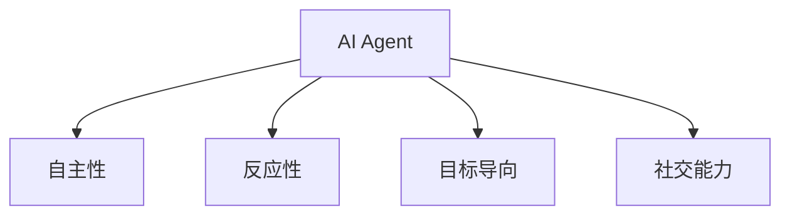
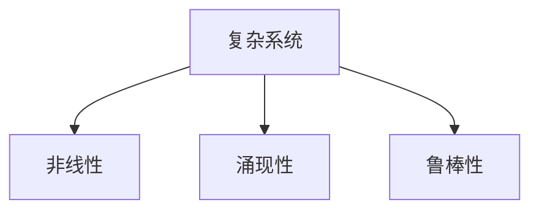
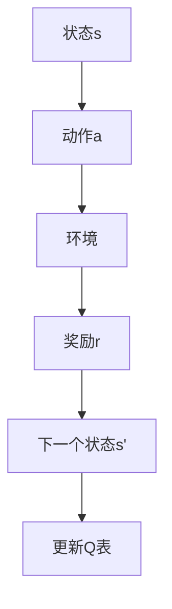
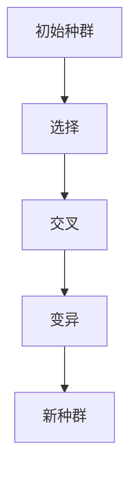
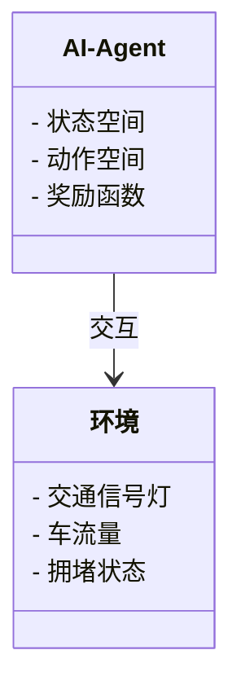
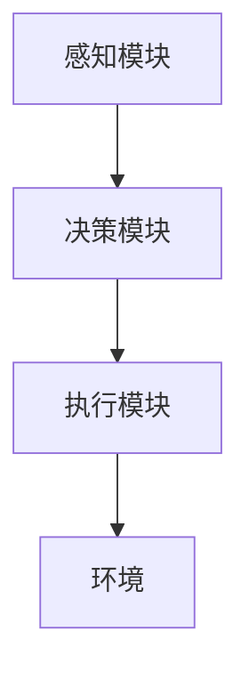
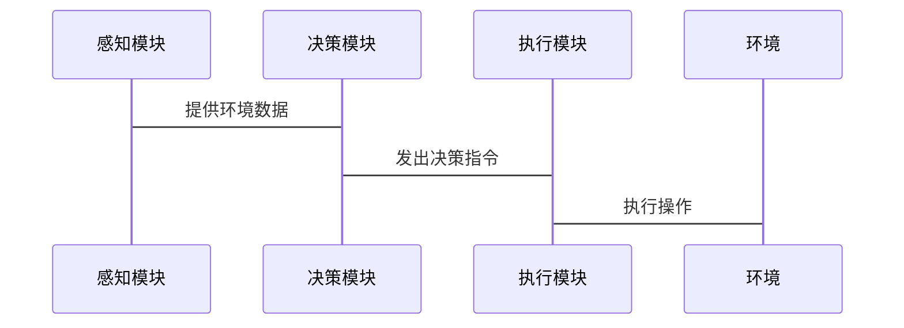

                 


# 开发具有复杂系统建模与仿真能力的AI Agent

> 关键词：AI Agent，复杂系统建模，系统仿真，强化学习，遗传算法，系统架构

> 摘要：本文详细探讨了开发具有复杂系统建模与仿真能力的AI Agent的各个方面，从基本概念到算法实现，再到系统架构设计和项目实战。通过深入分析系统建模的核心原理，结合强化学习和遗传算法的数学模型，以及实际案例的详细解读，为读者提供一个全面的技术指南。

---

# 第一部分: AI Agent与复杂系统建模概述

## 第1章: AI Agent基础

### 1.1 AI Agent的基本概念

#### 1.1.1 什么是AI Agent
AI Agent（人工智能代理）是指在计算机系统中能够感知环境并采取行动以实现目标的实体。AI Agent可以是软件程序、机器人或其他智能系统，其核心特征包括自主性、反应性、目标导向和社交能力。

**Mermaid流程图：AI Agent的基本概念**



#### 1.1.2 AI Agent的分类
AI Agent可以根据功能、智能水平和应用场景进行分类。常见的分类包括：
- **简单反射型Agent**：基于当前输入直接采取行动，如PID控制器。
- **基于模型的反射型Agent**：使用内部模型进行决策，如专家系统。
- **目标导向型Agent**：根据目标选择最优行动，如自动驾驶系统。
- **效用导向型Agent**：通过最大化效用函数实现目标，如经济决策模型。

**对比表格：AI Agent的分类**

| 分类标准       | 分类类型                     | 描述                                         |
|----------------|------------------------------|----------------------------------------------|
| 智能水平       | 简单反射型                 | 基于当前输入直接反应，无内部模型或目标       |
| 基于模型的反射型 | 使用内部模型进行决策         | 如专家系统，依赖知识库和推理规则             |
| 目标导向型     | 根据目标选择最优行动         | 如自动驾驶系统，基于目标规划路径             |
| 效用导向型     | 通过效用函数最大化目标       | 如经济决策模型，基于效用函数优化决策         |

#### 1.1.3 AI Agent的核心特征
AI Agent的核心特征包括：
- **自主性**：能够在没有外部干预的情况下独立运行。
- **反应性**：能够感知环境并实时调整行动。
- **目标导向**：基于目标进行决策和行动。
- **社交能力**：能够与其他系统或人类进行交互和协作。

---

## 第2章: 复杂系统建模基础

### 2.1 复杂系统的定义

复杂系统是指由多个相互作用的组件组成的系统，这些组件之间的相互作用导致系统表现出非线性、涌现性和不确定性。复杂系统的特点包括：
- **非线性**：系统的输出与输入不成简单的比例关系。
- **涌现性**：系统的整体行为无法通过单独分析组件得出。
- **鲁棒性**：系统在面对干扰时仍能保持功能。

**Mermaid流程图：复杂系统的定义**



### 2.2 复杂系统建模的挑战

复杂系统建模的挑战包括：
- **数据获取**：复杂系统的动态性和不确定性使得数据收集和处理困难。
- **模型构建**：需要考虑多个因素的相互作用，模型复杂度高。
- **验证与校准**：模型的验证和校准需要大量的实验数据和计算资源。

### 2.3 系统建模的方法论

系统建模的方法论包括：
1. **系统分解**：将复杂系统分解为子系统，分别建模。
2. **系统动力学分析**：分析系统的动态行为，如反馈机制和稳定性。
3. **仿真与验证**：通过仿真验证模型的准确性。

---

## 第3章: AI Agent与复杂系统的关系

### 3.1 AI Agent在复杂系统中的角色

AI Agent在复杂系统中的角色包括：
- **主体**：作为系统的一部分，与其他组件交互。
- **工具**：用于系统的建模、分析和优化。
- **协调者**：在多智能体系统中，协调各智能体的行为。

### 3.2 复杂系统建模的核心问题

复杂系统建模的核心问题包括：
- **系统分解与模块化**：如何将复杂系统分解为可管理的模块。
- **系统动态与反馈机制**：如何建模系统的动态行为和反馈机制。
- **系统不确定性与鲁棒性**：如何处理系统的不确定性和不确定性对模型的影响。

---

## 第4章: AI Agent开发的背景与挑战

### 4.1 当前AI Agent发展的技术背景

当前AI Agent发展的技术背景包括：
- **大模型技术的突破**：如GPT-4等大语言模型的出现，为AI Agent提供了强大的自然语言处理能力。
- **复杂系统建模的需求增长**：随着社会系统、经济系统等复杂系统的建模需求增加，AI Agent的应用场景扩展。
- **多智能体协作的兴起**：多智能体系统在游戏、机器人等领域的发展，推动了AI Agent技术的进步。

### 4.2 AI Agent开发的主要挑战

AI Agent开发的主要挑战包括：
- **系统复杂性带来的计算挑战**：复杂系统的建模和仿真需要大量的计算资源。
- **数据获取与处理的难度**：复杂系统的动态性和不确定性使得数据收集和处理困难。
- **模型的可解释性与可调性**：复杂的模型往往缺乏可解释性，难以进行调试和优化。

---

# 第二部分: 复杂系统建模的核心概念与联系

## 第5章: 系统建模的基本原理

### 5.1 系统建模的原理与方法

系统建模的原理与方法包括：
- **系统分解与层次化建模**：将系统分解为层次化的模块，分别建模。
- **系统动力学分析**：分析系统的动态行为，如反馈机制和稳定性。
- **系统仿真与验证**：通过仿真验证模型的准确性。

### 5.2 复杂系统建模的关键概念

复杂系统建模的关键概念包括：
- **系统的动态性与非线性**：系统的输出与输入不成简单的比例关系。
- **系统的涌现性与整体性**：系统的整体行为无法通过单独分析组件得出。
- **系统的鲁棒性与适应性**：系统在面对干扰时仍能保持功能。

---

## 第6章: 系统建模的核心要素

### 6.1 系统的输入与输出

系统的输入与输出包括：
- **输入**：系统的输入变量，如传感器数据、用户输入等。
- **输出**：系统的输出变量，如控制信号、决策结果等。

### 6.2 系统的动态性与反馈机制

系统的动态性与反馈机制包括：
- **动态性**：系统的状态随时间变化。
- **反馈机制**：系统根据输出结果调整输入。

---

# 第三部分: AI Agent的算法实现

## 第7章: 强化学习算法

### 7.1 强化学习的基本原理

强化学习的基本原理包括：
- **状态-动作-奖励模型**：智能体通过与环境交互，学习如何采取最优动作以最大化累计奖励。
- **Q-learning算法**：通过Q表记录状态-动作对的期望奖励值，更新Q值以逼近最优策略。

**Mermaid流程图：Q-learning算法**



### 7.2 强化学习的数学模型

强化学习的数学模型包括：
- **Q值更新公式**：
  $$ Q(s, a) = Q(s, a) + \alpha (r + \gamma \max Q(s', a') - Q(s, a)) $$
  其中，$\alpha$ 是学习率，$\gamma$ 是折扣因子。

### 7.3 强化学习的应用场景

强化学习的应用场景包括：
- **游戏AI**：如AlphaGo、Dota AI。
- **机器人控制**：如自动驾驶中的路径规划。
- **金融投资**：如股票交易策略优化。

**Python代码示例：Q-learning算法**

```python
import numpy as np

# 初始化Q表
Q = np.zeros((state_space, action_space))

# 定义参数
alpha = 0.1
gamma = 0.9

# Q-learning算法
for episode in range(episodes):
    state = initial_state
    while not done:
        action = np.argmax(Q[state, :])
        next_state, reward, done = environment.step(action)
        Q[state, action] += alpha * (reward + gamma * np.max(Q[next_state, :]) - Q[state, action])
```

---

## 第8章: 遗传算法

### 8.1 遗传算法的基本原理

遗传算法的基本原理包括：
- **编码**：将问题的解表示为染色体。
- **选择**：根据适应度函数选择优秀的解。
- **交叉**：将优秀解的基因进行交叉组合，生成新的解。
- **变异**：随机改变解的基因，增加多样性。

**Mermaid流程图：遗传算法**



### 8.2 遗传算法的数学模型

遗传算法的数学模型包括：
- **适应度函数**：衡量解的优劣，如$ f(x) $。
- **选择概率**：根据适应度函数计算选择概率，如$ p_i = \frac{f(x_i)}{\sum f(x_j)} $。
- **交叉概率**：设定交叉的概率，如$ pc $。
- **变异概率**：设定变异的概率，如$ pm $。

### 8.3 遗传算法的应用场景

遗传算法的应用场景包括：
- **函数优化**：如旅行商问题（TSP）。
- **参数调优**：如机器学习模型的超参数优化。
- **组合优化**：如资源分配问题。

**Python代码示例：遗传算法**

```python
import random

def fitness(x):
    return x**2

def crossover(parent1, parent2):
    return parent1 + parent2

def mutate(individual):
    return individual + random.gauss(0, 1)

# 初始种群
population = [i for i in range(10)]

# 进化过程
for generation in range(10):
    # 计算适应度
    fitnesses = [fitness(x) for x in population]
    # 选择
    selected = [population[i] for i in range(len(population)) if fitnesses[i] > 5]
    # 交叉
    crossed = [crossover(x, y) for x, y in zip(selected[::2], selected[1::2])]
    # 变异
    mutated = [mutate(x) for x in crossed]
    # 更新种群
    population = mutated
```

---

# 第四部分: 系统架构与设计

## 第9章: 系统功能设计

### 9.1 问题场景介绍

问题场景：设计一个AI Agent用于交通流模拟，目标是优化交通流量和减少拥堵。

### 9.2 系统功能设计

系统功能设计包括：
- **感知层**：采集交通数据，如车流量、交通信号灯状态。
- **决策层**：基于强化学习算法，制定交通信号灯的控制策略。
- **执行层**：根据决策层的指令，调整交通信号灯。

**Mermaid类图：系统功能设计**



---

## 第10章: 系统架构设计

### 10.1 系统架构设计

系统架构设计包括：
- **模块划分**：感知模块、决策模块、执行模块。
- **通信机制**：模块之间的数据交互。
- **接口设计**：模块之间的接口定义。

**Mermaid架构图：系统架构设计**



### 10.2 系统交互流程

系统交互流程包括：
1. **感知模块**：采集环境数据。
2. **决策模块**：基于强化学习算法，制定决策。
3. **执行模块**：根据决策模块的指令，执行操作。

**Mermaid序列图：系统交互流程**



---

# 第五部分: 项目实战

## 第11章: 交通流模拟案例

### 11.1 环境配置

环境配置包括：
- **数据源**：车流量数据。
- **模拟工具**：交通流模拟软件。
- **算法选择**：强化学习算法。

### 11.2 核心代码实现

核心代码实现包括：
- **感知模块**：采集车流量数据。
- **决策模块**：基于强化学习算法，制定交通信号灯控制策略。
- **执行模块**：调整交通信号灯。

**Python代码示例：核心代码实现**

```python
import numpy as np

# 初始化Q表
Q = np.zeros((state_space, action_space))

# 定义参数
alpha = 0.1
gamma = 0.9

# Q-learning算法
for episode in range(episodes):
    state = initial_state
    while not done:
        action = np.argmax(Q[state, :])
        next_state, reward, done = environment.step(action)
        Q[state, action] += alpha * (reward + gamma * np.max(Q[next_state, :]) - Q[state, action])
```

### 11.3 案例分析

案例分析包括：
- **性能评估**：优化前后的交通流量对比。
- **结果解读**：强化学习算法在交通流模拟中的效果。

### 11.4 项目总结

项目总结包括：
- **成功经验**：强化学习算法在交通流模拟中的有效性。
- **改进方向**：进一步优化算法，提高模型的可解释性。

---

# 第六部分: 高级主题与未来展望

## 第12章: 高级主题

### 12.1 多智能体协作

多智能体协作包括：
- **多智能体系统**：多个智能体协同工作。
- **协作机制**：智能体之间的通信与协作。

### 12.2 实时系统仿真

实时系统仿真包括：
- **实时性要求**：系统需要实时响应。
- **实时仿真技术**：如基于事件驱动的仿真。

## 第13章: 未来展望

### 13.1 当前研究的前沿

当前研究的前沿包括：
- **强化学习的改进**：如深度强化学习、多智能体强化学习。
- **复杂系统建模的创新**：如基于物理仿真的复杂系统建模。

### 13.2 未来研究的方向

未来研究的方向包括：
- **AI Agent的可解释性**：如何提高模型的可解释性。
- **AI Agent的实时性**：如何提高系统的实时性。
- **AI Agent的协作能力**：如何增强多智能体协作能力。

---

# 结语

开发具有复杂系统建模与仿真能力的AI Agent是一项具有挑战性的任务，但随着技术的不断进步，AI Agent在复杂系统建模中的应用前景广阔。通过深入理解系统建模的核心概念，掌握强化学习和遗传算法等算法原理，并结合实际项目进行实践，我们可以开发出更加智能和高效的AI Agent，为复杂系统的建模与仿真提供强有力的支持。

--- 

**Tips**:
1. 在开发AI Agent时，建议优先选择成熟的技术和算法，以降低开发难度。
2. 系统建模的关键在于对系统的深刻理解，建议在建模前进行充分的调研和分析。
3. 强化学习算法的收敛速度和效果依赖于奖励函数的设计，建议在实际应用中进行多次实验和调整。
4. 遗传算法的性能依赖于适应度函数的设计和参数的选择，建议在实际应用中进行多次实验和调整。

