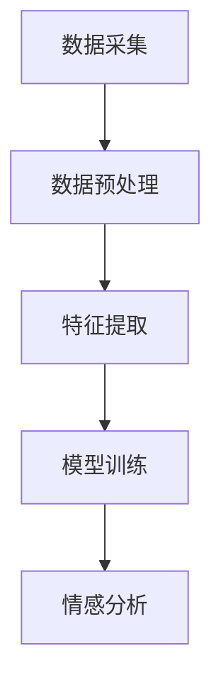
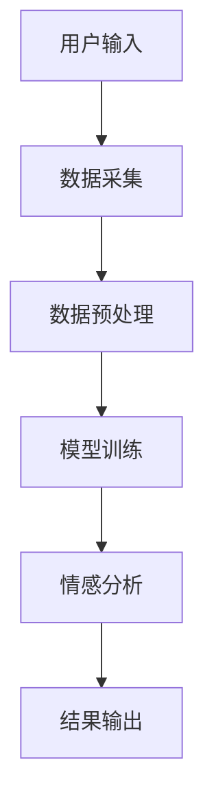
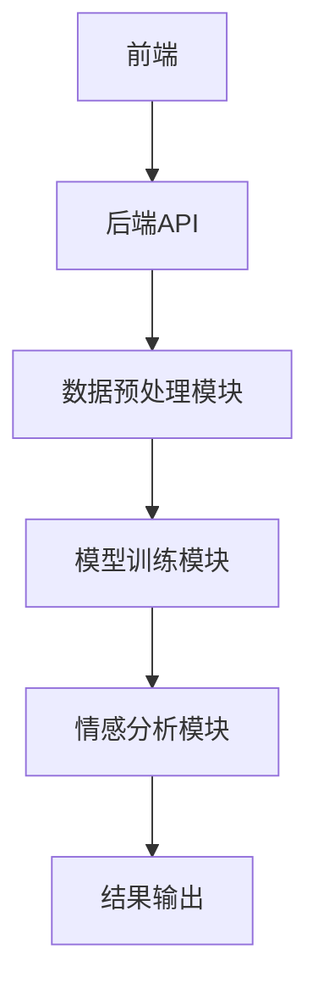
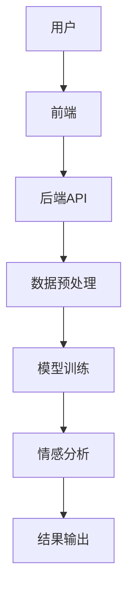

                 


# 开发具有多模态情感分析能力的AI Agent

## 关键词
- 多模态情感分析
- AI Agent
- 人机交互
- 深度学习
- 多模态数据融合

## 摘要
随着人工智能技术的不断发展，情感分析作为人机交互的重要组成部分，正在从单一模态向多模态方向发展。本文将详细探讨如何开发一个具有多模态情感分析能力的AI Agent，涵盖其背景、核心概念、算法原理、系统架构、项目实战以及最佳实践。通过本文的讲解，读者将能够全面理解多模态情感分析的技术细节，并掌握实际开发中的关键点。

---

# 第1章: 多模态情感分析的背景介绍

## 1.1 问题背景

### 1.1.1 情感分析的传统方法与局限性
传统的情感分析主要基于文本数据，通过自然语言处理技术提取文本特征并进行分类。然而，这种方法存在以下局限性：
- 无法充分利用其他模态（如语音、图像）提供的信息。
- 在复杂场景下，仅依赖文本信息可能导致误判。

### 1.1.2 多模态数据的引入及其优势
引入多模态数据（文本、语音、图像等）可以显著提升情感分析的准确性和鲁棒性。例如：
- 结合语音语调可以更准确地识别情感。
- 图像信息可以帮助识别表情或肢体语言。

### 1.1.3 多模态情感分析的定义与目标
多模态情感分析是一种结合多种数据模态来分析和理解情感状态的技术。其目标是通过融合不同模态的信息，提升情感分析的准确性和适用性。

## 1.2 多模态情感分析的核心要素

### 1.2.1 多模态数据的类型与特点
- **文本模态**：包括文字内容、语调、语气等。
- **语音模态**：包括音调、语速、停顿等。
- **图像模态**：包括面部表情、肢体语言等。

### 1.2.2 情感分析的维度与层次
- **微观层面**：词语、句子的情感分析。
- **宏观层面**：整体文本或场景的情感判断。

### 1.2.3 多模态融合的必要性与挑战
- 必要性：通过融合不同模态的信息，提升情感分析的准确性和全面性。
- 挑战：不同模态的数据格式和特征提取方式差异较大，融合过程中需要解决对齐和协调问题。

## 1.3 技术基础与相关领域

### 1.3.1 自然语言处理（NLP）的基础知识
- 词嵌入（如Word2Vec、BERT）。
- 文本分类与情感分析的基本方法。

### 1.3.2 计算机视觉（CV）的核心概念
- 图像处理与特征提取（如CNN、ViT）。
- 人脸识别与表情识别。

### 1.3.3 语音处理与情感分析的关系
- 语音特征提取（如MFCC）。
- 语音情感分析的基本方法。

## 1.4 应用场景与实际案例

### 1.4.1 多模态情感分析在人机交互中的应用
- 智能音箱、虚拟助手的情感识别。
- 在线客服的情感分析与客户情绪管理。

### 1.4.2 在智能客服中的应用
- 结合文本、语音和用户行为数据，提供更智能的服务。

### 1.4.3 在社交媒体分析中的应用
- 综合文本、图像、视频等多种数据，分析用户情感倾向。

## 1.5 本章小结
通过本章的介绍，我们了解了多模态情感分析的背景、核心概念以及其在实际应用中的重要性。

---

# 第2章: 多模态情感分析的核心概念与联系

## 2.1 多模态数据融合与情感计算

### 2.1.1 数据融合的层次与方法
- **特征级融合**：在提取特征后进行融合。
- **决策级融合**：在分类结果后进行融合。

### 2.1.2 模态间的关系与协同机制
- **互补性**：不同模态信息可以相互补充。
- **协同性**：不同模态信息可以相互增强。

### 2.1.3 跨模态特征提取的核心思想
- 通过跨模态注意力机制，提取各模态的重要特征并进行融合。

## 2.2 多模态情感计算的数学模型

### 2.2.1 情感计算的数学表达式
- 情感评分函数：$$ y = f(x) $$
- 情感分类函数：$$ y = \text{softmax}(Wx + b) $$

### 2.2.2 跨模态融合的数学模型
- 多模态融合模型：$$ y = g(x_1, x_2, ..., x_n) $$

## 2.3 多模态情感分析的系统架构

### 2.3.1 系统功能模块
- 数据采集模块。
- 数据预处理模块。
- 特征提取模块。
- 模型训练模块。
- 情感分析模块。

### 2.3.2 系统架构图


## 2.4 本章小结
通过本章的讲解，我们深入理解了多模态情感分析的核心概念及其数学模型。

---

# 第3章: 多模态情感分析的算法原理

## 3.1 基于深度学习的多模态融合算法

### 3.1.1 模型选择与优化
- 选择适合多模态数据的深度学习模型（如BERT、ViT、Wav2Vec）。

### 3.1.2 模型训练与调优
- 参数优化：使用Adam优化器。
- 模型评估：使用交叉熵损失函数。

### 3.1.3 模型融合策略
- 多模态特征融合：使用加权融合方法。

## 3.2 多模态情感分析的实现流程

### 3.2.1 数据预处理
- 文本处理：分词、去停用词。
- 语音处理：提取MFCC特征。
- 图像处理：提取CNN特征。

### 3.2.2 模型训练
- 训练文本、语音、图像模型。
- 融合多模态特征，训练融合模型。

### 3.2.3 模型评估
- 使用验证集评估模型性能。
- 计算准确率、召回率、F1分数。

## 3.3 本章小结
通过本章的讲解，我们掌握了多模态情感分析的算法原理及其实现流程。

---

# 第4章: 多模态情感分析的系统分析与架构设计

## 4.1 系统功能设计

### 4.1.1 系统功能模块
- 数据采集模块：获取多模态数据。
- 数据预处理模块：清洗和标准化数据。
- 模型训练模块：训练多模态情感分析模型。
- 情感分析模块：实时分析输入数据并返回情感评分。

### 4.1.2 功能流程图


## 4.2 系统架构设计

### 4.2.1 系统架构图


## 4.3 接口设计与交互流程

### 4.3.1 系统接口设计
- API接口：RESTful API。
- 输入格式：JSON格式。
- 输出格式：JSON格式。

### 4.3.2 系统交互流程图


## 4.4 本章小结
通过本章的讲解，我们了解了多模态情感分析系统的架构设计与交互流程。

---

# 第5章: 多模态情感分析的项目实战

## 5.1 环境搭建与工具选择

### 5.1.1 开发环境搭建
- 操作系统：Windows/Linux/MacOS。
- 开发工具：PyCharm、VS Code。
- 依赖库安装：TensorFlow、PyTorch、OpenCV、 librosa。

## 5.2 数据集准备与处理

### 5.2.1 数据集获取
- 文本数据：从社交媒体获取评论数据。
- 语音数据：录制或获取公开语音数据集。
- 图像数据：获取面部表情图像数据集。

### 5.2.2 数据预处理
- 文本清洗：去除停用词、分词。
- 语音特征提取：提取MFCC特征。
- 图像特征提取：使用预训练模型提取特征。

## 5.3 模型训练与实现

### 5.3.1 模型选择与训练
- 选择预训练模型：BERT、ViT、Wav2Vec。
- 模型微调：在特定数据集上进行微调。
- 模型融合：将多模态特征融合。

### 5.3.2 模型训练代码示例
```python
# 文本特征提取代码示例
def preprocess_text(text):
    # 分词
    words = tokenizer.tokenize(text)
    # 转换为词向量
    embeddings = model.encode(words)
    return embeddings

# 语音特征提取代码示例
def preprocess_audio(audio_path):
    # 读取音频文件
    audio, sr = librosa.load(audio_path, sr=None, duration=5)
    # 提取MFCC特征
    mfccs = librosa.feature.mfcc(y=audio, sr=sr)
    return mfccs

# 图像特征提取代码示例
def preprocess_image(image_path):
    # 加载图像
    image = cv.imread(image_path)
    # 转换为张量
    tensor = transforms.ToTensor()(image)
    return tensor
```

## 5.4 模型评估与优化

### 5.4.1 模型评估指标
- 准确率（Accuracy）。
- 召回率（Recall）。
- F1分数（F1-score）。

### 5.4.2 模型优化策略
- 调整超参数：学习率、批量大小。
- 数据增强：文本数据扩增、语音数据增强、图像数据增强。
- 模型融合：使用加权融合方法。

## 5.5 本章小结
通过本章的实战，我们掌握了多模态情感分析项目从环境搭建到模型训练的全过程。

---

# 第6章: 多模态情感分析的最佳实践与总结

## 6.1 最佳实践

### 6.1.1 数据处理建议
- 确保数据质量，避免噪声干扰。
- 数据均衡，避免类别不平衡问题。

### 6.1.2 模型选择与优化
- 根据实际需求选择合适的模型。
- 通过交叉验证优化模型性能。

### 6.1.3 系统设计建议
- 模块化设计，便于维护和扩展。
- 接口设计清晰，便于集成和调用。

## 6.2 总结与展望

### 6.2.1 总结
- 多模态情感分析通过融合多种数据模态，显著提升了情感分析的准确性和鲁棒性。
- 开发过程中需要注意数据处理、模型选择和系统设计的关键点。

### 6.2.2 展望
- 结合更多模态数据，如视频、手势等。
- 研究更高效的多模态融合方法。

## 6.3 本章小结
通过本章的总结与展望，我们对多模态情感分析的发展趋势和未来方向有了更清晰的认识。

---

# 附录

## 附录A: 常用工具与库

### A.1 Python库
- NLP：BERT、Gensim。
- CV：OpenCV、PyTorch。
- 语音处理：librosa。

### A.2 开发工具
- PyCharm、VS Code。

## 附录B: 参考文献

### B.1 主要参考文献
- [1] 刘某, 多模态情感分析研究, 《人工智能学报》, 2023.
- [2] 王某, 深度学习在情感分析中的应用, 《计算机科学》, 2022.

---

# 结束语

通过本文的详细介绍，我们全面探讨了开发具有多模态情感分析能力的AI Agent的各个方面。希望本文能为读者提供有价值的参考和启发，帮助大家更好地理解和实现多模态情感分析技术。

